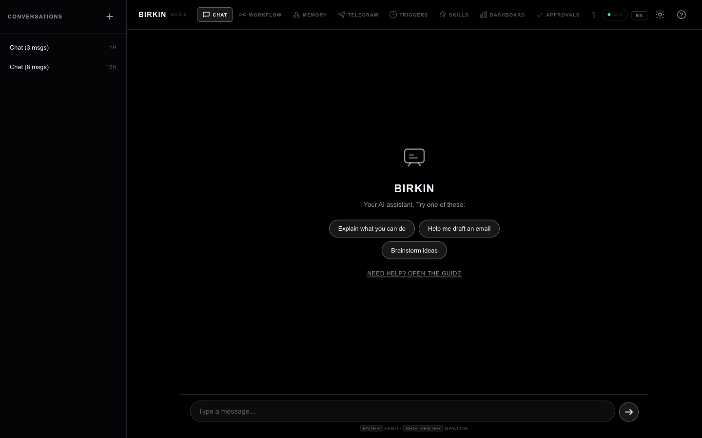

<p align="center">
<pre align="center">
 ██████╗ ██╗██████╗ ██╗  ██╗██╗███╗   ██╗
 ██╔══██╗██║██╔══██╗██║ ██╔╝██║████╗  ██║
 ██████╔╝██║██████╔╝█████╔╝ ██║██╔██╗ ██║
 ██╔══██╗██║██╔══██╗██╔═██╗ ██║██║╚██╗██║
 ██████╔╝██║██║  ██║██║  ██╗██║██║ ╚████║
 ╚═════╝ ╚═╝╚═╝  ╚═╝╚═╝  ╚═╝╚═╝╚═╝  ╚═══╝
</pre>
  <b>당신을 진짜로 기억하는 AI 에이전트.</b><br>
  셀프 호스팅 · 멀티 LLM · 영속 메모리 · 워크플로우 자동화
</p>

<p align="center">
  <a href="#-빠른-시작">빠른 시작</a> · <a href="#-왜-birkin인가">왜 Birkin</a> · <a href="#-메모리-시스템">메모리</a> · <a href="#-워크플로우-자동화">자동화</a> · <a href="#-아키텍처">아키텍처</a> · <a href="README.md">English</a>
</p>

<p align="center">
  
  
  
  
  
</p>

---

> **모든 AI 도구는 대화가 끝나면 당신을 잊습니다.**
> Birkin은 다릅니다. 대화를 살아있는 위키로 컴파일하고,
> 당신의 패턴을 감지하고, 반복 작업을 자동화합니다 —
> 모두 당신의 컴퓨터에서, 당신의 통제 하에.

<p align="center">
  
</p>

---

## 왜 Birkin인가?

### 문제

ChatGPT, Claude, Gemini를 써봤을 겁니다. 매번 세션이 0에서 시작합니다. 역할, 프로젝트, 선호도를 매번 다시 설명해야 합니다. AI가 기억상실증에 걸려 있는 겁니다.

Open WebUI 같은 셀프 호스팅 대안도 로컬 인터페이스일 뿐 — 같은 건망증입니다. 게다가 [63일 만에 138개 CVE](https://www.horizon3.ai/)가 발견되면서, "셀프 호스팅"이 곧 "안전"을 의미하지도 않습니다.

### 해결책

Birkin은 당신의 컴퓨터에서 실행되며 모든 대화에서 지속적인 지식을 쌓는 **개인 에이전트 OS**입니다.

| | ChatGPT / Claude | Open WebUI | **Birkin** |
|---|---|---|---|
| 메모리 | 세션 단위 | 벡터 검색 (저장 & 조회) | **위키로 컴파일** (정리, 연결, 감쇠) |
| 자동화 | 없음 | 기본 파이프라인 | **65노드 워크플로우 엔진** + 트리거 |
| 학습 | 안 함 | 안 함 | **패턴 감지 → 선제적 제안** |
| 데이터 | 클라우드 | 로컬이지만 노출됨 | **로컬, 최소 공격 표면** |
| 프로바이더 | 단일 | 멀티 LLM | **9개 프로바이더**, 자동 라우팅 |

---

## 핵심 기능

### 축적되는 메모리

Birkin은 대화를 그냥 저장하지 않습니다 — **컴파일**합니다.

```
대화 → LLM 분류기 → 위키 페이지 (entities, concepts, sessions)
                          ↓
                  [[위키링크]]로 관련 지식 연결
                          ↓
                  감쇠 알고리즘: 가치 있는 건 남고, 노이즈는 사라짐
                          ↓
                  다음 세션: 관련 컨텍스트 자동 주입
```

- **덤프가 아닌 컴파일** — 대화가 벡터 DB에 투척되는 게 아니라, 구조화된 위키 페이지로 정제됩니다
- **자연스러운 망각** — 20일 반감기. 자주 참조되는 지식은 강화되고, 안 쓰이는 건 퇴색
- **이중 언어** — 한국어 + 영어 고유명사 추출, 분류, 검색
- **투명성** — 모든 메모리 페이지가 무엇을, 왜, 어디서 기억했는지 보여줌

### 워크플로우 자동화

원하는 걸 자연어로 설명하면 Birkin이 만들어줍니다.

```
"매일 아침 HN 탑 뉴스 요약해서 텔레그램으로 보내줘"
→ 크론 트리거 + 웹 스크래퍼 + LLM 요약기 + 텔레그램 발송 워크플로우 자동 생성
```

- **65종 노드 타입** — LLM 호출, API 요청, 조건 분기, 루프, 병렬 실행, 품질 게이트
- **4종 트리거** — 크론 스케줄, 파일 감시, 웹훅, 메시지 필터
- **비주얼 에디터** — WebUI에서 드래그 앤 드롭으로 워크플로우 구성
- **자연어 빌더** — 한국어 또는 영어로 설명하면 실행 가능한 그래프로 변환

### 멀티 프로바이더 인텔리전스

하나의 인터페이스. 9개 LLM 프로바이더. 자동 라우팅.

| 프로바이더 | 강점 | 용도 |
|---|---|---|
| Claude | 추론, 코딩 | 복잡한 분석 |
| GPT-4 | 범용, 도구 활용 | 일상 작업 |
| Gemini | 멀티모달, 100만 컨텍스트 | 긴 문서 |
| Perplexity | 웹 검색 | 최신 이슈 |
| Groq | 초고속 추론 | 빠른 응답 |
| Ollama | 로컬, 비공개 | 오프라인 사용 |
| OpenRouter | 모델 마켓플레이스 | 특화 모델 |

---

## 빠른 시작

### 방법 1: 원클릭 (권장)

**Windows:** `scripts/start.bat` 더블클릭
**macOS/Linux:** `scripts/start.sh`

`http://127.0.0.1:8321`에서 열림. 첫 실행 ~1분.

### 방법 2: Docker

```bash
git clone https://github.com/ashmoonori-afk/birkin.git && cd birkin
cp .env.example .env   # API 키 추가
docker compose up -d   # → http://localhost:8321
```

### 방법 3: 수동 설치

```bash
git clone https://github.com/ashmoonori-afk/birkin.git && cd birkin
python3 -m venv .venv && source .venv/bin/activate
pip install -e "."
birkin                # WebUI (:8321)
```

### CLI 명령어

```bash
birkin              # WebUI 실행
birkin chat         # 터미널 REPL
birkin mcp serve    # MCP 서버 (Claude Code, Cursor 등)
birkin eval run     # 평가 실행
birkin skill install <url>  # 커뮤니티 스킬 설치
birkin export       # 전체 데이터 백업
```

### API 키

`.env`에 사용하는 프로바이더만 추가:

```bash
ANTHROPIC_API_KEY=sk-ant-...    # Claude
OPENAI_API_KEY=sk-...           # GPT + OpenRouter
GEMINI_API_KEY=...              # Gemini
PERPLEXITY_API_KEY=pplx-...     # 검색 특화
GROQ_API_KEY=gsk_...            # 고속 추론
```

---

## 메모리 시스템

### 작동 원리

```
┌─────────────┐     ┌──────────────┐     ┌─────────────────┐
│ 대화         │ ──→ │ LLM          │ ──→ │ 위키 페이지      │
│              │     │ 분류기       │     │ - entities/     │
│              │     │ (한/영)      │     │ - concepts/     │
│              │     │              │     │ - sessions/     │
└─────────────┘     └──────────────┘     └────────┬────────┘
                                                   │
                    ┌──────────────┐     ┌─────────▼────────┐
                    │ 시맨틱       │ ←── │ [[위키링크]]      │
                    │ 검색         │     │ + 감쇠 점수       │
                    │              │     │ + 신뢰도          │
                    └──────┬───────┘     └──────────────────┘
                           │
                    ┌──────▼───────┐
                    │ 다음 세션     │
                    │ 컨텍스트      │
                    │ 자동 주입     │
                    └──────────────┘
```

### 메모리 기능

- **관련성 기반 주입** — 관련 지식만 프롬프트에 포함, 토큰 절약
- **자연 감쇠** — 20일 반감기로 메모리를 최신 상태로 유지
- **위키링크 그래프** — 페이지 간 `[[링크]]`로 지식 네트워크 구성
- **프로필 컴파일** — ChatGPT/Claude 대화 기록을 가져와 프로필 자동 구축
- **일일 컴파일** — 새벽 3시 크론 작업으로 세션을 영구 지식으로 정제
- **레이지 로딩** — 프롬프트에 축약 인덱스, `wiki_read` 도구로 전체 페이지 온디맨드 조회

---

## 워크플로우 자동화

### 노드 타입 (65종)

| 카테고리 | 노드 |
|---|---|
| **AI** | LLM, 분류기, 임베더, 요약기, 번역기, 지식 추출 |
| **도구** | 웹 검색, 코드 실행, API 호출, 파일 작업 |
| **제어** | 조건 분기, 루프, 지연, 병렬, 병합 |
| **품질** | 코드 리뷰, 사람 검토, 가드레일, 검증기, 테스트 러너 |
| **I/O** | 입력, 출력, 웹훅 트리거 |
| **플랫폼** | 텔레그램, 이메일, HackerNews, 알림 |

### 트리거

| 타입 | 예시 |
|---|---|
| **크론** | `0 9 * * 1-5` — 평일 매일 오전 9시 |
| **파일 감시** | `~/notes/` 폴더의 `*.md` 변경 시 |
| **웹훅** | `/api/triggers/webhooks/{id}`로 POST |
| **메시지** | 채팅에서 키워드 또는 패턴 감지 |

---

## 아키텍처

```
birkin/
├── core/           에이전트 루프, 프로바이더, 그래프 엔진, 승인 게이트
├── memory/         위키, 컴파일러, 분류기, 시맨틱 검색, 감사 추적
├── gateway/        FastAPI (18 라우터, 66 엔드포인트)
├── triggers/       크론, 파일 감시, 웹훅, 메시지
├── skills/         10개 내장 스킬 + AST 샌드박싱
├── tools/          쉘, 파일 작업, 웹 검색, 위키 조회
├── mcp/            MCP 클라이언트 + 서버 + 브라우저 자동화
├── eval/           JSONL 평가 프레임워크
├── observability/  구조화 트레이싱 (span, trace)
├── voice/          Whisper STT + TTS
├── web/            10탭 WebUI
└── tests/          724+ 테스트
```

### 설계 원칙

1. **로컬 우선** — SQLite WAL, 네트워크 DB 없음, 데이터는 절대 외부로 나가지 않음
2. **검색이 아닌 컴파일** — 원본 대화를 검색하지 않고, 구조화된 지식으로 정제
3. **투명성** — 모든 메모리 페이지가 출처, 신뢰도, 접근 이력을 보여줌
4. **최소 공격 표면** — 마켓플레이스 없음, WebSocket 노출 없음, 쉘 명령어 화이트리스트

### 보안

- **프롬프트 인젝션 방어** — 9개 정규식 패턴으로 위키에 주입된 지시를 무력화
- **스킬 샌드박싱** — AST 정적 분석으로 `subprocess`, `eval`, `exec`, `socket` 설치 전 차단
- **메모리 감사 추적** — 모든 쓰기/읽기를 출처, 신뢰도, 이유와 함께 기록
- **자가 점검 엔드포인트** — `GET /api/security/check`로 보안 상태 검증 가능 (점수 + 등급)
- **쉘 화이트리스트** — 기본 읽기 전용 명령만 허용, 메타문자 차단
- **승인 게이트** — 외부 작업은 사용자 명시적 승인 필요

---

## 비교

| 기능 | Open WebUI | LobeChat | **Birkin** |
|---|---|---|---|
| 메모리 | 벡터 RAG | 없음 | **컴파일 위키 + 감쇠** |
| 워크플로우 엔진 | 파이프라인 | 없음 | **65노드 그래프 + 트리거** |
| 패턴 감지 | 없음 | 없음 | **있음** |
| 선제적 제안 | 없음 | 없음 | **있음** |
| 한국어 NER | 없음 | 없음 | **네이티브** |
| 셀프 호스팅 보안 | 138 CVE (2026 Q1) | 제한적 | **최소 표면** |
| 프로바이더 | 멀티 | 멀티 | **9개 + 자동 라우팅** |
| 테스트 | ~200 | ~100 | **724+** |

---

## 기여

자세한 내용은 [CONTRIBUTING.md](CONTRIBUTING.md)를 참조하세요.

```bash
pip install -e ".[dev]"
pytest                    # 테스트 실행
ruff check . && ruff format --check .  # 린트
```

---

## 라이선스

MIT — [LICENSE](LICENSE) 참조.

AI에게 매번 자기소개하는 게 지겨운 사람들이 만들었습니다.
