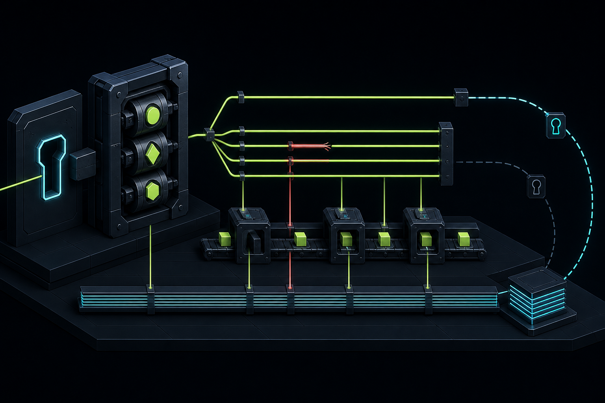
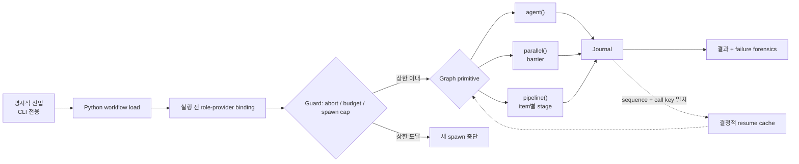
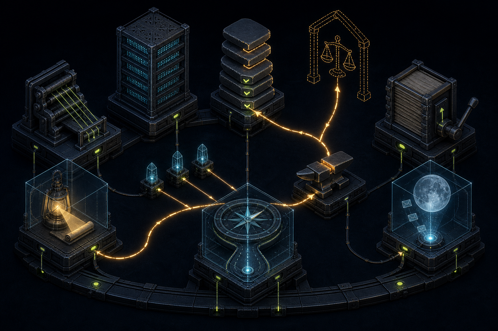

# birkin

**메모리, 실행, 자기개선을 들여다볼 수 있는 로컬 상태로 다루는 로컬 우선 파이썬
에이전트.**

birkin은 CLI 에이전트, HTTP/Telegram gateway, MCP server, 멀티에이전트 런타임을
하나의 설치 가능한 패키지에 담았습니다. 메모리는 열고, grep하고, 커밋할 수 있는
마크다운 폴더입니다. 멀티에이전트 작업은 모델이 스스로 자신을 호출하는 방식이
아니라 파이썬 그래프입니다. 결과가 생기는 행동은 프롬프트가 아니라 코드에 있는
승인·checkpoint·redaction 게이트를 통과합니다.

[English](./README.md) ·
[](https://deepwiki.com/ashmoonori-afk/birkin/1-overview)


> **기억은 파일로. 제어 흐름은 코드로. 권한은 경계 안에서.**

이름이 곧 농담이고, 그 농담이 곧 설계입니다. 헤르메스는 유명한 전령입니다.
빠르고, 신화적이고, 가볍게 다닙니다. birkin은 더 적은 기계 장치를 지고, 짐이
쏟아질 수 없는 형태로 담고, 통과해서는 안 되는 것 앞에 단단한 게이트를 세우는
방식으로 그 기준선보다 앞서 달립니다. 게이트는 장식이 아닙니다. 모델이 무엇을
원하든 거부하고, 큐에 넣고, checkpoint를 남기는 결정적 코드입니다. 속도 역시
실제이며 birkin의 이전 경로와 비교해 측정한 값입니다. warm gateway 턴이
Claude에서 13-16초 → 2.3초, Codex에서 37.5초 → 3초로 줄었습니다
([`docs/STATUS.md`](./docs/STATUS.md), ADR-045·ADR-046. 이 저장소에는
hermes-agent와의 지연 시간 비교 벤치마크가 없고, 그런 주장도 하지 않습니다).

## 60초 안에 보는 근거

각 행은 저장소에서 직접 확인할 수 있는 값입니다.

| | 실측 또는 코드로 강제되는 값 |
|---|---|
| **핵심 의존성 0개, 플랫폼당 voice + desktop 최대 3개** | OpenAI SDK는 `voice`, Pillow와 플랫폼 adapter 하나는 `desktop` extra입니다. `office`는 별도이며 `full`은 모든 기능 extra를 설치합니다. 에이전트 루프, gateway, 메모리, workflow, HTTP, JSON-RPC, cron 파싱은 표준 라이브러리입니다. [`pyproject.toml`](./pyproject.toml) |
| **큐레이션 연산 5개, 삭제는 없음** | `OPS`가 메모리 curator에게 주어지는 어휘 전부입니다. 적대적인 모델도 오염된 노트도 집어들 삭제 연산이 없습니다. [`curation_contract.py`](./birkin/curation_contract.py) |
| **프로덕션 R@1 0.891** | 현재 lexical stack은 LongMemEval-S 470문항에서 R@1 0.891 / R@5 0.974 / MRR 0.926입니다. 연구용 tuned 구성은 0.900으로, 같은 harness에서 측정한 최고 embedding hybrid(0.894)보다 앞섭니다. encoder도 vector store도 없습니다. [`docs/ranking-v2-plan.md`](./docs/ranking-v2-plan.md) |
| **동시 실행 슬롯 4개, agent 상한 100** | Moirai의 기본 thread pool 폭과 실행당 spawn 상한입니다. 아래의 이름 붙은 worker와는 다른 스케줄링 한도이며, 새 agent마다 abort·budget·상한을 먼저 검사합니다. [`moirai/engine.py`](./birkin/moirai/engine.py) |
| **오프라인 테스트 2,300개 이상, coverage 82.89%** | 기본 `pytest` 실행에 API key도 네트워크도 필요하지 않습니다. [`docs/STATUS.md`](./docs/STATUS.md) |
| **warm 턴 2.3초와 3초** | Claude와 Codex의 warm gateway 턴이며, birkin의 이전 경로에서는 각각 13-16초와 37.5초였습니다. 다른 프로젝트와의 비교가 아니라 자기 자신과의 비교입니다. [`docs/STATUS.md`](./docs/STATUS.md) |
| **번들 스킬 56개, 파이썬 약 37K줄** | 평평한 패키지 하나입니다. 대부분의 동작은 입력이 명시적이고 상태가 파일에 남는 모듈입니다. |

<details>
<summary><strong>README를 건너뛰고 에이전트에게 주장 검증을 맡기기</strong></summary>

```text
이 README와 여기서 링크한 구현 파일을 읽어라. birkin이 graph engineering인지
prompt loop인지, 모델이 스스로 승인할 수 없는 행동은 무엇인지, 그리고 프로젝트가
자신에게 불리한 결과를 공개한 위치는 어디인지 말해라:
https://raw.githubusercontent.com/ashmoonori-afk/birkin/main/README.ko.md
```

</details>

## Highlights

| | 무엇이 다른가 |
|---|---|
| **삭제할 수 없는 메모리 큐레이션** | 모델은 타입이 정해진 plan만 제안합니다. mutation은 결정적 코드가 소유하고 무엇이 살아남을지 정합니다. |
| **실측한 lexical 검색** | 한글 인식 토큰 위의 BM25, 에빙하우스 감쇠, Hebbian 강화, zone priority EMA. LLM을 쓰지 않으며 저장소 안에서 benchmark합니다. |
| **spawn 도구가 아니라 graph runtime** | `agent`, `parallel`, `pipeline`은 코드 primitive입니다. 스크립트에 이름을 적지 않고도 하나의 workflow가 Claude, Codex, API worker를 가로지릅니다. |
| **경계가 있는 worker** | 이름 붙은 worker마다 실행 조건 하나와 권한 상한 하나가 있고, 그 상한은 executor가 강제합니다. |
| **tool 결과의 단일 통제 경로** | 모든 네이티브 tool 호출은 `ToolRegistry.run`을 지납니다. hook은 거기서 관찰하고, 출력은 거기서 redaction되며, spill은 redaction 이후에만 일어납니다. |
| **자기개선은 되돌릴 수 있는 데이터** | 타입이 있는 proposal, 검증되는 한도, 버전이 붙는 ledger, 그리고 rollback. 보이지 않는 변형이 아닙니다. |
| **프롬프트 조립 지점 하나** | `promptgate.py`가 모든 표면의 persona, memory, skill, 공지를 조립합니다. 표면마다 다른 system prompt를 만들지 않습니다. |
| **로컬 우선 표면들** | CLI, WebUI, 로컬 HTTP, Telegram, 음성, MCP, opt-in A2A가 같은 패키지와 같은 저장 규약을 씁니다. |
| **설계상 감사 가능** | 불투명한 호스팅 상태 대신 보이는 파일, append-only 기록, 오프라인 테스트를 씁니다. |

## birkin이 존재하는 이유

이미 훌륭한 범용 에이전트 프로젝트들이 있습니다. birkin은 다른 선택을 합니다.

- 다중 언어 런타임 대신 설치 가능한 파이썬 패키지 하나
- SDK가 무거운 provider 스택 대신 핵심 의존성 0개와 플랫폼당 voice + desktop 최대 3개
- 불투명한 호스팅 상태 대신 보이는 파일과 append-only 기록
- browser/computer 자동화 대신 작은 네이티브 tool 표면
- 실행 주위의 명시적인 승인·checkpoint·redaction 지점
- 되돌릴 수 있고 검토 가능한 proposal 형태의 지속적 개선

그래서 birkin은 감사하고, 임베드하고, 오프라인에서 테스트하고, 평범한 파이썬
도구로 고치기가 유난히 쉽습니다.

## Agent theater가 아니라 graph engineering

대부분의 agent system은 제어 흐름을 프롬프트 안에 둡니다. 다른 모델을 부를지,
재시도할지, 언제 멈출지를 모델이 정합니다. 그건 spawn 버튼이 달린 제안 루프입니다.
Moirai는 그 결정들을 파이썬이 소유하는 실행 그래프로 옮깁니다.



*진입은 하나, guard는 모든 spawn보다 먼저, 동시성은 세 가지 형태, 실패는 한
곳에 갇히고, 전부 journal에 남으며, resume은 키가 맞는 자리에서만 재사용됩니다.*



- **제어 흐름은 파이썬이 소유합니다.** workflow는 `meta`와 `main(m)`을 가진
  파일이며, 역할은 무엇이 spawn되기 전에 provider에 binding됩니다.
- **동시성에는 의미가 있습니다.** `parallel()`은 barrier이고, `pipeline()`은 각
  item이 독립적으로 다음 stage로 갑니다. 실패한 branch가 sibling을 끌고 내려가지
  않습니다.
- **Replay는 선택적입니다.** resume은 sequence와 내용에서 파생된 key가 둘 다 맞는
  cached call만 받아들입니다. 그래서 role 하나를 다시 binding하면 그 role의 call만
  다시 실행됩니다.
- **실패도 데이터입니다.** provider error, guard block, token, 경과 시간,
  traceback이 "에이전트 실패" 한 줄로 뭉개지지 않고 실행 record에 남습니다.
- **정지 조건은 상수입니다.** 내장 `deep-research` 패턴은 새 리드가 없는 wave가
  연속 두 번 나오면 멈춥니다. `DRY_WAVES_TO_STOP`이 판단이 아니라 소스에 적힌
  숫자이기 때문입니다.

## 권한에 경계가 있는 worker



worker의 이름은 그리스·이집트 신화에서 왔지만, 그 경계는 의도적으로 낭만적이지
않습니다. 그리고 전부 같은 종류의 물건도 아닙니다. 넷은 결정적 모듈이고, 셋은
상태를 남기지만 실행은 거의 하지 않는 얇은 launcher이며, 하나는 모듈이 아예 없는
프로토콜 산문입니다.

| Worker | 언제 도는가 | 권한 상한 |
|---|---|---|
| **Moirai** | 당신이 CLI에서 명시적으로 workflow를 시작할 때 | provider portable한 graph를 실행합니다. 새 agent마다 abort, token budget, agent spawn 상한 100을 먼저 검사합니다. |
| **Mnemosyne** | 메모리를 색인·검색하거나 기계적으로 유지할 때 | zone, ranking, decay, priority를 소유합니다. 내부에 모델 호출이 없습니다. 판단은 자체 게이트를 가진 별도 계층입니다. |
| **Neurosis** | 요청이 그대로 실행하기엔 너무 모호할 때 | 인터뷰하고, spec을 쓰고, 승인을 기다립니다. 추측하지 않습니다. |
| **Morpheus** | 최근 작업을 예정된 주기로 검토할 때 | proposal을 낼 뿐, 에이전트를 직접 고쳐 쓰지 않습니다. |
| **Boulder** | 장기 goal이 설정됐을 때 | 재개 가능한 plan을 저장합니다. goal의 gate command는 goal store가 직접 실행하지 않고 shell approval queue를 거칩니다. |
| **Harness** | Morpheus나 턴 경계 검토에서 proposal이 올라올 때 | target, type, budget을 검증하고 한도 안에서 적용한 뒤, rollback을 지원하는 ledger에 남깁니다. |
| **Odyssey** | 당신이 goal-completion cycle을 시작할 때 | 엔진이 아니라 얇고 재개 가능한 glue입니다. slug를 만들고 Boulder plan을 가리키고 kickoff prompt를 구성할 뿐, cycle 자체는 여러 턴에 걸친 skill protocol로 돕니다. Moirai를 쓰지 않으며 자체 실행 기계도 없습니다. |
| **Osiris** | Odyssey의 한 step이 끝났다고 주장할 때 | Odyssey 스킬 안의 inline 프로토콜 산문이며, 패키지 어디에도 모듈이 없습니다. 관례로 step의 체크를 막을 뿐 독립적으로 무엇도 강제하지 못합니다. 결과를 실제로 영속화하는 것은 Boulder의 파일입니다. |

**이미지 읽는 법.** 단단한 기계 블록은 결정적 모듈, 반투명 프레임은 재개 가능한
상태를 들고 있지만 실행은 거의 하지 않는 launcher, 점선은 뒤에 코드가 없는
프로토콜입니다.

- 게이트가 달린 방직기, **Moirai**, 모듈
- 흐려지는 선반의 격자 서고, **Mnemosyne**, 모듈
- 계획 돌을 쌓은 케언, **Boulder**, 모듈
- 역방향 레버가 달린 제본 ledger, **Harness**, 모듈
- 봉인된 두루마리로 좁아지는 등불, **Neurosis**, launcher
- 나침반과 길, **Odyssey**, launcher
- 봉인된 봉투를 올려보내는 달, **Morpheus**, launcher
- 열린 문 안의 점선 저울, **Osiris**, 프로토콜 전용

amber 순환은 Odyssey의 cycle입니다. Neurosis, 비평가 3명, Boulder, step 실행,
Osiris 검증, 그리고 다시 다음 미체크 step으로 돌아갑니다.

이 표의 대부분을 만드는 규칙은 하나입니다. **worker는 증거와 제안을 만들고,
상한과 영속화와 승인은 결정적 코드가 소유합니다.** Osiris는 그 규칙을 증명하는
정직한 예외입니다. 뒤에 코드가 없는 유일한 역할이고, 바로 그래서 체크 하나는
막을 수 있어도 경계는 강제하지 못합니다.

## 코드 기준 비교

아래 비교는 birkin의 코드와
[hermes-agent](https://github.com/NousResearch/hermes-agent),
[prime-agent](https://github.com/PrimeIntellect-ai/prime-agent)의 2026-08-10
기준 소스 트리를 직접 확인한 결과입니다. 제품 홍보 문구나 아키텍처 문서에
기대지 않았습니다.

| | birkin | hermes-agent | prime-agent |
|---|---|---|---|
| 주요 형태 | 파이썬 패키지 하나 | 대형 파이썬 애플리케이션 + JS/TS 표면 | TypeScript monorepo + 파이썬 kernel shim |
| 대략적 소스 규모 | 파이썬 37K LOC | 파이썬 166K + JS/TS 132K LOC | TypeScript 152K LOC |
| 필수 런타임 의존성 | 없음. 기능별 `voice`, `desktop`, `office`, `full` extras 제공 | 정확히 고정된 대형 파이썬 세트 + extras | 다수의 npm 의존성 그래프, 파이썬 런타임은 IPython 사용 |
| 에이전트/도구 구성 | 네이티브 루프 하나와 registry 통제 지점 하나 | 넓은 provider, gateway, browser, media, tool 서브시스템 | `ai`, `agent`, `coding-agent`, `tui` 계층 패키지 |
| 메모리 | 편집 가능한 Markdown/YAML/wikilink 볼트 | 여러 state·memory 연동 | session/context tree 중심 |
| 자기개선 | 검증과 rollback이 있는 버전화된 proposal ledger | 넓은 skill·runtime 생태계 | extension·package 생태계 |
| UI/채널 폭 | CLI, WebUI, 로컬 HTTP, Telegram, 음성, MCP, A2A | 훨씬 넓은 browser·gateway·메시징 표면 | 풍부한 터미널 UI와 coding-agent extension |
| 적합한 곳 | 작고 감사 가능하며 오래 도는 로컬 에이전트 | 기능 폭과 다양한 연동 | TypeScript 네이티브 coding-agent 플랫폼과 TUI |

### birkin이 더 강한 부분

**작은 의존성과 공급망 표면.** 핵심 런타임 의존성은 0개입니다. 음성,
데스크톱, office 지원은 명시적 extra이며 voice + desktop은 한 플랫폼에서
최대 3개 패키지만 설치합니다. HTTP, streaming, JSON-RPC, cron 파싱, 영속화,
provider client, 네이티브 에이전트 루프는 패키지 안에 구현돼 있습니다.

**tool 결과의 단일 통제 경로.** 모든 네이티브 tool 호출은 `ToolRegistry.run`을
지납니다. hook은 거기서 관찰하고, 텍스트 출력은 거기서 redaction되며, 큰 텍스트는
redaction 이후에만 spill되고, 이미지 bytes는 event payload와 spill 파일 밖에
남습니다. 에이전트 루프는 하나의 타입화된 `ToolResult`를 받습니다.

**자기개선은 보이지 않는 변형이 아니라 데이터.** `harness.py`는 타입이 있는
proposal을 받아 한도를 검증하고 prompt/memory/skill/config 편집을 ledger에
기록하며 rollback을 지원합니다. `morpheus.py`는 에이전트를 직접 고쳐 쓰는 대신
최근 작업에서 proposal을 만듭니다. 같은 harness가 턴 경계에서도 돌 수 있습니다.

**투명한 메모리.** `memory.py`는 YAML frontmatter 마크다운 노트와 wikilink를
옵시디언 호환 볼트에 저장합니다. `mnemosyne.py`는 LLM을 쓰지 않는 index, zone,
priority, decay를 제공합니다. vector database나 마이그레이션 도구 없이 지식
베이스를 직접 보고 고칠 수 있습니다.

**실패 처리는 계층적.** provider 호출은 재시도하고, rate limit 후 credential을
회전하고, 다른 provider로 fallback할 수 있습니다. 긴 대화는 자동으로
compaction됩니다. workspace 편집은 checkpoint를 만들 수 있습니다. goal 실행은 한
프로세스가 끊기지 않기를 기대하는 대신 재개 가능한 Boulder plan을 저장합니다.

**프롬프트 조립 게이트 하나.** `promptgate.py`가 모든 표면의 persona, memory,
skill, 런타임 공지를 조립합니다. REPL, gateway, dry-run 경로, warm session이
각자 다른 system prompt를 만들지 않습니다.

**두 번째 런타임 없는 멀티에이전트.** 격리된 subagent, 동시 read-only tool 배치,
결정적 Moirai workflow, A2A JSON-RPC, MCP가 모두 같은 패키지와 같은 저장 규약에서
돕니다.

### hermes-agent와 prime-agent가 더 강한 부분

birkin은 의도적으로 표면이 좁습니다.

- hermes-agent는 gateway 플랫폼, browser/computer-use 코드, provider adapter,
  media tool, 배포 연동이 훨씬 많습니다.
- prime-agent는 더 풍부한 TypeScript 패키지 생태계, 터미널 UI, extension 표면,
  browser 지향 빌드 타깃, IPython 기반 coding 런타임을 갖췄습니다.
- birkin에는 네이티브 browser 자동화가 없고, 두 프로젝트의 완결된 TUI 스택에
  해당하는 것도 없습니다.
- birkin은 기본적으로 단일 프로세스 로컬 런타임입니다. 분산 control plane이
  아닙니다.
- 네이티브 tool은 현재 사용자 권한으로 실행됩니다. `shell_approval`, `fs_jail`,
  비활성화 tool, gateway 인증, allowlist는 배포 환경에 맞게 설정해야 하며 기본으로
  주어진다고 가정해서는 안 됩니다.

작은 크기, 로컬 관찰 가능성, 되돌릴 수 있는 운영이 연동 폭보다 중요할 때
birkin을 고르십시오.

## 구조

```text
birkin/
  agent.py          네이티브 tool-calling 루프, compaction, 병렬 호출
  llm.py            provider protocol, streaming, retry와 failover 경계
  runtime.py        client, prompt, registry, memory, skill 구성
  promptgate.py     system prompt 조립 단일 지점
  tools/            file, shell, web, vision, session, memory, subagent
  gateway/          로컬 HTTP와 Telegram 채널
  memory.py         옵시디언 호환 semantic memory
  mnemosyne.py      기계적 memory index, zone, decay
  harness.py        검증되는 자기개선 ledger와 rollback
  morpheus.py       예약 proposal 생성
  moirai/           결정적 멀티에이전트 workflow 엔진
  boulder.py        재개 가능한 goal plan
  checkpoints.py    workspace snapshot과 복원
  shellguard.py     파괴적 command 승인
  security.py       배포 관점 보안 진단
  a2a/              Agent2Agent JSON-RPC server
  web/              로컬 WebUI server
skills/             번들 마크다운 스킬 56개
tests/              오프라인 unit, integration, gateway, e2e 커버리지
```

구조는 의도적으로 평평합니다. 대부분의 동작은 프레임워크 계층이 아니라 입력이
명시적이고 상태가 파일에 남는 모듈입니다.

## 설치

Python 3.10 이상이 필요합니다.

```bash
git clone https://github.com/ashmoonori-afk/birkin.git
cd birkin
python -m pip install -e .

# 필요한 기능만 추가
python -m pip install -e ".[voice]"
python -m pip install -e ".[desktop]"
python -m pip install -e ".[office]"
python -m pip install -e ".[full]"
birkin setup
```

개발 환경:

```bash
python -m pip install -e ".[dev]"
pytest
```

## 첫 실행

```bash
# 대화형 설정
birkin setup

# 대화형 에이전트
birkin chat

# 모델과 네이티브 도구 확인
birkin models
birkin tools

# 로컬 gateway 또는 WebUI 시작
birkin gateway
birkin web
```

기본 provider는 Codex CLI이며, 로컬에서 인증된 Codex subscription을 API key
없이 사용합니다. API 기반 Anthropic·OpenAI provider와 Claude CLI provider도
setup, 환경 변수, `~/.birkin/config.json`을 통해 계속 사용할 수 있습니다.

birkin이 `codex app-server` 자식을 시작할 때는 plugin과 MCP server는 유지하되
해당 자식의 Codex plugin hook을 비활성화합니다. 따라서 전역
`UserPromptSubmit` hook이 birkin 내부 `<system-context>`를 사용자 입력으로
오인하지 않습니다.

### Telegram에서 OMO 제어

`channels.telegram.allowed_chat_ids`에 등록된 신뢰할 수 있는 Telegram chat은
`/omo list`, `/omo use`, `/omo send`, `/omo steer`, `/omo abort`, `/omo
status`, `/omo last`로 로컬 OMO session을 선택하고 제어할 수 있습니다.

`/omo send <prompt>`는 OMO 턴을 background에서 시작하고 즉시 반환합니다.
턴이 실행 중이어도 `/omo steer <message>`와 `/omo abort`를 사용할 수 있으며,
`/omo status`로 상태를 확인하고 `/omo last`로 최신 assistant 응답을 읽을 수
있습니다. 활성 턴이 끝날 때까지 두 번째 send와 session 전환은 거부됩니다.

### 능동 음성 제어

음성 기능은 `birkin[voice]`로 설치합니다. OpenAI STT/TTS에는 Platform API
키가 필요합니다.

```bash
export OPENAI_API_KEY="..."
uv run birkin gateway
```

다른 터미널에서 기본 마이크를 계속 사용하는 음성 모드를 시작합니다.

```bash
uv run birkin voice setup
uv run birkin voice start \
  --gateway-url http://127.0.0.1:8788/message
uv run birkin voice status
```

`voice setup`은 깨우기 문구, 음성 전용 대화 스타일, TTS 음성을 세 가지 짧은
질문으로 설정합니다. 첫 `voice start`는 설정이 완료될 때까지 이 과정을
자동으로 실행합니다. 선택을 바꾸려면 `voice setup` 또는 `voice onboard`를
다시 실행하십시오. 대화 스타일 지시는 음성 Gateway 턴에만 적용되며 chat이나
Telegram persona를 바꾸지 않습니다.

`start`는 인증된 worker 준비 완료를 기다리고 중복 daemon을 거부하며,
인증된 제어 상태와 로그를 `~/.birkin/voice` 아래에 기록합니다. 상태
디렉터리는 현재 OS 계정으로 제한되므로, 사용자 지정 `BIRKIN_HOME`은
사용자 ACL을 지원하는 파일 시스템에 두십시오. 실행 중인 daemon PID가
일시적으로 응답하지 않으면 `start`는 상태를 삭제하고 고아 중복 daemon을
실행하는 대신 `UNREACHABLE`을 보고합니다. `status`는 현재 PID를 보여
주며 `RUNNING`일 때만 종료 코드 `0`을 반환합니다. `STOPPING`,
`UNREACHABLE`, `INACTIVE`는 종료 코드 `1`을 반환합니다. 현재의 제한된
음성 턴이 끝난 뒤 daemon을
종료하려면 다음을 실행합니다.

```bash
uv run birkin voice stop
```

해당 턴이 제어 대기 시간보다 오래 걸리면 `stop`은 `STOPPING`을 출력하고
종료 코드 `1`을 반환하지만, 수락된 종료는 계속 진행됩니다. `voice
status`로 상태를 확인하십시오.

녹음 파일과 결정적 입력은 계속 one-shot 모드에서만 사용합니다.

```bash
uv run birkin voice --once \
  --audio wake.wav \
  --command-audio command.wav \
  --gateway-url http://127.0.0.1:8788/message \
  --tts-output reply.pcm \
  --no-playback
```

one-shot에서 `--audio`와 `--command-audio`를 생략하면 기본 마이크에서
깨우기/명령 구간을 제한 시간만큼 수집합니다. `--background`를 추가하면
`~/.birkin/voice/jobs` 아래 영속 작업 영수증을 받습니다. CI나 문제 분석에는
`--transcript "Daddy is home" --command "status"`로 결정적 입력을 줄 수
있습니다. Daemon `start`는 live microphone 옵션만 받습니다. 파일,
transcript, command, background, `--once` 입력은 worker를 실행하기 전에
실패합니다.

중첩된 `voice` 설정 블록은 대응하는 CLI 플래그의 기본값이며, 명시한
플래그가 우선합니다. 빈 `gateway_url`은 깨우기 fixture 실행을 오프라인으로
유지합니다. Gateway 전달에는 값을 설정하거나
`http://127.0.0.1:8788/message` 같은 정확한 loopback HTTP `/message`
주소를 `--gateway-url`로 넘깁니다. loopback이 아닌 host, HTTPS, 자격증명,
query, fragment는 거부됩니다. 로컬 HTTP 채널에 공유 비밀을 설정했다면
`BIRKIN_HTTP_TOKEN`을 지정하십시오. 음성 client는 검증된 loopback
endpoint에만 이 token을 전달합니다.

깨우기 문구는 명령 경로를 여는 신호일 뿐 인증이 아닙니다. 음성 요청도
`Gateway.handle("voice", ...)`를 통과하며 Telegram의 승인 작업 표식을
얻지 못합니다. 제한된 STT는 `gpt-transcribe`, 응답 음성은
`gpt-4o-mini-tts`를 사용하며 생성 음성은 AI 음성입니다. Codex/ChatGPT
로그인은 Audio API용 `OPENAI_API_KEY`를 대신하지 않습니다.


## 네이티브 도구

Registry가 노출할 수 있는 기능:

- workspace 범위 file read, edit, write, listing
- 파괴적 command 승인이 있는 shell 실행
- HTTP fetch, web search, 시세 조회, citation 검증
- session 조회와 transcript 접근
- 투명한 memory operation
- 범위가 제한된 tool group을 쓰는 격리 subagent
- skill load, create, refine
- 로컬 또는 HTTP(S) PNG/JPEG/GIF/WebP용 `vision_analyze`
- opt-in Windows window listing과 screenshot

원격 이미지는 web fetch와 동일한 private/reserved address 및 redirect 검사를
거칩니다. `desktop_tools`가 정확히 `true`가 아니면 desktop tool은 registry에
등록되지 않습니다.

재시도 가능한 native tool 차단은 수동 `operation` 승인이 됩니다. disabled-tool
정책, workspace·egress 파일 정책, control-plane 쓰기, OS 권한 오류, Git
`safe.directory`, PowerShell 실행 정책이 해당됩니다. 각 기록은 정확한 tool,
input, 작업 디렉터리, gate, digest에 묶이며, 승인은 권한 상승 플래그나 전역 정책
변경 없이 정확히 한 번만 재시도합니다. HARDLINE shell 명령, 잘못된 입력, 인증
실패, secret/SSRF egress 차단은 계속 승인할 수 없는 무결성 경계입니다.

## 설정

설정은 `~/.birkin/config.json` 또는 `BIRKIN_HOME` 아래에 있습니다. 다음은
`birkin/config.py`의 실제 기본값을 사용한 대표 설정입니다.

<!-- config-schema:start -->
```json
{
  "provider": "codex-cli",
  "model": "default",
  "subagent_model": "default",
  "base_url": "",
  "cli_command": [],
  "api_key": null,
  "max_tokens": 4096,
  "temperature": 1.0,
  "max_turns": 24,
  "auto_compact": true,
  "context_window": 200000,
  "fallback_provider": "",
  "fallback_model": "",
  "fallback_base_url": "",
  "fallback_cooldown": 300,
  "api_keys": [],
  "a2a_enabled": false,
  "lsp_servers": {},
  "spill_threshold": 30000,
  "spill_dir": "",
  "spill_retention_days": 7,
  "redact_secrets": true,
  "repl_typed_line": "steer",
  "moirai_auto": false,
  "moirai_workers": 4,
  "moirai_max_agents": 100,
  "moirai_roles": {},
  "moirai_token_budget": 0,
  "marginalia_api_key": "",
  "parallel_tools": true,
  "parallel_tool_workers": 8,
  "shell_approval": "manual",
  "checkpoints": true,
  "hooks": {},
  "hooks_auto_accept": false,
  "skills_guard_agent_created": false,
  "checkpoint_keep": 20,
  "command_allowlist": [],
  "approval_model": "",
  "max_depth": 2,
  "extra_skill_dirs": [],
  "disabled_tools": [],
  "desktop_tools": false,
  "self_improve": true,
  "skill_nudge_interval": 3,
  "memory_nudge_interval": 6,
  "web_port": 8787,
  "gateway_port": 8788,
  "gateway_model": "",
  "gateway_reasoning_effort": "",
  "gateway_persistent": true,
  "gateway_allowed_tools": [],
  "repl_warm_session": false,
  "gateway_clean_hooks": true,
  "gateway_thinking_tokens": 0,
  "gateway_prewarm": true,
  "voice": {
    "wake_phrase": "Daddy is home",
    "gateway_url": "",
    "session_id": "voice-local",
    "sample_rate": 24000,
    "stt_model": "gpt-transcribe",
    "tts_model": "gpt-4o-mini-tts",
    "tts_voice": "coral",
    "tts_instructions": "Speak concisely and clearly.",
    "conversation_style": "",
    "onboarding_complete": false,
    "background_workers": 2
  },
  "autosave_transcripts": true,
  "autosave_redact_secrets": true,
  "autosave_max_chars": 4000,
  "autosave_max_turns": 40,
  "autosave_retention_days": 30,
  "autosave_max_files": 500,
  "neurosis_threshold": null,
  "neurosis_auto": true,
  "channels": {
    "http": {
      "enabled": true
    },
    "telegram": {
      "enabled": false,
      "token": "",
      "allowed_chat_ids": [],
      "stream": true
    },
    "slack": {
      "enabled": false,
      "webhook_url": ""
    },
    "discord": {
      "enabled": false,
      "webhook_url": ""
    }
  },
  "vault_path": "",
  "morpheus_deliver_chat_id": "",
  "workspace_roots": [],
  "reaper_enabled": true,
  "morpheus_provider": "",
  "morpheus_model": "",
  "morpheus_hour": 7,
  "morpheus_minute": 0,
  "auto_approve": [
    "memory",
    "skill"
  ],
  "harness_enabled": true,
  "harness_turn_interval": 12,
  "harness_cooldown_min": 15,
  "harness_compact_review": true,
  "harness_max_edits": 12,
  "harness_prompt_budget": 20000,
  "harness_auto_approve": [
    "memory",
    "skill_note"
  ],
  "cli_access": "workspace",
  "cli_network_access": false,
  "egress": {
    "enabled": true,
    "enforced": true,
    "max_bytes": 1048576,
    "destinations": {}
  },
  "allow_unattended_full": false,
  "budget_tokens_daily": 0,
  "budget_tokens_monthly": 0,
  "subagent_tree_max_tokens": 0,
  "subagent_tree_max_usd": 0.0,
  "subagent_tree_deadline_seconds": 0,
  "subagent_tree_max_concurrent": 4,
  "subagent_tree_max_nodes": 16,
  "cli_timeout": 300,
  "evidence_required": false,
  "critique_agents": 3,
  "boulder_max_iters": 100,
  "fs_jail": false,
  "update_verify_signature": false
}
```
<!-- config-schema:end -->

중요한 경계:

- `shell_approval: "manual"`은 파괴적 shell command 전에 묻습니다.
- Windows shell 작업은 `cmd.exe`로 실행되고 검증된 쓰기 가능한
  `TEMP`/`TMP`를 받으므로 장시간 실행되는 gateway, scheduler, daemon에서도
  Bun·npm 같은 도구가 정상 동작합니다. PowerShell은 명시적으로 요청할 때만
  사용합니다.
- `fs_jail: true`는 네이티브 file tool을 설정된 workspace root로 제한합니다.
- `redact_secrets: true`는 output 저장 전에 감지한 credential을 마스킹합니다.
- `disabled_tools`는 이름이 지정된 네이티브 tool을 registry에서 제거합니다.
- Gateway를 외부에 노출할 때는 HTTP 인증 또는 Telegram
  `allowed_chat_ids`를 함께 설정해야 합니다.
- Slack과 Discord는 송신 전용 adapter입니다. HTTPS incoming-webhook URL이
  필요하며 message를 각각 3,500자와 2,000자로 제한합니다.
- 일/월 token budget은 `0`이면 비활성화됩니다.

대화형 설정에는 `birkin setup`, 유효한 tool set 확인과 toggle에는
`birkin tools`를 사용합니다.

`submit_payload`가 기본 outbound-write 경로입니다. inline JSON 또는 text를
받아 `egress.destinations`의 정확한 destination 이름만 해석하고, 최종 bytes를
canonicalize한 뒤 DNS/socket보다 먼저 검사합니다. 인증은 `auth_env`에서
destination별로 주입하고, 한 번만 전송하며, body나 credential이 없는
intent/outcome metadata를 `~/.birkin/egress-receipts.jsonl`에 기록합니다.
자동 전송은 `automatic: true`인 profile만 허용하고, 알 수 없거나
non-automatic인 destination은 차단합니다. Profile은 HTTPS/443, 고정된
method/path/content-type/byte cap만 허용하며 query, fragment, userinfo, proxy,
redirect를 허용하지 않습니다. 일반 `redact_secrets` 설정으로 이 pre-send
검사를 끌 수 없습니다.

기본 `egress.enforced: true`에서는 broker를 우회할 수 있는 native
`run_shell`과 `spawn_subagent` capability를 노출하지 않습니다. Model이 제어하는
`web_fetch` URL과 `web_search` query에도 network 전에 같은 secret scan을
적용하며, 일반 public research는 계속 사용할 수 있습니다. `enforced`를
`false`로 바꾸면 raw native capability가 복원되고 security warning이 표시됩니다.

`cli_network_access`의 기본값은 `false`입니다. 이를 켜면 Codex child가 raw
network를 사용해 inspected-egress destination/payload 검사를 우회하므로 Birkin이
security warning을 냅니다. Workspace 파일시스템 격리와
`approval_policy="never"`는 유지되지만 raw network는 명시적 escape hatch이며
기본 submission 경로가 아닙니다. `cli_access: "full"`은 별도의 위험한
host-access opt-in이며, 외부에서 접근 가능한 gateway에는 절대 상속되지 않습니다.

## 메모리와 자기개선

birkin의 메모리는 일반 Markdown 파일 디렉터리입니다. note는 birkin 없이도
사용할 수 있고 Git으로 versioning할 수 있습니다.

대부분의 메모리 시스템이 조용히 데이터를 잃는 지점은 큐레이션입니다. birkin의
curator는 `rezone`, `link`, `supersede`, `archive`, `annotate`로 제한된 타입
plan만 냅니다. 삭제는 표현할 수 있는 연산이 아니며, 무엇이 실제로 적용될지는
결정적 executor가 정합니다.

개선 경로는 분리되어 있습니다.

1. 최근 작업을 검토합니다.
2. reviewer가 범위가 제한된 edit를 냅니다.
3. harness가 target, type, budget을 검증합니다.
4. 승인된 edit를 적용하고 ledger에 추가합니다.
5. entry를 확인하거나 rollback할 수 있습니다.

관련 명령:

```bash
birkin harness
birkin harness history
birkin morpheus
birkin nightly
birkin curate
birkin curate-memory
```

## 멀티에이전트와 프로토콜 표면

- **Subagent**는 새 대화, 제한된 tool, 선택적 skill을 받습니다. 부모 transcript를
  상속하거나 부모 memory에 쓰지 않습니다.
- **Moirai**는 Claude, Codex, API worker를 사용해 결정론적 workflow를 실행합니다.
- **Boulder**는 독립적으로 검증 가능한 goal step의 재개 가능한 plan을 저장합니다.
- **Odyssey**는 그 plan 위에서 skill cycle을 여러 턴에 걸쳐 조율합니다. 자체 실행
  엔진이 없고 Moirai를 쓰지 않습니다.
- **Osiris**는 그 cycle 안의 inline 프로토콜 검증입니다. 모듈이 없고 독립적인
  강제력도 없으며, 무엇이 남았는지는 Boulder의 파일이 기록합니다.
- **MCP**는 호환 client에 Birkin tool을 노출합니다. `egress.enforced: true`인
  Birkin session은 Birkin MCP server만 사용합니다. `birkin mcp`로 외부 Claude
  MCP server를 관리할 수 있지만, 그 server가 Birkin에 상속된다는 뜻은 아닙니다.
- **A2A**는 opt-in Agent2Agent v1.0 JSON-RPC endpoint와 agent card를 제공합니다.
- **Gateway**는 로컬 HTTP와 Telegram turn 사이에서 session을 warm 상태로 유지합니다.
- **구조화 action**은 기존 승인 queue를 channel-neutral 질문에도 재사용합니다.
  모든 질문에는 action id, 명시적 만료 시각, radio/checkbox 선택지, 선택적 보충
  설명, 추천 metadata가 있습니다. 첫 유효 응답 하나만 원자적으로 확정되며,
  늦거나 잘못되었거나 만료된 답은 `reply_rejected`를 반환합니다.

WebUI 승인 inbox는 구조화 action을 접근 가능한 control로 표시합니다. 제출에
성공하면 card가 그 자리에서 해결 완료·비활성 상태로 바뀝니다. 브라우저가 아닌
channel도 같은 계약을 번호형 text로 표시할 수 있습니다.
  짧은 문맥 의존 Telegram 후속말은 재시작 뒤에도 그 채팅의 최근 실질 요청에
  연결하며, 주제가 완결된 새 질문은 바꾸지 않습니다.

## Integration workflow

지속되는 subagent run은 `/dash`와 REPL에서 확인할 수 있습니다.

```text
/agents
/attach <run-id>
/send <run-id> <message>
```

`spawn_subagent`은 `detach: true`를 받습니다. 이 경우 run을 백그라운드로 시작하고
호출자를 막는 대신 run id를 즉시 돌려줍니다. `/attach`는 그 run에 실제로 붙습니다.
기록된 progress trail을 재생하고, 진행 중인 tool 활동을 그대로 흘려보내며, run이
끝나면 결과를 출력합니다. Ctrl-C는 run을 멈추지 않고 detach만 합니다. detach된 run은
현재 프로세스 안에서 살기 때문에 프로세스가 끝나면 함께 끝납니다.

`/goal set <objective> [--gate "command"]`로 active goal 하나를 저장합니다.
`/goal show`, `/goal pause`, `/goal done`으로 상태를 관리하며, objective는 세션이
구성하는 모든 system prompt에 주입됩니다. gate command는 goal store에서 직접
실행하지 않습니다. `/goal done`은 기존 shell approval queue를 거쳐 verifier가 실제로
통과했을 때만 goal을 완료하며, 승인 대기 중이거나 실패한 verifier는 goal을 열린
상태로 남깁니다.

`/sessions <query>`는 저장된 transcript를 검색하고 date, channel, model,
snippet, score metadata를 반환합니다. `--since 30d`, `--from telegram`
(`--channel`도 지원), `--model <name>` filter는 AND로 결합됩니다. 인자 없는
`/sessions`는 기존 saved-session 목록을 그대로 표시합니다.

Cron job은 `"type": "monitor"`와 `monitor_url` 또는 `monitor_script` 중 정확히
하나를 사용할 수 있습니다. 제한된 결과가 바뀔 때만 알림을 보내며 URL monitor는
web SSRF guard, 30초 timeout, 최대 256 KiB response 제한을 적용합니다. Fetch
실패는 변경으로 취급하지 않습니다.

## 검증

기본 test run은 offline입니다.

```bash
pytest
```

이 README를 작성한 시점에 suite는 2,300개 이상의 테스트를 통과하며 package
coverage는 75% 게이트 대비 82.89%입니다. Live-provider test는 기본적으로
제외되며 `BIRKIN_LIVE=1`이 필요합니다.

프로젝트에서 사용하는 static check:

```bash
python -m ruff check .
python -m bandit -r birkin
```

## 라이선스

birkin은 [MIT License](./LICENSE)로 배포됩니다.
