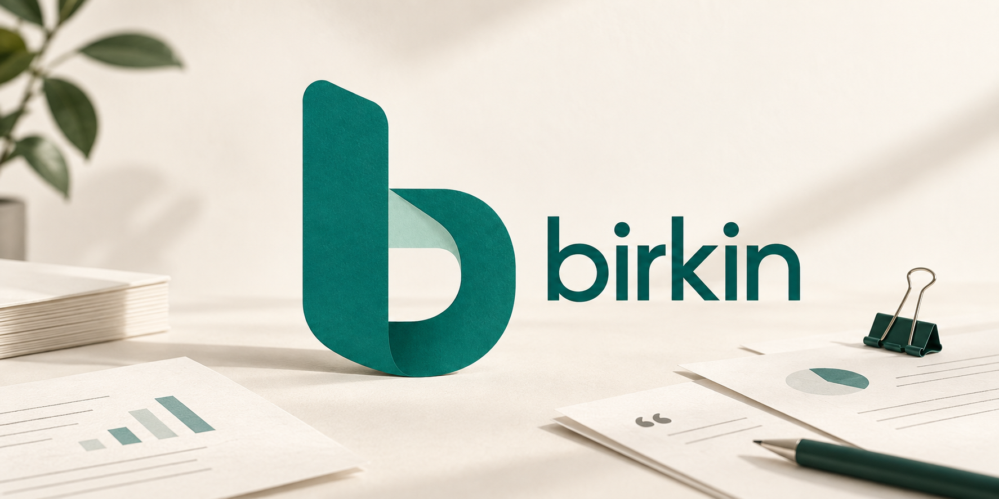
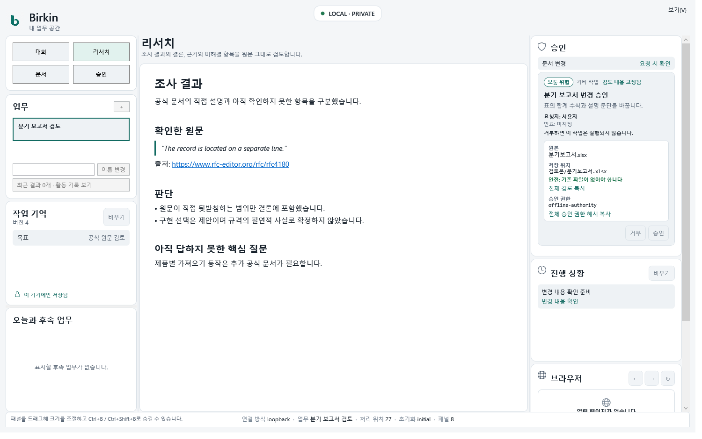

# Birkin



<p align="center"><strong>리서치와 Office 문서, 승인이 필요한 실행을 한곳에서 다루는 로컬 업무 공간.</strong></p>

<p align="center">
  <a href="./README.md">English</a> ·
  <a href="./docs/office-support.md">Office 지원 범위</a> ·
  <a href="./docs/DESIGN.md">아키텍처</a> ·
  <a href="./docs/config-reference.ko.md">설정</a>
</p>

Birkin은 대화, 근거를 남기는 리서치, 문서 작업, 승인을 하나의 로컬 업무 공간으로 연결합니다. Python이 실행과 정책을 맡고 Windows, macOS, 터미널, Web 화면은 같은 업무 상태를 보여 줍니다.

핵심은 ‘준비됨’과 ‘실행됨’을 구분하는 데 있습니다. 문서 변경은 저장 전에 검토할 수 있고, 중요한 작업은 승인 전까지 실행되지 않습니다. 완료 뒤에는 막연한 성공 메시지 대신 산출물과 검증 영수증을 남깁니다.

Birkin의 필수 runtime dependency는 `httpx`, `pydantic`, `psutil`, `tzdata`, `typing-extensions`입니다. `birkin_mnemosyne`은 별도 설치하지 않고 Birkin에 포함됩니다. 저장소에는 현재 **63개 skill**이 포함돼 있습니다.



> 표지는 생성한 브랜드 일러스트입니다. 업무 공간 이미지는 대표 데이터를 사용해 만든 제품 방향 시안입니다. 두 이미지 모두 실제 Microsoft 365 세션이나 설치 패키지 인수 결과는 아닙니다.

## 사무직용 10분 시작하기: Windows에서 첫 Office 리포트

Excel 원본을 Birkin의 격리 작업 공간으로 복사하고 한국어 리포트 초안을 요청하는 가장 짧은 경로입니다. 원본을 직접 수정하거나 API key를 먼저 입력하지 않습니다.

### 1. 설치와 provider 설정

관리자 권한이 없는 PowerShell 5.1 또는 7에서 installer를 실행하고 Office tier와 provider를 준비합니다.

```powershell
irm https://raw.githubusercontent.com/ashmoonori-afk/birkin/main/scripts/install.ps1 | iex
python -m pip install ".[office]"
birkin setup
```

### 2. Windows 문서를 격리 경로에 복사

```powershell
$source = Join-Path $env:USERPROFILE "Documents\매출.xlsx"
$incoming = Join-Path $env:USERPROFILE ".birkin\office\artifacts\incoming"
New-Item -ItemType Directory -Force $incoming | Out-Null
Copy-Item $source $incoming
```

### 3. 한국어로 첫 리포트 요청

`birkin chat`에서 `incoming의 매출.xlsx를 검사하고 주요 변화와 확인할 항목을 한국어 리포트 초안으로 정리해 줘. 원본은 수정하지 마.`라고 요청합니다. 파일 생성이나 내보내기가 제안되면 다른 PowerShell에서 `birkin review`를 실행해 source, destination, operation, overwrite 여부를 확인하고 승인합니다.

## 왜 birkin인가?

- **근거가 남는 리서치**: 공개 원문을 수집하고 출처로 확인한 사실, 근거에 기반한 추론, 아직 풀지 못한 질문을 나눠 결과와 인용을 함께 보관합니다.
- **Office 문서 검사와 변경 준비**: DOCX, XLSX, PPTX, PDF, HWPX를 읽고 추출·비교·검증하며, 새 문서를 만들거나 제한된 범위에서 원본을 보존한 채 수정합니다.
- **실행 전 검토**: 원본, 저장 위치, 정확한 변경 내용, 덮어쓰기 여부, 위험, 승인 상태를 보고 승인하거나 거부합니다.
- **추측하지 않는 복구**: 작업 기록과 영수증으로 완료·일부 완료·실패·결과 불확실을 구분합니다. 메일 발송 결과가 불확실하면 다시 보내기 전에 원격 상태부터 확인합니다.
- **로컬 우선 보관**: 세션, 기억, 승인, 감사 기록은 기본적으로 `BIRKIN_HOME` 아래에 둡니다. 설정한 모델 제공자는 요청 내용을 받을 수 있으며 Microsoft 365는 사용자가 연결한 경우에만 접속합니다.
- **필요한 화면 선택**: 터미널이나 로컬 Web 업무 공간에서 시작하고 Windows와 macOS Native 앱에서도 같은 Python 권한을 사용합니다.

## 기본 업무 흐름

1. 질문을 조사하거나 파일을 검사해 달라고 요청합니다.
2. 결과와 출처, 아직 확인하지 못한 내용을 검토합니다.
3. 문서 변경이나 외부 작업을 요청합니다.
4. 제안된 변경을 확인하고 승인하거나 거부합니다.
5. 생성된 산출물과 검증 영수증을 확인합니다.

기존 Office 파일을 바꾸려면 먼저 원본을 전용 `BIRKIN_HOME/office` 격리 경로로 가져와야 합니다. 원본은 그대로 두고 복사본에 변경하며 저장 위치도 허용된 범위 안으로 제한합니다. 승인 요청을 만들었다고 파일이 바뀌지는 않으며, 되돌리기도 별도 승인이 필요합니다.

```text
리서치 또는 파일 가져오기 → 결과와 근거 → 변경 제안
          → 사람의 승인 → 실행 + 산출물 + 영수증
```

## 빠른 시작

Python 3.10 이상이 필요합니다. 현재 저장소의 소스 버전은 Birkin `0.4.433`입니다. 이 표기는 같은 버전이 사용자 PC에 설치됐거나 서명된 공개 앱으로 배포됐다는 뜻이 아닙니다.

### Windows PowerShell 빠른 설치

관리자 권한이 없는 PowerShell 5.1 또는 7에서 현재 `main` 브랜치의 installer를 실행하고 설치 버전을 확인한 뒤 provider를 설정해 첫 대화를 시작합니다.

```powershell
irm https://raw.githubusercontent.com/ashmoonori-afk/birkin/main/scripts/install.ps1 | iex
birkin --version
birkin setup
birkin chat
```

Installer는 `setx PATH` 없이 user `PATH`를 등록하고 `birkin --version`을 검증합니다. 현재 shell에서 command shim을 찾지 못하면 `python -m birkin --version`으로 다시 확인합니다. Morpheus의 현재 기본 실행 시각은 **07:00**입니다.

원격 script를 먼저 확인하려면 다음처럼 내려받습니다.

```powershell
irm https://raw.githubusercontent.com/ashmoonori-afk/birkin/main/scripts/install.ps1 -OutFile install.ps1
notepad .\install.ps1
powershell -ExecutionPolicy Bypass -File .\install.ps1
```

기존 source checkout에서는 다음처럼 설치합니다.

```powershell
python -m pip install .
birkin setup
birkin chat
```

필요한 경우 비밀이 아닌 Birkin data root만 영구 저장합니다. `setx`는 현재 창을 갱신하지 않으며 `setx PATH`는 user path를 펼치고 잘라 손상할 수 있습니다.

```powershell
setx BIRKIN_HOME "$env:USERPROFILE\.birkin"
```

영구 override를 삭제할 때는 다음을 실행합니다.

```powershell
reg delete HKCU\Environment /v BIRKIN_HOME /f
```

WPF 앱은 development preview입니다. .NET 8과 로컬 Birkin CLI가 필요합니다.

```powershell
dotnet run --project .\windows\BirkinNativeApp\src\Birkin.Native.App\Birkin.Native.App.csproj -c Release
```

Windows client는 development preview입니다. Installer와 updater delivery, production signing, provider-backed production delivery는 각각 별도의 release gate입니다. 자세한 내용은 [Birkin for Windows](./windows/BirkinNativeApp/README.md)를 참고하십시오.

### macOS와 Linux

```bash
python3 -m pip install .
birkin setup
birkin chat
```

```bash
curl -fsSL https://raw.githubusercontent.com/ashmoonori-afk/birkin/main/scripts/install.sh | bash
birkin --version
```

macOS SwiftUI 앱은 소스에서 빌드합니다. release 자격 증명 없이 만든 빌드는 개발용 artifact입니다. notarization, stapling, Gatekeeper 검사, 공개 배포는 별도 인수 단계입니다. [Native 앱 안내](./docs/native-app/README.md)를 참고하십시오.

### Web 업무 공간

Web 업무 공간은 같은 Python 실행 환경이 로컬에서 인증을 적용해 제공합니다.

```bash
birkin web
```

다른 클라이언트에서 비공개 bootstrap URL을 열 때는 `birkin web --no-browser`를 사용합니다. 기본으로 loopback 주소에만 열리고, 일회용 bootstrap capability를 `HttpOnly`, `SameSite=Strict` cookie로 교환합니다.

## Office와 리서치 기능 추가

```bash
python -m pip install ".[office]"          # DOCX, XLSX, PPTX, HWPX
python -m pip install ".[office-advanced]" # PDF 추출과 제한된 페이지 렌더
python -m pip install ".[research]"        # 리서치 스키마와 canonical record
```

Office 기능은 범위가 정해진 문서 작업이며 데스크톱 Office 프로그램을 마음대로 자동화하는 기능이 아닙니다.

### Office Work OS v2

이 README는 Birkin `0.4.433`, `catalog_revision: 8`, `inventory_sha256: 54bb5a00d5370a69ec1c12e7e27ba72af51cfb11eb45dab912ab4ec10a008fd8`의 등록된 runtime 계약을 공개합니다. Machine publication은 [`provenance_manifest.json`](./birkin/office/adapters/provenance_manifest.json), 생성된 저작권 고지는 [`THIRD_PARTY_NOTICES.md`](./birkin/office/adapters/THIRD_PARTY_NOTICES.md)입니다.

<!-- office-support-matrix:start -->
| Format ID | Read/inspect | Create | Extract | Validate | Compare | Text convert | Surgical mutation | Render/recalc/forms |
|---|---|---|---|---|---|---|---|---|
| `docx` | bounded | conditional | bounded | structural | layered | bounded | bounded | structured-preview |
| `xlsx` | bounded | conditional | bounded | structural | layered | bounded | bounded | structured-preview |
| `pptx` | bounded | conditional | bounded | structural | layered | bounded | bounded | structured-preview |
| `pdf` | bounded | bounded | conditional | structural | layered | conditional | refused | conditional-page-image |
| `hwpx` | bounded | conditional | bounded | structural | layered | bounded | bounded | structured-preview |
<!-- office-support-matrix:end -->

정확히 등록된 도구는 `list_document_adapters`, `inspect_document`, `extract_document`, `analyze_workbook`, `review_meeting_actions`, `list_work_items`, `work_item_request`, `m365_document_import`, `search_office_sources`, `list_office_batches`, `office_batch_request`, `list_office_templates`, `office_template_request`, `resolve_office_template`, `compare_documents`, `render_artifact`, `validate_artifact`, `office_job_request`, `office_rollback_request`입니다. Machine catalog는 각 adapter의 `public_entrypoint`를 하위 capability와 별도로 기록합니다.

동기화된 skill ID는 `office-work-os`, `office-documents`, `word-documents`, `spreadsheets`, `presentations`, `pdf-documents`, `korean-hwp-documents`입니다.

입력은 `BIRKIN_HOME/office`에 격리됩니다. `BIRKIN_HOME=/workspace/.birkin`이면 `/workspace/.birkin/office/artifacts/incoming` 아래로 가져옵니다. 추출은 `max_text_bytes`를 받고 변환에는 명시적인 `loss_budget`이 필요하며 semantic render는 `output_format: "structured_preview"`를 사용합니다. PDF만 한 페이지 이미지를 조건부로 render할 수 있고, 지원하지 않는 다른 visual 요청은 `RENDER_UNAVAILABLE`을 반환합니다.

정확한 인자, provenance, 제한, 거부 조건은 [버전이 지정된 Office 지원 계약](./docs/office-support.md#office-work-os-v2)에 있습니다.

## GitHub Action

저장소의 GitHub workflow는 같은 Python 권한과 문서 계약을 검사합니다. 일부 로컬 결과를 여러 플랫폼의 release 인수로 해석하지 않습니다.

## 모델 제공자와 자주 쓰는 명령

`birkin setup`에서 모델 제공자와 모델을 설정합니다. 기본 설정은 로컬 `codex-cli` 모델 제공자를 사용하며 API 제공자나 호환 endpoint는 각 서비스의 자격 증명이 필요합니다.

```bash
birkin --version
birkin --help
birkin chat --dry-run "이 요청을 요약해줘" # prompt packet만 만들고 전송하지 않음
birkin review                              # 대기 중인 승인 검토
```

전체 설정표는 [설정 참조](./docs/config-reference.ko.md)에 있습니다. 사용자용 한국어와 protocol·진단용 영어의 기준은 [언어 정책](./docs/language-policy.md)을 따릅니다.

## 설정

`birkin setup`은 `~/.birkin/config.json`을 씁니다. 아래 block은 `birkin.config.DEFAULT_CONFIG`에서 생성되고 test가 검증하므로 일부 예시가 아니라 전체 기본값입니다.

<details>
<summary><strong>전체 기본 설정</strong></summary>

<!-- config-schema:start -->
```json
{
  "provider": "codex-cli",
  "model": "default",
  "subagent_model": "default",
  "base_url": "",
  "cli_command": [],
  "api_key": null,
  "max_tokens": 4096,
  "temperature": 1.0,
  "max_turns": 24,
  "auto_compact": true,
  "context_window": 200000,
  "fallback_provider": "",
  "fallback_model": "",
  "fallback_base_url": "",
  "fallback_cooldown": 300,
  "fallback_chain": [],
  "api_keys": [],
  "a2a_enabled": false,
  "lsp_servers": {},
  "spill_threshold": 30000,
  "spill_dir": "",
  "spill_retention_days": 7,
  "redact_secrets": true,
  "repl_typed_line": "steer",
  "moirai_auto": false,
  "worker_call_auto": true,
  "session_goal_fallback": true,
  "moirai_workers": 4,
  "moirai_max_agents": 100,
  "moirai_roles": {},
  "moirai_token_budget": 0,
  "marginalia_api_key": "",
  "parallel_tools": true,
  "parallel_tool_workers": 8,
  "shell_approval": "manual",
  "shell": {
    "extra_roots": [],
    "env_passthrough": []
  },
  "allow_powershell": false,
  "checkpoints": true,
  "hooks": {},
  "hooks_auto_accept": false,
  "skills_guard_agent_created": false,
  "checkpoint_keep": 20,
  "command_allowlist": [],
  "approval_model": "",
  "max_depth": 2,
  "extra_skill_dirs": [],
  "disabled_tools": [],
  "desktop_tools": false,
  "computer_use": {
    "enabled": false,
    "allowed_apps": [],
    "denied_apps": [],
    "allowed_windows": null,
    "denied_windows": [],
    "allowed_operations": [
      "click",
      "double_click",
      "right_click",
      "middle_click",
      "drag",
      "scroll",
      "type"
    ],
    "max_actions": 200
  },
  "self_improve": true,
  "skill_nudge_interval": 3,
  "memory_nudge_interval": 6,
  "web_port": 8787,
  "web_remote_access": false,
  "web_external_url": "",
  "browser_allow_private_network": false,
  "gateway_port": 8788,
  "gateway": {
    "http": {
      "insecure_no_token": false
    }
  },
  "gateway_model": "",
  "gateway_reasoning_effort": "",
  "gateway_persistent": true,
  "gateway_allowed_tools": [],
  "repl_warm_session": false,
  "gateway_clean_hooks": true,
  "gateway_thinking_tokens": 0,
  "gateway_prewarm": true,
  "gateway_max_sessions": 8,
  "gateway_session_ttl_s": 3600,
  "gateway_polish_timeout": 90,
  "voice": {
    "wake_phrase": "Daddy is home",
    "gateway_url": "",
    "session_id": "voice-local",
    "sample_rate": 24000,
    "stt_model": "gpt-transcribe",
    "tts_model": "gpt-4o-mini-tts",
    "tts_voice": "coral",
    "tts_instructions": "Speak concisely and clearly.",
    "conversation_style": "",
    "onboarding_complete": false,
    "background_workers": 2
  },
  "autosave_transcripts": false,
  "autosave_redact_secrets": true,
  "autosave_max_chars": 4000,
  "autosave_max_turns": 40,
  "autosave_retention_days": 30,
  "autosave_max_files": 500,
  "profile": {
    "enabled": false,
    "write_approval": false,
    "limits": {
      "user": 1375,
      "preferences": 1375,
      "mask": 800,
      "workflow": 1000,
      "automation": 800
    },
    "background_review": {
      "enabled": false,
      "provider": null,
      "model": null,
      "digest_recent_turns": 6
    }
  },
  "neurosis_threshold": null,
  "neurosis_auto": true,
  "channels": {
    "http": {
      "enabled": true
    },
    "telegram": {
      "enabled": false,
      "token": "",
      "allowed_chat_ids": [],
      "allowed_sender_ids": [],
      "stream": true,
      "max_public_workers": 4
    },
    "slack": {
      "enabled": false,
      "webhook_url": "",
      "allowed_channel_ids": []
    },
    "discord": {
      "enabled": false,
      "webhook_url": "",
      "allowed_channel_ids": []
    }
  },
  "vault_path": "",
  "memory_vector_enabled": false,
  "memory_vector_backend": "sentence-transformers",
  "memory_vector_model": "all-MiniLM-L6-v2",
  "memory_entity_enabled": false,
  "memory_temporal_enabled": false,
  "memory_scope": "user",
  "memory_visible_scopes": [
    "workflow",
    "agent",
    "project",
    "organization",
    "user"
  ],
  "memory_default_trust": "medium",
  "memory_source_trust": {},
  "morpheus_deliver_chat_id": "",
  "workspace_roots": [],
  "reaper_enabled": true,
  "morpheus_provider": "",
  "morpheus_model": "",
  "morpheus_hour": 7,
  "morpheus_minute": 0,
  "auto_approve": [
    "memory",
    "skill"
  ],
  "harness_enabled": true,
  "harness_turn_interval": 12,
  "harness_cooldown_min": 15,
  "ishikawa_enabled": true,
  "minto_enabled": true,
  "confidence_strict_below": 0.4,
  "confidence_fast_above": 0.8,
  "cynefin_enabled": true,
  "evidence_gate_enabled": false,
  "harness_compact_review": true,
  "harness_max_edits": 12,
  "harness_prompt_budget": 20000,
  "harness_auto_approve": [
    "memory",
    "skill_note"
  ],
  "cli_access": "workspace",
  "cli_network_access": false,
  "egress": {
    "enabled": true,
    "enforced": true,
    "max_bytes": 1048576,
    "destinations": {}
  },
  "allow_unattended_full": false,
  "budget_tokens_daily": 0,
  "budget_tokens_monthly": 0,
  "subagent_tree_max_tokens": 0,
  "subagent_tree_max_usd": 0.0,
  "subagent_tree_deadline_seconds": 0,
  "subagent_tree_max_concurrent": 4,
  "subagent_tree_max_nodes": 16,
  "cli_timeout": 300,
  "evidence_required": false,
  "critique_agents": 3,
  "boulder_max_iters": 100,
  "daedalus_dir": "",
  "daedalus_max_files": 2000,
  "fs_jail": false,
  "sandbox": {
    "backend": "worktree",
    "image": "",
    "setup": [],
    "env_allowlist": [],
    "network": "off",
    "network_allowlist": [],
    "write_paths": [
      "."
    ]
  },
  "update_verify_signature": false
}
```
<!-- config-schema:end -->

</details>

## 신뢰 경계

- 문서 본문, URL, 수식, macro, metadata, embedded object는 신뢰하지 않는 입력으로 다룹니다.
- 읽기와 검사는 쓰기 권한을 만들지 않습니다. Office 변경은 `office_job_request`, 되돌리기는 `office_rollback_request`를 통해서만 요청합니다.
- 승인은 원본 hash, 작업 내용, 저장 위치, 덮어쓰기 선택, 제안자를 정확히 묶습니다. 입력이 바뀌면 실행을 중단합니다.
- Browser와 Computer Use는 선택 기능이며 설정 전에는 꺼져 있습니다. 허용 목록, 작업 횟수 제한, 승인 정책의 적용을 받습니다.
- 모델 제공자 응답, HTTP 접수, 로컬 영수증, 확인된 원격 상태는 서로 다른 증거입니다. 외부 결과를 관측할 수 없으면 `unknown`이나 `needs_review` 상태를 유지합니다.

## 확인된 범위와 현재 한계

저장소 테스트와 제한된 로컬 실행으로 Python 권한, 승인·복구 계약, Web 동작, Native protocol projection을 검증했습니다. 대표 DOCX 한 건은 자연어 검사부터 Native 승인, 파일 저장, 영수증 확인까지 통과했고 승인 전에는 결과 파일이 생기지 않았습니다.

이 결과만으로 공개 제품 전체가 인수됐다고 볼 수는 없습니다.

- 소스 버전만으로 실제 설치 버전이나 공개 배포 버전을 알 수 없습니다.
- 최신 리서치 실행에는 미확정 주장이 남았고 답변 전체 인수를 통과하지 못했습니다.
- mock/offline 렌더와 keyboard 검사는 통과했지만 실제 설치본 여정, macOS CI 후속 확인, 사람의 화면 읽기 프로그램 검토가 남아 있습니다.
- Microsoft 365 실제 계정 검증은 마지막 단계로 두었으며 아직 완료하지 않았습니다.
- Windows 서명 package와 macOS notarized public 배포를 확인하지 못했습니다.

근거와 남은 조건은 [Office 에이전트 리뷰](./docs/office-agent-review.md), [UI 재설계 기준](./docs/ui-redesign-spec.md), [Windows 첫 리포트 여정](./docs/windows-first-report-journey.md)에 기록돼 있습니다.

## 문서 안내

| 찾는 내용 | 문서 |
| --- | --- |
| 정확한 Office 기능 | [Office Work OS v2](./docs/office-support.md) |
| UI 동작과 접근성 기준 | [UI 재설계 기준](./docs/ui-redesign-spec.md) |
| 현재 구현과 남은 조건 | [Office 에이전트 리뷰](./docs/office-agent-review.md) |
| 전체 설정 스키마 | [설정 참조](./docs/config-reference.ko.md) |
| 실행 환경 아키텍처 | [설계 문서](./docs/DESIGN.md) |
| 기억 시스템 | [Mnemosyne 설계](./docs/mnemosyne-design.md) |
| 멀티 에이전트 업무 흐름 | [Moirai 설계](./docs/moirai-design.md) |
| Native protocol과 보안 | [Native 앱 문서](./docs/native-app/README.md) |
| 현재 개발 상태 | [상태 문서](./docs/STATUS.md) |
| VS Code client | [Extension](./vscode-extension) |

## 개발

```bash
python -m pip install -e ".[dev]"
pytest
```

Native와 Browser test에는 플랫폼별 준비가 더 필요합니다. 일부 로컬 test 통과를 여러 플랫폼의 전체 인수로 해석하지 말고 위의 문서를 따라 확인하십시오.

Birkin은 [MIT License](./LICENSE)로 배포합니다. 외부 구성 요소의 저작권과 조건은 [NOTICE](./NOTICE), `LICENSES/`, Office [third-party notice](./birkin/office/adapters/THIRD_PARTY_NOTICES.md)에 기록돼 있습니다.
