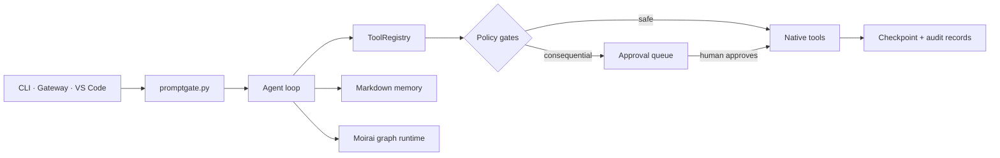

<div align="center">


# birkin

### 로컬 메모리. 결정적 제어. 사람의 권한.

메모리, 실행, 자기개선을 내 컴퓨터에서 직접 확인할 수 있는 의존성 가벼운 파이썬 에이전트.

[](https://github.com/ashmoonori-afk/birkin/actions/workflows/tests.yml)
[](./pyproject.toml)
[](./vscode-extension)
[](./LICENSE)

[존재 이유](#왜-birkin인가) · [빠른 시작](#빠른-시작) · [VS Code](#vs-code-extension) · [비교](#표면-비교) · [아키텍처](#아키텍처) · [명령어](#명령어) · [English](./README.md)

</div>

---

## 왜 birkin인가?

에이전트 런타임은 시연하기는 쉽지만 신뢰하기는 어렵습니다. Birkin은 모델의 유용함은 유지하고 권한은 코드로 옮깁니다.

| 문제 | Birkin의 해법 |
|---|---|
| 메모리가 호스팅 서비스나 벡터 데이터베이스 안으로 사라짐 | YAML frontmatter와 wikilink를 쓰는 마크다운 노트를 Obsidian 호환 로컬 볼트에 저장합니다. |
| 프롬프트가 자기 자신의 안전을 강제해야 함 | 네이티브 도구는 하나의 registry를 지나며, shell과 예약 작업은 결정적 정책과 승인 큐를 통과합니다. |
| “멀티에이전트”가 모델의 재귀적 자기 spawn을 뜻함 | Moirai가 budget·spawn 상한과 함께 파이썬 소유의 `agent`, `parallel`, `pipeline` 그래프 primitive를 제공합니다. |
| 자기개선이 런타임을 몰래 변경함 | Harness가 타입화된 proposal을 버전 ledger에 기록하고 rollback을 지원합니다. |
| 코딩 에이전트가 사용자가 plan을 이해하기 전에 파일을 변경함 | 공식 VS Code extension이 editor context를 보내고, plan을 먼저 검토하며, 제안 diff를 표시하고, Birkin 승인을 처리하고, checkpoint를 복원합니다. |
| 로컬 도구가 불투명한 서비스가 됨 | run, approval, checkpoint, status, config가 모두 로컬에서 확인 가능합니다. |

Birkin 핵심 런타임에는 **필수 서드파티 파이썬 의존성이 없습니다**. 선택적 extra가 voice, desktop vision, office 파일 지원을 추가합니다. 현재 저장소에는 **56개 스킬**이 번들되며, 기본 테스트는 모두 오프라인 실행을 목표로 합니다.

## 빠른 시작

Python 3.10 이상이 필요합니다. 기본 provider는 로컬 인증된 Codex CLI이며, setup에서 Claude CLI나 API provider를 고를 수 있습니다.

```bash
git clone https://github.com/ashmoonori-afk/birkin.git
cd birkin
python -m pip install -e .
birkin setup
birkin chat
```

로컬 서비스 표면은 별도 터미널에서 실행합니다.

```bash
birkin gateway          # 127.0.0.1:8788 로컬 HTTP, Telegram은 선택 사항
birkin web --no-browser # 127.0.0.1:8787 dashboard/control API
```

선택 기능은 명시적으로 설치합니다.

```bash
python -m pip install -e ".[voice]"
python -m pip install -e ".[desktop]"
python -m pip install -e ".[office]"
python -m pip install -e ".[full]"
```

> [!IMPORTANT]
> 네이티브 도구는 현재 OS 계정 권한으로 실행됩니다. gateway를 loopback 전용으로 유지하고, 배포 환경에 맞게 `shell_approval`, `fs_jail`, disabled tools, channel allowlist를 설정하며, 결과가 생기는 행동은 승인 전에 검토하십시오.

## VS Code extension

`vscode-extension/`은 공식 TypeScript extension입니다. 두 번째 에이전트 프로토콜을 만들지 않고 Birkin의 기존 로컬 표면에 연결됩니다.

- 활성 selection, range, workspace, 열린 파일 descriptor를 gateway에 전달
- 실행하지 않는 plan을 요청하고 명시적인 **Execute Plan** 결정 요구
- 파일 proposal을 VS Code 네이티브 inline diff editor로 표시
- 기존 Birkin approval queue를 통해 승인 또는 거절
- 확인 후 Birkin shadow-git checkpoint 복원
- status bar에 실시간 runtime·검토 대기 상태 표시

### 소스에서 설치

```bash
cd vscode-extension
npm ci
npm run compile
npm run package
code --install-extension birkin-vscode-0.1.0.vsix
```

Extension Development Host로 실행:

```bash
cd vscode-extension
npm ci
npm run compile
code --extensionDevelopmentPath="$PWD"
```

`birkin gateway`와 `birkin web --no-browser`를 모두 시작하십시오. WebUI는 private `~/.birkin/web_session.json`을 쓰며 extension은 이 파일에서 loopback port와 capability를 찾습니다. gateway가 8788이 아니면 `birkin.gatewayUrl`을 바꾸십시오. `BIRKIN_HTTP_TOKEN`을 설정했다면 같은 값을 `birkin.gatewayToken`에 넣으십시오.

Command Palette에서 **Birkin: Review Plan Before Execution**을 실행하십시오. 나머지 명령은 context 요청 전송, 제안 변경 검토, 파일 rollback, status 갱신을 담당합니다.

## 표면 비교

아래 행은 모두 이 저장소에 실제로 포함된 표면을 설명합니다.

| 기능 | CLI / REPL | Gateway | WebUI | VS Code |
|---|:---:|:---:|:---:|:---:|
| 대화형 에이전트 | 지원 | 지원 | 미지원(모니터링/control) | Gateway를 통해 지원 |
| 현재 editor selection과 열린 파일 | 수동 | 수동 | 미지원 | 지원 |
| 실행 전 plan review | slash command/workflow에 따라 다름 | 대화에 따라 다름 | 미지원 | 전용 review surface |
| 제안 변경 diff | 터미널 checkpoint diff | 미지원 | approval 상세 | VS Code 네이티브 diff editor |
| Approval queue | `birkin review` | 신뢰 chat control | 승인/거절 API와 UI | 승인/거절 API |
| 파일 rollback | `/rollback` | 미지원 | checkpoint control API | checkpoint picker |
| 실시간 status | status line | progress callback | dashboard | status bar |
| 로컬 transport | process stdin/stdout | loopback HTTP / channel | loopback HTTP | 기존 gateway + WebUI API |

## 아키텍처

모델은 제안하고, 결정적 코드는 영속화·정책·권한을 소유합니다.



<details>
<summary><strong>저장소 구조</strong></summary>

```text
birkin/
  agent.py          네이티브 tool loop, steering, compaction, 병렬 호출
  runtime.py        provider, prompt, registry, memory, skill 구성
  promptgate.py     모든 main surface의 단일 system-prompt 조립 지점
  tools/            file, shell, web, vision, memory, session, subagent
  approvals.py      사람의 gate와 승인된 action 실행
  checkpoints.py    외부 shadow-git snapshot과 restore
  gateway/          local HTTP, Telegram, outbound channel adapter
  web/              local dashboard와 인증된 control API
  harness.py        검증되는 자기개선 ledger와 rollback
  moirai/           결정적 멀티에이전트 graph runtime
  mcp_server.py     memory, skill, proposal용 stdio MCP server
vscode-extension/   공식 strict-TypeScript editor integration
skills/             번들 Markdown skill
tests/              offline unit, integration, end-to-end coverage
```

상태는 `BIRKIN_HOME`(보통 `~/.birkin`) 아래 파일에 저장됩니다. Dashboard는 process별 capability를 사용합니다. Gateway는 loopback에 bind하며 추가로 `BIRKIN_HTTP_TOKEN`을 요구할 수 있습니다. MCP는 stdio 위 newline-delimited JSON-RPC를 사용합니다. VS Code extension은 이 기존 권한에 연결됩니다. turn은 gateway `/message`, approval·status·editor context·checkpoint는 WebUI endpoint를 사용합니다.

</details>

<details>
<summary><strong>실행과 복구 경로</strong></summary>

1. `runtime.py`가 설정된 provider, memory, skill, hook, checkpoint manager, native tool registry를 구성합니다.
2. `promptgate.py`가 REPL, gateway, dry-run, warm session이 공유하는 sealed main prompt를 조립합니다.
3. `ToolRegistry.run`이 hook, redaction, output 처리의 네이티브 통제 지점입니다.
4. 결과가 생기는 cron, shell, operation, workflow, harness action은 file-backed approval record가 됩니다.
5. 파일을 변경하는 도구는 mutation 전에 프로젝트를 Birkin 외부 checkpoint store에 snapshot합니다.
6. 사용자는 CLI, 신뢰 channel, WebUI, VS Code에서 queue를 처리합니다. Rollback은 현재 상태를 먼저 보호한 뒤 선택한 checkpoint를 복원합니다.

</details>

## 명령어

| 명령 | 용도 |
|---|---|
| `birkin setup` | Provider와 workspace 안내 설정. |
| `birkin chat` | 대화형 로컬 에이전트(기본 명령). |
| `birkin gateway` | Loopback HTTP와 설정된 message channel 실행. |
| `birkin web [--no-browser]` | 로컬 dashboard와 인증된 control API 실행. |
| `birkin review` | 결과가 생기는 대기 action 승인 또는 거절. |
| `birkin permission` | Approval category와 CLI access 확인·변경. |
| `birkin tools` | 네이티브 tool 목록·활성화·비활성화. |
| `birkin model` / `birkin models` | Model 확인 또는 선택. |
| `birkin skills` | Skill 목록·조회·sync·validate·관리. |
| `birkin daemon` | Morpheus + cron scheduler 실행 또는 설치. |
| `birkin morpheus [--dry-run]` | 예약 자기개선 routine 즉시 실행. |
| `birkin harness` | 개선 ledger 조회·refine·export·rollback. |
| `birkin moirai` | 결정적 workflow 목록·실행·조회·resume. |
| `birkin runs` / `birkin trace ID` | Run summary와 상세 audit record 조회. |
| `birkin cron` | 예약 job 목록 또는 삭제. |
| `birkin sessions` | 저장된 대화 목록 또는 export. |
| `birkin mcp-serve` | Birkin memory, skill, proposal을 MCP stdio로 제공. |
| `birkin voice` | 선택적 voice daemon 설정·제어. |

전체 interface는 `birkin --help` 또는 `birkin <command> --help`로 확인하십시오.

## 설정

`birkin setup`은 `~/.birkin/config.json`을 씁니다. 아래 블록은 `birkin.config.DEFAULT_CONFIG`에서 생성되고 테스트가 검증하므로, 발췌가 아니라 전체 기본값입니다.

<details>
<summary><strong>전체 기본 설정</strong></summary>

<!-- config-schema:start -->
```json
{
  "provider": "codex-cli",
  "model": "default",
  "subagent_model": "default",
  "base_url": "",
  "cli_command": [],
  "api_key": null,
  "max_tokens": 4096,
  "temperature": 1.0,
  "max_turns": 24,
  "auto_compact": true,
  "context_window": 200000,
  "fallback_provider": "",
  "fallback_model": "",
  "fallback_base_url": "",
  "fallback_cooldown": 300,
  "api_keys": [],
  "a2a_enabled": false,
  "lsp_servers": {},
  "spill_threshold": 30000,
  "spill_dir": "",
  "spill_retention_days": 7,
  "redact_secrets": true,
  "repl_typed_line": "steer",
  "moirai_auto": false,
  "moirai_workers": 4,
  "moirai_max_agents": 100,
  "moirai_roles": {},
  "moirai_token_budget": 0,
  "marginalia_api_key": "",
  "parallel_tools": true,
  "parallel_tool_workers": 8,
  "shell_approval": "manual",
  "checkpoints": true,
  "hooks": {},
  "hooks_auto_accept": false,
  "skills_guard_agent_created": false,
  "checkpoint_keep": 20,
  "command_allowlist": [],
  "approval_model": "",
  "max_depth": 2,
  "extra_skill_dirs": [],
  "disabled_tools": [],
  "desktop_tools": false,
  "self_improve": true,
  "skill_nudge_interval": 3,
  "memory_nudge_interval": 6,
  "web_port": 8787,
  "gateway_port": 8788,
  "gateway_model": "",
  "gateway_reasoning_effort": "",
  "gateway_persistent": true,
  "gateway_allowed_tools": [],
  "repl_warm_session": false,
  "gateway_clean_hooks": true,
  "gateway_thinking_tokens": 0,
  "gateway_prewarm": true,
  "voice": {
    "wake_phrase": "Daddy is home",
    "gateway_url": "",
    "session_id": "voice-local",
    "sample_rate": 24000,
    "stt_model": "gpt-transcribe",
    "tts_model": "gpt-4o-mini-tts",
    "tts_voice": "coral",
    "tts_instructions": "Speak concisely and clearly.",
    "conversation_style": "",
    "onboarding_complete": false,
    "background_workers": 2
  },
  "autosave_transcripts": false,
  "autosave_redact_secrets": true,
  "autosave_max_chars": 4000,
  "autosave_max_turns": 40,
  "autosave_retention_days": 30,
  "autosave_max_files": 500,
  "neurosis_threshold": null,
  "neurosis_auto": true,
  "channels": {
    "http": {
      "enabled": true
    },
    "telegram": {
      "enabled": false,
      "token": "",
      "allowed_chat_ids": [],
      "stream": true
    },
    "slack": {
      "enabled": false,
      "webhook_url": ""
    },
    "discord": {
      "enabled": false,
      "webhook_url": ""
    }
  },
  "vault_path": "",
  "morpheus_deliver_chat_id": "",
  "workspace_roots": [],
  "reaper_enabled": true,
  "morpheus_provider": "",
  "morpheus_model": "",
  "morpheus_hour": 7,
  "morpheus_minute": 0,
  "auto_approve": [
    "memory",
    "skill"
  ],
  "harness_enabled": true,
  "harness_turn_interval": 12,
  "harness_cooldown_min": 15,
  "harness_compact_review": true,
  "harness_max_edits": 12,
  "harness_prompt_budget": 20000,
  "harness_auto_approve": [
    "memory",
    "skill_note"
  ],
  "cli_access": "workspace",
  "cli_network_access": false,
  "egress": {
    "enabled": true,
    "enforced": true,
    "max_bytes": 1048576,
    "destinations": {}
  },
  "allow_unattended_full": false,
  "budget_tokens_daily": 0,
  "budget_tokens_monthly": 0,
  "subagent_tree_max_tokens": 0,
  "subagent_tree_max_usd": 0.0,
  "subagent_tree_deadline_seconds": 0,
  "subagent_tree_max_concurrent": 4,
  "subagent_tree_max_nodes": 16,
  "cli_timeout": 300,
  "evidence_required": false,
  "critique_agents": 3,
  "boulder_max_iters": 100,
  "fs_jail": false,
  "update_verify_signature": false
}
```
<!-- config-schema:end -->

</details>

Provider secret은 환경 변수에 두는 것이 원칙입니다. `api_keys`는 환경 변수 pool의 이름이며 raw key를 붙여 넣는 곳이 아닙니다. `a2a_enabled`는 opt-in입니다. Enforced egress는 검사되지 않은 네이티브 network 경로를 비활성화하고 설정된 destination만 Birkin의 inspected tool을 통해 허용합니다. Sandbox 안의 gateway child는 `propose_action`으로 shell 요청을 제출할 수 있고, Birkin은 이를 child sandbox에서 실행하지 않고 승인 큐에 넣습니다.

## 개발

```bash
python -m pip install -e ".[dev]"
python -m compileall -q birkin
python -m pytest

cd vscode-extension
npm ci
npm test
npm run compile
npm run test:e2e
```

CI는 Ubuntu/Python 3.10, macOS/Python 3.13, Windows/Python 3.13에서 파이썬 suite를 실행합니다. Extension unit test는 Vitest, 실제 host QA는 `@vscode/test-electron`을 사용합니다.

## 라이선스

[MIT](./LICENSE). Attribution은 [NOTICE](./NOTICE)를 참고하십시오.
