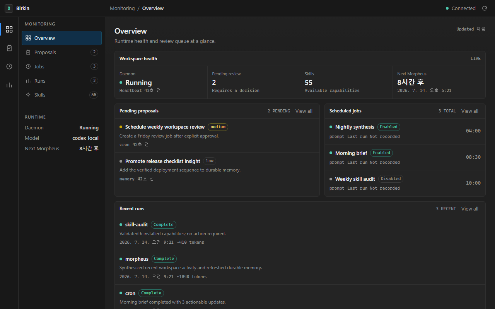

<div align="center">

```
 ██████╗ ██╗██████╗ ██╗  ██╗██╗███╗   ██╗
 ██╔══██╗██║██╔══██╗██║ ██╔╝██║████╗  ██║
 ██████╔╝██║██████╔╝█████╔╝ ██║██╔██╗ ██║
 ██╔══██╗██║██╔══██╗██╔═██╗ ██║██║╚██╗██║
 ██████╔╝██║██║  ██║██║  ██╗██║██║ ╚████║
 ╚═════╝ ╚═╝╚═╝  ╚═╝╚═╝  ╚═╝╚═╝╚═╝  ╚═══╝
```

### 당신을 기억하는 Claude 에이전트. 그 기억은 당신의 마크다운 파일에.

🌐 **Language**: [English](./README.md) · 한국어

</div>

---

birkin은 터미널과 텔레그램에서 쓰는 Claude 개인 에이전트입니다. 기억은 옵시디언
호환 마크다운 폴더 하나에 담깁니다. 옵시디언으로 열고, grep하고, git에 넣으세요.
당신의 것이고, birkin보다 오래 남습니다.

그리고 **기억을 지우는 연산 자체가 없는 유일한 에이전트**입니다. 야간 정리는
파일시스템과 "지우지 말라"는 당부를 받는 게 아닙니다 — 네 가지 연산으로 된 타입
플랜만 낼 수 있고, 그중 삭제는 없으며, 결정적 executor가 무엇이 살아남을지
정합니다. 적대적인 모델도, 노트에 심긴 프롬프트 인젝션도, 어느 날 밤의 사고도
당신이 기억하라고 한 것을 지울 수 없습니다.

번역이 아니라, 처음부터 한국어로.

---

## 무엇을 얻나요

| | |
|---|---|
| **내가 소유하는 볼트** | `~/.birkin/vault` 아래 `[[위키링크]]`·frontmatter·존·TTL을 가진 마크다운 노트. 랭킹에 에빙하우스 망각곡선이 결합된 BM25 검색 — 임베딩 없음, 불투명한 것 없음, 손으로 고칠 수 있음. |
| **지울 수 없는 큐레이션** | 매일 밤 모델은 타입 JSON 플랜을 제안할 뿐이고, 안전한 연산만 결정적 executor가 적용합니다. 아카이브 상한, 보호 노트 불가침, 적용 전 볼트 스냅샷 — 수락된 편집조차 되돌릴 수 있습니다. |
| **결과가 생기기 전에 승인** | 파괴적 셸 명령은 거부되거나 큐에 들어갑니다. 조용히 실행되는 일은 없습니다. 거부하면 그 사유가 에이전트에게 전달돼 맹목적 재시도 대신 방향을 고칩니다. **모델이 자기 셸 명령을 승인하지 않습니다.** |
| **행동 전 명료화** | 모호한 요청엔 추측하지 않고 한 질문씩 인터뷰합니다(모호도 점수 기반). spec을 쓰고, 승인한 뒤에야 움직입니다. |
| **밤사이 개선, 아침에 영수증** | 모든 턴이 자동 저장되고, Morpheus가 하루를 읽어 기억을 갱신하고 스킬을 초안하며 파급 있는 건 아침 검토용으로 큐잉합니다. 단 codex-cli에서는 `cli_access: full`일 때만 가능합니다 — 그 외에는 `codex exec`가 MCP 호출을 취소하며, 조용히 아무것도 저장하지 않는 대신 실행이 그 사실을 알려줍니다. 모든 턴은 `birkin trace`로 재생됩니다. |
| **한국어가 제1언어** | 한글 바이그램 검색, `지난주에 정리한…` 날짜 단서, `매주 월요일 09:00` 스케줄, CJK 정확한 터미널 폭. 나중에 현지화한 게 아니라 한국어로 검증합니다. |
| **모델 계열을 가로지르는 워크플로우** | 프롬프트가 아니라 스크립트를 실행합니다: 한 워크플로우 안에서 codex가 초안을 쓰고, claude 비평가 셋이 병렬로 공격하고, codex가 수정합니다. 어느 역할을 어느 모델이 맡을지는 하드코딩이 아니라 실행 전에 고릅니다. |
| **기본 UI 컴포넌트 북** | 프로젝트가 다른 디자인 시스템을 지정하지 않으면 프론트엔드 작업은 [shadcn/ui](https://ui.shadcn.com/docs/components)의 구성·상태·접근성 패턴에서 시작합니다. React/Tailwind에서는 컴포넌트를 직접 쓸 수 있고, 다른 스택에서는 의존성이 설치된 척하지 않고 패턴만 옮깁니다. |
| **런타임 의존성 0** | `dependencies = []`. 하루면 다 읽을 수 있는 stdlib 파이썬 패키지 하나 — Node도, Docker도, 로크파일 드리프트도 없습니다. |

---

## 설치

**macOS / Linux**
```bash
curl -fsSL https://raw.githubusercontent.com/ashmoonori-afk/birkin/main/scripts/install.sh | bash
```

**Windows (PowerShell)**
```powershell
irm https://raw.githubusercontent.com/ashmoonori-afk/birkin/main/scripts/install.ps1 | iex
```

**소스에서**
```bash
git clone https://github.com/ashmoonori-afk/birkin && cd birkin
uv run birkin            # 또는:  pip install -e .  &&  birkin
```

Python 3.10+. 첫 실행에 온보딩 마법사가 뜹니다.

### 무엇 위에서 도나요

birkin은 이미 갖고 계신 모델을 씁니다. 제품 기능은 백엔드 전반에서 동작하지만,
Birkin 네이티브 도구 루프와 외부 Claude/Codex CLI 도구 루프의 실행·권한 경계는
서로 다릅니다.

| 백엔드 | 방법 | 비용 |
|---|---|---|
| **Claude Code** (`claude`) — *기본* | `claude`에 로그인 후 `birkin model`에서 선택 | Claude 구독 |
| **Anthropic API** | `export ANTHROPIC_API_KEY=sk-ant-…` | 토큰당 — `birkin budget`이 이번 달을 달러로 알려줍니다 |
| **OpenAI 호환** | provider `openai` + `base_url` (**Ollama** 가능) | 토큰당, 로컬이면 무료 |
| **Codex** (`codex`) | `birkin auth codex login` 후 `birkin model`에서 선택 | ChatGPT 구독 |

`birkin auth codex login`은 birkin을 Codex에 **자체 OAuth 세션**으로 로그인시킵니다.
요청마다 인프로세스 HTTPS 한 번이라 `codex` 서브프로세스가 없고, `codex` CLI가
설치돼 있지 않아도 됩니다. 자격증명은 `$BIRKIN_HOME/codex-auth.json`에 두고
**`~/.codex/`에는 절대 쓰지 않습니다** — OpenAI는 갱신할 때마다 refresh token을
회전시키므로, 자격증명 하나를 두 클라이언트가 공유하면 한쪽이 로그아웃됩니다.
birkin 로그인이 없으면 `codex`는 기존대로 CLI로 폴백합니다. 어느 세션을 쓰는지는
`birkin auth codex status`로 확인합니다.

게이트웨이는 대화별로 따뜻한 프로세스를 유지하므로, 첫 응답 이후는 콜드 스타트가
아니라 모델시간(**~3초**)입니다.

### 모델 인식 프리셋과 도구 경계

Birkin은 프롬프트와 도구를 만들기 전에 실제 실행 모델을 확정합니다. 알려진 모델
패밀리에는 작은 역할 오버레이를 붙이고, 알 수 없는 모델에는 명시적인 neutral
프리셋을 씁니다. 제한된 네이티브 프리셋의 도구 그룹은 registry에서 빠지므로
모델에게 보이지도, 실행되지도 않습니다. 실행 중 `/model` 전환과
`subagent_model`도 새 모델 기준으로 registry를 다시 만듭니다.

외부 Claude/Codex CLI 에이전트는 자체 도구 루프를 소유하므로 같은 프리셋 문구는
권한 통제가 아니라 **행동 지침**입니다. 실제 경계는 해당 CLI의 sandbox와 permission
정책입니다. Birkin은 연결된 MCP 서버에도 실제 실행 모델을 전달해 MCP 도구 노출을
같은 프리셋에 맞춥니다. 사용자 `model_presets`는 역할·스타일을 바꾸고 제한을 더할
수 있지만, 내장 제한을 해제할 수는 없습니다.

> 구독 대 API 키 — 어떤 표면이 무인으로 도는지, 그게 내 플랜 약관에 무슨 의미인지
> 포함 — 은 [`docs/DECISIONS.md`](./docs/DECISIONS.md) ADR-050 / ADR-051에 적혀
> 있습니다. 알아서 발견하시라고 두지 않고 입장을 밝힙니다.

---

## 🧠 볼트

기억은 **Mnemosyne** — `~/.birkin/vault`에 자리한 기억의 궁전이고, 벡터가 아니라
파일로 만들어졌습니다.

노트는 **존(zone)** 디렉터리에 살면서 `type`·`polarity`(positive/known-failure)·
`version`(낙관적 잠금)·TTL·`[[위키링크]]`를 갖습니다. 검색은 **Okapi BM25** 역색인 —
idf 가중 질의, 한글 바이그램, 점수에 접힌 **에빙하우스 망각곡선**, 그리고
*"지난주에 정리한 배포 노트"* 가 지난주 노트를 찾게 하는 날짜 사전확률.

```bash
you > /remember 나는 군더더기 없는 간결한 답을 선호해
birkin > Noted as [[Profile - reply-style]].

you > /memory 배포 파이프라인
```

도구: `memory_search`(최적 윈도 스니펫 — 값싼 미리보기 계층),
`memory_get_note`(필요할 때 전문), `memory_write_note`, `memory_link`.
`evidence_required: true`로 출처 없는 노트를 거부할 수 있고, 시크릿은 노트가
**쓰이기 전에** 마스킹됩니다.

**주장이 아니라 실측**([연구](#-연구) 참조): 인코더 없이 튜닝된 임베딩
하이브리드와 **동급** 검색, 질의당 컨텍스트 비용은 볼트 전체 로딩 대비 **371× 절감**.

### 지울 수 없는 큐레이션

야간 큐레이터가 낼 수 있는 건 `rezone`·`link`·`supersede`·`archive`·`annotate`
뿐입니다. 삭제 연산은 **존재하지 않습니다**. 그다음 결정적 executor가 무엇이
살아남을지 정합니다 — 아카이브는 볼트의 일정 비율로 상한, 보호·부정극성 노트는
불가침, rezone으로 아카이브에 몰래 넣기 불가, 없는 노트 이름은 폐기.

`annotate`는 큐레이터가 **검색 앵커**(동의어·검색할 법한 표현·한↔영 키워드)를
노트 frontmatter에 적게 합니다 — 노트에 문자 그대로는 없는 단어로도 찾히도록. 그
연산으로는 본문을 주소 지정하는 것 자체가 불가능하고, 화이트리스트 3개 필드만,
길이·개수는 신뢰가 아니라 코드가 클램프합니다.

```bash
birkin curate-memory --dry-run   # 계획만 보여주고 아무것도 안 건드림
birkin curate-memory             # 볼트 스냅샷 후 안전한 연산만 적용
```

"에이전트에게 지우지 말라고 지시했다"와 "삭제를 표현할 수 없다"의 차이입니다.
자유형 read-modify-write 기억은 스스로를 날릴 수 있지만, 이 형태는 그럴 수 없습니다.

### 대화 기록도

```bash
birkin sessions export <name> --vault
```

트랜스크립트가 볼트 안의 옵시디언 노트가 됩니다 — 같은 파일, 같은 폴더, 같은 소유.

---

## 🔌 Claude Code에서 볼트 쓰기

볼트는 birkin 안에 갇혀 있지 않습니다. 평범한 stdio MCP 서버로 제공되므로 어떤
MCP 호스트든 마운트할 수 있습니다:

```bash
/plugin marketplace add ashmoonori-afk/birkin
/plugin install birkin-vault@birkin
```

플러그인 없이도 됩니다:

```bash
claude mcp add birkin -- birkin mcp-serve
```

이러면 Claude Code가 `memory_search`·`memory_get_note`·`memory_write_note`·
`memory_link`·`market_quote`와 스킬 도구를 갖습니다 — 볼트도, 랭킹도,
위키링크 그래프도 Claude Code를 떠나지 않고. 그 경계를 넘는 건 안전하고
되돌릴 수 있는 도구뿐입니다: **셸 없음**, 파급 있는 제안은 여전히 승인 큐로.

Claude Code 자체 메모리와 경쟁하는 게 아니라 함께 씁니다. Claude Code는 저장소별
프로젝트 노트를, 볼트는 프로젝트를 가로지르는 당신의 삶을 담습니다.
`autoMemoryDirectory`를 볼트 하위 폴더로 지정하면 둘 다 당신 소유의 같은 폴더에
씁니다.

---

## 🧵 Moirai — 모델 계열을 가로지르는 워크플로우

모델이 스스로 "에이전트를 하나 더 띄울까" 판단하는 건 오케스트레이션이 아닙니다.
Moirai가 그것입니다: 워크플로우는 파이썬 파일이고, 제어 흐름은 코드가 쥐며, 각
에이전트는 그 일을 맡아야 할 모델로 라우팅됩니다.

```bash
birkin moirai run cross-examine --args '{"topic": "..."}'
```

번들 `cross-examine` 패턴은 codex가 주장을 세우고, claude 비평가 셋이 서로 다른
각도에서 **병렬로** 공격한 뒤, codex가 수정합니다. 실측 1회: 191초어치를 71초에.

스크립트는 모델이 아니라 **역할(role)** 을 선언합니다:

```python
meta = {
    "name": "cross-examine",
    "roles": {
        "drafter": {"default": "codex:gpt-5.6-sol", "hint": "주장을 세운다"},
        "critic":  {"default": "claude:haiku", "hint": "그걸 공격한다"},
    },
}

def main(m):
    draft = m.agent("X를 주장하세요", role="drafter")
    votes = m.parallel([lambda a=a: m.agent(f"{a} 관점에서 공격: {draft}",
                                            role="critic")
                        for a in ("사실관계", "숨은 전제", "반대 사례")])
    return m.agent(f"비평을 반영해 수정: {votes}", role="drafter")
```

**어느 역할을 누가 맡을지는 실행 전에 정합니다.** 런처가 역할마다 묻습니다 —
지금 값 그대로, 지난번 것, 스크립트 기본, 아니면 프로바이더→모델 직접 고르기 —
그리고 `--bind critic=claude:opus`로 명령줄에서 고정할 수 있습니다. `--defaults`는
묻지 않고 넘어가고, 무인 표면은 애초에 프롬프트하지 않습니다.

시작 전에 무슨 일이 일어날지 보여줍니다. **달러가 아닙니다** — birkin의 주 경로는
토큰당 가격이라는 게 존재하지 않는 CLI 로그인이니까요:

```
  drafter → codex:gpt-5.6-sol     ●●○   12초 ×1        중량
  critic  → claude:opus           ●●●   62초 ×3        중량
  ─────────────────────────────────────────────────────
  합계                            예상 3분 18초 · 에이전트 4
```

무게는 가격이 바뀌어도 낡지 않는 상대 등급이고, 예상 소요는 **이 머신이 실제로
기록한** 그 모델의 중앙값입니다(첫 실행이 대체하기 전까지는 공표 수치에 `~` 표시).
예산 열은 토큰 캡을 설정했을 때만 나타납니다.

그 외: `schema=`는 검증된 데이터를 돌려줍니다(codex는 네이티브로 강제, 나머지는
프롬프트로 요청하고 검사하며 1회 재시도). 모든 호출이 저널에 남아
`birkin moirai resume <id>`는 **실제로 바뀐 첫 지점까지 재생**합니다 — 한 역할만
다시 바인딩하면 그 역할의 호출만 재실행됩니다. 실패한 에이전트는 워크플로우를
끝내는 대신 `None`을 돌려줍니다.

진입은 언제나 명시적 — CLI뿐입니다. 모델이 워크플로우를 시작할 수 있는 도구는
만들지 않았습니다. 상한이 없는 유일한 스폰 경로라서요. 현재 에이전트는 텍스트
전용이고, 도구를 쓰는 에이전트는 조용히 강등되는 대신 명확한 메시지로 거부됩니다.

### 마를 때까지 파고드는 조사

```bash
birkin moirai run deep-research --args '{"question": "..."}'
```

`deep-research`는 질문을 서로 겹치지 않는 축으로 쪼개 병렬로 조사하고, 그 답이
열어놓은 리드를 다시 따라갑니다 — 연속 두 번의 웨이브가 새 리드를 못 찾을 때까지.
그다음 주장들을 **다른 모델 계열**에 넘겨 반증을 시도하고, 확정하지 못한 것은
답에 올리는 대신 미해결로 보고합니다.

알고리즘은 oh-my-openagent의 `ulw-research`에서 각색했습니다(MIT, 파일에 출처
표기). 정직한 한계: Moirai 에이전트는 아직 텍스트 전용입니다 — 아래의
`web_search`는 birkin 본체 에이전트의 도구지 이들의 도구가 아닙니다 — 그래서 웹
비중이 큰 질문은 바인딩된 모델이 아는 것과 그 CLI가 닿는 범위에 기댑니다.

### birkin이 워크플로우를 먼저 제안하게 하기

기본값 꺼짐. `"moirai_auto": true`로 켜면, 여러 에이전트를 병렬로 돌리는 게 실제로
나은 요청은 답변 대신 **제안**됩니다. 그 제안은 파급 있는 다른 모든 것과 같은
`birkin review` 함으로 들어옵니다:

```
🧵 세 접근 비교
   세 갈래를 병렬로 파는 게 낫다
   워크플로우: deep-research
```

모델은 판단하고 제안할 뿐, 여전히 스스로 시작할 수 없습니다. Moirai를 모델에게
노출하는 도구는 없고, 그 사실을 테스트가 강제합니다. 이걸 켜는 건 2026-07-07에
의도를 자동 감지하지 않기로 한 결정을 뒤집는 일이라, 명시적인 설정 변경을
요구합니다.

설계 문서: `docs/moirai-design.md`.

---

## 🔒 설계상 안전

**셸 명령은 먼저 묻고, 기억 수정은 diff를 남깁니다.**

업계는 반대로 가고 있습니다 — 가장 큰 오픈소스 에이전트는 이제 LLM 리뷰어가
플래그된 명령을 기본값으로 승인합니다. birkin은 의도적으로 그러지 않습니다:
**모델이 자기 셸 명령을 승인하지 않습니다.**

- **run_shell 승인 게이트.** `rm -rf`·`curl | sh`·force-push 같은 건 즉시 거부하거나,
  아무도 보고 있지 않을 땐 당신을 위해 큐잉합니다. 패턴 기반 — 샌드박스가 아니라
  안전벨트 — 이고, 영구 허용목록은 복합 명령엔 절대 매칭되지 않습니다.
- **거부가 가르칩니다.** `/deny <id> <이유>`로 사유를 보내면 에이전트가 변형을
  맹목 재시도하는 대신 방향을 고칩니다. 사람이 루프에 있는 게 이기려면 루프가
  수렴해야 합니다.
- **워크스페이스 체크포인트, fail-closed.** 모든 변경 도구는 실행 전 워크스페이스를
  프로젝트 *바깥* bare git 저장소로 스냅샷하므로 `/rollback`으로 잘못된 편집을
  되돌립니다. 그 스냅샷을 못 뜨면 도구는 보호 없이 실행되는 대신 거부되고,
  현재 상태를 먼저 지키지 못하는 `/rollback`은 그냥 진행하지 않고 이유를
  보고합니다. 당신의 `.git`·`.env`는 건드리지 않습니다.
- **스캔된 스킬 설치.** `birkin skills install owner/repo`는 격리 구역으로 받아
  유출·프롬프트 인젝션·파괴 패턴을 스캔한 뒤에야 설치합니다.
- **cron이 shell을 세탁할 수 없음.** 자동 승인된 cron이 셸 페이로드를 실어도
  검토 큐로 갑니다.
- **게이트웨이는 절대 `--dangerously-skip-permissions`가 아님.** 도달 가능한 채팅
  메시지가 전권 프로세스에 닿을 수 없습니다.
- **열린 텔레그램 봇은 없습니다.** `channels.telegram.allowed_chat_ids`가 없으면
  게이트웨이는 텔레그램을 아예 띄우지 않습니다 — "한 번 경고하고 그냥 실행"
  경로는 없습니다. 그 문을 지나서도 낯선 사람은 여전히 자동 저장·기억되지
  않습니다: 기억 오염에도 문이 필요한데, 그 문은 닫혀 있습니다.
- 디스크와 기억에 닿기 전 **시크릿 마스킹**, 상태는 원자적·`0o600`. 선택적
  **라이프사이클 훅**이 도구를 차단하거나 컨텍스트를 주입할 수 있고, 각 훅은
  최초 실행 전 1회 확인합니다.

결정 근거: [`docs/DECISIONS.md`](./docs/DECISIONS.md) ADR-029.

---

## 🇰🇷 한국어 우선

번역 레이어가 아닙니다 — 한국어 입력이 실제로 부딪히는 실패 지점을 고치고
회귀 테스트로 묶습니다:

- **검색**: 한글 런 + 문자 바이그램 — 형태소 분석기도, 인코더도 없이 동작.
- **시간**: `지난주`·`그저께`·`3일 전`·`작년`을 날짜 단서로 파싱해 당신이 말한
  그 주 쪽으로 랭킹을 기울입니다.
- **스케줄**: `/remind 30분마다 메일 확인`·`매일 09:00`·`매주 월요일 09:00`·
  `1시간 후` — 영어 형태와 나란히.
- **터미널**: 모든 박스·바·컬럼을 동아시아 표시 셀로 계산하므로 한/영 혼용이
  레이아웃을 깨지 않습니다.
- **이름**: 한글로만 된 스킬·노트 이름도 공유 슬러그로 뭉개지지 않고 제 정체성을
  갖습니다.

---

## 🎮 birkin과 하루

### 행동 전 명료화 (Neurosis)

모호하거나 복잡한 요청엔 추측하지 않습니다. 모호도 점수를 두고 한 질문씩
Socratic 인터뷰를 하고, spec을 쓰고, 승인한 뒤에야 움직입니다.

```bash
you > /neurosis 회사 인스타 캠페인 새로 기획해줘
birkin > Round 0 | 구성요소 확인 …        # 구성요소 → 표적 질문 → spec
```

### 밤사이 자기개선 (Morpheus)

```bash
birkin daemon --install   # OS 작업 등록 (로그인 시 상주; cron / launchd / schtasks)
birkin morpheus --dry-run # 미리보기; 샌드박스 없는 local-cli는 거부됩니다
birkin review             # 다음 날 아침: 하나씩 승인/거부
birkin trace <run-id>     # 지난 턴의 감사 재생
```

기억·스킬 쓰기는 스스로 적용됩니다 — 되돌릴 수 있는 로컬 파일이니까요. 파급 있는
것은 당신을 기다립니다. 이건 의도가 아니라 강제입니다: Morpheus에는 셸이 없고,
birkin 자신의 제어면(`config.json`·`cron.json`·`hooks_allowlist.json`·`hooks/`)은
파일 도구에 아예 거부됩니다. 무인 실행이 명령을 예약하거나 훅을 미리 승인해서
셸을 되찾는 경로가 없습니다.

### 텔레그램에서

```bash
birkin gateway            # HTTP + (선택) Telegram, 따뜻하고 영속적으로
```

터미널과 같은 기억·스킬·페르소나 — birkin이 CLI 자식에게 자기 도구 서버를 붙여서,
게이트웨이가 볼트 요약을 읽기만 하는 게 아니라 **실제로 쓸 수 있습니다**. 긴 작업은
시작 전에 **승인/거부** 버튼과 함께
제안되고, 요청한 그 대화에 묶이며, 도는 동안 하트비트를 보냅니다. 완성된 답은
전송 전에 기록되므로, 그 틈에 크래시가 나도 잃지 않고 재전송합니다.
생성한 파일을 보내 달라고 명시하면 로컬 경로만 말하는 대신 작업공간 파일을
Telegram 문서로 업로드합니다. 내부 첨부 표식은 스트리밍 채팅에 노출되지 않고,
대용량 파일은 읽기 전에 거부되며, 텍스트나 문서 전송 실패는 outbox에 남아
재시작 때 다시 시도됩니다.

### 회사 도구 (MCP)

```bash
birkin mcp                # 게이트웨이가 상속하는 MCP 서버 (Notion·Drive 등)
birkin mcp add <name> …   # `claude mcp`로 그대로 전달
```

---

## 🖥️ 터미널 UI

표준 라이브러리 위 순수 ANSI로 만든 진짜 TUI — curses도, rich도, textual도 없이 —
CJK를 알고, 깔끔하게 저하됩니다: 파이프나 `NO_COLOR` 출력엔 escape 코드가
**하나도** 없습니다.

- **라이브 상태줄** — 매 턴 경계와 `/status`에서: model·provider·데몬 하트비트·
  예산 게이지·대기 승인. 각 세그먼트는 알릴 게 있을 때만 나타납니다.
- **도구 트레이스 트리** — 서브에이전트 아래 중첩, 도구마다 한 줄 + 개별 경과시간.
  `/details`로 전체 입력과 결과 스니펫까지.
- **디스커버빌리티** — 그룹화된 `/help`(또는 그냥 `?`), 퍼지 `/`-자동완성
  (`/prm` → `/permission`), 맥락 힌트 — 되돌릴 게 생긴 바로 그 순간 체크포인트가
  `/undo`를 알려줍니다.
- **`/dash`** — 전체화면 미션 컨트롤(세션·크론·승인·기억 존), 3중 터미널 복원,
  non-TTY용 `--plain`/`--json` 폴백. 불러오지 못한 페인은 빈 화면 대신 실패를
  말하고, 여기서 승인하면 그 작업이 실제로 뭘 했는지 알려줍니다.

`birkin web`은 런타임 상태·대기 제안·예약 작업·설치된 스킬을 보는 모니터링
워크벤치를 엽니다. 대화와 설정은 CLI에 남습니다.



---

## 🧯 오래, 무인으로 돌기 위해

- **자동 컴팩션** — 컨텍스트 창을 넘칠 대화는 호출 전 제자리에서 요약되고,
  오버플로 재시도 백스톱까지 있어 며칠짜리 대화가 *"prompt is too long"*으로
  죽지 않습니다.
- **프로바이더 페일오버** — 인증·레이트리밋·서버 실패 시 그 턴은 폴백 모델이
  쿨다운 동안 처리하고, 이후 주 프로바이더를 다시 탐침합니다.
- **그레이스 콜** — 작업 중 턴 예산이 소진되면 차갑게 멈추는 대신 무도구 마지막
  한 턴이 한 일과 남은 일을 보고합니다.
- **디스크 스필** — 초과 도구 출력은 잘리는 대신 미리보기와 경로로 저장됩니다.
- **턴 중 스티어링** — 에이전트가 일하는 중 타이핑하면 진행 중 작업을 버리지 않고
  지시를 주입합니다. Esc는 여전히 중단.
- **병렬 읽기** — 독립 읽기전용 호출은 동시 실행, 쓰기는 순차 유지.

---

## 📟 명령

```bash
birkin                              # 대화 시작 (첫 실행 → 온보딩)
birkin gateway                      # 웜 서비스: HTTP + Telegram
birkin neurosis "<아이디어>"        # 딥 인터뷰 시드 (/neurosis로 진행)
birkin odyssey "<목표>"             # 목표완수 사이클 시드 (/odyssey)
birkin moirai run <스크립트> [--bind role=provider:model] [--defaults]
birkin moirai list / status --run-id <id> / resume --run-id <id>
birkin sessions [export … --vault]  # 대화 목록 · 마크다운 내보내기
birkin curate-memory [--dry-run]    # 볼트 큐레이션 (미리보기 또는 적용)
birkin morpheus [--dry-run]         # 야간 루틴 즉시 실행
birkin daemon [--install]           # Morpheus + cron 스케줄러
birkin review                       # 제안 동작 승인/거부
birkin runs / trace <id> / budget   # 감사 로그 · 재생 · 토큰과 비용
birkin skills [validate|sync|install owner/repo|scan <dir>]
birkin mcp [list|add|remove|…]      # 회사 MCP 서버
birkin mcp-serve                    # 볼트를 MCP 호스트에 제공
birkin model / permission / web     # 백엔드 · 게이트 · 모니터링
```

### 대화 안에서

`/help`(또는 `?`)가 전부를 그룹으로 보여줍니다. 라인 에디터: **Ctrl+←/→** 단어
이동, **Ctrl-W** 단어 삭제, **Ctrl-U/Ctrl-K** 줄 시작/끝까지 삭제, **↑/↓** 히스토리,
**Shift+Enter** 줄바꿈, 인라인 `/` 드롭다운.

| 그룹 | 명령 |
|---|---|
| **대화** | `/new` · `/retry` · `/undo` · `/rollback` · `/compact` · `/clear` · `/status` · `/dash` |
| **명료화** | `/neurosis [name]` · `/odyssey <목표>` |
| **모델** | `/model` · `/models [name]` · `/provider` · `/temp` |
| **스킬·도구** | `/skills` · `/skill <name>` · `/reload` · `/tools` · `/system` · `/mcp` · `/details` |
| **기억** | `/memory <질의>` · `/remember <내용>` · `/vault` · `/learn` |
| **페르소나** | `/soul` · `/personality` |
| **자율** | `/morpheus` · `/review` · `/cron` · `/permission` |
| **세션** | `/save` · `/load` · `/sessions` |
| **시스템** | `/config` · `/update` · `/help` · `/quit` |

---

## 🔎 계정 없는 웹 검색

birkin은 이미 아는 URL을 열기만 하는 게 아니라, 찾아볼 수도 있습니다:

```
web_search  → Marginalia, 답을 못 하면 Mwmbl
web_fetch   → 돌려받은 URL 중 하나를 읽기
market_quote → 종목별 가격·통화·거래시각·출처를 구조화해 조회
```

둘 다 공개 HTTP API를 제공하는 독립·비영리 인덱스입니다. 만들 계정도, 붙여넣을
API 키도, 등록할 카드도, 추가로 깔 것도 없습니다 — `urllib`와 `json`이라
의존성은 여전히 0입니다.

대가는 커버리지이고, 모델이 빈 결과를 오해하지 않도록 도구 설명에 그대로
적어뒀습니다: 문서·블로그·포럼·기술 글에는 강하고 뉴스·쇼핑·지역 검색에는
약합니다. 검색 제목과 스니펫은 발견용일 뿐 근거가 아닙니다. `web_fetch`가 최종
원문 URL, 조회 시각, 페이지가 제공한 발행·갱신일, HTTP 최종 수정일을 원문과 함께
돌려줍니다. 레이트 리밋에 재시도하지 않습니다 — 공개 키의 버킷은 다른 모든
birkin 사용자와 공유되니, 재시도 루프는 모두의 몫을 갉아먹습니다. Marginalia
결과에는 CC-BY-NC-SA 4.0 출처 표기가 출력에 함께 실립니다.

자기 키가 있으면 `MARGINALIA_API_KEY`(또는 설정의 `marginalia_api_key`)로 쓸 수
있지만, 없어도 됩니다.

Birkin의 모든 에이전트 표면에는 같은 조사 계약이 적용됩니다. 인터넷 자료를 쓴
답변은 정확한 원문 URL·출처명·발행/갱신일·조회일을 Sources에 남기며, 최신성은
검색 순위가 아니라 날짜와 버전으로 판단합니다. 중요한 최신 주장은 가능하면
독립된 권위 있는 두 번째 출처로 교차 확인합니다. 원문 날짜가 없으면
`최신성 확인 불가`, 출처가 충돌하면 그 충돌을 명시하고 추측하지 않습니다.

`market_quote`는 시세 기사나 검색 스니펫을 읽지 않고 Yahoo의 구조화된 chart
응답을 사용합니다. `MSFT`, `NVDA`, `005930.KS`, `000660.KS` 같은 심볼을 받아
가격과 통화, 거래소 현지 `as_of`, `intraday`/`latest_close` 상태, 전일 종가,
당일 고가·저가, 원본 URL을 함께 돌려줍니다. 7일보다 오래됐거나 미래 시각인
값은 현재가로 내보내지 않습니다.

---

## 🧩 스킬

스킬은 `SKILL.md`(frontmatter + 마크다운)를 가진 디렉터리이고 agentskills.io /
hermes 표준과 호환됩니다. [`skills/`](./skills) 아래 **55개 번들** — research·
software·writing·data·devops·marketing·planning/**neurosis**·
automation/**morpheus**·**odyssey**·**camoufox**·creative/**codex-image-gen**·
quality/**model-compare** — 그리고 `~/.birkin/skills/`의 내 스킬(같은 이름이면
번들을 가림).

`load_skill`이 필요할 때 전문을 불러오고, `create_skill`/`improve_skill`은 승인
게이트를 거치며, `birkin skills validate`가 frontmatter를 린트하고 번들 스크립트를
`py_compile`합니다. 편집하면 핫리로드됩니다.

---

## 🗣️ 페르소나

`~/.birkin/SOUL.md` — 모든 표면에 주입되는 따뜻하고 편집 가능한 말투이며 REPL은
매 턴 새로 읽습니다. `/personality warm|concise|mentor|direct`로 프리셋을 바꾸고,
`/soul`로 보고 고칩니다.

---

## ⚙️ 설정

모든 상태는 `~/.birkin` 아래 (`BIRKIN_HOME`로 변경):

```
~/.birkin/
├── config.json     # provider, model, gateway, autosave, neurosis, 권한…
├── vault/          # 내 옵시디언 기억
├── skills/         # 사용자·에이전트 작성 스킬
├── sessions/       # 자동 저장 트랜스크립트 — Morpheus 입력
├── specs/          # Neurosis 인터뷰 spec
├── runs/           # 턴별·Morpheus별 요약
├── ledger.jsonl    # append-only 감사 로그
├── pending/        # 내 승인을 기다리는 동작
└── status.json     # 데몬 하트비트
```

자주 만지는 키:

```json
{
  "provider": "claude-cli",
  "model": "opus",
  "gateway_model": "sonnet",
  "gateway_polish_provider": "claude-cli",
  "gateway_polish_model": "sonnet",
  "gateway_persistent": true,
  "autosave_transcripts": true,
  "neurosis_auto": true,
  "morpheus_hour": 4,
  "morpheus_provider": "",
  "auto_approve": ["memory", "skill"],

  "auto_compact": true,
  "context_window": 200000,
  "fallback_provider": "",
  "fallback_model": "",
  "shell_approval": "manual",
  "command_allowlist": [],
  "checkpoints": true,
  "hooks": {},
  "parallel_tools": true,
  "spill_threshold": 30000,
  "repl_typed_line": "steer"
}
```

`gateway_polish_provider`를 설정하면 승인된 Telegram 장기 작업의 최종 답변을
도구 없는 별도 모델이 윤문합니다. 기본 Claude 경로는 모든 숫자와 URL이
보존될 때만 윤문본을 채택하며, 인증 실패나 사실 누락 시 원문으로 되돌아갑니다.
`claude auth status`가 `loggedIn: true`여야 합니다.

두 번째 블록이 신뢰성·안전 레이어입니다: 오버플로 전 자동 요약, 프로바이더
페일오버, 파괴 명령 게이트, `/rollback`용 워크스페이스 스냅샷, 라이프사이클 훅,
병렬 읽기, 도구 출력 스필, 그리고 턴 중 타이핑이 스티어인지 중단인지.

위는 *기본값*이고, 디스크의 `config.json`에는 당신이 실제로 바꾼 키만 남습니다
(중첩 섹션 안까지). 업데이트할 때 중요합니다: 모든 기본값을 그대로 적어 둔
파일은 어제의 값을 더 나은 기본값 위에 영원히 덮어씌우므로, `birkin update`가
개선된 기본값을 실어 와도 기존 설치는 영영 못 받게 됩니다. birkin이 모르는
키 — 옛 이름이나 직접 추가한 것 — 는 그대로 보존됩니다.

API 키는 환경변수를 먼저 읽고, `config.json`의 키는 `chmod 600`으로 저장됩니다.
색은 `NO_COLOR`/`CLICOLOR_FORCE`를 따르고, `BIRKIN_PLAIN=1`은 스크린 리더용으로
애니메이션을 끕니다.

---

## 📄 연구

기억 엔진은 논문으로 정리돼 있습니다 — *Birkin-Mnemosyne: A Zero-Dependency
Lexical Memory Palace with Safe, Provider-Portable Curation for Personal LLM
Agents* — 재현 가능한 하네스는 [`benchmarks/`](./benchmarks). LongMemEval-S
세션 검색, 470문항, 동일 하네스:

| 시스템 | R@1 | R@5 | MRR |
|---|---|---|---|
| BM25 + 바이그램 | 0.870 | 0.968 | 0.910 |
| 최강 임베딩 하이브리드 (RRF k=20, 청크 bge) | 0.894 | 0.977 | 0.931 |
| **튜닝 lexical 스택 — 인코더 0** | **0.900** | **0.977** | **0.933** |
| **현재 프로덕션 출하본** | **0.891** | **0.974** | **0.926** |

추가 실측: 엔진별 큐레이션 정확도(n=10, 부트스트랩 CI — 순위를 *뒤집는* 비공개
2차 픽스처까지 묻지 않고 보고), 실제 1,910노트 볼트 연구, 컨텍스트 비용(검색
top-5가 long-context 대비 **9.1×**, 볼트 전체 로딩 대비 **371×** 절감), 그리고
정직한 부정 결과 — 스니펫은 전문 열람을 대체하지 못하고, BM25F 필드 가중은
구현·측정했으나 가용한 어떤 코퍼스에서도 판별되지 않아 감으로 출하하는 대신
되돌렸습니다. 연구 로그: [`docs/ranking-v2-plan.md`](./docs/ranking-v2-plan.md).

---

## 🛠️ 현재 위치

- **번들 스킬 55개**, **런타임 의존성 0**, Python 3.10+.
- 영감을 준 프로젝트들보다 의도적으로 작습니다 —
  [hermes-agent](https://github.com/NousResearch/hermes-agent),
  [openclaw](https://github.com/openclaw/openclaw); 딥 인터뷰 계보는
  [gajae-code](https://github.com/Yeachan-Heo/gajae-code)에서 왔습니다. 폭이
  아니라 **신뢰와 기억의 깊이**로 경쟁합니다. birkin이 **지는 지점까지 적어 둔**
  비교: [`docs/COMPARISON.md`](./docs/COMPARISON.md).
- 모든 결정에 근거가 남아 있습니다: [`docs/DECISIONS.md`](./docs/DECISIONS.md).
  라이브 상태: [`docs/STATUS.md`](./docs/STATUS.md).

---

## 🙌 기여

스킬이 가장 쉬운 시작점입니다: 스킬은 `SKILL.md`를 가진 디렉터리일 뿐이니
[`skills/`](./skills) 아무 폴더나 복사하고, `birkin skills validate`로 린트한 뒤
PR을 올려주세요. 버그 리포트와 기능 제안도 이슈로 환영합니다.

커밋·푸시 인계 전에는 관련 CLI 테스트와 수동 CLI 스모크를 실행하고, 영문·한글
README를 함께 최신화·교차 확인하며, 정적 및 관련 보안 점검을 완료해야 합니다.
에이전트가 따르는 바인딩 체크리스트는 [`AGENTS.md`](./AGENTS.md)에 있습니다.

birkin이 쓸모 있었다면 **레포에 별(star)** 을 눌러주는 게 다른 사람이 찾는 데
가장 큰 도움이 됩니다. ⭐

---

## 📄 라이선스

**MIT** (© 2026 ashmoonori). 쓰고, 포크하고, 배포하세요. 번들 스킬 카탈로그 일부는
MIT 프로젝트(NousResearch/hermes-agent·openclaw·Yeachan-Heo/gajae-code)에서
각색했고 출처를 보존했습니다. [`LICENSE`](./LICENSE)와 [`NOTICE`](./NOTICE) 참조.
