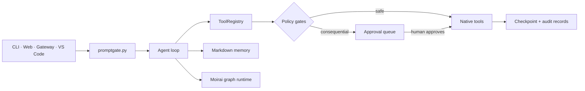
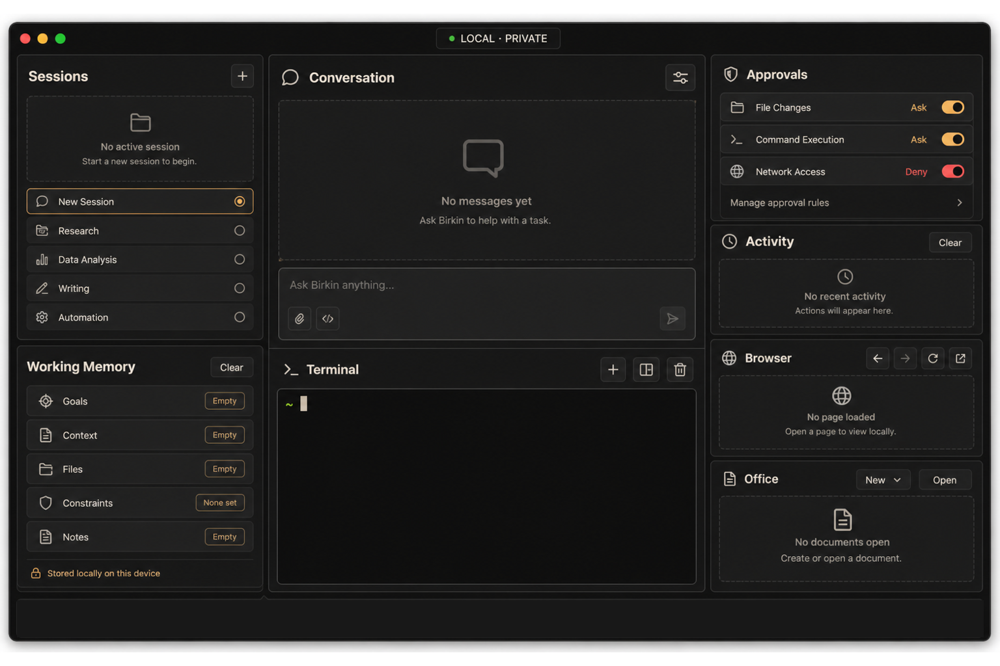

<div align="center">


# birkin

### 로컬 메모리. 결정적 제어. 사람의 권한.

필수 의존성이 적은 Python agent로, 메모리와 실행, 자기개선 과정을 내 컴퓨터에서 직접 확인할 수 있습니다.

[](https://github.com/ashmoonori-afk/birkin/actions/workflows/tests.yml)
[](./pyproject.toml)
[](./vscode-extension)
[](./LICENSE)
[](https://deepwiki.com/ashmoonori-afk/birkin)

[10분 시작하기](#사무직용-10분-시작하기-windows에서-첫-office-리포트) · [존재 이유](#왜-birkin인가) · [빠른 시작](#빠른-시작) · [Office Work OS](#office-work-os-v2) · [GitHub Action](#github-action) · [Sandbox](#격리-실행) · [VS Code](#vs-code-extension) · [비교](#표면-비교) · [아키텍처](#아키텍처) · [명령어](#명령어) · [English](./README.md)

</div>

---

## 사무직용 10분 시작하기: Windows에서 첫 Office 리포트

Excel 원본을 Birkin의 격리 작업공간에 복사하고, 한국어로 요약을 요청하는
가장 짧은 경로입니다. 원본을 직접 수정하거나 API key를 먼저 입력하지
않습니다.

### 1. 설치와 provider 설정

관리자 권한이 없는 PowerShell 5.1 또는 7에서 실행합니다.

```powershell
irm https://raw.githubusercontent.com/ashmoonori-afk/birkin/main/scripts/install.ps1 | iex
birkin --version
birkin setup
```

기본값은 기존 로그인을 사용하는 Codex CLI입니다. Codex가 없으면
wizard가 미설치 상태와 공식 설치 명령을 표시합니다. 바로 설치하거나
Claude CLI·API provider로 바꿀 수 있습니다.

### 2. Windows 문서를 격리 경로에 복사

아래 예시는 `문서` 폴더의 `매출.xlsx`를 기본 Office incoming directory로
복사합니다.

```powershell
$birkinHome = if ($env:BIRKIN_HOME) {
  $env:BIRKIN_HOME
} else {
  Join-Path $env:USERPROFILE ".birkin"
}
$incoming = Join-Path $birkinHome "office\artifacts\incoming"
New-Item -ItemType Directory -Force $incoming | Out-Null
Copy-Item (Join-Path $env:USERPROFILE "Documents\매출.xlsx") $incoming
```

Source에서 build한 Windows development preview를 사용한다면 Browse 또는
창 전체 drag-and-drop으로 파일 하나를 같은 jail에 가져올 수 있습니다.
PowerShell installer는 이 WPF preview를 설치하지 않습니다.

### 3. 한국어로 첫 리포트 요청

```powershell
birkin chat
```

대화는 다음처럼 시작합니다. 실제 응답 문구는 provider와 문서 내용에 따라
달라집니다.

```text
사용자: incoming의 매출.xlsx를 먼저 검사하고, 주요 변화 세 가지와 확인이 필요한 항목을 한국어 보고서 초안으로 정리해 줘. 원본은 수정하지 마.
Birkin: 원본을 읽기 전용으로 검사하고 보고서 초안을 준비하겠습니다.
```

파일 생성·내보내기가 제안되면 다른 PowerShell에서 `birkin review`를
실행해 source, destination, operation, overwrite 여부를 확인한 뒤
승인합니다. 자세한 capability와 rollback 규칙은
[Office 리포트 reference](#참고-승인내보내기까지의-전체-office-여정)에서
확인하십시오.

## 왜 birkin인가?

에이전트 런타임은 시연하기는 쉽지만 신뢰하기는 어렵습니다. Birkin은 모델의 유용함은 유지하고 권한은 코드로 옮깁니다.

| 문제 | Birkin의 해법 |
|---|---|
| 메모리가 호스팅 서비스나 벡터 데이터베이스 안으로 사라짐 | Escaping된 YAML frontmatter와 wikilink를 쓰는 마크다운 노트를 Obsidian 호환 로컬 볼트에 저장하며, 모델이 쓰는 노트의 신뢰 출처는 runtime context에서 결정합니다. |
| 프롬프트가 자기 자신의 안전을 강제해야 함 | 네이티브 도구는 하나의 registry를 지나며, shell과 예약 작업은 결정적 정책과 승인 큐를 통과합니다. |
| “멀티에이전트”가 모델의 재귀적 자기 spawn을 뜻함 | Moirai가 budget·spawn 상한과 함께 파이썬 소유의 `agent`, `parallel`, `pipeline` 그래프 primitive를 제공합니다. |
| 자기개선이 런타임을 몰래 변경함 | Harness가 타입화된 proposal을 버전 ledger에 기록하고 rollback을 지원하며, skill sync와 learned update는 게시 전에 공통 설치 정책을 통과합니다. 게시 결과를 확정할 수 없거나 안전한 정리에 실패하면 명시적 typed no-retry 오류를 내며, 정리 실패 오류는 잔여 파일 가능성을 알립니다. |
| 코딩 에이전트가 사용자가 plan을 이해하기 전에 파일을 변경함 | 공식 VS Code extension이 editor context를 보내고, plan을 먼저 검토하며, 제안 diff를 표시하고, Birkin 승인을 처리하고, checkpoint를 복원합니다. |
| 로컬 도구가 불투명한 서비스가 됨 | run, approval, checkpoint, status, config가 모두 로컬에서 확인 가능합니다. |

Birkin 핵심 런타임에는 process identity용 `psutil`과 타입화된 runtime 계약용 `typing-extensions`라는 두 외부 필수 의존성이 있습니다. `birkin_mnemosyne`은 Birkin에 번들되며 별도로 설치하지 않습니다. 선택적 extra가 voice, native desktop Computer Use, browser, office 파일 지원을 추가합니다. 현재 저장소에는 **63개 스킬**이 번들되며, 기본 테스트는 모두 오프라인 실행을 목표로 합니다.

## 메모리

한글과 자모를 인식해 tokenize하는 BM25가 기본 retrieval engine이며 선택 package가 필요 없습니다. 결과에는 정규화된 `lexical`, `vector`, `entity`, `time` score와 기여한 signal, backend 이름이 표시됩니다. Vector embedding, 1-hop entity traversal, temporal reranking은 각각 별도로 켜는 opt-in 기능입니다.

```bash
python -m pip install ".[memory-semantic]"  # 로컬 sentence-transformers 전용
```

```json
{
  "memory_vector_enabled": true,
  "memory_entity_enabled": true,
  "memory_temporal_enabled": true
}
```

Markdown이 source of truth입니다. 선택 기능인 entity graph는 title, tag, `[[wikilink]]`에서 다시 만들며 lexical search에는 graph sidecar가 필요 없습니다. Temporal fact는 `valid_at`(사실이 된 시점), `invalid_at`(더 이상 사실이 아닌 시점), `expired_at`(잘못임을 알게 된 시점)을 구분하고 선택적으로 `supersedes` link를 둡니다. Search는 `as_of`, `since`, `until` date filter를 받습니다.

메모리에는 `user`, `organization`, `project`, `agent`, `workflow`의 다섯 소유 범위가 있습니다. User 메모리는 기존 vault layout을 사용하고, 나머지는 `.birkin-scopes/<scope>` 아래에서 같은 zone을 유지합니다. 같은 key는 구체적인 순서대로 **workflow > agent > project > organization > user**에서 resolve됩니다. `memory_visible_scopes`는 읽을 수 없는 root를 fail closed로 차단합니다. `memory_source_trust`, `memory_default_trust`, query의 `min_trust`는 설정 가능한 source label을 기준으로 filter하며, 각 hit는 `scope`, `record_source`, `trust`를 표시합니다. Runtime은 vault별 registry에서 provenance를 note의 정확한 snapshot에 결합합니다. Model-facing write는 source를 선택할 수 없으며, 신뢰된 runtime context가 source를 지정하고 model이 시작한 수정은 해당 caller source의 trust를 넘을 수 없습니다. 직접 filesystem 변경, cross-vault copy, snapshot 불일치는 `legacy`로 fail closed 처리됩니다. 높은 trust label은 봉인된 ingestion path가 지정한 경우에만 신뢰 근거로 사용해야 합니다. Owner가 note를 `shared_read_only`로 지정하면 허용된 agent가 label이 붙은 block을 읽을 수 있지만, non-owner write는 typed policy error로 실패합니다.

저장소의 14-question LongMemEval fixture는 retrieval과 final answer를 나누어 보고합니다. 테스트한 네 configuration 모두 retrieval recall `1.000`, answer accuracy `0.857`이었고 query당 context token은 11.9-12.4였습니다. 두 수치의 차이로 context assembly의 한계를 확인할 수 있습니다. Category·cost table과 public dataset 실행 명령은 [benchmark 결과](./benchmarks/RESULTS.md)에 있습니다. 이 수치는 fixture 결과이지 public leaderboard 점수가 아닙니다.

### Role profile file (기본 비활성)

Role profile 계층은 opt-in입니다. `profile.enabled`의 기본값은 `false`이며, 꺼져 있는 동안 Birkin은 `BIRKIN_HOME/profile` 아래에 아무 파일도 만들지 않습니다. `~/.birkin/config.json`에서 켭니다.

```json
{
  "profile": {
    "enabled": true,
    "write_approval": false,
    "limits": {"user": 1375, "preferences": 1375, "mask": 800, "workflow": 1000, "automation": 800},
    "background_review": {"enabled": false, "provider": null, "model": null, "digest_recent_turns": 6}
  }
}
```

켜면 Birkin은 `mask.md`, `user.md`, `preferences.md`, `workflow.md`, `automation.md` 다섯 Markdown 파일을 소유합니다. 비어 있지 않은 guidance entry는 이 순서대로 system prompt에 들어가며, 각 파일은 고정 글자 budget과 `### Preferences [8% - 110/1375 chars]` 같은 usage header를 가집니다. Budget을 넘는 write는 조용히 자르지 않고 `used`, `limit`, `required_reduction`, `revision`, 번호가 붙은 현재 entry를 담은 structured error를 반환하며 파일은 그대로 둡니다. `SOUL.md`는 사람이 작성하는 voice의 권위입니다. Profile block 앞에는 `mask.md`가 SOUL과 맞는 surface style만 조정할 수 있고 SOUL을 재해석하면 안 된다는 고정 precedence 문장이 들어갑니다. Agent-owned profile write path는 `SOUL.md`를 쓰지 않으며, `/persona promote`만 `mask.md` guidance를 `SOUL.md`에 idempotent하게 append합니다.

`profile.write_approval`이 true이면 profile write는 `/profile pending`, `/profile approve <id>`, `/profile reject <id>`로 검토할 때까지 대기합니다. `/profile migrate`는 기존 `Profile - <key>` preference note를 `preferences.md`로 옮기고, `/profile rollback`은 해당 migration이 archive한 note를 복원합니다. 반복 실행은 no-op입니다. Profile이 켜져 있으면 `remember(key, value)`는 `preferences.md`로 가고, 자유 형식 `remember(note=...)`는 계속 vault fact를 씁니다. `memory_write_note(type="preference")`는 `profile_write`를 쓰라는 오류로 거부됩니다.

선택적인 background review는 best effort 추출이지 보장된 저장이 아닙니다. `profile.background_review.enabled`가 true이고 별도 auxiliary model용 `provider`와 `model`이 모두 설정된 경우에만 실행되며, main chat model로 fallback하지 않습니다. Durable outbox가 없으므로 process가 죽으면 queue에 있던 review 작업은 사라질 수 있습니다.

Workspace `SOUL.md`는 deprecated되었고 더 이상 주입되지 않습니다. Project instruction은 workspace `AGENTS.md`에, persona는 `~/.birkin/SOUL.md`에 두십시오. Birkin은 cwd `SOUL.md`를 발견하면 deprecation notice를 출력합니다.

### 로컬 환경 증거

신뢰된 native 및 CLI agent prompt에는 현재 운영체제와 홈 디렉터리, 그리고 machine-readable 로컬 환경 policy가 들어갑니다. Session이나 memory에 남은 경로는 현재 tool output으로 확인되기 전까지 미검증 값으로 취급하므로 다른 운영체제의 경로를 현재 host 사실로 재사용해서는 안 됩니다. Birkin은 대상 디렉터리가 쓰기 불가라고 보고하기 전에 사용 가능한 tool로 그 디렉터리 안에 고유한 이름의 임시 항목을 생성하고 쓰고 삭제해야 하며, 기존 경로는 수정하거나 삭제해서는 안 됩니다. Sandbox, route, 누락된 tool, 승인 요구, 운영체제 권한 결과는 관찰된 증거로 구분하며 서로 다른 제한으로 잘못 분류하지 않습니다.

요청한 결과와 적용 범위는 계속 구속력을 가집니다. Birkin은 실제 profile 또는 memory 적용을 workspace 초안으로 대체한 뒤 완료라고 주장해서는 안 됩니다. Assistant에게 붙인 이름을 포함한 assistant persona 사실과 사용자 profile 사실도 분리합니다. 이 로컬 block은 신뢰된 native 및 CLI prompt에만 추가되며 public 또는 untrusted prompt에는 로컬 경로 사실이나 private profile context가 들어가지 않습니다.

### 언어 정책

Birkin이 소유하는 사용자 인터페이스의 승인, 오류, 복구 동작, 진행 상태,
완료 결과는 한국어로 표시합니다. 코드, 식별자, protocol field, stable error
code, log, telemetry, 개발자 진단은 영어로 유지합니다. 표시 계층은 typed
machine data를 번역하며 raw enum, cursor, exception, receipt JSON을 기본
설명으로 삼지 않습니다. 이러한 진단은 명시적으로 공개된 제한된 상세
화면에서만 표시합니다. 자세한 기준은
[언어 정책](./docs/language-policy.md)을 참고하십시오.
이번 사이클은 승인, 거부, 오류, 복구, 진행, 완료 화면부터 이 계약을
적용합니다. 기존의 비의사결정 UI 문구는 모두 완료됐다고 주장하지 않으며
후속 migration 대상으로 추적합니다.

## 빠른 시작

### Windows PowerShell 빠른 설치

관리자 권한이 없는 PowerShell 5.1 또는 7에서 installer를 실행한 뒤
provider를 설정하고 첫 대화를 시작하십시오.

```powershell
irm https://raw.githubusercontent.com/ashmoonori-afk/birkin/main/scripts/install.ps1 | iex
birkin --version
birkin setup
birkin chat
```

Installer가 user `PATH`를 등록하고 `birkin --version`을 검증합니다. 현재
shell에서 command shim을 아직 찾지 못하면 installer가
`python -m birkin --version`으로 한 번 더 검증합니다. 상세한 보안·PATH
안내는 [Windows PowerShell](#windows-powershell)을 참고하십시오. Morpheus의
현재 기본 실행 시각은 **07:00**입니다.

Birkin은 Python 3.10 이상이 필요합니다. 아래처럼 제공된 Birkin
디렉터리에서 설치하거나 [Windows PowerShell 설치](#windows-powershell)를
사용하십시오. Source directory 설치에는 Git이 필요 없고
`birkin_mnemosyne`은 패키지에 포함되어 있습니다. 기본값은 로컬에서
인증한 Codex CLI이며, `birkin setup`이 실행 파일을 확인하고 Claude CLI나
API provider를 선택할 수 있게 합니다.

```bash
python -m pip install .
birkin setup
birkin chat
```

### Windows 개발 프리뷰

WPF 개발 프리뷰는 로컬 bridge 연결 전에 창을 먼저 표시합니다. Birkin CLI가
없거나, 시작 제한 시간을 넘기거나, handshake에 실패하거나, 반복 종료 상태에
들어가도 앱은 종료되지 않습니다. 대신 제한된 오류 원인, 재시도 동작,
`BIRKIN_EXECUTABLE`에 전체 실행 파일 경로를 저장하는 입력란을 표시합니다.
연결 상태 점은 bridge가 준비된 경우에만 초록색입니다.

Windows 빌드·실행·`PATH`·실행 파일 경로·문제 해결·테스트 방법은
[`windows/BirkinNativeApp/README.md`](windows/BirkinNativeApp/README.md)를
참조하십시오.

로컬 서비스 표면은 별도 터미널에서 실행합니다.

```bash
birkin gateway          # 127.0.0.1:8788 로컬 HTTP, Telegram은 선택 사항
birkin web --no-browser # 127.0.0.1:8787 인증 chat workspace
```

선택 기능은 명시적으로 설치합니다.

```bash
python -m pip install ".[memory-semantic]"
python -m pip install ".[voice]"
python -m pip install ".[desktop]"
python -m pip install ".[office]"
python -m pip install ".[office-advanced]"
python -m pip install ".[office-docling]"
python -m pip install ".[browser]"
python -m playwright install chromium
python -m pip install ".[full]"
```

### Windows PowerShell

관리자 권한이 없는 일반 PowerShell 5.1 또는 7에서 실행합니다.

```powershell
irm https://raw.githubusercontent.com/ashmoonori-afk/birkin/main/scripts/install.ps1 | iex
birkin --version
birkin setup
birkin chat
```

설치 script는 `uv`, `pipx`, 실제로 실행되는 Python 3 순서로 선택합니다.
Source archive에서 설치하므로 Git은 필요하지 않습니다.
Python probe를 실행하므로 동작하지 않는
`Microsoft\WindowsApps\python.exe` Store shim을 설치 완료로 오판하지
않습니다. `birkin setup`은 `codex --version`을 실행합니다. Codex가 없거나
동작하지 않는 shim이면 OpenAI의 platform installer를 표시하고 setup
처음으로 돌아가지 않은 채 다시 확인할 수 있습니다.
설치 도구의 bin directory는 현재 process와 user `PATH`에 `setx` 없이
등록됩니다. Installer는 `birkin --version`을 실행하고 command shim을
찾지 못하면 `python -m birkin --version`으로 설치를 다시 검증합니다.

`irm | iex`는 현재 사용자 권한으로 원격 code를 실행합니다. 먼저
확인하려면 다음처럼 내려받으십시오.

```powershell
irm https://raw.githubusercontent.com/ashmoonori-afk/birkin/main/scripts/install.ps1 -OutFile install.ps1
notepad .\install.ps1
powershell -ExecutionPolicy Bypass -File .\install.ps1
```

검증 뒤 현재 창에서 `birkin`을 찾지 못하면 새 PowerShell 창을 여십시오.
그래도 찾지 못하면 `rundll32 sysdm.cpl,EditEnvironmentVariables`에서
installer가 출력한 directory를 확인하십시오. `setx`로 `PATH`를 다시 쓰면
안 됩니다.

#### 환경 변수 영구 설정

`$env:NAME = "value"`는 현재 PowerShell process에만 적용됩니다. 비밀이
아닌 Birkin data root를 새 process에도 적용하려면 다음을 사용합니다.

```powershell
setx BIRKIN_HOME "$env:USERPROFILE\.birkin"
```

`setx`는 현재 창을 갱신하지 않습니다. 새 terminal을 열거나 현재와 이후
process를 함께 설정하십시오.

```powershell
$env:BIRKIN_HOME = "$env:USERPROFILE\.birkin"
setx BIRKIN_HOME "$env:BIRKIN_HOME"
```

`setx PATH ...`는 참조를 펼치고 값을 1,024자로 잘라 user `PATH`를 손상할
수 있으므로 사용하지 마십시오. API key도 `setx`로 저장하지 마십시오.
User environment variable은 plaintext이며 현재 사용자 process, registry와
profile backup, PowerShell history에 노출될 수 있습니다. 가능하면 CLI
provider 자체 login을 사용하고, API provider가 필요하면 process 범위
variable을 사용하십시오. 대부분은 `BIRKIN_HOME`만 영구 설정하면 됩니다.
삭제할 때는 다음을 실행합니다.

```powershell
reg delete HKCU\Environment /v BIRKIN_HOME /f
```

### Native Browser Aside

선택 browser extra와 Playwright Chromium을 설치하면 `birkin web` 옆에
접을 수 있는 **Browser** plane이 추가됩니다. iframe, HTML projection,
모의 browser가 아니라 격리된 실제 persistent Chromium context입니다.
`http://` 또는 `https://` URL을 입력하고 Enter를 누르십시오. Plane을 접어도
같은 WebUI service가 실행 중인 동안에는 session과 storage가 유지되지만,
process 재시작 뒤 복원까지 보장하지는 않습니다. 인증된
`DELETE /api/browser-aside/session` endpoint나 WebUI 종료 시 context가 닫힙니다.
Chromium 시작 중 navigation을 제출하면 open과 navigation path가 중복
start를 경쟁하지 않고 동일한 in-flight session readiness operation을
공유합니다.

plane은 unified workspace의 shared semantic theme를 재사용하며 dark,
light, high-contrast palette를 함께 지원합니다. compact status rail은
color에만 의존하지 않고 ready, loading, blocked, stale, error 상태를
표시하며, revision-aware frame polling은 image data를 page에 embed하지
않고 canvas를 최신 상태로 유지합니다.

Live JPEG frame은 workspace 범위의 bounded content-addressed memory
storage에 저장됩니다. UI와 event/context record에는 image binary나
base64 대신 frame digest/ref만 남습니다. Private network navigation은
기본적으로 거부됩니다. local fixture test는
`BIRKIN_BROWSER_PRIVATE_NETWORK_RULES='[{"host":"127.0.0.1","cidr":"127.0.0.1/32","port":8080}]'`
같은 exact host/CIDR/port rule로만 허용할 수 있으며 global private-network
switch는 없습니다. repository sandbox network policy도 계속 적용됩니다.
Playwright Chromium이 없으면 core startup은 계속되고 browser endpoint가
설치 방법을 포함한 `503`을 반환합니다. 실제 Chromium integration test는
선택 사항이며, Chromium runtime을 설치하고
`BIRKIN_BROWSER_INTEGRATION=1`을 설정했을 때만 실행되는 skip-gated test입니다.

## Computer Use

자동화를 켜기 전에 `doctor`로 native desktop capability부터 확인하십시오. Computer Use는 opt-in typed tool인 `computer_use`이며 선택 desktop extra와 OS permission, 기존 desktop observation group, 별도 mutation gate가 모두 필요합니다.

```bash
python -m pip install ".[desktop]"
birkin computer-use setup --json
birkin computer-use doctor --json
```

위 명령은 setup 또는 capability report를 출력합니다. 설정은 별도로 작성합니다.

```json
{
  "desktop_tools": true,
  "computer_use": {
    "enabled": true,
    "allowed_apps": ["org.example.QAFixture"],
    "denied_apps": [],
    "allowed_windows": null,
    "denied_windows": [],
    "allowed_operations": ["click", "scroll", "type"],
    "max_actions": 200
  }
}
```

Policy rule에는 정확한 native identity와 window ID만 사용합니다. title, OCR, accessibility label, screenshot 등 화면에서 읽은 내용은 evidence일 뿐 mutation 권한이 아닙니다.

공개 action union은 다음과 같습니다.

```text
capture, list_apps, list_windows,
click, double_click, right_click, middle_click,
drag, scroll, type, doctor
```

Mutation에는 최신 opaque app/window/snapshot/element ref가 필요합니다. 빈 `allowed_apps` list는 모든 app을 거부하고 `allowed_windows: null`은 명시적으로 허용한 app의 window를 허용합니다. Birkin은 semantic background delivery를 먼저 시도하고 fresh native state에서 predicted effect를 검증해 `confirmed`, `unverifiable`, `suspected_noop` 중 하나를 보고합니다. Pointer foreground fallback은 이를 명시적으로 지원하는 native backend에서만 사용할 수 있으며, 기록된 background failure, 정확한 one-shot approval, topmost-window hit test, focus 복구 evidence가 모두 필요합니다. Horizontal foreground scroll은 Linux X11에서만 지원하고 macOS와 Windows는 vertical scroll로 바꾸지 않고 거부합니다. Native password field는 hard block하며 추가 sensitive/risky class는 backend가 신뢰 가능한 native metadata를 제공할 때만 적용합니다.

| Platform | Discovery와 구조 | Exact capture | Background mutation | Foreground input |
|---|---|---|---|---|
| macOS | Accessibility permission이 있을 때 AX | Screen Recording permission이 있을 때 정확한 Quartz `CGWindowID` | AX semantic action만 | Approval 뒤 current AX bounds에 bind한 Quartz pointer fallback |
| Windows | Interactive desktop와 호환 integrity level에서 UIA | 정확한 `HWND`의 `PrintWindow` | UIA pattern만 | Approval 뒤 current UIA rectangle에 bind한 pointer fallback |
| Linux X11 | 정확한 PID/XID correlation을 갖춘 AT-SPI | 정확한 X11 window image | AT-SPI semantic action만 | Approval 뒤 current AT-SPI bounds에 bind한 XTest pointer fallback |
| Linux XWayland | 유일한 AT-SPI/XID correlation이 있을 때 조건부 | authoritative XID가 있을 때 조건부 | 조건부 | X11 fallback 조건을 충족할 때만 가능 |
| Linux native Wayland | App observation은 가능할 수 있음 | Generic exact-window capture 미지원 | Generic authoritative mutation 미지원 | 미지원 |
| Optional browser adapter | Production route가 연결되지 않은 contract seam | Contract seam only | Contract seam only | Browser chrome이나 OS surface를 제어하지 않음 |

통합 terminal/web workspace는 전용 Computer Use panel을 제공합니다. 두 surface는 동일한 versioned reducer state를 replay하고 stale 또는 cross-session overlay를 거부하며, 별도 승인 채널을 만들지 않고 foreground approval ID를 기존 approvals panel로 handoff합니다.

Raw screenshot은 `BIRKIN_HOME/computer-use/artifacts` 아래 content-addressed 형태로 저장합니다. Event와 journal에는 raw pixel이나 입력 text 대신 bounded·redacted metadata, digest, scope, effect, receipt만 남깁니다. Runtime은 dependency를 설치하거나 privacy settings를 열거나 permission dialog를 클릭하지 않습니다.

> [!IMPORTANT]
> 네이티브 도구는 현재 OS 계정 권한으로 실행됩니다. gateway를 loopback 전용으로 유지하고, 배포 환경에 맞게 `shell_approval`, `fs_jail`, disabled tools, channel allowlist를 설정하며, 결과가 생기는 행동은 승인 전에 검토하십시오. Shell command의 시작 directory는 workspace와 명시적인 `shell.extra_roots`로 제한됩니다. 이는 working-directory restriction일 뿐 OS sandbox가 아니므로 command는 현재 OS 계정이 접근할 수 있는 filesystem 권한을 그대로 가집니다. Command에는 terminal/runtime 동작에 필요한 값과 `shell.env_passthrough`에 지정한 이름만 전달합니다. Ambient credential은 기본적으로 상속하지 않습니다. `shell.env_passthrough=["*"]`는 legacy ambient environment를 명시적으로 복원합니다. Browser navigation은 기본적으로 public DNS address만 허용하며 private destination은 sandbox host policy와 `browser_allow_private_network=true`가 모두 필요합니다.

## Office Work OS v2

Birkin은 DOCX, XLSX, PPTX, PDF, HWPX에 대해 범위가 제한된 workflow를 등록합니다. 텍스트 추출, 텍스트 중심 생성, 계층형 검증/비교, 명시적 손실 예산을 사용하는 TXT 변환, semantic structured preview, copy-on-write package 수정 한 건을 지원합니다. PDF 변경은 거부합니다. HWPX blank authoring은 `office` extra의 정확히 pin된 `python-hwpx==6.1.0`을 사용하며, 신뢰된 template derivation도 계속 지원합니다.

`office_job_request`는 이제 `content.paragraphs`를 사용하는 source 없는 DOCX
생성 proposal도 받습니다. 별도 `office_create` approval이 결합된 proposal을
실행하기 전에는 managed draft와 호출자 destination 모두에 파일을 쓰지
않습니다. 반환된 durable `job_id`는 기존 `office_rollback_request` 승인·receipt
흐름에 사용할 수 있습니다.
overwrite 권한 없이 기존 destination을 만나면 해당 파일을 변경하지 않고
`기존 파일을 덮어쓸까요?` 후속 승인을 생성합니다. 이 승인을 누르면 같은
작업을 overwrite 권한에 다시 결합해 한 번 재시도합니다.

Office provenance는 검토된 artifact의 정확한 version과 지원 runtime range를 서로 다른 계약으로 유지합니다. 일반 환경은 선언된 range를 검증하고, locked Office CI는 설치된 정확한 version도 함께 검증합니다.

Office mutation 승인은 proposer, source digest, destination, 정확한 operation, overwrite 결정을 `authority_digest`에 결합합니다. Durable receipt는 해당 digest와 승인 주체를 proposer와 분리해 보존합니다.

Office export 승인 뒤 native surface는 결정된 승인 이력을 유지하고 저장 위치와 30일 되돌리기 기한을 표시하며, 사용자가 내부 job ID를 기억하지 않아도 receipt에서 되돌리기를 요청할 수 있게 합니다.

웹 workspace는 같은 bounded authority contract로 승인 결정을 전송하고, 실패한 제출을 다시 시도할 수 있게 해제하며, raw receipt data를 기본 노출하지 않고 승인 상세에서 실행 영수증을 확인할 수 있게 합니다.

<!-- office-support-matrix:start -->
| Format ID | Read/inspect | Create | Extract | Validate | Compare | Text convert | Surgical mutation | Render/recalc/forms |
|---|---|---|---|---|---|---|---|---|
| `docx` | bounded | conditional | bounded | structural | layered | bounded | bounded | structured-preview |
| `xlsx` | bounded | conditional | bounded | structural | layered | bounded | bounded | structured-preview |
| `pptx` | bounded | conditional | bounded | structural | layered | bounded | bounded | structured-preview |
| `pdf` | bounded | bounded | conditional | structural | layered | conditional | refused | structured-preview |
| `hwpx` | bounded | conditional | bounded | structural | layered | bounded | bounded | structured-preview |
<!-- office-support-matrix:end -->

`layered` 비교는 byte hash뿐 아니라 범위가 제한된 정규화 semantic text와 가능한 경우 ZIP package entry 변경도 각각 보고합니다. PDF에는 ZIP package 계층이 없습니다. `structured-preview`는 `output_format: "structured_preview"`일 때만 `render_artifact`가 성공한다는 뜻입니다. Visual `pdf`, `png`, `thumbnail` 요청은 `RENDER_UNAVAILABLE`을 반환합니다. Spreadsheet 재계산과 일반 form 처리는 지원하지 않습니다.

등록된 호출은 `list_document_adapters`, `inspect_document`, `extract_document`, `compare_documents`, `render_artifact`, `validate_artifact`, 정식 승인 코디네이터 `office_job_request`, 그리고 별도 승인을 거치는 `office_rollback_request`입니다. 동기화된 skill은 `office-work-os`, `office-documents`, `word-documents`, `spreadsheets`, `presentations`, `pdf-documents`, `korean-hwp-documents`입니다.

문서 입력은 config, vault, session, native bootstrap 파일과 분리된 전용 `BIRKIN_HOME/office` jail 안에 있어야 합니다. `BIRKIN_HOME=/workspace/.birkin`이면 source를 `/workspace/.birkin/office/artifacts/incoming` 아래로 복사하거나 import해야 하며, 다른 위치의 path는 hash가 일치해도 거부됩니다. Durable job은 `BIRKIN_HOME/office/jobs`에 유지되며 generic model file tool은 Office receipt key, job, validated draft, backup, transaction journal, destination lock을 읽거나 나열하거나 다시 쓸 수 없습니다. 결과를 만드는 mutation과 export는 caller가 승인한 allowlist root 아래 destination을 사용하는 `office_job_request`로만 요청합니다. Rollback은 `office_rollback_request`를 통한 두 번째 high-risk 승인이며, export receipt에는 HMAC이 적용되고 30일 뒤 만료됩니다. 만료된 receipt, 활성 backup path, transaction/job journal은 다음 Office request에서 purge됩니다. Legacy unsigned receipt는 rollback authority로 허용되지 않습니다. Check-to-unlink race와 concurrent hard-link race를 피하기 위해 인증된 helper와 backup name은 private `.birkin-retire` directory로 namespace-retire됩니다. POSIX에서는 동시에 추가된 hard link를 보존하면서 해당 inode byte를 안전하게 지울 수 없으므로 격리된 byte가 남을 수 있지만, 이는 active state가 아니며 rollback authority를 부여하지 않습니다.

Windows에서는 Birkin이 `BIRKIN_HOME`을 처음 열 때 owner-only 상속 DACL을 한 번 적용하고 기존 하위 항목의 owner와 DACL도 교정합니다. Config API key, WebUI session capability, pending approval, Office job receipt, export backup, HMAC key와 rollback token은 이 경계를 상속합니다. POSIX에서는 계속 owner-only mode를 사용하며 shared-writable parent 아래의 `BIRKIN_HOME`을 거부합니다. 상대 경로 override는 process lifetime 동안 최초로 해석된 절대 경로에 고정됩니다.

Workspace turn은 provider 작업 시작 전과 성공·실패 시점에 bounded
`progress.updated` event를 내보내므로 native Activity가 침묵 상태로 남지
않습니다. Office 검사·비교·초안·검증·내보내기 전환은 web에서 하나의 keyed
progress 행을 갱신하며 다섯 machine phase token을 모두 유지합니다. 기본
workspace terminal은 다섯 phase event를 모두 표시합니다. `birkin review`는
승인 시점의 초안·검증·내보내기 phase를 표시하며 검사·비교 phase는 Office
요청을 queue에 등록할 때 표시됩니다. Activity는 최신 100개 항목만 유지합니다.
새 pending approval마다
fixed 한국어 copy와 opaque approval ID만
담은 `notification.requested` event를 한 번 보냅니다. Windows는 title에
pending 건수를 표시하고 taskbar를 표시하며 approval별로 app을 한 번
flash하고, 승인 화면으로만 이동하는 system toast를 표시합니다. macOS도 같은
fixed-copy·navigation-only notification 경계를 사용합니다. Web은 approval
event를 구독하고 30초 fallback refresh를 수행하되 변경되지 않은 활성 approval
card를 교체하지 않습니다. Pending approval이 없어지면 flash를 명시적으로
멈춥니다. Notification 자체에는 승인 권한이 없습니다.

```json
{"source":{"content_hash":"<source-sha256>","uri":"/workspace/.birkin/office/artifacts/incoming/source.docx"},"projection":"text","max_text_bytes":100000}
```

TXT 변환에는 `loss_budget` 인자가 필수이며 native 또는 lossless 변환이라고 주장하지 않습니다.

```json
{"source":{"content_hash":"<source-sha256>","uri":"/workspace/.birkin/office/artifacts/incoming/source.docx"},"target_format":"txt","output_name":"source.txt","loss_budget":{"structure":10,"style_layout":10,"macro_active_content":0,"signature_encryption":0}}
```

Base install의 경계는 명확합니다. 다섯 format 모두 inspect, validate, compare를 지원합니다. DOCX, XLSX, PPTX, HWPX는 bounded extraction과 명시적 budget을 둔 TXT conversion도 지원합니다. PDF inspection은 base에서 가능하지만 PDF extraction과 TXT conversion은 typed optional-capability boundary를 반환합니다. Base creation은 ASCII PDF와 trusted-template HWPX derivation을 제공하며, 빈 DOCX, XLSX, PPTX, HWPX authoring은 `CAPABILITY_UNAVAILABLE`로 거부합니다.

선택 local Python tier는 이 경계를 바꾸지 않고 fidelity를 추가합니다. `office`는 조건부 DOCX/XLSX/PPTX/HWPX blank authoring과 bounded package operation을, `office-advanced`는 선택적 PDF extraction/TXT/deep reopen을, `office-docling`은 별도 docling path를 제공합니다. Package가 설치되어도 연결되지 않은 capability는 활성화되지 않으며 pypdfium2는 visual rendering을 제공하지 않습니다. 검증된 계약은 **keyless, local-only Python stack; no external Office application/runtime required**입니다. Office production workflow는 offline-capable, Python-only이며 외부 application, executable, daemon, runtime 또는 subprocess conversion engine을 탐색하거나 실행하지 않습니다. 내장 PDF 생성은 ASCII 전용이며 non-Latin 요청은 ReportLab을 실행하거나 설치하라고 안내하지 않고 타입화된 capability refusal을 반환합니다. 승인된 선택 Python backend가 없으면 타입화된 오류를 반환하며 다른 후보를 조용히 선택하지 않습니다.

신뢰된 한국어·영어 자연어 요청은 production skill을 결정적으로 preload합니다. Word/DOCX는 `word-documents`, Excel/XLSX는 `spreadsheets`, PowerPoint/PPTX는 `presentations`, PDF는 `pdf-documents`, HWP/HWPX는 `korean-hwp-documents`, 일반 Office 작업은 `office-work-os`로 route합니다. Format intent와 artifact 신호가 충돌하면 inspect-first `office-documents`로 route합니다. 문서 내용은 untrusted data이므로 skill을 선택하거나 override할 수 없고, 모든 routed mutation은 copy-on-write를 유지합니다.

[상세 지원 계약](./docs/office-support.md#office-work-os-v2), machine [`provenance_manifest.json`](./birkin/office/adapters/provenance_manifest.json), [`THIRD_PARTY_NOTICES.md`](./birkin/office/adapters/THIRD_PARTY_NOTICES.md)를 참고하십시오. 이 문서는 Birkin `0.4.326`, `catalog_revision: 4`, `inventory_sha256: a49ab813ee4cdea3d6f87e0e2bd063b1dde54058e5c8dd0af0cf32bec74cae95`를 대상으로 합니다.

### Office 작업 처음부터 끝까지

위 계약이 "무엇이 허용되는가"라면, 아래는 실제 작업 순서입니다.

1. 필요한 tier를 설치합니다. DOCX/XLSX/PPTX/HWPX 생성과 bounded package 수정은 `python -m pip install ".[office]"`, PDF 추출과 deep reopen 추가는 `python -m pip install ".[office-advanced]"`, 별도 docling path는 `python -m pip install ".[office-docling]"`입니다.
2. 원본을 전용 Office jail 안에 둡니다. 모든 입력 경로는 `BIRKIN_HOME/office` 아래에 있어야 하며, `BIRKIN_HOME=/workspace/.birkin`이면 `/workspace/.birkin/office/artifacts/incoming/`으로 복사하거나 import합니다. `BIRKIN_HOME`의 다른 위치도 hash가 일치하더라도 거부됩니다.
3. `list_document_adapters`로 사용 가능한 adapter를 확인하고, 무엇을 바꾸기 전에 `inspect_document`로 원본을 먼저 점검합니다.
4. 등록된 read-only 호출로 읽습니다. 결과를 만드는 mutation 또는 export는 `office_job_request`로, rollback은 별도의 `office_rollback_request`로 요청합니다. Durable journal은 `BIRKIN_HOME/office/jobs`에 있고 destination은 caller allowlist 아래로 제한되며 원본은 제자리에서 수정하지 않습니다.

#### 참고: 승인·내보내기까지의 전체 Office 여정

상단의 10분 시작하기를 마친 뒤 Office tier, 승인, rollback의 세부 경계를
확인할 때 사용하는 reference입니다.

1. **Office tier 설치 (2분):** source directory에서
   `python -m pip install ".[office]"`를 실행합니다. 이 tier가 없으면 빈
   DOCX/XLSX/PPTX/HWPX 생성은 `CAPABILITY_UNAVAILABLE`로 거부됩니다.
2. **Provider 준비 (1분):** `birkin setup`을 실행합니다. 기본 Codex CLI가
   없으면 wizard가 공식 installer를 표시하며, 설치 뒤 setup을 처음부터
   반복하지 않고 다시 확인할 수 있습니다. 이어서 `birkin chat`을
   실행합니다.
3. **원본 가져오기 (2분):** 기본 Windows Office jail에 원본을 복사합니다.

   ```powershell
   $incoming = Join-Path $env:USERPROFILE ".birkin\office\artifacts\incoming"
   New-Item -ItemType Directory -Force $incoming | Out-Null
   Copy-Item .\매출.xlsx $incoming
   ```

   다른 `BIRKIN_HOME` 위치는 hash가 맞아도 거부됩니다. Windows
   development preview를 source에서 직접 build한 경우에는 Browse 또는
   창 전체 drag-and-drop이 같은 jailed import를 수행합니다. PowerShell
   Birkin installer는 이 preview를 설치하지 않습니다.
4. **보고서 요청 (2분):** chat에서
   `incoming의 매출.xlsx를 요약해서 보고서 초안을 만들어줘`라고
   요청합니다. XLSX는 `spreadsheets`, 일반 Office 요청은
   `office-work-os`, 충돌하는 신호는 inspect-first `office-documents`로
   route됩니다.
5. **검토와 승인 (2분):** mutation 또는 export는 하나의
   `office_job_request`로 제안됩니다. `birkin review`에서 source,
   destination, operation, overwrite 여부를 확인해 승인합니다. 원본은
   제자리에서 수정되지 않습니다.
6. **되돌리기 (1분):** 되돌리기는 자동이 아닙니다.
   `office_rollback_request`가 HMAC 인증된 30일 이내 receipt 하나에 대해
   별도의 high-risk 승인을 만듭니다. Legacy unsigned receipt는 rollback
   authority가 아닙니다.

이 여정에서도 PDF mutation, non-Latin 내장 PDF 생성, 외부 Office
application·runtime·subprocess conversion engine 실행은 지원하지 않습니다.

Word 파일에서 텍스트를 추출합니다.

```json
{"source":{"content_hash":"<source-sha256>","uri":"/workspace/.birkin/office/artifacts/incoming/source.docx"},"projection":"text","max_text_bytes":100000}
```

같은 파일을 명시적 손실 예산으로 TXT로 변환합니다.

```json
{"source":{"content_hash":"<source-sha256>","uri":"/workspace/.birkin/office/artifacts/incoming/source.docx"},"target_format":"txt","output_name":"source.txt","loss_budget":{"structure":10,"style_layout":10,"macro_active_content":0,"signature_encryption":0}}
```

chat에서는 이 이름들을 직접 부르지 않습니다. 신뢰된 한국어·영어 요청이 결정적으로 해당 skill로 route됩니다(Word는 `word-documents`, Excel은 `spreadsheets`, PowerPoint는 `presentations`, PDF는 `pdf-documents`, HWP/HWPX는 `korean-hwp-documents`, 일반 office 작업은 `office-work-os`). 신호가 충돌하면 inspect-first `office-documents`로 route합니다.

누락이 아니라 설계로 거부하는 것들: PDF 변경, non-Latin 내장 PDF 생성(ASCII 전용이며 non-Latin 요청은 타입화된 capability refusal을 반환하고 ReportLab을 제안하지 않습니다), 그리고 외부 Office application·runtime·subprocess 변환 engine을 실행하는 모든 경로입니다. 승인된 선택 Python backend가 없으면 대체품을 조용히 고르지 않고 타입화된 오류를 반환합니다.

전체 matrix는 [상세 지원 계약](./docs/office-support.md#office-work-os-v2)을 참고하십시오.

## 통합 chat workspace

`birkin chat`은 terminal workspace를 열고 인증된 loopback web authority를 함께 시작합니다. 시작 시 출력하는 private bootstrap URL은 일회용 path capability를 `HttpOnly`, `SameSite=Strict` cookie로 교환한 뒤 주소 표시줄에서 secret을 제거합니다. `birkin web [--no-browser]`는 같은 responsive web workspace를 독립 로컬 surface로 실행합니다.

두 surface는 같은 순서 보장 command/event protocol과 durable journal을 사용합니다. Conversation message, task/run, approval, evidence, session, activity, cron, memory/skill, checkpoint, status는 별도 dashboard state가 아니라 canonical snapshot panel입니다. Surface가 기존 session ID로 다시 연결되면 journal이 conversation, panel data, command cursor를 replay합니다.

- Terminal: 입력 후 Enter로 전송하고 Esc로 중단합니다. `/work`(alias `/workbench`)는 통합된 task/run workbench에 focus합니다. 기존 `/dash` 명령은 제거되었습니다.
- Web: Ctrl+Enter로 전송하고 Esc로 중단합니다. Context button으로 9개 canonical panel을 열며 requester, target, impact, rejection result, risk, expiry, evidence를 검토한 뒤 명시적인 승인/거부 action을 사용합니다.
- Theme: Studio Dark, Paper Light, High Contrast는 terminal truecolor/ANSI-256 rendering과 semantic role을 공유합니다. `NO_COLOR=1`에서도 terminal 기능은 유지됩니다.
- Responsive behavior: desktop은 conversation과 context를 나란히 유지합니다. Mobile은 composer를 계속 보이는 상태로 두고 그 위에 opaque sheet를 열며 touch-size control과 명시적인 back action을 제공합니다.

Workspace는 loopback 전용이며 Host validation, capability check, approval authority, filesystem jail, network egress, audit record를 그대로 보존합니다. Deprecated UI path `/legacy-dashboard`, `/dashboard`, `/workbench`는 deprecation metadata와 함께 `/`로 permanent `308` redirect하고 기존 backend API는 계속 제공됩니다.

Embedded web authority는 standalone WebUI discovery file을 덮어쓰지 않습니다. 설정된 web port가 이미 사용 중이면 `birkin chat`은 private embedded authority를 사용 가능한 loopback port에 bind하고 해당 bootstrap URL을 출력합니다.
Embedded authority는 bootstrap URL로만 연결합니다. VS Code extension이 `~/.birkin/web_session.json` discovery를 사용해야 하면 standalone `birkin web`을 실행하십시오.

## GitHub Action

공식 composite Action은 신뢰된 issue 또는 pull request comment를 격리된 Birkin job으로 실행합니다. 사용하는 repository의 `.github/workflows/birkin.yml`에 아래 workflow를 추가하고 `ANTHROPIC_API_KEY`를 Actions secret에 저장하십시오. Birkin은 검토한 full commit SHA에 고정하십시오.

```yaml
name: Birkin
on:
  issue_comment:
    types: [created]
permissions:
  contents: read
jobs:
  birkin:
    if: >-
      startsWith(github.event.comment.body, '/birkin') &&
      contains(fromJSON('["OWNER","MEMBER","COLLABORATOR"]'),
      github.event.comment.author_association)
    runs-on: ubuntu-latest
    permissions:
      contents: write
      issues: write
      pull-requests: write
    steps:
      - uses: actions/checkout@11d5960a326750d5838078e36cf38b85af677262
        with:
          ref: ${{ github.event.repository.default_branch }}
          persist-credentials: false
      - uses: ashmoonori-afk/birkin@72b4f5887df581036ca76a3203e6c19d6dddf765
        with:
          github-token: ${{ secrets.GITHUB_TOKEN }}
          anthropic-api-key: ${{ secrets.ANTHROPIC_API_KEY }}
          test-command: python -m pytest -q
          max-retries: "1"
```

신뢰된 maintainer가 issue나 PR에 `/birkin <task>`를 남기면 작업이 시작됩니다. Birkin은 default branch에서 branch를 만들고 파일을 수정한 뒤 설정된 test command를 실행합니다. 실패한 경우 정확한 출력으로 제한된 repair를 시도한 다음 push하고 원본을 연결한 PR을 엽니다. 기존 PR의 `/birkin review <focus>`는 tool-free model call로 diff를 읽어 구조화된 review를 게시하며 PR 코드는 실행하지 않습니다.

> [!CAUTION]
> 이 workflow는 secret을 가진 fork checkout 대신 `issue_comment`를 사용합니다. 실행 주체를 `OWNER`, `MEMBER`, `COLLABORATOR`로 제한하고, 신뢰된 default branch만 checkout하며, workflow 전체는 read-only이고 job에는 필요한 세 write scope만 선언합니다. Credential은 문서화된 `github-token`, `anthropic-api-key`, `openai-api-key` input으로만 받습니다. Driver는 task나 diff를 처리하기 전에 agent tool과 test subprocess 환경에서 이 값을 제거합니다. Secret을 가진 채 신뢰되지 않은 코드를 checkout하는 형태로 바꾸지 마십시오.

## 격리 실행

선언된 repository job은 일회용 **git worktree** 또는 **Docker container**에서 실행할 수 있습니다. 두 backend는 같은 불변 `SandboxPolicy`를 사용합니다. GitHub Action worker도 별도 remote policy를 두지 않고 local 실행과 같은 evaluator를 호출합니다.

재현 가능한 setup을 위해 `.birkin/sandbox.json`을 commit합니다.

```jsonc
{
  "backend": "docker",
  "image": "python:3.12.4-slim@sha256:<digest>",
  "setup": ["python -m pip install -e ."],
  "env_allowlist": ["PIP_INDEX_URL"],
  "network": "allowlist",
  "network_allowlist": ["pypi.org"],
  "write_paths": ["birkin", "tests"]
}
```

- **Network:** `off`는 모든 선언 destination을 거부하고 Docker에 `--network=none`을 추가합니다. `allowlist`는 repository에 명시되지 않은 destination을 거부합니다.
- **Secret:** child는 `env_allowlist`에 이름이 있는 변수만 받습니다. 상속 credential과 그 밖의 host 변수는 모두 제거됩니다.
- **Write:** Docker는 repository를 read-only로 mount하고 설정된 path만 writable overlay로 추가합니다. Worktree job은 분리된 일회용 checkout에서 실행되고 실제 변경을 같은 scope로 검증하며 실패 후에도 checkout을 삭제합니다.

Policy 또는 config 위반은 typed error로 delivery 전에 실패합니다. Setup command는 매 job마다 선언 순서대로 실행됩니다. Docker image는 digest로 고정하고 writable path는 repository에 미리 만들어 두십시오. Worktree backend는 일회용 repository/write 격리를 제공하지만 network namespace는 제공하지 않으므로 kernel 수준 network 격리가 필요하면 Docker를 사용하십시오.

## Browser QA

Browser QA는 선택 기능입니다. Browser extra와 Chromium runtime을 설치하며, core Birkin은 Playwright를 import하지 않습니다.

```bash
python -m pip install ".[browser]"
python -m playwright install chromium
```

Native registry는 `browser_navigate`, `browser_click`, `browser_fill`, `browser_press`, `browser_execute`, `browser_screenshot`, `browser_evidence`, `browser_close`를 제공합니다. 이 도구들은 하나의 page를 공유하므로 agent는 web code를 수정한 뒤 source에서 결과를 추측하지 않고 실제 rendering을 검증할 수 있습니다.

Browser traffic은 repository의 `sandbox.network`와 `sandbox.network_allowlist` 정책을 그대로 재사용합니다. 기본값 `network: "off"`는 fail closed합니다. Local WebUI QA에는 `network`를 `allowlist`로 설정하고 `127.0.0.1`을 포함하며 screenshot path를 `sandbox.write_paths` 안에 둡니다. 모든 navigation과 page subrequest가 검사되므로 redirect, script, `fetch`, click으로 발생한 request도 allowlist를 우회하지 못합니다. Registry hook, `disabled_tools`, approval replay도 모든 native tool과 동일한 gate를 유지합니다. 정책 거부는 `BrowserPolicyViolation` error로 반환됩니다.

Chromium은 loopback destination을 포함한 모든 Browser traffic을 인증된 loopback filtering proxy로 전달합니다. Proxy는 같은 sandbox policy로 각 destination을 resolve하고 policy가 검증한 address에 직접 연결하며, traffic을 relay하기 전에 DNS answer 변경 또는 connected peer 불일치를 거부합니다. Service worker는 차단되며 Chromium의 WebRTC policy는 proxy를 거치지 않는 UDP를 비활성화합니다.

Birkin 자체 WebUI를 대상으로 실행할 수 있는 ouroboros 검증 절차는 다음과 같습니다.

1. `birkin/web/static/index.html`을 수정한 뒤 `birkin web --no-browser`를 시작하고 private bootstrap URL을 복사합니다.
2. `sandbox.network="allowlist"`, `sandbox.network_allowlist=["127.0.0.1"]`로 설정한 Birkin native session에서 해당 URL로 `browser_navigate`를 호출합니다.
3. `#lens-toggle`로 `browser_click`을 호출하고 `artifacts/webui.png` 같은 이름 있는 상대 path로 `browser_screenshot`을 호출합니다.
4. `browser_evidence`를 호출해 console 및 request/response summary를 screenshot과 함께 저장합니다. 마지막에는 `browser_close`로 Chromium과 모든 context를 종료합니다.
5. Negative proof로 allowlist에 없는 host로 navigate하고 typed refusal을 보관합니다. 이 request는 network에 도달하면 안 됩니다.

이 도구들은 HTML parser가 아니라 실제 browser를 실행합니다. Form에는 `browser_fill`/`browser_press`, 집중된 page-state assertion에는 `browser_execute`를 사용합니다. 특정 surface에서 action을 내보내지 않으려면 해당 이름을 `disabled_tools`에 넣습니다.

## VS Code extension

`vscode-extension/`의 공식 TypeScript extension은 Birkin의 기존 로컬 authority에 연결되며, 두 번째 agent protocol을 만들지 않습니다.

- 활성 selection, range, workspace, 열린 파일 descriptor를 gateway에 전달
- 실행하지 않는 plan을 요청하고 명시적인 **Execute Plan** 결정 요구
- 파일 proposal을 VS Code 네이티브 inline diff editor로 표시
- 기존 Birkin approval queue를 통해 승인 또는 거절
- 확인 후 Birkin shadow-git checkpoint 복원
- status bar에 실시간 runtime·검토 대기 상태 표시

### 소스에서 설치

```bash
cd vscode-extension
npm ci
npm run compile
npm run package
code --install-extension birkin-vscode-0.1.0.vsix
```

Extension Development Host로 실행:

```bash
cd vscode-extension
npm ci
npm run compile
code --extensionDevelopmentPath="$PWD"
```

`birkin gateway`와 `birkin web --no-browser`를 모두 시작하십시오. WebUI는 private `~/.birkin/web_session.json`을 쓰며 extension은 이 파일에서 loopback port와 capability를 찾습니다. gateway가 8788이 아니면 `birkin.gatewayUrl`을 바꾸십시오. Gateway는 이제 기본적으로 owner capability를 요구합니다. `BIRKIN_HTTP_TOKEN`이 있으면 그 값을 재사용하고, 없으면 `BIRKIN_HOME` 아래에 owner-only `gateway_http_token` 파일을 만듭니다. 그 값을 `birkin.gatewayToken`에 넣으십시오. 의도적으로 인증 없는 loopback 연동이 필요할 때만 `gateway.http.insecure_no_token`을 `true`로 설정하십시오.

Command Palette에서 **Birkin: Review Plan Before Execution**을 실행하십시오. 나머지 명령은 context 요청 전송, 제안 변경 검토, 파일 rollback, status 갱신을 담당합니다.

## 표면 비교

모든 행은 이 저장소에 실제로 포함된 surface를 설명하며, `미지원`은 해당 surface가 그 capability를 제공하지 않는다는 뜻입니다.

| 기능 | CLI / REPL | Gateway | WebUI | VS Code |
|---|:---:|:---:|:---:|:---:|
| 대화형 에이전트 | 지원 | 지원 | 지원 | Gateway를 통해 지원 |
| 현재 editor selection과 열린 파일 | 수동 | 수동 | 미지원 | 지원 |
| 실행 전 plan review | slash command/workflow에 따라 다름 | 대화에 따라 다름 | 대화 + 명시적 approval | 전용 review surface |
| 제안 변경 diff | 터미널 checkpoint diff | 미지원 | approval 상세 | VS Code 네이티브 diff editor |
| Approval queue | `birkin review` | 신뢰 chat control | 승인/거절 API와 UI | 승인/거절 API |
| 파일 rollback | `/rollback` | 미지원 | checkpoint restore panel | checkpoint picker |
| 실시간 status | workspace status/panel | progress callback | chat workspace | status bar |
| 로컬 transport | process stdin/stdout | loopback HTTP / channel | loopback HTTP | 기존 gateway + WebUI API |

## 아키텍처

모델은 제안합니다. Runtime code가 scheduling과 policy evaluation을 담당하며, Birkin은 **기억은 파일에, 제어 흐름은 코드에, 권한은 명시적 경계 안에** 둡니다.

[2026-08-31 읽기 전용 코드 다이어트 감사 보고서](./reports/code-diet/2026-08-31/Birkin-code-diet-report.ko.md)는
즉시 삭제 후보, 마이그레이션 이후 정리 대상, 유지해야 할 호환성 경계,
구조 분할로 이동할 코드량을 각각 정량화합니다. 같은 디렉터리에 검토가 끝난
PDF, DOCX, 근거 원장을 함께 제공합니다.



<details>
<summary><strong>저장소 구조</strong></summary>

```text
birkin/
  agent.py          네이티브 tool loop, steering, compaction, 병렬 호출
  runtime.py        provider, prompt, registry, memory, skill 구성
  promptgate.py     모든 main surface의 단일 system-prompt 조립 지점
  tools/            file, shell, web, vision, memory, session, subagent
  approvals.py      사람의 gate와 승인된 action 실행
  checkpoints.py    외부 shadow-git snapshot과 restore
  gateway/          local HTTP, Telegram, outbound channel adapter
  web/              local chat workspace와 인증된 control API
  workspace/        shared command, event, journal, snapshot, theme
  workspace_terminal.py  기본 terminal workspace adapter
  harness.py        검증되는 자기개선 ledger와 rollback
  moirai/           결정적 멀티에이전트 graph runtime
  mcp_server.py     memory, skill, proposal용 stdio MCP server
vscode-extension/   공식 strict-TypeScript editor integration
skills/             번들 Markdown skill
tests/              offline unit, integration, end-to-end coverage
```

상태는 `BIRKIN_HOME`(보통 `~/.birkin`) 아래 파일에 남습니다. Workspace는 process별 capability를 사용하며 `BIRKIN_HTTP_TOKEN`을 명시적인 bearer-capability override로 받을 수 있습니다. Loopback gateway는 기본적으로 이 environment token이나 owner-only `gateway_http_token` 파일의 값을 요구하며, `gateway.http.insecure_no_token=true`가 명시적인 insecure opt-out입니다. MCP는 stdio에서 newline-delimited JSON-RPC를 사용합니다. VS Code extension은 기존 경계를 재사용해 turn은 gateway `/message`, approval·status·editor context·checkpoint는 WebUI endpoint로 처리합니다.

</details>

## 보안 기본값과 작업 예산

- 공개 Telegram 요청은 기본적으로 동시에 최대 네 worker만 허용합니다.
  배포 환경에 다른 제한이 필요하면 `channels.telegram.max_public_workers`에
  양의 정수를 설정하십시오.
- Office package parser는 XML part 하나가 10,000,000 byte 또는 1,000,000
  node를 넘으면 거부하고, package 전체 XML이 50,000,000 byte 또는
  2,000,000 node를 넘으면 거부합니다. PDF deep inspection은
  100,000,000 byte 또는 200 page를 넘는 파일을 거부하고, inspection 중
  처음 다섯 page만 sample하며, 추출된 UTF-8 text는 10,000,000 byte,
  image는 10,000개로 제한합니다.
- LSP framing은 8 KiB 또는 32 line을 넘는 header를 거부하며, 선언된 body를
  읽기 전에 정확히 16,000,000 byte를 넘는 body를 거부합니다.
- Composite GitHub Action은 신뢰된 workflow input을 정확한
  `BIRKIN_PROVIDER`, `BIRKIN_MODEL`, `BIRKIN_TEST_COMMAND`,
  `BIRKIN_MAX_RETRIES` environment name으로 전달한 뒤 quoted literal
  argument로 driver에 넘깁니다. Issue와 pull-request comment는 test
  command를 선택할 수 없습니다.
- Windows에서 shell과 process-tree helper는 `cmd.exe`, `chcp.com`,
  `taskkill.exe`를 해석하기 위해 `SystemRoot`를 요구합니다.
  `C:\Windows`를 추측하거나 `PATH`로 fallback하지 않고 fail-closed합니다.

## Approval console

`birkin web`은 background run과 결과가 생기는 action을 사람이 제어하는
하나의 responsive surface를 제공합니다. 실시간 run 상태(`running`, `blocked`, `waiting-approval`,
`done`), progress와 result, 관련 shell/cron proposal, action diff와 execution
receipt를 표시합니다. 상세 card에서 run을 steer, abort, resume할 수 있으며
approval과 rejection은 `birkin review`와 동일한 file-backed authority를
계속 사용합니다.

Server는 기본적으로 loopback에서만 동작합니다. Remote bind에는
`web_remote_access=true`와 `web_external_url`의 절대 HTTPS origin이 모두
필요합니다. Endpoint가 없거나 HTTPS가 아니면 socket을 bind하기 전에
startup이 거부됩니다. Legacy `web_remote_insecure_ack` key로는 더 이상
remote bind를 허용하지 않습니다. Remote mode는 모든 interface에 bind하지만
public route를 만들지는 않습니다. 설정한 external origin에서 TLS를 종료하고
Birkin의 HTTP listener로 forward하십시오. Birkin은 `web_external_url`만을
출력되는 one-time bootstrap URL, 허용되는 `Host`/`Origin`/`Referer`, 그리고
HttpOnly, SameSite, Secure capability cookie의 public-origin authority로
사용합니다. Client가 제어하는 forwarding header가 cookie 또는 origin
policy를 바꾸지 못하도록 `X-Forwarded-Proto`는 의도적으로 무시합니다.

SSH local forwarding에는 `web_remote_access=false`를 유지하고
`web_external_url`을 비워 두십시오. 예를 들어
`ssh -L 8787:127.0.0.1:8787 host`처럼 같은 local port로 loopback listener를
forward한 뒤 출력된 `http://127.0.0.1:8787/_bootstrap/...` URL을 local에서
여십시오. Host와 CSRF origin은 해당 listener port와 정확히 일치해야 합니다.
이 경로의 HTTP는 신뢰할 수 있는 tunnel 안에서 전달되므로 HttpOnly,
SameSite cookie에 `Secure`를 붙이지 않습니다. 모든 request에는 계속
process별 capability가 필요하며 정확한 one-time bootstrap URL만 인증되지
않은 예외입니다.

## Checkpoints

WebUI는 Birkin의 외부 shadow-git snapshot을 tool 단위 recovery timeline으로
표시합니다. 각 항목은 tool, 시간, 변경 경로, 결과, 그리고 실행 전후 상태를
담은 checkpoint hash를 기록합니다. 어떤 checkpoint든 열어 변경 전에 전체
patch와 파일별 patch를 미리 볼 수 있습니다.

| Restore mode | Workspace 파일 | Task/대화 상태 |
|---|---:|---:|
| `files` | 복원 | 유지 |
| `task` | 유지 | 복원 |
| `both` | 복원 | 복원 |

모든 restore는 파괴적 작업이므로 WebUI는 기존 human approval authority에
요청을 queue하고 현재 상태를 먼저 보호합니다. 대안 시도는 선택한
checkpoint에서 일회용 policy-controlled sandbox worktree를 만들고 lineage를
기록하므로 현재 workspace를 변경하지 않습니다. 인증 API도 checkpoint 목록,
`/timeline`, `/lineage`, `/{id}/diff`, `/{id}/restore`, `/{id}/fork`로 같은
흐름을 제공합니다.

<details>
<summary><strong>실행과 복구 경로</strong></summary>

1. `runtime.py`가 설정된 provider, memory, skill, hook, checkpoint manager, native tool registry를 구성합니다.
2. `promptgate.py`가 REPL, gateway, dry-run, warm session이 공유하는 sealed main prompt를 조립합니다.
3. `ToolRegistry.run`이 hook, redaction, output 처리의 네이티브 통제 지점입니다.
4. 결과가 생기는 cron, shell, operation, workflow, harness action은 file-backed approval record가 됩니다.
5. 파일을 변경하는 도구는 mutation 전에 프로젝트를 Birkin 외부 checkpoint store에 snapshot합니다.
6. 사용자는 CLI, 신뢰 channel, WebUI, VS Code에서 queue를 처리합니다. Rollback은 현재 상태를 먼저 보호한 뒤 선택한 checkpoint를 복원합니다.

</details>

## Working Memory

Birkin은 현재 작업 계약을 first-class **Working Memory**로 유지합니다. 이는
대화 transcript나 장기 semantic memory가 아닙니다. 한 세션의 목표, 사용자
교정, 제약, 결정, 미완료 항목, 증거, 다음 행동을 담는 작고 구조화된
상태입니다.

각 agent turn은 기존 session-local harness journal인
`$BIRKIN_HOME/sessions/<normalized-label>--<sha256-prefix>/harness/harness_state.json`을
Prompt-Gate를 통해 다시 읽습니다. Hash가 유효한 session ID 사이의
cross-platform 충돌을 방지하며, 모호하지 않은 기존 literal session
directory는 최초 접근 때 이 형식으로 이동합니다. 따라서 context compaction이 이 상태를
요약해 없앨 수 없고, 동일한 안정적 session ID로 process를 재개하면 같은
상태를 복구합니다. Objective와 completion verifier는 계속 `goals.py`가
canonical하게 소유하고, harness journal은 교정·제약·결정·미완료 항목·
증거·다음 행동을 소유합니다. Update는 lock 안에서 atomic replace로
저장됩니다. 반복된 목록 값은 deduplicate되고 새 `--goal`은 해당 session의
이전 목표를 교체합니다.

```bash
birkin working-memory update \
  --session issue-123 \
  --goal "수정 사항 배포" \
  --correction "공개 JSON 형상을 유지" \
  --constraint "오프라인 유지" \
  --decision "기존 atomic store 사용" \
  --incomplete "보안 regression 실행" \
  --evidence "집중 테스트 통과" \
  --next-action "전체 suite 실행"

birkin working-memory show --session issue-123 --json
birkin working-memory clear --session issue-123
```

목록 값 flag는 반복해서 지정할 수 있습니다. Session ID는 path-safe하게
제한됩니다. 첫 글자는 영문자나 숫자여야 하며 전체 길이는 1-128자, 허용
문자는 ASCII 영문자, 숫자, `.`, `_`, `-`입니다. 전체 표면은
`birkin working-memory --help`로 확인하십시오.

`task` 또는 `both` mode의 checkpoint restore는 이 canonical Working Memory와
canonical goal store를 snapshot하고 복원합니다. 별도의 task-state sidecar는
유지하지 않습니다. 신뢰되지 않은 channel의 persistent gateway turn에는 해당
session의 로컬 canonical goal과 Working Memory만 주입합니다. Transcript history,
skill, persona/global memory, native tool 권한은 계속 제외됩니다.

신뢰된 context compaction은 `BIRKIN_HOME` 아래에 복구 가능한 snapshot chain을
기록합니다. 신뢰되지 않은 turn은 compaction lineage를 저장하지 않습니다.
`birkin lineage list`로 chain을 조회하고, `recover`로 snapshot 하나를 출력하며,
`prune --keep N`으로 최신 snapshot만 남기거나 `export ID DESTINATION`으로
snapshot을 복사할 수 있습니다.

## 명령어

| 명령 | 용도 |
|---|---|
| `birkin setup` | Provider와 workspace 안내 설정. |
| `birkin chat` | 기본 terminal chat workspace와 private loopback web authority 실행. |
| `birkin gateway` | Loopback HTTP와 설정된 message channel을 실행하고, 중단 후 답변 재전송을 단일 owner가 배타적으로 claim하도록 보장. |
| `birkin web [--no-browser]` | 독립 인증 chat workspace와 control API 실행. |
| `birkin native-bridge serve` | macOS와 Windows native client가 사용하는 인증된 local bridge 실행. |
| `birkin review` | 결과가 생기는 대기 action 승인 또는 거절. |
| `birkin permission` | Approval category와 CLI access 확인·변경. |
| `birkin tools` | Canonical registry inventory에서 네이티브 tool 목록·활성화·비활성화. |
| `birkin model` / `birkin models` | Model 확인 또는 선택. |
| `birkin skills` | Skill 목록·조회·sync·validate·관리. |
| `birkin plugins` | 권한 확인, 정확한 signed bundle version 설치, pin resolution. |
| `birkin daemon` | Morpheus + cron scheduler 실행 또는 설치. |
| `birkin morpheus [--dry-run]` | 예약 자기개선 routine 즉시 실행. |
| `birkin harness` | 개선 ledger 조회·refine·export·rollback. |
| `birkin moirai` | 결정적 workflow 목록·실행·조회·resume. |
| `birkin runs` / `birkin trace ID` | Run summary와 상세 audit record 조회. |
| `birkin cron` | 예약 job 목록 또는 삭제. |
| `birkin companion` | Opt-in 약속, 체크인, 알림 정책 관리. 고정 UTC fallback offset은 -1440분 초과 1440분 미만이어야 함. |
| `birkin sessions` / `birkin sessions export NAME [--vault]` | 저장된 대화 목록 또는 export. |
| `birkin sessions live` | 각 process가 보고한 작업 디렉터리별로 실행 중인 agent session 조회. |
| `birkin lineage` | 신뢰된 compaction snapshot 목록·복구·prune·export. |
| `birkin worker-hook-qa` | Side effect 없는 worker continuation QA driver의 deprecated compatibility alias. |
| `birkin working-memory` | 구조화된 현재 작업 상태 조회·갱신·삭제. |
| `birkin mcp-serve` | Birkin memory, skill, proposal을 MCP stdio로 제공. |
| `birkin voice` | 선택적 voice daemon 설정·제어. |

전체 interface는 `birkin --help` 또는 `birkin <command> --help`로 확인하십시오.

## 실행 중인 세션과 검증된 실행 파일 탐색

`birkin sessions live`는 저장된 transcript에서 추정하지 않고 현재 process
table을 읽습니다. 현재 사용자의 process에서 read가 거부된 scan은 다음 형식으로
출력되며 값과 표시되는 process는 실행할 때마다 달라집니다.

```text
ACTIVE AGENT PROJECTS: <count>

PROJECT: <process가 보고한 cwd>
  PID <pid> <실행 파일>
    cmdline: <전체 command line>
    session: <session-id>
      file: <열린 session file>

SCAN: enumerated=<n> own-user=<n> unidentified=<n> cmdline_ok=<n> open_files_ok=<n> disappeared=<n>
REFUSALS: name=<n> cmdline=<n> cwd=<n> open_files=<n>
LIMITATION: access is denied: cwd=<0이 아닌 n> open_files=<0이 아닌 n>
```

다른 process 속성보다 먼저 소유자를 확인합니다. 다른 사용자가 소유한 process는
더 살펴보지 않고 제외합니다. 소유자를 확인할 수 없는 process는
`unidentified`에 따로 더하며 refusal이나 권한 오류 문구를 만들지 않습니다.
표시되는 각 session은 해당 session file을 열고 있는 PID에 1:1로 연결하며
디렉터리에서 추정하지 않습니다. Project는 각 process가 보고한 작업 디렉터리를
기준으로 묶습니다.

`REFUSALS`는 현재 사용자 소유임을 확인한 뒤 시도한 read만 집계합니다.
`LIMITATION:` line은 그 process에서 발생한 0이 아닌 refusal만으로 만들며,
refusal이 하나도 없으면 line 자체를 출력하지 않습니다.
`birkin sessions --help`에는 `export`와 `live`가 표시됩니다. 다음 두 잘못된
command는 scan 전에 exit 2로 끝납니다. `birkin sessions live unexpected`는
`unrecognized arguments: unexpected`를 보고하고, `birkin sessions unknown`은
`invalid choice: 'unknown' (choose from export, live)`를 보고합니다.

Skill prerequisite에 필요한 command는 직접 실행해서 검증한 뒤 선택합니다.
Birkin은 PATH candidate를 모두 열거하고 순서대로 probe한 뒤, 실제로 실행되어
요청한 출력을 반환하는 candidate만 받아들입니다. 응답하지 못한 candidate는
`NON_FUNCTIONAL_SHIM`으로 기록하고 다음 candidate를 계속 시도하므로, 앞에 있는
shim이 뒤의 실제 interpreter를 가리지 못합니다. 사용할 수 있는 command를 찾지
못하면 "설치되지 않았다"고 단정하는 대신 정확한 path와 관찰한 probe 결과를
보고합니다.

PATH에서 WindowsApps가 Python 3.12보다 앞에 있을 때 확인한 해석 결과는 다음과
같습니다.

```text
shutil.which("python") -> C:\Users\<사용자>\AppData\Local\Microsoft\WindowsApps\python.EXE
probe C:\Users\<사용자>\AppData\Local\Microsoft\WindowsApps\python.EXE -> NON_FUNCTIONAL_SHIM (exit 9009, stdout "", stderr "Python ")
selected -> C:\Users\<사용자>\AppData\Local\Programs\Python\Python312\python.EXE
```

## Plugin registry

Bundle은 `birkin-plugin.json`, entry-point file, detached `bundle.sig`를 담은
directory입니다. 엄격한 manifest는 정확한 semantic version 하나,
활성화 가능한 `skill` 또는 `agent` kind 하나 이상, 그리고 공개할
`SandboxPolicy`와 동일한 `network`, `network_allowlist`, `env_allowlist`,
`write_paths` vocabulary로 필요한 권한을 선언합니다.

```jsonc
{
  "name": "acme-review",
  "version": "1.2.3",
  "kinds": ["skill", "agent"],
  "entry_points": {
    "skill": ["skills/review"],
    "agent": ["agent.py:tools"]
  },
  "required_permissions": {
    "network": "off",
    "network_allowlist": [],
    "env_allowlist": ["ACME_TOKEN"],
    "write_paths": ["reports"]
  }
}
```

설치 전에 `birkin plugins inspect BUNDLE [--json]`으로 정확한 권한 record를
확인합니다. `birkin plugins install BUNDLE --version 1.2.3`은 항상 이 내용을
먼저 표시하며, 네 권한 field가 모두 read-only/empty가 아니면 대화형 확인
(또는 명시적 `--yes`)이 필요합니다. 이 절차는 권한 disclosure와 동의이지
runtime confinement가 아닙니다. Agent entry module과 factory는 Birkin
process 안에서 host 권한을 가진 trusted Python으로 실행됩니다. 신뢰하는
코드만 설치하십시오. 따라서 agent plugin은 선언한 permission field가 모두
비어 있어도 항상 확인이 필요합니다.

Signed bundle 검증은 `--key KEY_ID=HEX`로 전달한 shared HMAC key를
사용합니다. 같은 secret을 가진 주체 사이의 integrity는 확인하지만 publisher
identity를 증명하지는 않습니다. 현재 argv 방식은 장기 key를 shell history나
process inspection에 노출할 수 있으므로 publisher-signature boundary로
간주하지 마십시오. Unsigned bundle은 기본적으로 fail-closed이며 bundle이
`"unsigned_allowed": true`를 설정해 스스로 승인할 수 없습니다. Operator는
`plugins.allow_unsigned=true`를 명시적으로 설정할 수 있고, trusted HMAC key는
`plugins.trusted_keys` 아래에 hex 값으로 저장할 수 있습니다. 설치된 byte와
signature identity는 lockfile에 기록되며 skill 또는 agent를 활성화할 때마다
다시 검증됩니다.

Project pin은 `.birkin/registry/registry.lock`, team pin은
`~/.birkin/registry/team/registry.lock`에 저장됩니다. Resolution은 결정적입니다.
같은 bundle name의 project pin은 version이 달라도 team pin을 shadow합니다.
정확한 version 요청이 project pin과 다르면 team scope로 fallback하지 않고
conflict가 됩니다. 기존 pin은 `--upgrade`로만 변경됩니다. Skill entry point는
기존 `SkillManager`에, agent entry point가 반환한 `Tool`은 기존 native tool
registry에 연결됩니다.

## 네이티브 macOS control shell

> **이 저장소에 구현되어 있습니다.** Birkin은 이제 네이티브 macOS
> SwiftUI client와 universal signed `Birkin.app` build pipeline을
> 포함합니다. 이 앱은 별도의 local control surface이며 CLI, WebUI, VS Code
> extension을 대체하지 않습니다. Credential 없이 만든 app은 ad-hoc signed
> development artifact이지 notarized public download가 아닙니다.



Architecture, protocol, security contract: [`docs/native-app/`](./docs/native-app/README.md).

### 패키지 앱 build와 검증

Universal ad-hoc signed app을 build하고 DMG를 만든 뒤 production packaged
journey로 built app을 구동합니다.

```bash
evidence="$(mktemp -d /private/tmp/birkin-native-evidence-XXXXXX)"
dist="$evidence/dist"
scripts/native/package_macos_app.sh "$dist"
scripts/native/create_macos_dmg.sh "$dist"
scripts/native/packaged_journey.sh "$evidence" "$dist"
```

연결된 read-only DMG의 app을 검증하려면 `Birkin.app`이 있는 mount를
전달합니다. Harness는 mount되지 않은 directory나 모호한 image provenance를
거부합니다.

```bash
mount="/Volumes/Birkin"
BIRKIN_NATIVE_JOURNEY_ORIGIN=mounted-dmg \
  scripts/native/packaged_journey.sh "$evidence" "$mount"
```

Journey는 기존 계정 provider credential을 preflight probe와 explicit
provider-backed chat step을 수행하는 app-owned bridge에만 노출합니다.
Browser fixture와 terminal child는 provider credential이 없는 allowlist
environment를 받습니다. Harness는 기록한 process ID만 소유하고 restrictive
umask 아래 evidence directory mode를 `0700`으로 강제합니다. 성공한 run은
schema-2 receipt, compositor-backed step별 PNG, provider probe, read-only
origin provenance, bounded redacted event를 만들고 temporary provider
workspace를 삭제하기 전에 자동으로 검증합니다. Custom driver는 해당
workspace를 정리하기 전에 같은 verifier를 직접 실행할 수 있습니다.

```bash
helper="$dist/Birkin.app/Contents/Helpers/$(uname -m)/birkin-native-bridge"
scripts/native/verify_packaged_journey.py \
  "$evidence" "$helper" "/private/tmp/bk-journey-XXXXXX/workspace"
```

Birkin macOS client는 별도의 agent 구현이 아니라 **기존 Python runtime
위에 얹는 얇은 SwiftUI shell**입니다. Memory, tool 실행, policy, approval,
audit record, recovery의 권한은 Python에 남습니다. 두 process는 version이
명시된 local `birkin-local-1` protocol로만 통신합니다. POSIX에서는 같은
user의 private Unix domain socket이 기본값이고, Windows에서는 Unix domain
socket과 peer-UID 검사를 쓸 수 없으므로 인증된 `127.0.0.1` loopback이
기본값입니다. 두 transport 모두 `--transport`로 명시 선택할 수 있습니다.

구현된 경계는 의도적으로 다음 원칙을 지킵니다.

- **영속 상태:** Swift는 ephemeral session과 Working Memory projection을
  표시하며 native database를 만들거나 capability와 execution state를
  저장하지 않습니다.
- **실행과 권한:** Python이 budget을 적용하고 tool을 실행하며 terminal
  process tree를 소유하고 approval을 처리합니다. Swift는 typed command를
  보낼 뿐 UI state, focus, menu, voice input, notification tap이 action을
  승인하지 않습니다.
  macOS에서는 승인된 각 PTY shell이 terminal별 launchd resource coalition
  안에서 실행됩니다. Seatbelt profile은 Mach, network, shared-memory IPC와
  terminal-originated process signal을 차단하고, cleanup은 coalition을
  정지·재탐색·종료하므로 double-fork 또는 `setsid()` descendant가 Python
  소유권 밖으로 이동할 수 없습니다.
  Non-Darwin bridge는 Native Terminal command set을 광고하지 않습니다.
- **Bridge lifecycle:** App은 배포된 `birkin native-bridge serve` 명령으로
  자체 Python bridge를 시작하고, 그 명령이 알리는 endpoint를 기다리며,
  60초 안에 최대 다섯 번까지 재시작하고, 종료할 때 함께 정리합니다.
  `BIRKIN_NATIVE_SOCKET`을 설정하면 이미 실행 중인 사용자 관리 bridge에
  연결하며, 이 경우 app은 그 bridge를 종료하지 않습니다.
- **복구:** Cursor replay, gap 또는 instance 변경 뒤 full snapshot,
  capability renewal, app-owned bridge의 bounded restart로 stale projection을
  권한으로 취급하지 않고 local state를 복구합니다.
- **Workspace:** Shell은 session, streaming conversation, Working Memory
  merge/clear, owned Terminal, approval, Activity, Browser Aside, Computer Use
  상태/동의, Office create/open projection을 표시합니다.
- **Desktop integration:** Navigation-only menu, redacted notification과 deep
  link, jailed file import, 선택적 voice gate, keyboard와 VoiceOver path,
  visual accessibility setting이 Python의 refusal boundary를 유지합니다.
- **Packaging:** Build는 dirty tree를 거부하고 universal
  `com.birkin.native` app을 만든 뒤 inside-out 순서로 sign합니다. `arm64`와
  `x86_64` 모두 app과 함께 build한 frozen Python helper와 checksum이 고정된
  Playwright Chromium·FFmpeg runtime을 포함합니다. Seal된 manifest는
  clean revision을 기록하며 package version과 bridge의
  `ready.server_version`은 generated app version과 정확히 같아야 합니다.
  Developer bridge override도 이 handshake를 우회할 수 없습니다. App은 현재
  architecture만 선택해 검증하며 bridge와 Browser Aside는 host Python,
  repository, virtual environment, host Playwright cache를 참조하지 않습니다.
  Read-only media에서 실행할 때 Browser Aside는 sealed runtime을
  `BIRKIN_HOME` 아래 private architecture-bound content-addressed cache
  하나로 복사하고, 복사본을 다시 검증하며, link를 거부합니다. Live process
  lease가 있는 cache는 유지하고 실행 전에 inactive 이전 architecture
  cache를 정리합니다.
- **Release QA:** 기본으로 비활성화된 `BIRKIN_NATIVE_JOURNEY=1` seam은 test
  transport나 direct wire client 없이 packaged UI와 같은 control을
  구동합니다. 빈 `HOME`, 정리된 `PATH`, bridge override가 없는 환경에서 실제
  existing-account provider probe와 별도의 provider-backed chat success
  marker가 확인되어야 전체 product와 reconnect journey를 통과합니다. Python
  policy, approval, consent, lease gate는 그대로 적용됩니다.
- **Signing:** Developer ID identity가 있으면 packaging script가 hardened
  runtime을 활성화합니다. Identity가 없으면 hardened-runtime option과
  entitlement가 없는 ad-hoc-signed development artifact를 만듭니다. 이
  script는 해당 artifact를 notarize하지 않으며 notarization, stapling,
  Gatekeeper 평가는 credential이 필요한 별도의 public-release gate입니다.
  PTY, local socket, Accessibility, Screen Recording이 초기 sandbox profile
  밖에 있어 App Sandbox는 계속 비활성화하지만 Python policy, local
  authentication, macOS privacy permission은 적용됩니다.

## Native Windows development preview

Windows client는 인증된 loopback bridge 위의 .NET 8 WPF thin client입니다.
이는 출시된 production support가 아니라 **development preview**입니다. Socket을
읽는 유일한 주체인 `BridgeSession` 하나와 공유 in-memory projection store 하나가
shell에 상태를 제공하며, policy, execution, approval, Office, receipt, recovery의
유일한 authority는 계속 Python입니다. Terminal은 Windows에서 사용할 수 없음을
사실대로 표시하고, Browser는 control이나 authority를 만들지 않고 canonical
projected state만 표시합니다.

Windows Office path는 의도적으로 read-only입니다. Jail 안으로 artifact를 import하고,
canonical projection을 선택하고, Python 소유 comparison을 요청하고, 그 결과인
Diff를 표시할 수 있습니다. Approval control은 generic canonical Birkin approval
record에만 답하며 client가 별도의 Office approval authority를 만들거나 seal하지
않습니다. Python이 canonical approval, execution, validation, receipt, recovery
path를 사용하는 durable comparison-report job을 제공하기 전까지 direct
comparison-report save는 unavailable입니다.

Office mutation을 승인하기 전에 canonical macOS와 Windows card는 source
filename, cell 단위 before/after description, destination, overwrite authority,
risk tier, sealed state를 표시합니다. Projected authority digest로 live event와
reconnect snapshot이 같은 reviewed identity를 유지하지만, 이 authority를
검증하고 실행하는 유일한 주체는 계속 Python입니다.
Approve와 reject action은 explicit confirmation state를 거치고, canonical
projection이 반영될 때까지 decision이 전송 중임을 표시합니다.

Windows installer나 MSI, packaged app, customer-ready release는 아직 없습니다.
Installer와 updater delivery, production signing,
provider-backed production delivery는 향후 작업으로 남아 있습니다. 공통 cross-platform shell은 별도의 향후
platform 결정입니다. 위 native-shell mockup은 모든 Windows capability가
활성화되었다는 주장이 아니라 roadmap입니다.

### 절충점과 비목표

Native shell은 browser tab보다 accessibility, notification, window
lifecycle, drag and drop, OS 수준 recovery를 더 자연스럽게 제공할 수
있습니다. 대신 두 번째 release artifact, transport compatibility,
signing/notarization, platform별 QA가 필요합니다. 따라서 local protocol은
명시적인 version negotiation, 수명이 짧은 capability, bounded payload,
눈에 보이는 disconnected state를 가져야 합니다.
이 native design은 다음을 제안하지 않습니다.

- Birkin 전체를 Swift로 다시 작성하는 일
- memory ownership, policy evaluation, approval, audit authority를 UI로
  옮기는 일
- 기본 설정에서 Unix socket 또는 인증된 private loopback 밖으로 control
  protocol을 노출하는 일
- 편의를 위해 개인 browser profile을 연결하거나 Browser Aside,
  Computer Use, Office의 refusal boundary를 약화하는 일
- app 안에 provider token, debug dump, 숨은 execution state를 저장하는 일
- ad-hoc development build를 notarized release로 표현하는 일

## 설정

`birkin setup`은 `~/.birkin/config.json`을 씁니다. 아래 블록은 `birkin.config.DEFAULT_CONFIG`에서 생성되고 테스트가 검증하므로, 발췌가 아니라 전체 기본값입니다.

<details>
<summary><strong>전체 기본 설정</strong></summary>

<!-- config-schema:start -->
```json
{
  "provider": "codex-cli",
  "model": "default",
  "subagent_model": "default",
  "base_url": "",
  "cli_command": [],
  "api_key": null,
  "max_tokens": 4096,
  "temperature": 1.0,
  "max_turns": 24,
  "auto_compact": true,
  "context_window": 200000,
  "fallback_provider": "",
  "fallback_model": "",
  "fallback_base_url": "",
  "fallback_cooldown": 300,
  "fallback_chain": [],
  "api_keys": [],
  "a2a_enabled": false,
  "lsp_servers": {},
  "spill_threshold": 30000,
  "spill_dir": "",
  "spill_retention_days": 7,
  "redact_secrets": true,
  "repl_typed_line": "steer",
  "moirai_auto": false,
  "worker_call_auto": true,
  "moirai_workers": 4,
  "moirai_max_agents": 100,
  "moirai_roles": {},
  "moirai_token_budget": 0,
  "marginalia_api_key": "",
  "parallel_tools": true,
  "parallel_tool_workers": 8,
  "shell_approval": "manual",
  "shell": {
    "extra_roots": [],
    "env_passthrough": []
  },
  "allow_powershell": false,
  "checkpoints": true,
  "hooks": {},
  "hooks_auto_accept": false,
  "skills_guard_agent_created": false,
  "checkpoint_keep": 20,
  "command_allowlist": [],
  "approval_model": "",
  "max_depth": 2,
  "extra_skill_dirs": [],
  "disabled_tools": [],
  "desktop_tools": false,
  "computer_use": {
    "enabled": false,
    "allowed_apps": [],
    "denied_apps": [],
    "allowed_windows": null,
    "denied_windows": [],
    "allowed_operations": [
      "click",
      "double_click",
      "right_click",
      "middle_click",
      "drag",
      "scroll",
      "type"
    ],
    "max_actions": 200
  },
  "self_improve": true,
  "skill_nudge_interval": 3,
  "memory_nudge_interval": 6,
  "web_port": 8787,
  "web_remote_access": false,
  "web_external_url": "",
  "browser_allow_private_network": false,
  "gateway_port": 8788,
  "gateway": {
    "http": {
      "insecure_no_token": false
    }
  },
  "gateway_model": "",
  "gateway_reasoning_effort": "",
  "gateway_persistent": true,
  "gateway_allowed_tools": [],
  "repl_warm_session": false,
  "gateway_clean_hooks": true,
  "gateway_thinking_tokens": 0,
  "gateway_prewarm": true,
  "voice": {
    "wake_phrase": "Daddy is home",
    "gateway_url": "",
    "session_id": "voice-local",
    "sample_rate": 24000,
    "stt_model": "gpt-transcribe",
    "tts_model": "gpt-4o-mini-tts",
    "tts_voice": "coral",
    "tts_instructions": "Speak concisely and clearly.",
    "conversation_style": "",
    "onboarding_complete": false,
    "background_workers": 2
  },
  "autosave_transcripts": false,
  "autosave_redact_secrets": true,
  "autosave_max_chars": 4000,
  "autosave_max_turns": 40,
  "autosave_retention_days": 30,
  "autosave_max_files": 500,
  "profile": {
    "enabled": false,
    "write_approval": false,
    "limits": {
      "user": 1375,
      "preferences": 1375,
      "mask": 800,
      "workflow": 1000,
      "automation": 800
    },
    "background_review": {
      "enabled": false,
      "provider": null,
      "model": null,
      "digest_recent_turns": 6
    }
  },
  "neurosis_threshold": null,
  "neurosis_auto": true,
  "channels": {
    "http": {
      "enabled": true
    },
    "telegram": {
      "enabled": false,
      "token": "",
      "allowed_chat_ids": [],
      "stream": true,
      "max_public_workers": 4
    },
    "slack": {
      "enabled": false,
      "webhook_url": "",
      "allowed_channel_ids": []
    },
    "discord": {
      "enabled": false,
      "webhook_url": "",
      "allowed_channel_ids": []
    }
  },
  "vault_path": "",
  "memory_vector_enabled": false,
  "memory_vector_backend": "sentence-transformers",
  "memory_vector_model": "all-MiniLM-L6-v2",
  "memory_entity_enabled": false,
  "memory_temporal_enabled": false,
  "memory_scope": "user",
  "memory_visible_scopes": [
    "workflow",
    "agent",
    "project",
    "organization",
    "user"
  ],
  "memory_default_trust": "medium",
  "memory_source_trust": {},
  "morpheus_deliver_chat_id": "",
  "workspace_roots": [],
  "reaper_enabled": true,
  "morpheus_provider": "",
  "morpheus_model": "",
  "morpheus_hour": 7,
  "morpheus_minute": 0,
  "auto_approve": [
    "memory",
    "skill"
  ],
  "harness_enabled": true,
  "harness_turn_interval": 12,
  "harness_cooldown_min": 15,
  "ishikawa_enabled": true,
  "minto_enabled": true,
  "confidence_strict_below": 0.4,
  "confidence_fast_above": 0.8,
  "cynefin_enabled": true,
  "evidence_gate_enabled": false,
  "harness_compact_review": true,
  "harness_max_edits": 12,
  "harness_prompt_budget": 20000,
  "harness_auto_approve": [
    "memory",
    "skill_note"
  ],
  "cli_access": "workspace",
  "cli_network_access": false,
  "egress": {
    "enabled": true,
    "enforced": true,
    "max_bytes": 1048576,
    "destinations": {}
  },
  "allow_unattended_full": false,
  "budget_tokens_daily": 0,
  "budget_tokens_monthly": 0,
  "subagent_tree_max_tokens": 0,
  "subagent_tree_max_usd": 0.0,
  "subagent_tree_deadline_seconds": 0,
  "subagent_tree_max_concurrent": 4,
  "subagent_tree_max_nodes": 16,
  "cli_timeout": 300,
  "evidence_required": false,
  "critique_agents": 3,
  "boulder_max_iters": 100,
  "daedalus_dir": "",
  "daedalus_max_files": 2000,
  "fs_jail": false,
  "sandbox": {
    "backend": "worktree",
    "image": "",
    "setup": [],
    "env_allowlist": [],
    "network": "off",
    "network_allowlist": [],
    "write_paths": [
      "."
    ]
  },
  "update_verify_signature": false
}
```
<!-- config-schema:end -->

</details>

Provider secret은 환경 변수에 두는 것이 원칙입니다. `api_keys`는 환경 변수 pool의 이름이며 raw key를 붙여 넣는 곳이 아닙니다. `a2a_enabled`는 opt-in입니다. Enforced egress는 검사되지 않은 네이티브 network 경로를 비활성화하고 설정된 destination만 Birkin의 inspected tool을 통해 허용합니다. Sandbox 안의 gateway child는 `propose_action`으로 shell 요청을 제출할 수 있고, Birkin은 이를 child sandbox에서 실행하지 않고 승인 큐에 넣습니다. Telegram의 `allowed_chat_ids`가 비어 있으면 Claude/native provider에서는 public text-only turn만 허용하고 semantic memory, harness state/review, transcript persistence, Birkin/company MCP, native tool을 모두 제거합니다. 동등한 tool-free child를 제공할 수 없는 Codex CLI의 Telegram gateway는 명시적인 chat allowlist가 필요합니다.
Public reply는 attachment 전달이나 workflow persistence를 trigger할 수 없고,
`/neurosis` 같은 shared-state command는 allowlist에 포함된 chat에서만 허용됩니다.

Slack과 Discord는 send-only HTTPS webhook target이며 inbound listener를 시작하지
않습니다. Scheduler job은 `deliver_channel`로 target을 선택하고 해당 channel의
`allowed_channel_ids`에 포함된 destination만 지정할 수 있습니다. Birkin은
network request 전에 delivery obligation을 기록하고 성공 후에만 제거하며,
scheduler daemon 시작 시 pending Slack/Discord obligation을 replay합니다.

자유 형식 shell 요청은 소유권이 있는 process tree 안에서 고정된 non-login platform shell(Windows의 `%SystemRoot%\System32\cmd.exe /d /s /c`, POSIX의 `/bin/bash -c`)을 사용합니다. Windows는 AutoRun을 비활성화하고 사용자 명령을 평가하기 전에 code page 65001을 선택하므로 네이티브 `cmd.exe` built-in과 UTF-8 runtime이 같은 stream capture 계약을 따릅니다. Birkin은 상속된 `PATH`를 보존하고 사용자 profile을 읽지 않은 채 알려진 runtime 디렉터리를 추가하며, UTF-8 stream과 쓰기 가능한 임시 디렉터리를 제공합니다. 네이티브 shell tool, 승인된 shell continuation, scheduler shell job, script monitor, lifecycle hook, GitHub Action test command, worktree setup command가 같은 managed runner를 공유합니다. Worktree setup의 payload 환경은 정책이 허용한 변수만 받고, 별도로 비밀이 아닌 `PATH`, system interpreter 변수, 격리된 `TMPDIR`/`TEMP`/`TMP` 같은 process 실행 요소만 받습니다. Docker setup shell text는 정책으로 제한된 container 안에 남습니다. Timeout, interrupt, Job Object/process-group 종료는 반환 전에 descendant를 제거하고 부분 stdout과 stderr를 보존합니다.

모델이 호출하는 네이티브 shell tool에서는 PowerShell이 기본적으로 비활성화됩니다. `allow_powershell`을 의도적으로 `true`로 설정하거나 큐에 들어간 정확한 단일 operation을 승인해야 합니다. 다른 owner-controlled shell surface는 기존의 명시적 권한 경계를 유지합니다. Managed-shell 계약 이전에 저장된 lifecycle-hook 동의는 예전 discrete-argv 동의가 shell operator 권한으로 조용히 확대되지 않도록 한 번 다시 승인해야 합니다. 네이티브 macOS 및 Windows CI는 일반 명령, pipeline, redirection, quoting, Unicode 및 공백이 있는 작업 디렉터리, 환경/임시 디렉터리, exit 전달, runtime/package-manager 해석, descendant cleanup을 검증합니다.

확장자가 없는 명령이 command-bound PowerShell execution-policy diagnostic으로 실패하면 Birkin은 현재 디렉터리와 `PATH`에서 같은 이름의 `.com`, `.exe`, `.bat`, `.cmd` 후보를 모두 시도하며 `.ps1`은 다시 시도하지 않습니다. 재시도는 정확한 argument suffix를 보존하고 하나의 timeout budget을 사용하며 shellguard와 approval authority의 적용을 받고 machine policy를 우회하지 않습니다.

### Model provider와 fallback chain

`anthropic`, `openai`, CLI agent, `claude-oauth`에 더해 OpenAI 호환 provider 세 개가 등록되어 있습니다. 각각 key만 있으면 되고 base URL은 이미 올바른 기본값을 가집니다.

| Provider | Key env | 기본 base URL |
| --- | --- | --- |
| `gemini` | `GEMINI_API_KEY` | `https://generativelanguage.googleapis.com/v1beta/openai` |
| `nvidia` | `NVIDIA_API_KEY` | `https://integrate.api.nvidia.com/v1` |
| `freellmapi` | `FREELLMAPI_API_KEY` | `http://localhost:3001/v1` |

여기서 `gemini`는 `gemini` CLI가 아니라 Gemini HTTP API의 OpenAI 호환 경로입니다. `nvidia`는 build.nvidia.com의 NVIDIA hosted NIM inference이며 preview model을 포함합니다. `freellmapi`는 여러 provider의 무료 tier를 하나의 key 뒤에 묶는 **self-hosted** proxy이므로 기본값이 문서화된 local port를 가리킵니다. 다른 곳에서 실행한다면 `base_url`을 지정하십시오.

Memory curation(`birkin curate-memory --provider ...`)에서는 같은 세 provider를 `gemini-api`, `nvidia`, `freellmapi`로 사용합니다. 그곳의 `gemini`는 예전처럼 `gemini` CLI wrapper를 의미하므로 기존 설정은 그대로 동작합니다. credential이 없으면 예외를 던지지 않고 타입화된 `[provider-error] ...` 문자열을 반환합니다.

`fallback_provider` / `fallback_model`은 여전히 fallback 하나를 의미하며 동작도 이전과 완전히 같습니다. `fallback_chain`은 그 뒤를 순서대로 잇습니다.

```jsonc
{
  "provider": "claude-oauth",
  "model": "claude-sonnet-4-6",
  "fallback_provider": "anthropic",
  "fallback_model": "claude-sonnet-4-6",
  "fallback_chain": [
    {"provider": "gemini", "model": "gemini-3.7-flash"},
    {"provider": "nvidia", "model": "meta/llama-3.1-8b-instruct"},
    {"provider": "freellmapi", "model": "auto"}
  ],
  "fallback_cooldown": 300
}
```

auth, billing, rate-limit, server, network 실패가 나면 turn이 다음 model로 넘어가고 `fallback_cooldown`초 동안 그대로 머물다가 이전 model을 다시 확인합니다. 각 hop은 자신만의 독립적인 cooldown을 가집니다. 형식이 잘못되었거나 provider에 credential이 없는 chain 항목은 뒤쪽 hop을 망가뜨리지 않고 경고와 함께 건너뜁니다. chain 전체가 사용 불가하면 실패하는 대신 primary만으로 동작합니다. CLI provider는 실패를 오류가 아닌 응답 텍스트로 보고하므로 chain이 적용되지 않습니다.

## 개발

```bash
python -m pip install -e ".[dev]"
python -m compileall -q birkin
python -m pytest
uv run python scripts/qa/macos_shell_smoke.py
uv run python scripts/qa/windows_shell_smoke.py

cd vscode-extension
npm ci
npm test
npm run compile
npm run test:e2e
```

CI는 Ubuntu/Python 3.10, macOS/Python 3.13, Windows/Python 3.13에서 일반 Python suite를 실행합니다. macOS와 Windows job은 고정된 Bun release를 추가로 설치하고, workflow의 **Native macOS shell acceptance** 또는 **Native Windows shell acceptance** step과 각 platform의 tracked sibling-surface smoke driver를 실행합니다. Extension unit test는 Vitest, host QA는 `@vscode/test-electron`을 사용합니다.

## 라이선스

[MIT](./LICENSE). Attribution은 [NOTICE](./NOTICE)를 참고하십시오.
