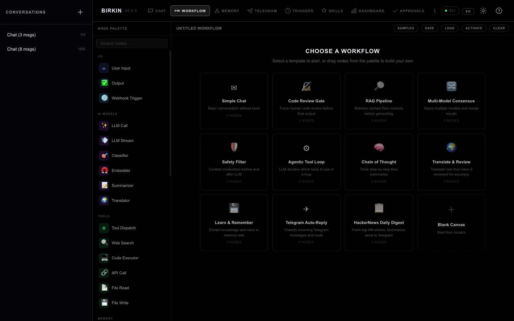
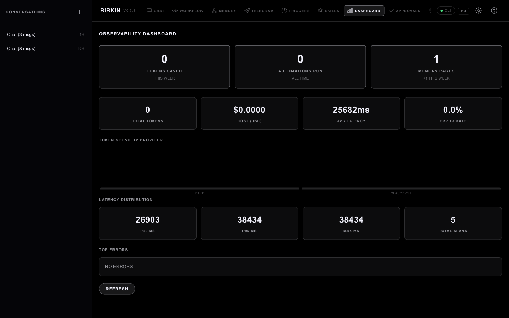
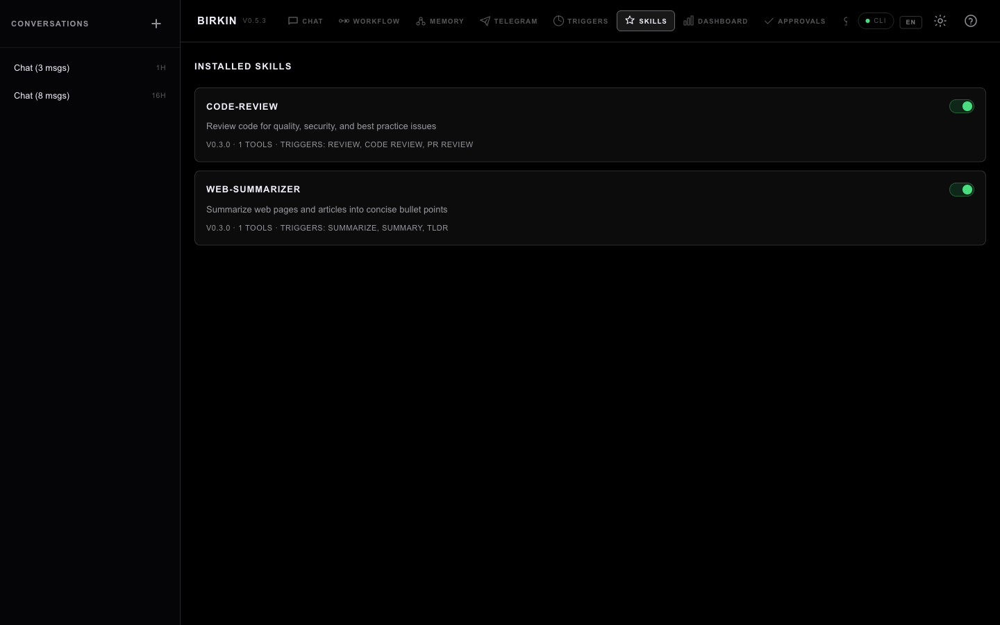
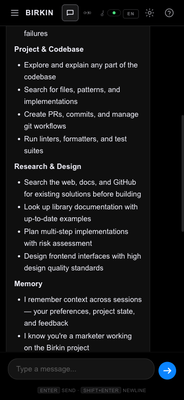

<h1 align="center">Birkin</h1>

<p align="center">
  <strong>Your personal agent OS that remembers, learns, and works for you.</strong>
</p>

<p align="center">
  <a href="#-quick-start">Quick Start</a> &bull;
  <a href="#-what-birkin-does">What It Does</a> &bull;
  <a href="#-10-tab-webui">WebUI</a> &bull;
  <a href="#-providers">Providers</a> &bull;
  <a href="#-memory-system">Memory</a> &bull;
  <a href="#-automation">Automation</a> &bull;
  <a href="#-api">API</a> &bull;
  <a href="#-architecture">Architecture</a> &bull;
  <a href="README-ko.md">한국어</a>
</p>

<p align="center">
  <a href="LICENSE"></a>
  
  
  
  
</p>

---

## What is Birkin?

Most AI tools forget you the moment the conversation ends. Birkin doesn't.

**Birkin is a personal agent OS** that sits on your machine, connects to any LLM, and builds a persistent knowledge base from every interaction. It routes tasks to the right model, automates workflows on triggers, and gets better at helping *you* over time.

- **One interface, many LLMs** — Talk to Claude, GPT, Gemini, Perplexity, Groq, Ollama, or OpenRouter. Birkin picks the best one for each task.
- **Memory that compounds** — Every conversation compiles into a searchable wiki. Relevant context is injected automatically.
- **Automation that runs itself** — Set up triggers (cron, file changes, webhooks) and let workflows execute without you.
- **100% local, 100% yours** — Self-hosted. No cloud dependency. Your data never leaves your machine.

---

## Quick Start

### One-Click (Recommended)

**Windows:** Double-click `scripts/start.bat`
**macOS/Linux:** Double-click `scripts/Birkin.command` or run `scripts/start.sh`

Browser opens at `http://127.0.0.1:8321`. First run ~1 minute (creates venv + installs deps). After that, instant.

### Docker (One Command)

```bash
git clone https://github.com/ashmoonori-afk/birkin.git && cd birkin
cp .env.example .env   # Add your API keys
docker compose up -d   # http://localhost:8321
```

See [QUICKSTART.md](QUICKSTART.md) for details.

### Manual

```bash
git clone https://github.com/ashmoonori-afk/birkin.git
cd birkin
python3 -m venv .venv && source .venv/bin/activate
pip install -e "."
birkin                # WebUI at :8321
birkin chat           # Terminal REPL
birkin mcp serve      # MCP server (for Claude Code, Cursor, etc.)
birkin eval run ...   # Evaluation framework
birkin skill install  # Install community skills
birkin export         # Backup all data
```

### API Keys

Copy `.env.example` to `.env` and add at least one key:

```bash
ANTHROPIC_API_KEY=sk-ant-...    # Claude
OPENAI_API_KEY=sk-...           # GPT + OpenRouter
PERPLEXITY_API_KEY=pplx-...     # Search-augmented
GEMINI_API_KEY=...              # Multimodal + 1M context
GROQ_API_KEY=gsk_...            # Ultra low-latency
```

**No API key?** Use Ollama (local) or Claude Code CLI — zero cost, zero setup.

---

## Screenshots

<p align="center">
  <br>
  <em>Chat — SSE streaming with persistent sidebar, suggestion prompts, scroll-lock</em>
</p>

<p align="center">
  <br>
  <em>Workflow — 40+ node palette, 11 sample templates, drag-and-drop canvas editor</em>
</p>

<p align="center">
  <br>
  <em>Dashboard — Token spend, latency distribution, error rates, provider breakdown</em>
</p>

<details>
<summary>More screenshots</summary>

<p align="center">
  <br>
  <em>Skills — Install and toggle skill plugins with one click</em>
</p>

<p align="center">
  <br>
  <em>Mobile — Fully responsive at 375px with adaptive navigation</em>
</p>

</details>

---

## 10-Tab WebUI

| Tab | What You Get |
|-----|-------------|
| **Chat** | SSE streaming with scroll-lock, retry on disconnect, elapsed-time indicator, and auto-memory |
| **Workflow** | Visual editor — drag 40+ node types, parallel execution, condition routing, error recovery paths |
| **Memory** | Interactive knowledge graph — see what Birkin remembers, edit pages, upload files (.md, .json, .csv, .pdf) |
| **Profile** | Import ChatGPT/Claude conversations — Birkin builds a profile of you (role, expertise, interests, projects, style) |
| **Telegram** | Connect a bot in 3 steps — works over polling (no public URL needed) |
| **Triggers** | Schedule anything — cron, file watchers, webhooks, message filters |
| **Skills** | Install and toggle skill plugins (code-review, web-summarizer, or build your own) |
| **Dashboard** | Real-time observability — token spend, latency, error rates per provider |
| **Approvals** | Safety layer — review and approve agent actions before they execute |
| **Insights** | Weekly digest — where your tokens went, which providers you used, patterns detected |

---

## Providers

Birkin auto-selects the best provider for each task based on capability, cost, and latency.

| Provider | Strength | API Key | Local? |
|----------|----------|---------|--------|
| **Anthropic** | Reasoning, code | `ANTHROPIC_API_KEY` | |
| **OpenAI** | General purpose | `OPENAI_API_KEY` | |
| **Perplexity** | Web search | `PERPLEXITY_API_KEY` | |
| **Gemini** | Vision, 1M context | `GEMINI_API_KEY` | |
| **Groq** | Ultra low-latency | `GROQ_API_KEY` | |
| **Ollama** | Fully local, free | — | Yes |
| **OpenRouter** | 100+ models | `OPENAI_API_KEY` | |
| **Claude CLI** | Claude Code local | — | Yes |
| **Codex CLI** | Codex local | — | Yes |

Set `provider: "auto"` in settings and Birkin routes to the cheapest available model that fits the task.

---

## Memory System

Birkin's memory is what makes it different from a chatbot.

**How it works:**
1. Every conversation is scored by an LLM classifier (bilingual KO/EN)
2. Important exchanges are saved as wiki pages with tags and category
3. On the next conversation, relevant pages are pulled via semantic search and injected as context
4. Over time, pages that aren't referenced decay naturally — high-value knowledge stays, noise fades

**Features:**
- Relevance-scored context injection (not full dump)
- Memory decay with 20-day half-life (confidence x references x time)
- Prompt injection protection on auto-saved content
- Korean NER support (optional `kiwipiepy`)
- Wikilink aliases for multilingual synonyms
- `wiki_read` tool for on-demand lazy loading
- Daily compilation cron (3 AM) + session cleanup
- **Memory ↔ Workflow bridge** — LLM nodes auto-receive memory context; workflow results write back to wiki
- 5 wiki categories: entities, concepts, sessions, workflows, meta

---

## Automation

### Triggers

| Type | Example |
|------|---------|
| **Cron** | "Every Monday 9 AM, summarize last week" |
| **File Watch** | "When `reports/` changes, analyze the new file" |
| **Webhook** | "When deploy webhook fires, run smoke tests" |
| **Message** | "When Telegram message contains 'urgent', notify" |

### Workflows

- **Simple mode:** BFS node graph (40+ node types, drag-and-drop, 5-module architecture)
- **Graph mode:** Conditional routing (YES/NO labels), true parallel execution (`asyncio.gather`) + merge, loops with convergence detection, error recovery paths (ERROR label edges)
- **NL builder:** Describe what you want in a sentence — Birkin generates the workflow
- **LLM timeout:** Configurable per-node timeout (default 120s) with fallback provider
- **Workflow recommender** — detects repeated patterns in your behaviour and suggests new workflows automatically
- **Proactive discovery** — suggestions surface in chat responses and run on the daily cron
- **Feedback loop** — accept, dismiss, or modify suggestions; Birkin learns from your choices

### Skill Matching

- **Hybrid trigger matching** — exact substring first, semantic fallback via local embeddings (threshold 0.6)
- Supports Korean intent matching ("견적서 전달해" → email skill)

### Token Budget

Every session enforces a budget. When tokens run low, Birkin auto-compresses context or downgrades to a cheaper model. No surprise bills.

---

## API

| Group | Endpoints | What For |
|-------|-----------|----------|
| **Chat** | `POST /api/chat`, `/api/chat/stream` | Blocking + SSE streaming |
| **Sessions** | `GET/POST/DELETE /api/sessions` | Conversation management |
| **Memory** | `GET/PUT/DELETE /api/wiki/*` | Wiki CRUD + graph + search |
| **Triggers** | `GET/POST/DELETE /api/triggers` | CRUD + manual fire |
| **Skills** | `GET/POST /api/skills` | List + toggle + install |
| **Workflows** | `GET/PUT/DELETE /api/workflows` | CRUD + NL generate + suggestions + feedback |
| **Insights** | `GET /api/insights/*` | Weekly digest, patterns, trends |
| **Dashboard** | `GET /api/observability/*` | Spend, latency, errors, hero metrics |
| **Approvals** | `GET/POST /api/approvals` | Pending actions |
| **Eval** | `birkin eval run/list/diff` | CLI evaluation framework |
| **Voice** | `POST /api/voice/stt`, `/tts` | Speech-to-text, text-to-speech |
| **MCP** | `birkin mcp serve` | Expose as MCP server |
| **Profile** | `POST /api/profile/import`, `GET/DELETE /api/profile` | Conversation import + user profile |
| **Settings** | `GET/PUT /api/settings` | Config, keys, providers |

Full API: 63 endpoints across 17 routers.

---

## Architecture

```
birkin/
  core/           Agent loop, 9 providers, graph engine, budget, approval gates, workflow recommender
  mcp/            MCP client + server + Playwright browser automation
  triggers/       Cron, file watch, webhook, message + SQLite persistence
  skills/         SKILL.md plugin system (code-review, web-summarizer)
  memory/         Wiki (5 categories), event store, compiler, importers, profile, semantic search, decay
  eval/           JSONL evaluation framework with regression detection
  observability/  Structured tracing (Trace > Span > JSONL)
  voice/          Whisper STT + TTS
  gateway/        FastAPI backend (17 routers)
  web/            10-tab WebUI (vanilla JS, cinematic dark theme, 4-tier responsive)
  tests/          685+ tests (pytest)
```

---

## Security

- Shell tool uses an **allowlist** — only safe read-only commands allowed by default
- Shell metacharacters (`|`, `&&`, `>`, `` ` ``) are rejected
- Extend with `BIRKIN_SHELL_ALLOWLIST=curl,python`
- Set `BIRKIN_AUTH_TOKEN` before exposing to network
- Memory auto-sanitizes prompt injection patterns

---

## Contributing

```bash
pytest tests/ -q          # Run tests
ruff check .              # Lint
ruff format --check .     # Format check
```

See [CONTRIBUTING.md](CONTRIBUTING.md) for the full guide.

---

## License

MIT — see [LICENSE](LICENSE).

Copyright (c) 2026 Birkin Team.
