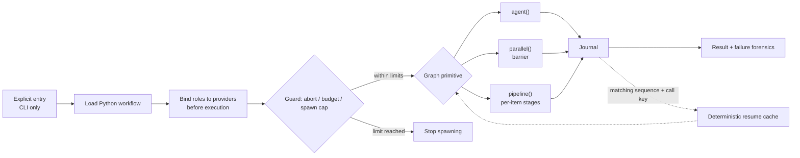

# birkin

**A local-first Python agent that treats memory, execution, and
self-improvement as inspectable local state.**

birkin is a CLI agent, HTTP/Telegram gateway, MCP server, and multi-agent
runtime in one installable package. Memory is a folder of Markdown you can
open, grep, and commit. Multi-agent work is a Python graph, not a model
deciding to call itself. Consequential actions cross approval, checkpoint, and
redaction gates that live in code rather than in a prompt.

[한국어](./README.ko.md) ·
[](https://deepwiki.com/ashmoonori-afk/birkin/1-overview)


> **Memory is files. Control flow is code. Authority is bounded.**

The name is the joke and the joke is the design. Hermes is the famous courier:
fast, mythic, travelling light. birkin runs ahead of that baseline by carrying
less machinery, holding its cargo in a shape that cannot spill, and putting
hard gates in front of what should never pass. The gates are not decoration.
They are deterministic code that refuses, queues, and checkpoints no matter
what a model would prefer. The speed is real and measured against birkin's own
earlier path: warm gateway turns went from 13-16 s to 2.3 s on Claude and from
37.5 s to 3 s on Codex ([`docs/STATUS.md`](./docs/STATUS.md), ADR-045 and
ADR-046; no comparative hermes-agent latency benchmark exists here, and none is
claimed).

## The 60-second proof

Every row is something the repository can be made to show you.

| | Measured or enforced |
|---|---|
| **0 core dependencies; at most 3 for voice + desktop per platform** | The OpenAI SDK is in the `voice` extra; Pillow plus one platform adapter are in `desktop`. `office` is separate, and `full` installs every feature extra. Agent loop, gateway, memory, workflows, HTTP, JSON-RPC, and cron parsing are standard library. [`pyproject.toml`](./pyproject.toml) |
| **5 curation operations, none of them delete** | `OPS` is the entire vocabulary a memory curator gets. There is no delete for an adversarial model or a poisoned note to reach for. [`curation_contract.py`](./birkin/curation_contract.py) |
| **R@1 0.891 in production** | The shipped lexical stack scores 0.891 R@1 / 0.974 R@5 / 0.926 MRR on 470 LongMemEval-S questions. The tuned research configuration reaches 0.900, ahead of the best embedding hybrid measured on the same harness at 0.894. No encoder, no vector store. [`docs/ranking-v2-plan.md`](./docs/ranking-v2-plan.md) |
| **4 concurrent execution slots, 100-agent ceiling** | Moirai's default thread-pool width and per-run spawn cap. Scheduling limits, distinct from the named workers below. Abort, budget, and cap are checked before each new agent. [`moirai/engine.py`](./birkin/moirai/engine.py) |
| **2,300+ offline tests, 82.89% coverage** | The default `pytest` run needs no API key and no network. [`docs/STATUS.md`](./docs/STATUS.md) |
| **Warm turns at 2.3 s and 3 s** | Claude and Codex warm gateway turns, down from 13-16 s and 37.5 s on birkin's own earlier path. This is a self-comparison, not a claim about any other project. [`docs/STATUS.md`](./docs/STATUS.md) |
| **56 bundled skills, ~37K lines of Python** | One flat package. Most behavior is a module with explicit inputs and file-backed state. |

<details>
<summary><strong>Or skip this README and make your agent audit the claims</strong></summary>

```text
Read this README and the implementation files it links to. Tell me whether
birkin is graph engineering or a prompt loop, which actions a model can never
authorize for itself, and where the project publishes results that went
against it:
https://raw.githubusercontent.com/ashmoonori-afk/birkin/main/README.md
```

</details>

## Highlights

| | What is different |
|---|---|
| **Delete-free memory curation** | The model proposes a typed plan. Deterministic code owns the mutation and decides what survives. |
| **Lexical retrieval, measured** | BM25 over Hangul-aware tokens, Ebbinghaus decay, Hebbian potentiation, zone-priority EMA. LLM-free, benchmarked in-repo. |
| **A graph runtime, not a spawn tool** | `agent`, `parallel`, and `pipeline` are code primitives. One workflow crosses Claude, Codex, and API workers without naming them in the script. |
| **Bounded workers** | Each named worker has one trigger and one authority ceiling, enforced in the executor. |
| **One enforcement path for tool results** | Every native tool call passes `ToolRegistry.run`. Hooks observe there, output is redacted there, spill happens only after redaction. |
| **Self-improvement is reversible data** | Typed proposals, validated limits, a versioned ledger, and rollback. Not an invisible mutation. |
| **One prompt assembly gate** | `promptgate.py` composes persona, memory, skills, and notices for every surface. No surface invents its own system prompt. |
| **Local-first surfaces** | CLI, WebUI, local HTTP, Telegram, voice, MCP, and opt-in A2A from the same package and storage conventions. |
| **Auditable by construction** | Visible files, append-only records, and offline tests instead of opaque hosted state. |

## Why birkin exists

There are already excellent general-purpose agent projects. birkin makes a
different trade:

- one installable Python package instead of a multi-language runtime;
- no core dependencies and at most three voice + desktop packages per platform instead of
  SDK-heavy provider stacks;
- visible files and append-only records instead of opaque hosted state;
- a small native tool surface instead of browser/computer automation;
- explicit approval, checkpoint, and redaction choke points around execution;
- continual improvement as reviewable proposals that can be rolled back.

This makes birkin unusually easy to audit, embed, test offline, and repair with
ordinary Python tools.

## Graph engineering, not agent theater

Most agent systems keep control flow inside the prompt. The model decides
whether to call another model, whether to retry, when to stop. That is a
suggestion loop with a spawn button. Moirai moves those decisions into an
execution graph that Python owns.


*One entry, one guard before any spawn, three concurrency shapes, one failure
contained, everything journaled, and resume reused only where the key still
matches.*


```mermaid
flowchart LR
    E["Explicit entry<br/>CLI only"] --> S["Load Python workflow"]
    S --> B["Bind roles to providers<br/>before execution"]
    B --> G{"Guard: abort / budget / spawn cap"}
    G -->|within limits| X{"Graph primitive"}
    G -->|limit reached| Z["Stop spawning"]
    X --> A["agent()"]
    X --> P["parallel()<br/>barrier"]
    X --> L["pipeline()<br/>per-item stages"]
    A --> J["Journal"]
    P --> J
    L --> J
    J --> O["Result + failure forensics"]
    J -. "matching sequence + call key" .-> R["Deterministic resume cache"]
    R -.-> X
```

- **Python owns control flow.** A workflow is a file with `meta` and `main(m)`.
  Roles bind to providers before anything spawns.
- **Concurrency has semantics.** `parallel()` is a barrier. `pipeline()` lets
  each item advance through stages independently. A failed branch does not take
  down its siblings.
- **Replay is selective.** Resume accepts a cached call only when the sequence
  and a content-derived key both still match, so rebinding one role re-runs
  that role and nothing else.
- **Failure is data.** Provider errors, guard blocks, tokens, elapsed time, and
  tracebacks go into the run record instead of collapsing into "agent failed".
- **Stop conditions are constants.** The bundled `deep-research` pattern halts
  after two consecutive waves that surface no new lead, because
  `DRY_WAVES_TO_STOP` is a number in the source rather than a judgment call.

## Workers with bounded authority


The workers are named after Greek and Egyptian figures. Their boundaries are
deliberately unromantic, and they are not all the same kind of thing. Four are
deterministic modules. Three are thin launchers that persist state but execute
little. One is protocol prose with no module at all.

| Worker | Runs when | Authority ceiling |
|---|---|---|
| **Moirai** | You start a workflow explicitly from the CLI | Runs provider-portable graphs. Abort, token budget, and the 100-agent spawn cap are evaluated before each new agent. |
| **Mnemosyne** | Memory is indexed, searched, or mechanically maintained | Owns zones, ranking, decay, and priority. No model call anywhere in it. Judgment is a separate layer with its own gate. |
| **Neurosis** | A request is too ambiguous to act on | Interviews, writes a spec, waits for approval. It does not guess. |
| **Morpheus** | Scheduled review of recent work | Emits proposals. It does not rewrite the agent directly. |
| **Boulder** | A long-running goal is set | Persists a resumable plan. A goal's gate command is never executed by the goal store; it routes through the shell approval queue. |
| **Harness** | A proposal arrives from Morpheus or a turn-boundary review | Validates target, type, and budget, applies within limits, and appends to a ledger that supports rollback. |
| **Odyssey** | You start a goal-completion cycle | Thin resumable glue, not an engine. It derives a slug, points at a Boulder plan, and builds the kickoff prompt; the cycle itself runs as skill protocol across turns. It does not use Moirai and owns no execution machinery of its own. |
| **Osiris** | An Odyssey step claims to be finished | Inline protocol prose inside the Odyssey skill, with no module anywhere in the package. It gates a step's checkmark by convention only and cannot independently enforce anything. Boulder's file is what actually persists the outcome. |

**Reading the image.** Solid machined blocks are deterministic modules,
half-tone frames are launchers that hold resumable state but execute little,
and the dashed outline is protocol with no module behind it.

- Loom at a gated aperture, **Moirai**, module
- Lattice archive with fading shelves, **Mnemosyne**, module
- Cairn of plan-stones, **Boulder**, module
- Bound ledger with a reverse lever, **Harness**, module
- Lantern narrowing to a sealed scroll, **Neurosis**, launcher
- Compass and road, **Odyssey**, launcher
- Moon emitting sealed envelopes, **Morpheus**, launcher
- Dashed scales in an open gateway, **Osiris**, protocol only

The amber loop is Odyssey's cycle: Neurosis, three critics, Boulder, step
execution, an Osiris check, then back to the next unchecked step.

One rule generates most of that table. **Workers produce evidence and
proposals. Deterministic code owns ceilings, persistence, and approval.**
Osiris is the honest exception that proves the rule: it is the one role with no
code behind it, which is precisely why it can gate a checkmark but cannot
enforce a boundary.

## Code-level comparison

The following comparison comes from the code in birkin and the current source
trees of
[hermes-agent](https://github.com/NousResearch/hermes-agent) and
[prime-agent](https://github.com/PrimeIntellect-ai/prime-agent), inspected on
2026-08-10. It does not rely on product claims or architecture documents.

| | birkin | hermes-agent | prime-agent |
|---|---|---|---|
| Main shape | One Python package | Large Python application plus JS/TS surfaces | TypeScript monorepo plus Python kernel shim |
| Approximate source scale | 37K Python LOC | 166K Python + 132K JS/TS LOC | 152K TypeScript LOC |
| Mandatory runtime dependencies | None; feature extras are `voice`, `desktop`, `office`, and `full` | Large exact-pinned Python set plus extras | Multiple npm package dependency graphs; Python runtime uses IPython |
| Agent/tool organization | One native loop and one registry choke point | Broad provider, gateway, browser, media, and tool subsystems | Layered `ai`, `agent`, `coding-agent`, and `tui` packages |
| Memory | Editable Markdown/YAML/wikilink vault | Multiple state and memory integrations | Session/context-tree centric |
| Self-improvement | Versioned proposal ledger with validation and rollback | Broad skill and runtime ecosystem | Extension and package ecosystem |
| UI/channel breadth | CLI, WebUI, local HTTP, Telegram, voice, MCP, A2A | Much broader browser, gateway, and messaging surface | Rich terminal UI and coding-agent extensions |
| Best fit | Small, auditable, long-running local agent | Feature breadth and many integrations | TypeScript-native coding-agent platform and TUI |

### Where birkin is stronger

**Small dependency and supply-chain surface.** `pyproject.toml` keeps the core
dependency-free. Voice, desktop, and office support are explicit extras; voice
plus desktop installs at most three packages on one platform. HTTP, streaming,
JSON-RPC, cron parsing, persistence, provider clients, and the native agent loop
are implemented in the package.

**A single enforcement path for tool results.** Every native tool call passes
through `ToolRegistry.run`. Hooks observe there; textual output is redacted
there; oversized text spills only after redaction; image bytes are kept out of
event payloads and spill files. The agent loop receives one typed
`ToolResult` shape.

**Self-improvement is data, not an invisible mutation.** `harness.py` accepts
typed proposals, validates their limits, records prompt/memory/skill/config
edits in a ledger, and supports rollback. `morpheus.py` produces proposals from
recent work instead of directly rewriting the agent. The same harness can run
at turn boundaries.

**Transparent memory.** `memory.py` stores YAML-frontmatter Markdown notes and
wikilinks in an Obsidian-compatible vault. `mnemosyne.py` supplies an LLM-free
index, zones, priority, and decay. Users can inspect and edit the knowledge
base without a vector database or migration tool.

**Failure handling is layered.** Provider calls can retry, rotate credentials
after rate limits, and fall back to another provider. Long conversations
compact automatically. Workspace edits can create checkpoints. Goal execution
persists a resumable Boulder plan instead of depending on one uninterrupted
process.

**One prompt assembly gate.** `promptgate.py` composes persona, memory, skills,
and runtime notices for every surface. The REPL, gateway, dry-run path, and
warm sessions do not each invent a different system prompt.

**Multi-agent work without a second runtime.** Isolated subagents, concurrent
read-only tool batches, deterministic Moirai workflows, A2A JSON-RPC, and MCP
all run from the same package and storage conventions.

### Where hermes-agent and prime-agent are stronger

birkin intentionally has less surface area.

- hermes-agent has far more gateway platforms, browser/computer-use code,
  provider adapters, media tools, and deployment integrations.
- prime-agent has a richer TypeScript package ecosystem, terminal UI,
  extension surface, browser-oriented build targets, and an IPython-backed
  coding runtime.
- birkin has no native browser automation and no equivalent to their full TUI
  stacks.
- birkin is primarily a single-process local runtime. It is not a distributed
  control plane.
- Native tools execute with the current user's authority. `shell_approval`,
  `fs_jail`, disabled tools, gateway authentication, and allowlists must be
  configured for the deployment rather than assumed.

Choose birkin when smallness, local inspectability, and reversible operation
matter more than integration breadth.

## Structural map

```text
birkin/
  agent.py          native tool-calling loop, compaction, parallel calls
  llm.py            provider protocol, streaming, retry and failover boundary
  runtime.py        constructs clients, prompts, registries, memory and skills
  promptgate.py     single system-prompt assembly point
  tools/            files, shell, web, vision, sessions, memory and subagents
  gateway/          local HTTP and Telegram channels
  memory.py         Obsidian-compatible semantic memory
  mnemosyne.py      mechanical memory index, zones and decay
  harness.py        validated self-improvement ledger and rollback
  morpheus.py       scheduled proposal generation
  moirai/           deterministic multi-agent workflow engine
  boulder.py        durable resumable goal plans
  checkpoints.py    workspace snapshots and restore
  shellguard.py     destructive-command approval
  security.py       deployment-facing security diagnostics
  a2a/              Agent2Agent JSON-RPC server
  web/              local WebUI server
skills/             56 bundled Markdown skills
tests/              offline unit, integration, gateway and e2e coverage
```

The structure is deliberately flat. Most behavior is a module with explicit
inputs and file-backed state rather than a framework hierarchy.

## Install

Python 3.10 or newer is required.

```bash
git clone https://github.com/ashmoonori-afk/birkin.git
cd birkin
python -m pip install -e .

# Add only the feature surface you need
python -m pip install -e ".[voice]"
python -m pip install -e ".[desktop]"
python -m pip install -e ".[office]"
python -m pip install -e ".[full]"
birkin setup
```

For development:

```bash
python -m pip install -e ".[dev]"
pytest
```

## First run

```bash
# Guided setup
birkin setup

# Interactive agent
birkin chat

# Inspect models and native tools
birkin models
birkin tools

# Start the local gateway or WebUI
birkin gateway
birkin web
```

The default provider is Codex CLI, using the locally authenticated Codex
subscription with no API key. API-backed Anthropic and OpenAI providers and the
Claude CLI provider remain available through setup, environment variables, or
`~/.birkin/config.json`.

When birkin starts a `codex app-server` child, it disables Codex plugin hooks
for that child while preserving plugins and MCP servers. This keeps a global
`UserPromptSubmit` hook from treating birkin's internal `<system-context>` as
user input.

### OMO control from Telegram

Trusted Telegram chats configured in `channels.telegram.allowed_chat_ids` can
select and control a local OMO session with `/omo list`, `/omo use`, `/omo
send`, `/omo steer`, `/omo abort`, `/omo status`, and `/omo last`.

`/omo send <prompt>` starts the OMO turn in the background and returns
immediately. While that turn is running, `/omo steer <message>` and `/omo
abort` remain available; use `/omo status` to inspect the turn and `/omo last`
to read its latest assistant reply. A second send or session switch is rejected
until the active turn finishes.

### Active voice control

Voice support is installed with `birkin[voice]`. OpenAI STT/TTS calls require a
Platform API key:

```bash
export OPENAI_API_KEY="..."
uv run birkin gateway
```

In another terminal, start continuous live-microphone voice mode:

```bash
uv run birkin voice setup
uv run birkin voice start \
  --gateway-url http://127.0.0.1:8788/message
uv run birkin voice status
```

`voice setup` asks three short questions for the wake phrase, a voice-only
conversation style, and the TTS voice. The first `voice start` runs this setup
automatically until it is completed; run `voice setup` or `voice onboard`
again to change the choices. Conversation style instructions are scoped to
voice Gateway turns and do not change the chat or Telegram persona.

`start` waits for authenticated worker readiness, rejects duplicate daemons,
and writes its authenticated control state and log under `~/.birkin/voice`.
The state directory is restricted to the current OS account; keep any custom
`BIRKIN_HOME` on a filesystem that supports user ACLs. If a live daemon PID
temporarily stops answering, `start` reports it as `UNREACHABLE` instead of
deleting its state and launching an orphaned duplicate.
`status` reports the current PID and exits `0` only for `RUNNING`;
`STOPPING`, `UNREACHABLE`, and `INACTIVE` exit `1`. Stop the daemon after its
current bounded voice turn with:

```bash
uv run birkin voice stop
```

If that turn outlives the control wait, `stop` prints `STOPPING`, exits `1`,
and the accepted shutdown continues; poll with `voice status`.

Recorded and deterministic inputs remain one-shot only:

```bash
uv run birkin voice --once \
  --audio wake.wav \
  --command-audio command.wav \
  --gateway-url http://127.0.0.1:8788/message \
  --tts-output reply.pcm \
  --no-playback
```

For a one-shot live capture, omit `--audio` and `--command-audio`. Add
`--background` to receive a durable job receipt under
`~/.birkin/voice/jobs`. For deterministic CI or troubleshooting, provide
`--transcript "Daddy is home" --command "status"` instead. Daemon `start`
accepts live-microphone options only; file, transcript, command, background,
and `--once` inputs fail before a worker is launched.

The nested `voice` config block supplies defaults for the matching CLI flags;
an explicit flag wins. Its empty `gateway_url` keeps wake-only fixture runs
offline. For Gateway delivery, set it or pass `--gateway-url` with an exact
loopback HTTP `/message` endpoint such as
`http://127.0.0.1:8788/message`. Non-loopback hosts, HTTPS, credentials,
queries, and fragments are rejected. If the local HTTP channel is protected,
set `BIRKIN_HTTP_TOKEN`; the voice client forwards it only to that validated
loopback endpoint.

The wake phrase is a routing trigger, not authorization. Voice requests still
cross `Gateway.handle("voice", ...)` and cannot gain Telegram's approved-work
flags. `gpt-transcribe` performs bounded STT and `gpt-4o-mini-tts` produces the
reply audio; generated speech is AI-generated. Codex/ChatGPT sign-in does not
replace `OPENAI_API_KEY` for Audio API calls.

## Native tools

The registry can expose:

- workspace-scoped file read, edit, write, and listing;
- shell execution with destructive-command approval;
- HTTP fetch, web search, quote lookup, and citation verification;
- session lookup and transcript access;
- transparent memory operations;
- isolated subagents with scoped tool groups;
- skill loading, creation, and refinement;
- `vision_analyze` for local or HTTP(S) PNG, JPEG, GIF, and WebP images;
- opt-in Windows window listing and screenshot capture.

Remote images use the same private/reserved-address and redirect checks as web
fetching. Desktop tools are absent from the registry unless
`desktop_tools` is exactly `true`.

Retriable native-tool blocks become manual `operation` approvals, including
disabled-tool policy, workspace and egress file policy, control-plane writes,
OS permission errors, Git `safe.directory`, and PowerShell execution policy.
Each record binds the exact tool, input, working directory, gate, and digest;
approval permits one exact retry without elevation flags or global policy
changes. HARDLINE shell commands, malformed input, authentication failures,
and secret/SSRF egress blocks remain non-approvable integrity boundaries.

## Configuration

Configuration lives at `~/.birkin/config.json` or under `BIRKIN_HOME`. This is
a representative configuration using real defaults from `birkin/config.py`:

```json
{
  "provider": "codex-cli",
  "model": "default",
  "subagent_model": "default",
  "api_key": null,
  "api_keys": [],
  "max_tokens": 4096,
  "temperature": 1.0,
  "max_turns": 24,
  "cli_network_access": false,
  "egress": {
    "enabled": true,
    "enforced": true,
    "max_bytes": 1048576,
    "destinations": {
      "trusted-api": {
        "url": "https://api.example.com/submissions",
        "method": "POST",
        "automatic": true,
        "content_types": ["application/json"],
        "max_bytes": 1048576,
        "auth_env": "EXAMPLE_SUBMIT_TOKEN"
      }
    }
  },
  "context_window": 200000,
  "auto_compact": true,
  "fallback_provider": "",
  "fallback_model": "",
  "fallback_cooldown": 300,
  "parallel_tools": true,
  "max_depth": 2,
  "shell_approval": "manual",
  "command_allowlist": [],
  "fs_jail": false,
  "checkpoints": true,
  "checkpoint_keep": 20,
  "redact_secrets": true,
  "spill_threshold": 30000,
  "disabled_tools": [],
  "desktop_tools": false,
  "self_improve": true,
  "a2a_enabled": false,
  "lsp_servers": {},
  "harness_enabled": true,
  "harness_turn_interval": 12,
  "harness_cooldown_min": 15,
  "harness_compact_review": true,
  "harness_max_edits": 12,
  "harness_prompt_budget": 20000,
  "harness_auto_approve": ["memory", "skill"],
  "web_port": 8787,
  "gateway_port": 8788,
  "budget_tokens_daily": 0,
  "budget_tokens_monthly": 0,
  "voice": {
    "wake_phrase": "Daddy is home",
    "gateway_url": "",
    "session_id": "voice-local",
    "sample_rate": 24000,
    "stt_model": "gpt-transcribe",
    "tts_model": "gpt-4o-mini-tts",
    "tts_voice": "coral",
    "tts_instructions": "Speak concisely and clearly.",
    "conversation_style": "",
    "onboarding_complete": false,
    "background_workers": 2
  },

  "channels": {
    "http": {"enabled": true},
    "telegram": {
      "enabled": false,
      "token": "",
      "allowed_chat_ids": [],
      "stream": true
    },
    "slack": {"enabled": false, "webhook_url": ""},
    "discord": {"enabled": false, "webhook_url": ""}
  }
}
```

Important boundaries:

- `shell_approval: "manual"` asks before destructive shell commands.
- On Windows, shell jobs use `cmd.exe` and receive a verified writable
  `TEMP`/`TMP`, so tools such as Bun and npm keep working in long-lived
  gateway, scheduler, and daemon processes. PowerShell is used only when
  explicitly requested.
- `fs_jail: true` restricts native file tools to configured workspace roots.
- `redact_secrets: true` masks detected credentials before output is persisted.
- `disabled_tools` removes named native tools from the registry.
- Gateway exposure should be paired with HTTP authentication or Telegram
  `allowed_chat_ids`.
- Slack and Discord are send-only adapters. They require HTTPS incoming-webhook
  URLs and truncate messages at 3,500 and 2,000 characters respectively.
- Daily/monthly token budgets are disabled when set to `0`.

Run `birkin setup` for guided configuration and `birkin tools` to inspect or
toggle the effective tool set.

`submit_payload` is the default outbound-write path. It accepts inline JSON or
text, resolves only an exact destination name from `egress.destinations`,
canonicalizes and scans the final bytes before DNS or a socket, injects
destination-scoped authentication from `auth_env`, sends once, and writes
metadata-only intent/outcome records to
`~/.birkin/egress-receipts.jsonl`. Automatic transfer requires
`automatic: true`; unknown and non-automatic destinations are blocked. Profiles
are HTTPS/443 only, with a fixed method/path/content-type/byte cap and no
query, fragment, userinfo, proxy, or redirect. Normal `redact_secrets` settings
cannot disable this pre-send scan.

With the default `egress.enforced: true`, Birkin omits native `run_shell` and
`spawn_subagent` capabilities that could bypass the broker. Model-controlled
`web_fetch` URLs and `web_search` queries receive the same pre-network secret
scan while normal public research remains available. Setting `enforced` to
`false` restores those raw native capabilities and emits a security warning.

`cli_network_access` defaults to `false`. Turning it on grants the Codex child
raw network and bypasses inspected-egress destination and payload checks, so
Birkin emits a security warning. Workspace filesystem confinement and
`approval_policy="never"` remain in force, but raw network is an explicit
escape hatch, not the submission default. `cli_access: "full"` remains the
separate, dangerous host-access opt-in and is never inherited by the reachable
gateway.

## Memory and self-improvement

birkin's memory is a directory of normal Markdown files. Notes remain usable
without birkin and can be versioned with Git.

Curation is where most memory systems quietly lose data. birkin's curator emits
a typed plan restricted to `rezone`, `link`, `supersede`, `archive`, and
`annotate`. Deletion is not an operation it can express, and a deterministic
executor decides what actually lands.

The improvement path is deliberately separate:

1. recent work is reviewed;
2. the reviewer emits bounded edits;
3. the harness validates target, type, and budget;
4. approved edits are applied and appended to the ledger;
5. an entry can be inspected or rolled back.

Useful commands:

```bash
birkin harness
birkin harness history
birkin morpheus
birkin nightly
birkin curate
birkin curate-memory
```

## Multi-agent and protocol surfaces

- **Subagents** receive a fresh conversation, scoped tools, and optional
  skills. They do not inherit the parent's transcript or write to its memory.
- **Moirai** executes deterministic workflows across Claude, Codex, and API
  workers.
- **Boulder** persists a resumable plan of independently verifiable goal steps.
- **Odyssey** coordinates the skill cycle over that plan across turns. It owns
  no execution engine and does not use Moirai.
- **Osiris** is the inline protocol check inside that cycle. It has no module
  and no independent enforcement; Boulder's file records what survived.
- **MCP** exposes Birkin tools to compatible clients. With
  `egress.enforced: true`, Birkin sessions use only the Birkin MCP server;
  `birkin mcp` can still manage external Claude MCP servers, but does not imply
  that those servers are inherited.
- **A2A** exposes an opt-in Agent2Agent v1.0 JSON-RPC endpoint and agent card.
- **Gateway** keeps sessions warm across local HTTP and Telegram turns.
- **Structured actions** reuse the approval queue for channel-neutral questions.
  Every question has an action id, explicit expiry, typed radio or checkbox
  options, optional clarification, and recommendation metadata. The first valid
  answer wins atomically; stale, malformed, or expired replies return
  `reply_rejected`.

Moirai workflows can stop at a top-level `m.request_answers(step_id=...)`
checkpoint. The wait binds the action to the source run, `main` worker, explicit
step, exact question digest, authenticated actor/capability class, expiry,
random resume token, input schema version, and prior-state digest. Birkin
commits one immutable accepted-answer event before it starts a resume.

Resume is an exact **logical checkpoint replay** in a child run: Birkin verifies
the script and prior-state digests, restores the stored args and bindings,
replays the durable agent-call prefix, and injects the versioned answer only at
the bound step. It does not restore an arbitrary Python stack or promise
exactly-once execution for unjournaled side effects before the checkpoint.
Input checkpoints are therefore limited to the top-level `main` worker; calls
from anonymous parallel thunks fail closed.

The WebUI approval inbox renders structured actions as accessible controls. A
successful submission changes the card in place to a resolved, disabled
outcome. Non-browser channels can render the same contract as numbered text.
  Short context-dependent Telegram follow-ups resolve against that chat's latest
  substantive request, including after a restart, without rewriting new topics.

## Integration workflows

Durable subagent runs are visible in `/dash` and the REPL:

```text
/agents
/attach <run-id>
/send <run-id> <message>
```

`spawn_subagent` accepts `detach: true`, which starts the run in the background
and returns its id immediately instead of blocking the caller. `/attach` then
follows that run live: it replays the recorded progress trail, streams new tool
activity as it happens, and prints the result when the run finishes. Ctrl-C
detaches without stopping the run. Detached runs live inside the current
process, so they end when the process does.

Use `/goal set <objective> [--gate "command"]` to persist one active goal.
`/goal show`, `/goal pause`, and `/goal done` manage it, and the objective is
injected into every system prompt the session composes. A gate command is never
executed directly by the goal store; `/goal done` routes the verifier through
the existing shell approval queue and completes the goal only once that verifier
has actually passed — a queued or failing verifier leaves the goal open.

`/sessions <query>` searches saved transcripts and returns date, channel,
model, snippet, and score metadata. Filters compose with AND:
`--since 30d`, `--from telegram` (also `--channel`), and `--model <name>`.
Bare `/sessions` keeps the original saved-session listing.

Cron jobs may use `"type": "monitor"` with exactly one of `monitor_url` or
`monitor_script`. They alert only when the bounded result changes; URL monitors
apply the web SSRF guard, a 30-second timeout, and a 256 KiB maximum response.
Fetch failures are recorded as failures, not changes.

## Verification

The default test run is offline:

```bash
pytest
```

At the time of this rewrite the suite passes more than 2,300 tests with 82.89%
package coverage against a 75% gate. Live-provider tests are excluded by
default and require `BIRKIN_LIVE=1`.

Static checks used by the project:

```bash
python -m ruff check .
python -m bandit -r birkin
```

## License

birkin is released under the [MIT License](./LICENSE).
