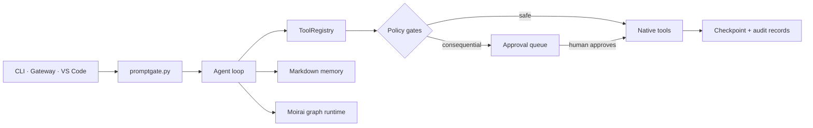

<div align="center">


# birkin

### Local memory. Deterministic control. Human authority.

A dependency-light Python agent whose memory, execution, and self-improvement stay inspectable on your machine.

[](https://github.com/ashmoonori-afk/birkin/actions/workflows/tests.yml)
[](./pyproject.toml)
[](./vscode-extension)
[](./LICENSE)

[Why](#why-birkin) · [Quick Start](#quick-start) · [Office Work OS](#office-work-os-v2) · [GitHub Action](#github-action) · [Sandbox](#isolated-execution) · [VS Code](#vs-code-extension) · [Compare](#surface-comparison) · [Architecture](#architecture) · [Commands](#commands) · [한국어](./README.ko.md)

</div>

---

## Why birkin?

Agent runtimes are easy to demo and hard to trust. Birkin keeps the model useful while moving authority into code.

| The problem | Birkin's fix |
|---|---|
| Memory disappears into a hosted service or vector database | Markdown notes, YAML frontmatter, and wikilinks live in an Obsidian-compatible local vault. |
| A prompt is asked to enforce its own safety | Native tools pass through one registry; shell and scheduled actions use deterministic policy and the approval queue. |
| “Multi-agent” means a model recursively spawning itself | Moirai provides Python-owned `agent`, `parallel`, and `pipeline` graph primitives with budget and spawn ceilings. |
| Self-improvement silently mutates the runtime | Harness records typed proposals in a versioned ledger and supports rollback. |
| A coding agent changes files before the user understands the plan | The official VS Code extension sends editor context, reviews a plan first, renders proposed diffs, resolves Birkin approvals, and restores checkpoints. |
| A local tool becomes an opaque service | Runs, approvals, checkpoints, status, and configuration remain local and inspectable. |

Birkin's core runtime has **no mandatory third-party Python dependencies**. Optional extras add voice, desktop vision, and office-file support. The repository currently bundles **63 skills**; all default tests are designed to run offline.

## Quick Start

Python 3.10 or newer is required. The default provider is the locally authenticated Codex CLI; setup can select Claude CLI or API-backed providers instead.

```bash
git clone https://github.com/ashmoonori-afk/birkin.git
cd birkin
python -m pip install -e .
birkin setup
birkin chat
```

Run the local service surfaces in separate terminals:

```bash
birkin gateway          # local HTTP on 127.0.0.1:8788; Telegram is optional
birkin web --no-browser # dashboard/control API on 127.0.0.1:8787
```

Optional features are explicit:

```bash
python -m pip install -e ".[voice]"
python -m pip install -e ".[desktop]"
python -m pip install -e ".[office]"
python -m pip install -e ".[full]"
```

> [!IMPORTANT]
> Native tools run with your operating-system account. Keep the gateway loopback-only, configure `shell_approval`, `fs_jail`, disabled tools, and channel allowlists for your deployment, and review consequential actions before approval.

## Office Work OS v2

Birkin registers a bounded workflow for DOCX, XLSX, PPTX, PDF, and HWPX. It supports text extraction, text-first creation, layered validation and comparison, explicit-budget TXT conversion, semantic structured previews, and narrow copy-on-write package edits. PDF mutation remains refused; HWPX creation requires a trusted template.

<!-- office-support-matrix:start -->
| Format ID | Read/inspect | Create | Extract | Validate | Compare | Text convert | Surgical mutation | Render/recalc/forms |
|---|---|---|---|---|---|---|---|---|
| `docx` | bounded | conditional | bounded | structural | layered | bounded | bounded | structured-preview |
| `xlsx` | bounded | conditional | bounded | structural | layered | bounded | bounded | structured-preview |
| `pptx` | bounded | conditional | bounded | structural | layered | bounded | bounded | structured-preview |
| `pdf` | bounded | bounded | conditional | structural | layered | conditional | refused | structured-preview |
| `hwpx` | bounded | template-only | bounded | structural | layered | bounded | bounded | structured-preview |
<!-- office-support-matrix:end -->

`layered` comparison reports byte hashes, bounded normalized semantic text, and ZIP package-entry changes where applicable; it is not byte-only. PDF has no ZIP package layer. `structured-preview` means `render_artifact` succeeds only with `output_format: "structured_preview"`; visual `pdf`, `png`, and `thumbnail` requests return `RENDER_UNAVAILABLE`. Spreadsheet recalculation and general forms remain unavailable.

The registered calls are `list_document_adapters`, `inspect_document`, `extract_document`, `create_document`, `compare_documents`, `fill_template`, `apply_document_patch`, `render_artifact`, `validate_artifact`, and `convert_document`. The synchronized skills are `office-work-os`, `office-documents`, `word-documents`, `spreadsheets`, `presentations`, `pdf-documents`, and `korean-hwp-documents`.

Document inputs are jailed to `BIRKIN_HOME`. For example, with `BIRKIN_HOME=/workspace/.birkin`, copy or import the source under `/workspace/.birkin/artifacts/incoming` before calling a tool; an absolute path outside that tree is rejected. Outputs are basename-only new files under `/workspace/.birkin/artifacts/drafts`.

```json
{"source":{"content_hash":"<source-sha256>","uri":"/workspace/.birkin/artifacts/incoming/source.docx"},"projection":"text","max_text_bytes":100000}
```

TXT conversion requires the `loss_budget` argument and never claims native or lossless conversion:

```json
{"source":{"content_hash":"<source-sha256>","uri":"/workspace/.birkin/artifacts/incoming/source.docx"},"target_format":"txt","output_name":"source.txt","loss_budget":{"structure":10,"style_layout":10,"macro_active_content":0,"signature_encryption":0}}
```

Install optional Office backends with `python -m pip install -e ".[office]"` and PDF inspection/extraction/deep reopen with `python -m pip install -e ".[office-advanced]"`. Built-in PDF creation is ASCII-only; non-Latin requests return a typed capability refusal without executing or suggesting ReportLab. Missing approved optional backends return typed errors and never silently select a candidate.

See the [detailed support contract](./docs/office-support.md#office-work-os-v2), machine [`provenance_manifest.json`](./birkin/office/adapters/provenance_manifest.json), and [`THIRD_PARTY_NOTICES.md`](./birkin/office/adapters/THIRD_PARTY_NOTICES.md). This documentation targets Birkin `0.4.227`, `catalog_revision: 4`, `inventory_sha256: 66ac4638ee7a8b4f6b68325b036ca7d9b312fdf37eef9b90f3c163a756356d53`.

## GitHub Action

The official composite Action turns a trusted issue or pull-request comment into an isolated Birkin job. Put this workflow in `.github/workflows/birkin.yml` in a consumer repository, add `ANTHROPIC_API_KEY` as an Actions secret, and pin `@main` to a release tag or commit SHA once selected:

```yaml
name: Birkin
on:
  issue_comment:
    types: [created]
permissions:
  contents: read
jobs:
  birkin:
    if: >-
      startsWith(github.event.comment.body, '/birkin') &&
      contains(fromJSON('["OWNER","MEMBER","COLLABORATOR"]'),
      github.event.comment.author_association)
    runs-on: ubuntu-latest
    permissions:
      contents: write
      issues: write
      pull-requests: write
    steps:
      - uses: actions/checkout@11d5960a326750d5838078e36cf38b85af677262
        with:
          ref: ${{ github.event.repository.default_branch }}
          persist-credentials: false
      - uses: ashmoonori-afk/birkin@main
        with:
          github-token: ${{ secrets.GITHUB_TOKEN }}
          anthropic-api-key: ${{ secrets.ANTHROPIC_API_KEY }}
          test-command: python -m pytest -q
          max-retries: "1"
```

A trusted maintainer comments `/birkin <task>` on an issue or PR. Birkin edits a branch from the default branch, runs the configured test command, receives exact failure output for a bounded repair attempt, pushes, and opens a PR referencing the source. On a PR, `/birkin review <focus>` reads the diff with a tool-free model call and posts a structured review comment; it does not execute PR code.

> [!CAUTION]
> The workflow intentionally uses `issue_comment`, not a secret-bearing fork checkout. It gates runs to `OWNER`, `MEMBER`, or `COLLABORATOR`, checks out only the trusted default branch, and declares read-only workflow permissions plus the three write scopes required by the job. Credentials are accepted only through the documented `github-token`, `anthropic-api-key`, and `openai-api-key` inputs. The driver removes them from agent tools and test subprocess environments before processing task or diff content. Never replace this with a secret-bearing untrusted-code checkout.

## Isolated execution

Birkin can run a declared repository job in either a disposable **git worktree** or a **Docker container**. Both backends consume the same immutable `SandboxPolicy`, and the GitHub Action worker calls the same evaluator as local execution rather than maintaining a second remote policy.

Check in `.birkin/sandbox.json` to make setup reproducible:

```jsonc
{
  "backend": "docker",
  "image": "python:3.12.4-slim@sha256:<digest>",
  "setup": ["python -m pip install -e ."],
  "env_allowlist": ["PIP_INDEX_URL"],
  "network": "allowlist",
  "network_allowlist": ["pypi.org"],
  "write_paths": ["birkin", "tests"]
}
```

- **Network:** `off` rejects every declared destination and Docker adds `--network=none`; `allowlist` rejects destinations not named by the repository.
- **Secrets:** the child receives only variables named by `env_allowlist`; inherited credentials and every other host variable are stripped.
- **Writes:** Docker mounts the repository read-only and overlays only configured paths as writable. Worktree jobs run on a detached disposable checkout, validate actual changes against the same scopes, and remove the checkout even after failure.

Policy or configuration violations raise typed errors and fail before delivery. Setup commands run in declaration order on every job. Keep Docker images digest-pinned and writable paths present in the repository. The worktree backend provides disposable repository/write isolation, not a network namespace; use Docker when kernel-enforced network isolation is required.

## Browser QA

Install the optional browser surface and its Chromium runtime; core Birkin does not import Playwright:

```bash
python -m pip install 'birkin[browser]'
python -m playwright install chromium
```

The native registry exposes `browser_navigate`, `browser_click`, `browser_fill`, `browser_press`, `browser_execute`, `browser_screenshot`, `browser_evidence`, and `browser_close`. They share one page, so an agent can edit web code and verify the rendered result rather than infer it from source.

Browser traffic reuses the repository's `sandbox.network` and `sandbox.network_allowlist` policy. The default `network: "off"` fails closed. For local WebUI QA, set `network` to `allowlist`, include `127.0.0.1`, and keep the screenshot path inside `sandbox.write_paths`. Every navigation and page subrequest is checked; redirects, scripts, `fetch`, and click-triggered requests cannot bypass the allowlist. Registry hooks, `disabled_tools`, and approval replay remain the same gates used by every native tool. Policy refusals are returned as `BrowserPolicyViolation` errors.

A runnable ouroboros check against Birkin's own WebUI:

1. Change `birkin/web/static/index.html`, then start `birkin web --no-browser` and copy its private bootstrap URL.
2. In a Birkin native session configured with `sandbox.network="allowlist"` and `sandbox.network_allowlist=["127.0.0.1"]`, call `browser_navigate` with that URL.
3. Call `browser_click` with `#lens-toggle`, then `browser_screenshot` with a named relative path such as `artifacts/webui.png`.
4. Call `browser_evidence` and save its console plus request/response summaries with the screenshot. Finish with `browser_close` so Chromium and all contexts are released.
5. As a negative proof, navigate to a host absent from the allowlist and retain the typed refusal. This request must not reach the network.

This is real browser execution, not an HTML parser. Use `browser_fill`/`browser_press` for forms and `browser_execute` for focused page-state assertions; disable any action by name in `disabled_tools` when a surface should not expose it.

## VS Code extension

`vscode-extension/` is the official TypeScript extension. It binds to Birkin's existing local surfaces instead of running a second agent protocol:

- sends the active selection, range, workspace, and open-file descriptors to the gateway;
- requests a non-executing plan and requires an explicit **Execute Plan** decision;
- opens file proposals in VS Code's native inline diff editor;
- approves or rejects through Birkin's existing approval queue;
- restores Birkin's shadow-git checkpoints after confirmation;
- displays live runtime and pending-review status in the status bar.

### Install from source

```bash
cd vscode-extension
npm ci
npm run compile
npm run package
code --install-extension birkin-vscode-0.1.0.vsix
```

For an Extension Development Host:

```bash
cd vscode-extension
npm ci
npm run compile
code --extensionDevelopmentPath="$PWD"
```

Start both `birkin gateway` and `birkin web --no-browser`. The WebUI writes a private `~/.birkin/web_session.json`, which the extension uses to discover its loopback port and capability. Change `birkin.gatewayUrl` if the gateway is not on port 8788. If you set `BIRKIN_HTTP_TOKEN`, copy the same value to `birkin.gatewayToken`.

Open the Command Palette and run **Birkin: Review Plan Before Execution**. The other commands send a contextual request, review proposed changes, roll back files, and refresh status.

## Surface comparison

All rows below describe surfaces shipped in this repository.

| Capability | CLI / REPL | Gateway | WebUI | VS Code |
|---|:---:|:---:|:---:|:---:|
| Conversational agent | Yes | Yes | No (monitoring/control) | Yes, through gateway |
| Current editor selection and open files | Manual | Manual | No | Yes |
| Plan review before execution | Slash-command/workflow dependent | Conversation dependent | No | Dedicated review surface |
| Proposed-change diff | Terminal checkpoint diff | No | Approval details | Native VS Code diff editor |
| Approval queue | `birkin review` | Trusted chat controls | Approve/reject API and UI | Approve/reject API |
| File rollback | `/rollback` | No | Checkpoint control API | Checkpoint picker |
| Live status | Status line | Progress callbacks | Dashboard | Status bar |
| Local transport | Process stdin/stdout | Loopback HTTP / channels | Loopback HTTP | Existing gateway + WebUI APIs |

## Architecture

The model proposes; deterministic code owns persistence, policy, and authority.


```mermaid
flowchart LR
    U[CLI · Gateway · VS Code] --> P[promptgate.py]
    P --> A[Agent loop]
    A --> R[ToolRegistry]
    R --> G{Policy gates}
    G -->|safe| T[Native tools]
    G -->|consequential| Q[Approval queue]
    Q -->|human approves| T
    T --> C[Checkpoint + audit records]
    A --> M[Markdown memory]
    A --> W[Moirai graph runtime]
```

<details>
<summary><strong>Repository map</strong></summary>

```text
birkin/
  agent.py          native tool loop, steering, compaction, parallel calls
  runtime.py        provider, prompt, registry, memory, and skill construction
  promptgate.py     one system-prompt assembly point for every main surface
  tools/            files, shell, web, vision, memory, sessions, subagents
  approvals.py      human gate and approved action execution
  checkpoints.py    external shadow-git snapshots and restore
  gateway/          local HTTP, Telegram, and outbound channel adapters
  web/              local dashboard and authenticated control API
  harness.py        validated self-improvement ledger and rollback
  moirai/           deterministic multi-agent graph runtime
  mcp_server.py     stdio MCP server for memory, skills, and proposals
vscode-extension/   official strict-TypeScript editor integration
skills/             bundled Markdown skills
tests/              offline unit, integration, and end-to-end coverage
```

State is file-backed under `BIRKIN_HOME` (normally `~/.birkin`). The dashboard uses a per-process capability; the gateway binds to loopback and can additionally require `BIRKIN_HTTP_TOKEN`. MCP uses newline-delimited JSON-RPC over stdio. The VS Code extension uses these existing authorities: gateway `/message` for turns and WebUI endpoints for approvals, status, editor context, and checkpoints.

</details>

## Checkpoints

The WebUI workbench turns Birkin's external shadow-git snapshots into a tool-level
timeline. Each entry records the tool, time, touched paths, result, and the
checkpoint hashes for its before and after state. Open any checkpoint to preview
an aggregate patch or each file's patch before changing anything.

| Restore mode | Workspace files | Task/conversation state |
|---|---:|---:|
| `files` | restored | unchanged |
| `task` | unchanged | restored |
| `both` | restored | restored |

Every restore is destructive, so the WebUI queues it through the existing human
approval authority and first protects the current state. An alternate attempt
instead seeds a disposable, policy-controlled sandbox worktree from the selected
checkpoint and records its lineage, without touching the current workspace.
The authenticated API exposes the checkpoint list, `/timeline`, `/lineage`,
`/{id}/diff`, `/{id}/restore`, and `/{id}/fork` for the same flow.

<details>
<summary><strong>Execution and recovery path</strong></summary>

1. `runtime.py` builds the configured provider, memory, skills, hooks, checkpoint manager, and native tool registry.
2. `promptgate.py` composes the sealed main prompt shared by REPL, gateway, dry-run, and warm sessions.
3. `ToolRegistry.run` is the native enforcement choke point for hooks, redaction, and output handling.
4. Consequential cron, shell, operation, workflow, and harness actions become file-backed approval records.
5. Mutating file tools snapshot the project into Birkin's external checkpoint store before mutation.
6. A human resolves the queue from CLI, trusted channels, WebUI, or VS Code; rollback restores a chosen checkpoint after protecting the current state.

</details>

## Commands

| Command | Purpose |
|---|---|
| `birkin setup` | Guided provider and workspace onboarding. |
| `birkin chat` | Interactive local agent (the default command). |
| `birkin gateway` | Run loopback HTTP and configured message channels. |
| `birkin web [--no-browser]` | Run the local dashboard and authenticated control API. |
| `birkin review` | Approve or reject pending consequential actions. |
| `birkin permission` | Inspect or change approval categories and CLI access. |
| `birkin tools` | List, enable, or disable native tools. |
| `birkin model` / `birkin models` | Inspect or select the model. |
| `birkin skills` | List, inspect, sync, validate, or manage skills. |
| `birkin daemon` | Run or install the Morpheus + cron scheduler. |
| `birkin morpheus [--dry-run]` | Run the scheduled self-improvement routine now. |
| `birkin harness` | Show, refine, export, or roll back the improvement ledger. |
| `birkin moirai` | List, run, inspect, or resume deterministic workflows. |
| `birkin runs` / `birkin trace ID` | Inspect run summaries and detailed audit records. |
| `birkin cron` | List or remove scheduled jobs. |
| `birkin sessions` | List or export saved conversations. |
| `birkin mcp-serve` | Serve Birkin memory, skills, and proposals over MCP stdio. |
| `birkin voice` | Configure or control the optional voice daemon. |

Run `birkin --help` or `birkin <command> --help` for the complete interface.

## Configuration

`birkin setup` writes `~/.birkin/config.json`. The block below is generated from `birkin.config.DEFAULT_CONFIG` and verified by tests, so it is the complete default surface rather than a curated excerpt:

<details>
<summary><strong>Full default configuration</strong></summary>

<!-- config-schema:start -->
```json
{
  "provider": "codex-cli",
  "model": "default",
  "subagent_model": "default",
  "base_url": "",
  "cli_command": [],
  "api_key": null,
  "max_tokens": 4096,
  "temperature": 1.0,
  "max_turns": 24,
  "auto_compact": true,
  "context_window": 200000,
  "fallback_provider": "",
  "fallback_model": "",
  "fallback_base_url": "",
  "fallback_cooldown": 300,
  "api_keys": [],
  "a2a_enabled": false,
  "lsp_servers": {},
  "spill_threshold": 30000,
  "spill_dir": "",
  "spill_retention_days": 7,
  "redact_secrets": true,
  "repl_typed_line": "steer",
  "moirai_auto": false,
  "moirai_workers": 4,
  "moirai_max_agents": 100,
  "moirai_roles": {},
  "moirai_token_budget": 0,
  "marginalia_api_key": "",
  "parallel_tools": true,
  "parallel_tool_workers": 8,
  "shell_approval": "manual",
  "checkpoints": true,
  "hooks": {},
  "hooks_auto_accept": false,
  "skills_guard_agent_created": false,
  "checkpoint_keep": 20,
  "command_allowlist": [],
  "approval_model": "",
  "max_depth": 2,
  "extra_skill_dirs": [],
  "disabled_tools": [],
  "desktop_tools": false,
  "self_improve": true,
  "skill_nudge_interval": 3,
  "memory_nudge_interval": 6,
  "web_port": 8787,
  "gateway_port": 8788,
  "gateway_model": "",
  "gateway_reasoning_effort": "",
  "gateway_persistent": true,
  "gateway_allowed_tools": [],
  "repl_warm_session": false,
  "gateway_clean_hooks": true,
  "gateway_thinking_tokens": 0,
  "gateway_prewarm": true,
  "office": {
    "handoc": {
      "node_path": "",
      "node_version": "22.14.0",
      "module_root": "",
      "package_manifest_sha256": "",
      "timeout_seconds": 30
    }
  },
  "voice": {
    "wake_phrase": "Daddy is home",
    "gateway_url": "",
    "session_id": "voice-local",
    "sample_rate": 24000,
    "stt_model": "gpt-transcribe",
    "tts_model": "gpt-4o-mini-tts",
    "tts_voice": "coral",
    "tts_instructions": "Speak concisely and clearly.",
    "conversation_style": "",
    "onboarding_complete": false,
    "background_workers": 2
  },
  "autosave_transcripts": false,
  "autosave_redact_secrets": true,
  "autosave_max_chars": 4000,
  "autosave_max_turns": 40,
  "autosave_retention_days": 30,
  "autosave_max_files": 500,
  "neurosis_threshold": null,
  "neurosis_auto": true,
  "channels": {
    "http": {
      "enabled": true
    },
    "telegram": {
      "enabled": false,
      "token": "",
      "allowed_chat_ids": [],
      "stream": true
    },
    "slack": {
      "enabled": false,
      "webhook_url": ""
    },
    "discord": {
      "enabled": false,
      "webhook_url": ""
    }
  },
  "vault_path": "",
  "morpheus_deliver_chat_id": "",
  "workspace_roots": [],
  "reaper_enabled": true,
  "morpheus_provider": "",
  "morpheus_model": "",
  "morpheus_hour": 7,
  "morpheus_minute": 0,
  "auto_approve": [
    "memory",
    "skill"
  ],
  "harness_enabled": true,
  "harness_turn_interval": 12,
  "harness_cooldown_min": 15,
  "harness_compact_review": true,
  "harness_max_edits": 12,
  "harness_prompt_budget": 20000,
  "harness_auto_approve": [
    "memory",
    "skill_note"
  ],
  "cli_access": "workspace",
  "cli_network_access": false,
  "egress": {
    "enabled": true,
    "enforced": true,
    "max_bytes": 1048576,
    "destinations": {}
  },
  "allow_unattended_full": false,
  "budget_tokens_daily": 0,
  "budget_tokens_monthly": 0,
  "subagent_tree_max_tokens": 0,
  "subagent_tree_max_usd": 0.0,
  "subagent_tree_deadline_seconds": 0,
  "subagent_tree_max_concurrent": 4,
  "subagent_tree_max_nodes": 16,
  "cli_timeout": 300,
  "evidence_required": false,
  "critique_agents": 3,
  "boulder_max_iters": 100,
  "fs_jail": false,
  "sandbox": {
    "backend": "worktree",
    "image": "",
    "setup": [],
    "env_allowlist": [],
    "network": "off",
    "network_allowlist": [],
    "write_paths": [
      "."
    ]
  },
  "update_verify_signature": false
}
```
<!-- config-schema:end -->

</details>

Environment variables remain the right place for provider secrets. `api_keys` names environment-variable pools; it is not a place to paste raw keys. `a2a_enabled` is opt-in. Enforced egress disables uninspected native network paths and allows only configured destinations through Birkin's inspected tools. A sandboxed gateway child can submit a shell request through `propose_action`; Birkin queues it for approval instead of running it inside the child sandbox.

## Development

```bash
python -m pip install -e ".[dev]"
python -m compileall -q birkin
python -m pytest

cd vscode-extension
npm ci
npm test
npm run compile
npm run test:e2e
```

CI executes the Python suite on Ubuntu/Python 3.10, macOS/Python 3.13, and Windows/Python 3.13. Extension unit tests use Vitest; the host QA target uses `@vscode/test-electron`.

## License

[MIT](./LICENSE). See [NOTICE](./NOTICE) for attribution.
