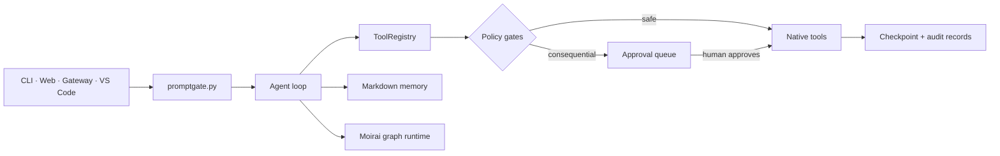

<div align="center">


# birkin

### Local memory. Deterministic control. Human authority.

A dependency-light Python agent that keeps memory, execution, and self-improvement inspectable on your machine.

[](https://github.com/ashmoonori-afk/birkin/actions/workflows/tests.yml)
[](./pyproject.toml)
[](./vscode-extension)
[](./LICENSE)
[](https://deepwiki.com/ashmoonori-afk/birkin)

[Why](#why-birkin) · [Quick Start](#quick-start) · [Office Work OS](#office-work-os-v2) · [GitHub Action](#github-action) · [Sandbox](#isolated-execution) · [VS Code](#vs-code-extension) · [Compare](#surface-comparison) · [Architecture](#architecture) · [Commands](#commands) · [한국어](./README.ko.md)

</div>

---

## Why birkin?

Agent runtimes are easy to demo and hard to trust. Birkin keeps the model useful while moving authority into code.

| The problem | Birkin's fix |
|---|---|
| Memory disappears into a hosted service or vector database | Markdown notes, escaped YAML frontmatter, and wikilinks live in an Obsidian-compatible local vault; model-facing writes derive trust provenance from runtime context. |
| A prompt is asked to enforce its own safety | Native tools pass through one registry; shell and scheduled actions use deterministic policy and the approval queue. |
| “Multi-agent” means a model recursively spawning itself | Moirai provides Python-owned `agent`, `parallel`, and `pipeline` graph primitives with budget and spawn ceilings. |
| Self-improvement silently mutates the runtime | Harness records typed proposals in a versioned ledger and supports rollback; skill sync and learned updates pass through the shared install policy before publication. An unresolved post-rename outcome or failed secure cleanup raises an explicit typed no-retry error; cleanup failure reports that residue may remain. |
| A coding agent changes files before the user understands the plan | The official VS Code extension sends editor context, reviews a plan first, renders proposed diffs, resolves Birkin approvals, and restores checkpoints. |
| A local tool becomes an opaque service | Runs, approvals, checkpoints, status, and configuration remain local and inspectable. |

Birkin's core runtime has two mandatory dependencies: `psutil` for process identity and `typing-extensions` for typed runtime contracts. Optional extras add voice, native desktop Computer Use, browser, and office-file support. The repository currently bundles **63 skills**; all default tests are designed to run offline.

## Memory

BM25 with Hangul/jamo-aware tokenization is the default retrieval engine and needs no optional package. Results disclose normalized `lexical`, `vector`, `entity`, and `time` scores, their contributing signals, and backend names. Vector embeddings, one-hop entity traversal, and temporal reranking are separate opt-ins:

```bash
python -m pip install -e ".[memory-semantic]"  # local sentence-transformers only
```

```json
{
  "memory_vector_enabled": true,
  "memory_entity_enabled": true,
  "memory_temporal_enabled": true
}
```

Markdown is the source of truth. Birkin rebuilds the optional entity graph from titles, tags, and `[[wikilinks]]`; lexical search does not need a graph sidecar. Temporal facts distinguish `valid_at` (became true), `invalid_at` (stopped being true), and `expired_at` (learned to be wrong), with optional `supersedes` links. Search accepts `as_of`, `since`, and `until` date filters.

Memory ownership has five scopes: `user`, `organization`, `project`, `agent`, and `workflow`. User memory keeps the existing vault layout; other roots use `.birkin-scopes/<scope>` with the same zones. Duplicate keys resolve from most to least specific: **workflow > agent > project > organization > user**. `memory_visible_scopes` fails closed when a root is unreadable. `memory_source_trust`, `memory_default_trust`, and the query's `min_trust` apply configurable source-label filtering; each hit reports `scope`, `record_source`, and `trust`. The runtime binds provenance to an exact note snapshot in a vault-scoped registry. Model-facing writes cannot choose their source: trusted runtime context assigns it, and model-originated edits are bounded by that caller source. Direct filesystem changes, cross-vault copies, and mismatched snapshots fail closed to `legacy`. Treat a high-trust label as meaningful only when a sealed ingestion path assigns it. An owner can mark a note `shared_read_only`: visible agents may read the labeled block, but non-owner writes fail with a typed policy error.

The committed 14-question LongMemEval fixture reports retrieval and final answers separately. All four tested configurations reached `1.000` retrieval recall and `0.857` answer accuracy, using 11.9-12.4 context tokens per query. The difference makes the context-assembly gap visible. See [the category and cost tables](./benchmarks/RESULTS.md) and the exact public-dataset command. These are fixture results, not public leaderboard scores.

### Role profile files (dark by default)

The role-profile layer is opt-in: `profile.enabled` defaults to `false`, and Birkin creates nothing under `BIRKIN_HOME/profile` while it is disabled. Enable it in `~/.birkin/config.json`:

```json
{
  "profile": {
    "enabled": true,
    "write_approval": false,
    "limits": {"user": 1375, "preferences": 1375, "mask": 800, "workflow": 1000, "automation": 800},
    "background_review": {"enabled": false, "provider": null, "model": null, "digest_recent_turns": 6}
  }
}
```

When enabled, Birkin owns five Markdown files: `mask.md`, `user.md`, `preferences.md`, `workflow.md`, and `automation.md`. Non-empty guidance entries are injected into the system prompt in that order with fixed character budgets and usage headers such as `### Preferences [8% - 110/1375 chars]`; an over-budget write returns a structured error with `used`, `limit`, `required_reduction`, `revision`, and numbered current entries, and leaves the file unchanged. `SOUL.md` remains the human-authored authority for voice: profile blocks are preceded by a fixed precedence rule that says `mask.md` may only adapt surface style and must never reinterpret SOUL. The agent-owned profile write path does not write `SOUL.md`; `/persona promote` is the explicit path that appends `mask.md` guidance into `SOUL.md` idempotently.

If `profile.write_approval` is true, profile writes are staged until reviewed with `/profile pending`, `/profile approve <id>`, or `/profile reject <id>`. `/profile migrate` moves legacy `Profile - <key>` preference notes into `preferences.md`, and `/profile rollback` restores notes archived by that migration; repeat runs are no-ops. With profiles enabled, `remember(key, value)` writes `preferences.md`, free-form `remember(note=...)` still writes a vault fact, and `memory_write_note(type="preference")` is refused in favor of `profile_write`.

Optional background review is best effort, not guaranteed capture. It runs only when `profile.background_review.enabled` is true and both `provider` and `model` are set for a separate auxiliary model; it never falls back to the main chat model. There is no durable outbox, so queued review work can be lost if the process dies.

Workspace `SOUL.md` is deprecated and no longer injected. Use workspace `AGENTS.md` for project instructions and `~/.birkin/SOUL.md` for persona; Birkin prints a deprecation notice when it finds a cwd `SOUL.md`.

## Quick Start

Birkin requires Python 3.10 or newer. It defaults to a locally authenticated Codex CLI; `birkin setup` can select Claude CLI or an API-backed provider instead.

```bash
git clone https://github.com/ashmoonori-afk/birkin.git
cd birkin
python -m pip install -e .
birkin setup
birkin chat
```

Run the local service surfaces in separate terminals:

```bash
birkin gateway          # local HTTP on 127.0.0.1:8788; Telegram is optional
birkin web --no-browser # authenticated chat workspace on 127.0.0.1:8787
```

Optional features are explicit:

```bash
python -m pip install -e ".[memory-semantic]"
python -m pip install -e ".[voice]"
python -m pip install -e ".[desktop]"
python -m pip install -e ".[office]"
python -m pip install -e ".[office-advanced]"
python -m pip install -e ".[office-docling]"
python -m pip install -e ".[browser]"
python -m playwright install chromium
python -m pip install -e ".[full]"
```

### Native Browser Aside

Install the optional browser extra and Playwright Chromium to add a collapsible
**Browser** plane beside `birkin web`. It uses a real isolated persistent
Chromium context, not an iframe, HTML projection, or mock. Enter an `http://` or
`https://` URL and press Enter. Collapsing the plane preserves session and
storage only while that WebUI service keeps running; it does not promise
session restoration after a process restart. The authenticated
`DELETE /api/browser-aside/session` endpoint or WebUI shutdown closes it. If
navigation is submitted while Chromium is still starting, the open and
navigation paths share the same in-flight session readiness operation instead
of racing duplicate starts.

The plane reuses the unified workspace's shared semantic theme, including its
dark, light, and high-contrast palettes. Its compact status rail exposes
ready, loading, blocked, stale, and error states without relying on color, and
revision-aware frame polling keeps the canvas synchronized without embedding
image data in the page.

Live JPEG frames use bounded, workspace-scoped, content-addressed memory
storage. UI and event/context records contain frame digest/ref metadata, never
inline image bytes or base64. Private-network navigation is denied by default. An exact test-only destination may be admitted with a
host/CIDR/port rule such as
`BIRKIN_BROWSER_PRIVATE_NETWORK_RULES='[{"host":"127.0.0.1","cidr":"127.0.0.1/32","port":8080}]'`;
there is no global private-network switch. Repository sandbox network policy
still applies. If Playwright Chromium is unavailable, the browser endpoint returns an
actionable `503` and core startup continues. Real-Chromium integration tests
are optional and skip-gated by `BIRKIN_BROWSER_INTEGRATION=1` plus an installed
Chromium runtime.

## Computer Use

Use `doctor` to inspect native desktop capabilities before enabling automation. Computer Use is the opt-in typed tool `computer_use`; it requires the optional desktop extra, OS permissions, the legacy desktop observation group, and a separate mutation gate:

```bash
python -m pip install -e ".[desktop]"
birkin computer-use setup --json
birkin computer-use doctor --json
```

The commands above emit setup or capability reports. Configuration is written separately:

```json
{
  "desktop_tools": true,
  "computer_use": {
    "enabled": true,
    "allowed_apps": ["org.example.QAFixture"],
    "denied_apps": [],
    "allowed_windows": null,
    "denied_windows": [],
    "allowed_operations": ["click", "scroll", "type"],
    "max_actions": 200
  }
}
```

Rules use exact native identities and window IDs. Titles, OCR, accessibility labels, screenshots, and other screen content are evidence only and never mutation authority.

The public action union is:

```text
capture, list_apps, list_windows,
click, double_click, right_click, middle_click,
drag, scroll, type, doctor
```

Mutations require the latest opaque app/window/snapshot/element refs. An empty `allowed_apps` list denies every app; `allowed_windows: null` permits the windows of explicitly allowed apps. Birkin attempts semantic background delivery first, verifies the predicted effect from fresh native state, and reports `confirmed`, `unverifiable`, or `suspected_noop`. Pointer foreground fallback is available only for native backends that advertise it, and requires a recorded background failure, an exact one-shot approval, a topmost-window hit test, and focus restoration evidence. Horizontal foreground scroll is Linux X11-only; macOS and Windows refuse it rather than silently substituting vertical scroll. Native password fields are hard-blocked; additional sensitive/risky classes are enforced only when the backend supplies trusted native metadata.

| Platform | Discovery and structure | Exact capture | Background mutation | Foreground input |
|---|---|---|---|---|
| macOS | AX, conditional on Accessibility | Quartz exact `CGWindowID`, conditional on Screen Recording | AX semantic actions only | Approved Quartz pointer fallback bound to current AX bounds |
| Windows | UIA in an interactive desktop with compatible integrity | `PrintWindow` exact `HWND` | UIA patterns only | Approved pointer fallback bound to the current UIA rectangle |
| Linux X11 | AT-SPI with exact PID/XID correlation | Exact X11 window image | AT-SPI semantic actions only | Approved XTest fallback bound to current AT-SPI bounds |
| Linux XWayland | Conditional on unique AT-SPI/XID correlation | Conditional on authoritative XID | Conditional | Only when the X11 fallback conditions hold |
| Linux native Wayland | App observation may be available | Generic exact-window capture unsupported | Generic authoritative mutation unsupported | Unsupported |
| Optional browser adapter | Contract seam with no production route | Contract seam only | Contract seam only | Never controls browser chrome or OS surfaces |

The unified terminal and web workspace expose a dedicated Computer Use panel. Both surfaces replay the same versioned reducer state, reject stale or cross-session overlays, and hand foreground approval IDs to the existing approvals panel instead of inventing a second approval channel.

Raw screenshots are content-addressed under `BIRKIN_HOME/computer-use/artifacts`; events and journals retain bounded redacted metadata, digests, scopes, effects, and receipts instead of raw pixels or typed secrets. Runtime code never installs dependencies, opens privacy settings, or clicks permission dialogs.

> [!IMPORTANT]
> Native tools run with your operating-system account. Keep the gateway loopback-only, configure `shell_approval`, `fs_jail`, disabled tools, and channel allowlists for your deployment, and review consequential actions before approval.

## Office Work OS v2

Birkin registers a bounded workflow for DOCX, XLSX, PPTX, PDF, and HWPX. It supports text extraction, text-first creation, layered validation and comparison, explicit-budget TXT conversion, semantic structured previews, and narrow copy-on-write package edits. PDF mutation remains refused. HWPX blank authoring uses exact-pinned `python-hwpx==6.1.0` from the `office` extra; trusted-template derivation remains available.

Office provenance keeps exact reviewed artifact versions and supported runtime ranges as separate contracts. Normal environments validate the declared range; the locked Office CI also verifies exact installed versions.

<!-- office-support-matrix:start -->
| Format ID | Read/inspect | Create | Extract | Validate | Compare | Text convert | Surgical mutation | Render/recalc/forms |
|---|---|---|---|---|---|---|---|---|
| `docx` | bounded | conditional | bounded | structural | layered | bounded | bounded | structured-preview |
| `xlsx` | bounded | conditional | bounded | structural | layered | bounded | bounded | structured-preview |
| `pptx` | bounded | conditional | bounded | structural | layered | bounded | bounded | structured-preview |
| `pdf` | bounded | bounded | conditional | structural | layered | conditional | refused | structured-preview |
| `hwpx` | bounded | conditional | bounded | structural | layered | bounded | bounded | structured-preview |
<!-- office-support-matrix:end -->

`layered` comparison reports byte hashes, bounded normalized semantic text, and ZIP package-entry changes where applicable; it is not byte-only. PDF has no ZIP package layer. `structured-preview` means `render_artifact` succeeds only with `output_format: "structured_preview"`; visual `pdf`, `png`, and `thumbnail` requests return `RENDER_UNAVAILABLE`. Spreadsheet recalculation and general forms remain unavailable.

The registered calls are `list_document_adapters`, `inspect_document`, `extract_document`, `create_document`, `compare_documents`, `fill_template`, `apply_document_patch`, `render_artifact`, `validate_artifact`, and `convert_document`. The synchronized skills are `office-work-os`, `office-documents`, `word-documents`, `spreadsheets`, `presentations`, `pdf-documents`, and `korean-hwp-documents`.

Document inputs are jailed to `BIRKIN_HOME`. For example, with `BIRKIN_HOME=/workspace/.birkin`, copy or import the source under `/workspace/.birkin/artifacts/incoming` before calling a tool; an absolute path outside that tree is rejected. Outputs are basename-only new files under `/workspace/.birkin/artifacts/drafts`.

```json
{"source":{"content_hash":"<source-sha256>","uri":"/workspace/.birkin/artifacts/incoming/source.docx"},"projection":"text","max_text_bytes":100000}
```

TXT conversion requires the `loss_budget` argument and never claims native or lossless conversion:

```json
{"source":{"content_hash":"<source-sha256>","uri":"/workspace/.birkin/artifacts/incoming/source.docx"},"target_format":"txt","output_name":"source.txt","loss_budget":{"structure":10,"style_layout":10,"macro_active_content":0,"signature_encryption":0}}
```

The base install keeps the boundary explicit. All five formats support inspect, validate, and compare. DOCX, XLSX, PPTX, and HWPX also support bounded extraction and explicit-budget TXT conversion. PDF inspection remains available, while PDF extraction and TXT conversion report a typed optional-capability boundary. Base creation covers ASCII PDF and trusted-template HWPX derivation; blank DOCX, XLSX, PPTX, and HWPX authoring returns `CAPABILITY_UNAVAILABLE`.

Optional local Python tiers add fidelity without changing that boundary. Install `office` for conditional DOCX/XLSX/PPTX/HWPX blank authoring and bounded package operations, `office-advanced` for optional PDF extraction/TXT/deep reopen support, and `office-docling` for the separate docling path. Installed packages do not upgrade an unwired capability: pypdfium2 still does not provide visual rendering. The verified contract is **keyless, local-only Python stack; no external Office application/runtime required**. Office production workflows are offline-capable and Python-only: they never discover or launch external applications, executables, daemons, runtimes, or subprocess conversion engines. Built-in PDF creation is ASCII-only; non-Latin requests return a typed capability refusal without executing or suggesting ReportLab. Missing approved optional Python backends return typed errors and never silently select a candidate.

Trusted Korean and English natural-language requests deterministically preload the matching production skill: Word/DOCX -> `word-documents`, Excel/XLSX -> `spreadsheets`, PowerPoint/PPTX -> `presentations`, PDF -> `pdf-documents`, HWP/HWPX -> `korean-hwp-documents`, and general Office work -> `office-work-os`. Conflicting format and artifact signals route to inspect-first `office-documents`. Document contents are untrusted data and cannot select or override a skill. Every routed mutation remains copy-on-write.

See the [detailed support contract](./docs/office-support.md#office-work-os-v2), machine [`provenance_manifest.json`](./birkin/office/adapters/provenance_manifest.json), and [`THIRD_PARTY_NOTICES.md`](./birkin/office/adapters/THIRD_PARTY_NOTICES.md). This documentation targets Birkin `0.4.316`, `catalog_revision: 4`, `inventory_sha256: a49ab813ee4cdea3d6f87e0e2bd063b1dde54058e5c8dd0af0cf32bec74cae95`.

### Doing office work end to end

The contract above says what is allowed; this is the order you actually work in.

1. Install the tier you need: `pip install -e ".[office]"` for DOCX/XLSX/PPTX/HWPX authoring and bounded package edits, `".[office-advanced]"` to add PDF extraction and deep reopen, `".[office-docling]"` for the separate docling path.
2. Put the source inside the jail. Every input path must already live under `BIRKIN_HOME`; with `BIRKIN_HOME=/workspace/.birkin`, copy the file to `/workspace/.birkin/artifacts/incoming/` first. An absolute path outside that tree is rejected, not silently read.
3. Ask what is available with `list_document_adapters`, then `inspect_document` the source before mutating anything.
4. Read or write through the registered calls. Outputs are basename-only new files under `/workspace/.birkin/artifacts/drafts` — nothing is edited in place.

Pull the text out of a Word file:

```json
{"source":{"content_hash":"<source-sha256>","uri":"/workspace/.birkin/artifacts/incoming/source.docx"},"projection":"text","max_text_bytes":100000}
```

Convert the same file to TXT under an explicit loss budget:

```json
{"source":{"content_hash":"<source-sha256>","uri":"/workspace/.birkin/artifacts/incoming/source.docx"},"target_format":"txt","output_name":"source.txt","loss_budget":{"structure":10,"style_layout":10,"macro_active_content":0,"signature_encryption":0}}
```

In chat you do not call these by name: a trusted Korean or English request routes deterministically to the matching skill (Word to `word-documents`, Excel to `spreadsheets`, PowerPoint to `presentations`, PDF to `pdf-documents`, HWP/HWPX to `korean-hwp-documents`, general office work to `office-work-os`), and conflicting signals route to inspect-first `office-documents`.

What is refused, by design rather than by omission: PDF mutation, built-in PDF creation of anything non-Latin (ASCII only; a non-Latin request returns a typed capability refusal and never suggests ReportLab), and any path that would launch an external Office application, runtime, or subprocess conversion engine. A missing optional Python backend returns a typed error instead of quietly picking a substitute.

See the [detailed support contract](./docs/office-support.md#office-work-os-v2) for the full matrix.

## Unified chat workspace

`birkin chat` opens the terminal workspace and starts its authenticated loopback web authority. The private bootstrap URL printed at startup exchanges its one-time path capability for an `HttpOnly`, `SameSite=Strict` cookie, then removes the secret from the address bar. `birkin web [--no-browser]` runs the same responsive web workspace as a standalone local surface.

Both surfaces consume the same ordered command/event protocol and durable journal. Conversation messages, tasks and runs, approvals, evidence, sessions, activity, cron, memory and skills, checkpoints, and status are canonical snapshot panels rather than separate dashboard state. When a surface reconnects with an existing session ID, the journal replays its conversation, panel data, and command cursor.

- Terminal: type and press Enter to send, press Esc to interrupt, and use `/work` (alias `/workbench`) to focus the unified tasks/runs workbench. The former `/dash` command has been removed.
- Web: press Ctrl+Enter to send, press Esc to interrupt, use the context button for the nine canonical panels, and use the explicit approve/reject actions after reviewing requester, target, impact, rejection result, risk, expiry, and evidence.
- Themes: Studio Dark, Paper Light, and High Contrast share semantic roles with terminal truecolor/ANSI-256 rendering. `NO_COLOR=1` keeps the terminal usable without color.
- Responsive behavior: desktop keeps conversation and context side by side; mobile uses an opaque sheet above a composer that remains visible, with touch-sized controls and an explicit back action.

The workspace remains loopback-only and preserves Host validation, capability checks, approval authority, filesystem jail, network egress, and audit records. Deprecated UI paths `/legacy-dashboard`, `/dashboard`, and `/workbench` return a permanent `308` redirect to `/` with deprecation metadata; existing backend APIs remain available.

The embedded web authority does not overwrite the standalone WebUI discovery file. If the configured web port is already occupied, `birkin chat` binds its private embedded authority to an available loopback port and prints that bootstrap URL instead.
The embedded authority is bootstrap-URL only; run standalone `birkin web` when the VS Code extension needs `~/.birkin/web_session.json` discovery.

## GitHub Action

The official composite Action runs a trusted issue or pull-request comment as an isolated Birkin job. Add this workflow at `.github/workflows/birkin.yml`, store `ANTHROPIC_API_KEY` as an Actions secret, and pin Birkin to a reviewed full commit SHA:

```yaml
name: Birkin
on:
  issue_comment:
    types: [created]
permissions:
  contents: read
jobs:
  birkin:
    if: >-
      startsWith(github.event.comment.body, '/birkin') &&
      contains(fromJSON('["OWNER","MEMBER","COLLABORATOR"]'),
      github.event.comment.author_association)
    runs-on: ubuntu-latest
    permissions:
      contents: write
      issues: write
      pull-requests: write
    steps:
      - uses: actions/checkout@11d5960a326750d5838078e36cf38b85af677262
        with:
          ref: ${{ github.event.repository.default_branch }}
          persist-credentials: false
      - uses: ashmoonori-afk/birkin@72b4f5887df581036ca76a3203e6c19d6dddf765
        with:
          github-token: ${{ secrets.GITHUB_TOKEN }}
          anthropic-api-key: ${{ secrets.ANTHROPIC_API_KEY }}
          test-command: python -m pytest -q
          max-retries: "1"
```

A trusted maintainer starts work with `/birkin <task>` on an issue or PR. Birkin branches from the default branch, edits files, runs the configured test command, and can use exact failure output for a bounded repair attempt before pushing and opening a linked PR. On an existing PR, `/birkin review <focus>` uses a tool-free model call to read the diff and post a structured review; it never executes the PR's code.

> [!CAUTION]
> The workflow intentionally uses `issue_comment`, not a secret-bearing fork checkout. It gates runs to `OWNER`, `MEMBER`, or `COLLABORATOR`, checks out only the trusted default branch, and declares read-only workflow permissions plus the three write scopes required by the job. Credentials are accepted only through the documented `github-token`, `anthropic-api-key`, and `openai-api-key` inputs. The driver removes them from agent tools and test subprocess environments before processing task or diff content. Never replace this with a secret-bearing untrusted-code checkout.

## Isolated execution

A declared repository job can run in a disposable **git worktree** or **Docker container**. Both use the same immutable `SandboxPolicy`; the GitHub Action worker reuses the local evaluator instead of carrying a separate remote policy.

Check in `.birkin/sandbox.json` to make setup reproducible:

```jsonc
{
  "backend": "docker",
  "image": "python:3.12.4-slim@sha256:<digest>",
  "setup": ["python -m pip install -e ."],
  "env_allowlist": ["PIP_INDEX_URL"],
  "network": "allowlist",
  "network_allowlist": ["pypi.org"],
  "write_paths": ["birkin", "tests"]
}
```

- **Network:** `off` rejects every declared destination and Docker adds `--network=none`; `allowlist` rejects destinations not named by the repository.
- **Secrets:** the child receives only variables named by `env_allowlist`; inherited credentials and every other host variable are stripped.
- **Writes:** Docker mounts the repository read-only and overlays only configured paths as writable. Worktree jobs run on a detached disposable checkout, validate actual changes against the same scopes, and remove the checkout even after failure.

Policy or configuration violations raise typed errors and fail before delivery. Setup commands run in declaration order on every job. Keep Docker images digest-pinned and writable paths present in the repository. The worktree backend provides disposable repository/write isolation, not a network namespace; use Docker when kernel-enforced network isolation is required.

## Browser QA

Browser QA is optional. Install the browser extra and its Chromium runtime; core Birkin does not import Playwright:

```bash
python -m pip install 'birkin[browser]'
python -m playwright install chromium
```

The native registry exposes `browser_navigate`, `browser_click`, `browser_fill`, `browser_press`, `browser_execute`, `browser_screenshot`, `browser_evidence`, and `browser_close`. They share one page, so an agent can edit web code and verify the rendered result rather than infer it from source.

Browser traffic reuses the repository's `sandbox.network` and `sandbox.network_allowlist` policy. The default `network: "off"` fails closed. For local WebUI QA, set `network` to `allowlist`, include `127.0.0.1`, and keep the screenshot path inside `sandbox.write_paths`. Every navigation and page subrequest is checked; redirects, scripts, `fetch`, and click-triggered requests cannot bypass the allowlist. Registry hooks, `disabled_tools`, and approval replay remain the same gates used by every native tool. Policy refusals are returned as `BrowserPolicyViolation` errors.

A runnable ouroboros check against Birkin's own WebUI:

1. Change `birkin/web/static/index.html`, then start `birkin web --no-browser` and copy its private bootstrap URL.
2. In a Birkin native session configured with `sandbox.network="allowlist"` and `sandbox.network_allowlist=["127.0.0.1"]`, call `browser_navigate` with that URL.
3. Call `browser_click` with `#lens-toggle`, then `browser_screenshot` with a named relative path such as `artifacts/webui.png`.
4. Call `browser_evidence` and save its console plus request/response summaries with the screenshot. Finish with `browser_close` so Chromium and all contexts are released.
5. As a negative proof, navigate to a host absent from the allowlist and retain the typed refusal. This request must not reach the network.

These tools drive a real browser, not an HTML parser. Use `browser_fill`/`browser_press` for forms and `browser_execute` for focused page-state assertions. A surface can withhold any action by listing its name in `disabled_tools`.

## VS Code extension

The official TypeScript extension in `vscode-extension/` connects to Birkin's existing local authorities; it does not introduce a second agent protocol:

- sends the active selection, range, workspace, and open-file descriptors to the gateway;
- requests a non-executing plan and requires an explicit **Execute Plan** decision;
- opens file proposals in VS Code's native inline diff editor;
- approves or rejects through Birkin's existing approval queue;
- restores Birkin's shadow-git checkpoints after confirmation;
- displays live runtime and pending-review status in the status bar.

### Install from source

```bash
cd vscode-extension
npm ci
npm run compile
npm run package
code --install-extension birkin-vscode-0.1.0.vsix
```

For an Extension Development Host:

```bash
cd vscode-extension
npm ci
npm run compile
code --extensionDevelopmentPath="$PWD"
```

Start both `birkin gateway` and `birkin web --no-browser`. The WebUI writes a private `~/.birkin/web_session.json`, which the extension uses to discover its loopback port and capability. Change `birkin.gatewayUrl` if the gateway is not on port 8788. If you set `BIRKIN_HTTP_TOKEN`, copy the same value to `birkin.gatewayToken`.

Open the Command Palette and run **Birkin: Review Plan Before Execution**. The other commands send a contextual request, review proposed changes, roll back files, and refresh status.

## Surface comparison

Every row describes a surface shipped in this repository; `No` means that surface does not provide the capability.

| Capability | CLI / REPL | Gateway | WebUI | VS Code |
|---|:---:|:---:|:---:|:---:|
| Conversational agent | Yes | Yes | Yes | Yes, through gateway |
| Current editor selection and open files | Manual | Manual | No | Yes |
| Plan review before execution | Slash-command/workflow dependent | Conversation dependent | Conversation + explicit approval | Dedicated review surface |
| Proposed-change diff | Terminal checkpoint diff | No | Approval details | Native VS Code diff editor |
| Approval queue | `birkin review` | Trusted chat controls | Approve/reject API and UI | Approve/reject API |
| File rollback | `/rollback` | No | Checkpoint restore panel | Checkpoint picker |
| Live status | Workspace status/panels | Progress callbacks | Chat workspace | Status bar |
| Local transport | Process stdin/stdout | Loopback HTTP / channels | Loopback HTTP | Existing gateway + WebUI APIs |

## Architecture

The model proposes. Runtime code owns scheduling and policy evaluation; Birkin keeps **memory in files, control flow in code, and authority inside explicit boundaries**.


```mermaid
flowchart LR
    U[CLI · Web · Gateway · VS Code] --> P[promptgate.py]
    P --> A[Agent loop]
    A --> R[ToolRegistry]
    R --> G{Policy gates}
    G -->|safe| T[Native tools]
    G -->|consequential| Q[Approval queue]
    Q -->|human approves| T
    T --> C[Checkpoint + audit records]
    A --> M[Markdown memory]
    A --> W[Moirai graph runtime]
```

<details>
<summary><strong>Repository map</strong></summary>

```text
birkin/
  agent.py          native tool loop, steering, compaction, parallel calls
  runtime.py        provider, prompt, registry, memory, and skill construction
  promptgate.py     one system-prompt assembly point for every main surface
  tools/            files, shell, web, vision, memory, sessions, subagents
  approvals.py      human gate and approved action execution
  checkpoints.py    external shadow-git snapshots and restore
  gateway/          local HTTP, Telegram, and outbound channel adapters
  web/              local chat workspace and authenticated control API
  workspace/        shared commands, events, journal, snapshots, and themes
  workspace_terminal.py  default terminal workspace adapter
  harness.py        validated self-improvement ledger and rollback
  moirai/           deterministic multi-agent graph runtime
  mcp_server.py     stdio MCP server for memory, skills, and proposals
vscode-extension/   official strict-TypeScript editor integration
skills/             bundled Markdown skills
tests/              offline unit, integration, and end-to-end coverage
```

State stays in files under `BIRKIN_HOME` (normally `~/.birkin`). The workspace uses a per-process capability and accepts `BIRKIN_HTTP_TOKEN` as an explicit bearer-capability override; the loopback gateway can require the same token. MCP speaks newline-delimited JSON-RPC over stdio. The VS Code extension reuses these boundaries: gateway `/message` for turns, and WebUI endpoints for approvals, status, editor context, and checkpoints.

</details>

## Approval console

`birkin web` gives people one responsive control surface for background runs
and consequential actions. It shows live run states (`running`, `blocked`,
`waiting-approval`, and `done`), progress and results, related shell/cron
proposals, action diffs, and execution receipts. A run can be steered, aborted,
or resumed from its detail card; approval and rejection continue to use the
same file-backed authority as `birkin review`.

The server remains loopback-only by default. Set `web_remote_access` to `true`
only when remote access is intentional; this binds on all interfaces but does
**not** create a public route. In remote mode, `birkin web` prints a secret
bootstrap URL using the server hostname and does not open it locally, because
the nonce is one-time. Open that URL on the remote device; if the hostname is
not resolvable there, replace only the hostname with the server's trusted
private-network address. The URL exchanges the per-process capability for an
HttpOnly, SameSite cookie, and every remote request without that capability is
rejected. Local versus remote authority is derived from the TCP peer address,
not the client-controlled `Host` header; the exact one-time bootstrap URL is the
only unauthenticated remote exception. Put TLS or a trusted private-network
tunnel in front when traffic leaves the host.

## Checkpoints

The WebUI turns Birkin's external shadow-git snapshots into a tool-level
recovery timeline. Each entry records the tool, time, touched paths, result, and the
checkpoint hashes for its before and after state. Open any checkpoint to preview
an aggregate patch or each file's patch before changing anything.

| Restore mode | Workspace files | Task/conversation state |
|---|---:|---:|
| `files` | restored | unchanged |
| `task` | unchanged | restored |
| `both` | restored | restored |

Every restore is destructive, so the WebUI queues it through the existing human
approval authority and first protects the current state. An alternate attempt
instead seeds a disposable, policy-controlled sandbox worktree from the selected
checkpoint and records its lineage, without touching the current workspace.
The authenticated API exposes the checkpoint list, `/timeline`, `/lineage`,
`/{id}/diff`, `/{id}/restore`, and `/{id}/fork` for the same flow.

<details>
<summary><strong>Execution and recovery path</strong></summary>

1. `runtime.py` builds the configured provider, memory, skills, hooks, checkpoint manager, and native tool registry.
2. `promptgate.py` composes the sealed main prompt shared by REPL, gateway, dry-run, and warm sessions.
3. `ToolRegistry.run` is the native enforcement choke point for hooks, redaction, and output handling.
4. Consequential cron, shell, operation, workflow, and harness actions become file-backed approval records.
5. Mutating file tools snapshot the project into Birkin's external checkpoint store before mutation.
6. A human resolves the queue from CLI, trusted channels, WebUI, or VS Code; rollback restores a chosen checkpoint after protecting the current state.

</details>

## Working Memory

Birkin keeps the current task contract in first-class **Working Memory**. This
is not transcript history or long-term semantic memory: it is a compact,
structured state for one session containing the goal, user corrections,
constraints, decisions, incomplete items, evidence, and next actions.

Each agent turn reloads the existing session-local harness journal at
`$BIRKIN_HOME/sessions/<normalized-label>--<sha256-prefix>/harness/harness_state.json`
through the Prompt-Gate. The hash makes valid session IDs collision-safe across
platforms; an unambiguous older literal session directory is moved to this form
on first access. Context compaction therefore cannot summarize it away, and a process
that resumes the same stable session ID reloads the same state. The objective
and completion verifier remain canonical in `goals.py`; the harness journal
owns corrections, constraints, decisions, incomplete items, evidence, and next
actions. Updates are locked and atomically replaced, repeated list values are
deduplicated, and a new `--goal` replaces that session's previous goal.

```bash
birkin working-memory update \
  --session issue-123 \
  --goal "Ship the fix" \
  --correction "Preserve the public JSON shape" \
  --constraint "Stay offline" \
  --decision "Use the existing atomic store" \
  --incomplete "Run the security regression" \
  --evidence "Focused tests passed" \
  --next-action "Run the full suite"

birkin working-memory show --session issue-123 --json
birkin working-memory clear --session issue-123
```

The list-valued flags are repeatable. Session IDs are deliberately
path-safe: 1-128 ASCII letters, digits, `.`, `_`, or `-`, beginning with a
letter or digit. Use `birkin working-memory --help` for the complete surface.

Checkpoint restores in `task` or `both` mode snapshot and restore this
canonical Working Memory plus the canonical goal store; they do not maintain
a second task-state sidecar. Persistent gateway turns from an untrusted
channel receive only that session's local canonical goal and Working Memory.
Transcript history, skills, persona/global memory, and native tool authority
remain excluded.

Trusted context compaction writes a recoverable snapshot chain under
`BIRKIN_HOME`. Untrusted turns never persist compaction lineage. Inspect the
chain with `birkin lineage list`, print one snapshot with `recover`, retain only
the newest snapshots with `prune --keep N`, or copy a snapshot with
`export ID DESTINATION`.

## Commands

| Command | Purpose |
|---|---|
| `birkin setup` | Guided provider and workspace onboarding. |
| `birkin chat` | Default terminal chat workspace plus private loopback web authority. |
| `birkin gateway` | Run loopback HTTP and configured message channels with crash-durable, exclusively claimed reply redelivery. |
| `birkin web [--no-browser]` | Run the standalone authenticated chat workspace and control API. |
| `birkin native-bridge serve` | Serve the authenticated local bridge used by the macOS and Windows native clients. |
| `birkin review` | Approve or reject pending consequential actions. |
| `birkin permission` | Inspect or change approval categories and CLI access. |
| `birkin tools` | List, enable, or disable native tools from the canonical registry inventory. |
| `birkin model` / `birkin models` | Inspect or select the model. |
| `birkin skills` | List, inspect, sync, validate, or manage skills. |
| `birkin plugins` | Inspect permissions, install exact signed bundle versions, or resolve pins. |
| `birkin daemon` | Run or install the Morpheus + cron scheduler. |
| `birkin morpheus [--dry-run]` | Run the scheduled self-improvement routine now. |
| `birkin harness` | Show, refine, export, or roll back the improvement ledger. |
| `birkin moirai` | List, run, inspect, or resume deterministic workflows. |
| `birkin runs` / `birkin trace ID` | Inspect run summaries and detailed audit records. |
| `birkin cron` | List or remove scheduled jobs. |
| `birkin companion` | Manage opt-in commitments, check-ins, and notification policy. Fixed UTC fallback offsets must be strictly between -1440 and 1440 minutes. |
| `birkin sessions` / `birkin sessions export NAME [--vault]` | List or export saved conversations. |
| `birkin sessions live` | Inspect live agent sessions grouped by each process's reported working directory. |
| `birkin lineage` | List, recover, prune, or export trusted compaction snapshots. |
| `birkin worker-hook-qa` | Deprecated compatibility alias for the side-effect-free worker continuation QA driver. |
| `birkin working-memory` | Inspect, update, or clear structured current-task state. |
| `birkin mcp-serve` | Serve Birkin memory, skills, and proposals over MCP stdio. |
| `birkin voice` | Configure or control the optional voice daemon. |

Run `birkin --help` or `birkin <command> --help` for the complete interface.

## Live sessions and executable resolution

`birkin sessions live` reads the live process table instead of guessing from
saved transcripts. A scan with current-user read refusals has this shape; the
values and reported processes vary:

```text
ACTIVE AGENT PROJECTS: <count>

PROJECT: <process-reported cwd>
  PID <pid> <executable>
    cmdline: <full command line>
    session: <session-id>
      file: <open session file>

SCAN: enumerated=<n> own-user=<n> unidentified=<n> cmdline_ok=<n> open_files_ok=<n> disappeared=<n>
REFUSALS: name=<n> cmdline=<n> cwd=<n> open_files=<n>
LIMITATION: access is denied: cwd=<nonzero n> open_files=<nonzero n>
```

Ownership is established before any other process attribute is read. Processes
owned by other users are discarded without further inspection. A process whose
owner cannot be established increments `unidentified`; it does not add a
refusal or produce a permission complaint. Each displayed session is bound 1:1
to the PID holding its session file open, rather than inferred from a directory.
Projects are grouped by the working directory reported by each process.

`REFUSALS` counts only reads attempted after current-user ownership was
established. The `LIMITATION:` line is assembled from the nonzero refusals on
those processes and is omitted entirely when there are none.
`birkin sessions --help` lists `export` and `live`. Both malformed commands
below exit 2 before scanning: `birkin sessions live unexpected` reports
`unrecognized arguments: unexpected`; `birkin sessions unknown` reports
`invalid choice: 'unknown' (choose from export, live)`.

Skill prerequisite commands use execution-proven resolution. Birkin enumerates
all PATH candidates, probes them in order, and accepts a candidate only when it
runs and returns the requested output. A candidate that cannot answer is
recorded as a `NON_FUNCTIONAL_SHIM` and resolution continues, so a shim before
a real interpreter does not hide it. A failed resolution names the exact path
and observed probe result instead of claiming that the command is "not
installed."

With WindowsApps ahead of Python 3.12 on PATH, the verified resolution is:

```text
shutil.which("python") -> C:\Users\<user>\AppData\Local\Microsoft\WindowsApps\python.EXE
probe C:\Users\<user>\AppData\Local\Microsoft\WindowsApps\python.EXE -> NON_FUNCTIONAL_SHIM (exit 9009, stdout "", stderr "Python ")
selected -> C:\Users\<user>\AppData\Local\Programs\Python\Python312\python.EXE
```

## Plugin registry

A bundle is a directory containing `birkin-plugin.json`, its entry-point files,
and a detached `bundle.sig`. The strict manifest declares one exact semantic
version, one or more activatable `skill` or `agent` kinds, and the
permissions it discloses using the same `network`, `network_allowlist`,
`env_allowlist`, and `write_paths` vocabulary as `SandboxPolicy`:

```jsonc
{
  "name": "acme-review",
  "version": "1.2.3",
  "kinds": ["skill", "agent"],
  "entry_points": {
    "skill": ["skills/review"],
    "agent": ["agent.py:tools"]
  },
  "required_permissions": {
    "network": "off",
    "network_allowlist": [],
    "env_allowlist": ["ACME_TOKEN"],
    "write_paths": ["reports"]
  }
}
```

Run `birkin plugins inspect BUNDLE [--json]` to see the exact permission record
before installation. `birkin plugins install BUNDLE --version 1.2.3` always
prints that disclosure and requires interactive confirmation (or explicit
`--yes`) unless all four permission fields are read-only/empty. This is
disclosure and consent, not runtime confinement. Agent entry modules and their
factories execute as trusted Python inside the Birkin process with host
authority. Install only code you trust.

Signed bundle verification accepts a shared HMAC key through
`--key KEY_ID=HEX`. That checks integrity for holders of the same secret; it
does not establish publisher identity, and the current argv form can expose a
long-lived key through shell history or process inspection. Do not treat it as
a publisher-signature boundary. The bundle itself may set
`"unsigned_allowed": true`, so inspect that field rather than assuming an
unsigned bundle fails closed.

Project pins live under `.birkin/registry/registry.lock`; team pins live under
`~/.birkin/registry/team/registry.lock`. Resolution is deterministic: a project
pin shadows a team pin with the same bundle name, including when their versions
differ. An exact version request that disagrees with the project pin is a
conflict rather than a fallback to team scope. Existing pins change only with
`--upgrade`. Skill entry points feed the existing `SkillManager`; agent entry
points return `Tool` objects consumed by the existing native tool registry.

## Native macOS control shell

> **Shipped in this repository.** Birkin now includes a native macOS SwiftUI
> client and a build pipeline for a universal signed `Birkin.app`. The app is a
> separate local control surface; it does not replace the CLI, WebUI, or VS Code
> extension. Credential-free builds are ad-hoc signed development artifacts,
> not notarized public downloads.


Architecture, protocol, and security contracts: [`docs/native-app/`](./docs/native-app/README.md).

### Build and verify the packaged app

Build the universal ad-hoc-signed app, create its DMG, and drive the built app
through the production packaged journey:

```bash
evidence="$(mktemp -d /private/tmp/birkin-native-evidence-XXXXXX)"
dist="$evidence/dist"
scripts/native/package_macos_app.sh "$dist"
scripts/native/create_macos_dmg.sh "$dist"
scripts/native/packaged_journey.sh "$evidence" "$dist"
```

To verify an app from an attached read-only DMG, pass the mount containing
`Birkin.app`. The harness rejects an unmounted directory or ambiguous image
provenance:

```bash
mount="/Volumes/Birkin"
BIRKIN_NATIVE_JOURNEY_ORIGIN=mounted-dmg \
  scripts/native/packaged_journey.sh "$evidence" "$mount"
```

The journey exposes the existing-account provider credential only to the
preflight probe and the app-owned bridge that performs the explicit
provider-backed chat step. Browser fixtures and terminal children receive
allowlisted environments without provider credentials. The harness owns only
the process IDs it records and forces the evidence directory to mode `0700`
under a restrictive umask. A successful run emits schema-2 receipts,
compositor-backed per-step PNGs, a provider probe, read-only origin
provenance, and bounded redacted events, then verifies them automatically
before deleting its temporary provider workspace. A custom driver can invoke
the same verifier before tearing down that workspace:

```bash
helper="$dist/Birkin.app/Contents/Helpers/$(uname -m)/birkin-native-bridge"
scripts/native/verify_packaged_journey.py \
  "$evidence" "$helper" "/private/tmp/bk-journey-XXXXXX/workspace"
```

Birkin's macOS client is a **thin SwiftUI shell over the existing Python
runtime**, not a second agent implementation. Python remains authoritative for
memory, tool execution, policy, approvals, audit records, and recovery. The two
processes communicate only over the versioned local `birkin-local-1` protocol:
a same-user private Unix domain socket is the POSIX default, and authenticated
`127.0.0.1` loopback is the Windows default because Unix domain sockets and
peer-UID checks are unavailable there. Either transport can be selected
explicitly with `--transport`.

The shipped boundary is deliberate:

- **Persistence:** Swift renders ephemeral projected session and Working Memory
  state; it does not create a native database or persist capabilities and
  execution state.
- **Execution and authority:** Python enforces budgets, runs tools, owns terminal
  process trees, and resolves approvals. Swift sends typed commands; UI state,
  focus, menus, voice input, and notification taps never authorize an action.
  On macOS, every approved PTY shell runs in a terminal-unique launchd resource
  coalition. Its Seatbelt profile denies Mach, network, and shared-memory IPC
  plus terminal-originated process signalling, and cleanup
  quiesces, rescans, and kills the coalition so double-forked or `setsid()`
  descendants cannot migrate away from Python ownership. Non-Darwin bridges do
  not advertise the Native Terminal command set.
- **Bridge lifecycle:** the app starts its own Python bridge with the shipped
  `birkin native-bridge serve` command, waits for the endpoint that command
  announces, restarts it at most five times in sixty seconds, and terminates it
  on exit. Setting `BIRKIN_NATIVE_SOCKET` attaches an already running,
  user-managed bridge instead, which the app never terminates.
- **Recovery:** cursor replay, full snapshots after gaps or instance changes,
  capability renewal, and bounded app-owned bridge restart recover local state
  without treating stale projections as authority.
- **Workspace:** the shell presents sessions, streaming conversation, Working
  Memory merge/clear, owned Terminal, approvals, Activity, Browser Aside,
  Computer Use status/consent, and Office create/open projections.
- **Desktop integration:** navigation-only menus, redacted notifications and
  deep links, jailed file import, optional voice gating, keyboard and VoiceOver
  paths, and visual accessibility settings retain Python's refusal boundaries.
- **Packaging:** the build refuses a dirty tree, produces a universal
  `com.birkin.native` app, and signs it inside-out. Both `arm64` and `x86_64`
  ship a frozen Python helper built with the app plus checksum-pinned Playwright
  Chromium and FFmpeg runtimes. The sealed manifest records the clean revision;
  its package version and the bridge `ready.server_version` must both exactly
  match the generated app version. A developer bridge override cannot bypass
  that handshake. The app selects and verifies only its architecture; neither
  the bridge nor Browser Aside consults a host Python, repository, virtual
  environment, or host Playwright cache. When launched from read-only media,
  Browser Aside copies the sealed runtime into one private, architecture-bound,
  content-addressed cache under `BIRKIN_HOME`, verifies the copy again, rejects
  links, retains caches with live process leases, and prunes inactive prior
  architecture caches before execution.
- **Release QA:** the disabled-by-default `BIRKIN_NATIVE_JOURNEY=1` seam drives
  the same controls as the packaged UI, with no test transport or direct wire
  client. Under an empty `HOME`, sanitized `PATH`, and absent bridge overrides,
  acceptance requires a real existing-account provider probe and a separate
  provider-backed chat success marker before the full product and reconnect
  journey passes. Python policy, approval, consent, and lease gates still apply.
- **Signing:** with a Developer ID identity the packaging script enables
  hardened runtime. Without one it produces an ad-hoc-signed development
  artifact with no hardened-runtime option or entitlements. The script does not
  notarize that artifact; notarization, stapling, and Gatekeeper assessment are
  separate credentialed public-release gates. App Sandbox remains disabled
  because PTYs, local sockets, Accessibility, and Screen Recording are outside
  the initial profile, while Python policy, local authentication, and macOS
  privacy permissions remain enforced.

## Native Windows development preview

The platform decision is now implemented as a .NET 8 WPF thin client over the
authenticated loopback bridge. Phase 3 is a **development preview**, not a
customer release. Its production composition has one `BridgeSession` as the
sole socket reader and one shared in-memory projection store; Python remains
the only policy, execution, approval, Office, receipt, and recovery authority.
Terminal and Browser regions are visible truth-telling placeholders because
the requested Windows mockup includes them: Terminal says it is unavailable on
Windows, and Browser renders only canonical projected state rather than
inventing controls or authority.

The deterministic fast regression drives the real WPF `MainWindow`, real frame
codec/reducer, and real Python bridge without a provider or manual receive path
(`windows/BirkinNativeApp/tests/Birkin.Native.App.Tests/Journeys/DeterministicWindowJourneyTests.cs`
and `ProviderOfficeDeterministicSeamTests.cs`). Separately, the Phase 3 exit
journey passed once with the existing `codex-cli` account: provider-backed chat,
three jailed imports, Python comparison and sealed approval, a visible
pre-approval Diff, UI approval, structural OOXML save, an Activity receipt, two
screenshots, and cleanup. The test is
`windows/BirkinNativeApp/tests/Birkin.Native.App.Tests/Journeys/ProviderOfficeJourneyTests.cs`;
bounded evidence is retained as private local release evidence and is not
shipped.

There is no Windows installer or MSI, code signing, updater, packaged app, or
customer-ready release. Those remain later roadmap work. The existing
native-shell mockup above remains the product roadmap, not a claim that every
pictured Windows capability is active.

### Trade-offs and non-goals

A native shell can provide better accessibility, notifications, window
lifecycle, drag and drop, and OS-level recovery than a browser tab. It also adds
a second release artifact, transport compatibility work, signing/notarization,
and platform-specific QA. The local protocol therefore needs explicit version
negotiation, short-lived capabilities, bounded payloads, and a visible
disconnected state.

This native design does **not** propose:

- a full Swift rewrite of Birkin;
- moving memory ownership, policy evaluation, approvals, or audit authority
  into the UI;
- exposing the control protocol beyond a Unix socket or authenticated private
  loopback by default;
- attaching personal browser profiles or weakening Browser Aside, Computer
  Use, or Office refusal boundaries for convenience;
- storing provider tokens, debug dumps, or hidden execution state in the app;
- presenting an ad-hoc development build as a notarized release.

## Configuration

`birkin setup` writes `~/.birkin/config.json`. The block below is generated from `birkin.config.DEFAULT_CONFIG` and verified by tests, so it is the complete default surface rather than a curated excerpt:

<details>
<summary><strong>Full default configuration</strong></summary>

<!-- config-schema:start -->
```json
{
  "provider": "codex-cli",
  "model": "default",
  "subagent_model": "default",
  "base_url": "",
  "cli_command": [],
  "api_key": null,
  "max_tokens": 4096,
  "temperature": 1.0,
  "max_turns": 24,
  "auto_compact": true,
  "context_window": 200000,
  "fallback_provider": "",
  "fallback_model": "",
  "fallback_base_url": "",
  "fallback_cooldown": 300,
  "fallback_chain": [],
  "api_keys": [],
  "a2a_enabled": false,
  "lsp_servers": {},
  "spill_threshold": 30000,
  "spill_dir": "",
  "spill_retention_days": 7,
  "redact_secrets": true,
  "repl_typed_line": "steer",
  "moirai_auto": false,
  "worker_call_auto": true,
  "moirai_workers": 4,
  "moirai_max_agents": 100,
  "moirai_roles": {},
  "moirai_token_budget": 0,
  "marginalia_api_key": "",
  "parallel_tools": true,
  "parallel_tool_workers": 8,
  "shell_approval": "manual",
  "allow_powershell": false,
  "checkpoints": true,
  "hooks": {},
  "hooks_auto_accept": false,
  "skills_guard_agent_created": false,
  "checkpoint_keep": 20,
  "command_allowlist": [],
  "approval_model": "",
  "max_depth": 2,
  "extra_skill_dirs": [],
  "disabled_tools": [],
  "desktop_tools": false,
  "computer_use": {
    "enabled": false,
    "allowed_apps": [],
    "denied_apps": [],
    "allowed_windows": null,
    "denied_windows": [],
    "allowed_operations": [
      "click",
      "double_click",
      "right_click",
      "middle_click",
      "drag",
      "scroll",
      "type"
    ],
    "max_actions": 200
  },
  "self_improve": true,
  "skill_nudge_interval": 3,
  "memory_nudge_interval": 6,
  "web_port": 8787,
  "web_remote_access": false,
  "gateway_port": 8788,
  "gateway_model": "",
  "gateway_reasoning_effort": "",
  "gateway_persistent": true,
  "gateway_allowed_tools": [],
  "repl_warm_session": false,
  "gateway_clean_hooks": true,
  "gateway_thinking_tokens": 0,
  "gateway_prewarm": true,
  "voice": {
    "wake_phrase": "Daddy is home",
    "gateway_url": "",
    "session_id": "voice-local",
    "sample_rate": 24000,
    "stt_model": "gpt-transcribe",
    "tts_model": "gpt-4o-mini-tts",
    "tts_voice": "coral",
    "tts_instructions": "Speak concisely and clearly.",
    "conversation_style": "",
    "onboarding_complete": false,
    "background_workers": 2
  },
  "autosave_transcripts": false,
  "autosave_redact_secrets": true,
  "autosave_max_chars": 4000,
  "autosave_max_turns": 40,
  "autosave_retention_days": 30,
  "autosave_max_files": 500,
  "profile": {
    "enabled": false,
    "write_approval": false,
    "limits": {
      "user": 1375,
      "preferences": 1375,
      "mask": 800,
      "workflow": 1000,
      "automation": 800
    },
    "background_review": {
      "enabled": false,
      "provider": null,
      "model": null,
      "digest_recent_turns": 6
    }
  },
  "neurosis_threshold": null,
  "neurosis_auto": true,
  "channels": {
    "http": {
      "enabled": true
    },
    "telegram": {
      "enabled": false,
      "token": "",
      "allowed_chat_ids": [],
      "stream": true
    },
    "slack": {
      "enabled": false,
      "webhook_url": "",
      "allowed_channel_ids": []
    },
    "discord": {
      "enabled": false,
      "webhook_url": "",
      "allowed_channel_ids": []
    }
  },
  "vault_path": "",
  "memory_vector_enabled": false,
  "memory_vector_backend": "sentence-transformers",
  "memory_vector_model": "all-MiniLM-L6-v2",
  "memory_entity_enabled": false,
  "memory_temporal_enabled": false,
  "memory_scope": "user",
  "memory_visible_scopes": [
    "workflow",
    "agent",
    "project",
    "organization",
    "user"
  ],
  "memory_default_trust": "medium",
  "memory_source_trust": {},
  "morpheus_deliver_chat_id": "",
  "workspace_roots": [],
  "reaper_enabled": true,
  "morpheus_provider": "",
  "morpheus_model": "",
  "morpheus_hour": 7,
  "morpheus_minute": 0,
  "auto_approve": [
    "memory",
    "skill"
  ],
  "harness_enabled": true,
  "harness_turn_interval": 12,
  "harness_cooldown_min": 15,
  "ishikawa_enabled": true,
  "minto_enabled": true,
  "confidence_strict_below": 0.4,
  "confidence_fast_above": 0.8,
  "cynefin_enabled": true,
  "evidence_gate_enabled": false,
  "harness_compact_review": true,
  "harness_max_edits": 12,
  "harness_prompt_budget": 20000,
  "harness_auto_approve": [
    "memory",
    "skill_note"
  ],
  "cli_access": "workspace",
  "cli_network_access": false,
  "egress": {
    "enabled": true,
    "enforced": true,
    "max_bytes": 1048576,
    "destinations": {}
  },
  "allow_unattended_full": false,
  "budget_tokens_daily": 0,
  "budget_tokens_monthly": 0,
  "subagent_tree_max_tokens": 0,
  "subagent_tree_max_usd": 0.0,
  "subagent_tree_deadline_seconds": 0,
  "subagent_tree_max_concurrent": 4,
  "subagent_tree_max_nodes": 16,
  "cli_timeout": 300,
  "evidence_required": false,
  "critique_agents": 3,
  "boulder_max_iters": 100,
  "daedalus_dir": "",
  "daedalus_max_files": 2000,
  "fs_jail": false,
  "sandbox": {
    "backend": "worktree",
    "image": "",
    "setup": [],
    "env_allowlist": [],
    "network": "off",
    "network_allowlist": [],
    "write_paths": [
      "."
    ]
  },
  "update_verify_signature": false
}
```
<!-- config-schema:end -->

</details>

Environment variables remain the right place for provider secrets. `api_keys` names environment-variable pools; it is not a place to paste raw keys. `a2a_enabled` is opt-in. Enforced egress disables uninspected native network paths and allows only configured destinations through Birkin's inspected tools. A sandboxed gateway child can submit a shell request through `propose_action`; Birkin queues it for approval instead of running it inside the child sandbox. An empty Telegram `allowed_chat_ids` list permits public text-only turns for Claude/native providers, but strips semantic memory, harness state/review, transcript persistence, Birkin/company MCP, and native tools. Codex CLI cannot provide an equivalent tool-free child, so its Telegram gateway requires an explicit chat allowlist. Public replies cannot trigger attachment delivery or workflow persistence, and shared-state commands such as `/neurosis` require an allowlisted chat.

Slack and Discord are send-only HTTPS webhook targets: they never start an
inbound listener. Scheduler jobs select them with `deliver_channel` and must
name a destination in that channel's `allowed_channel_ids`. Birkin records the
delivery obligation before the network request, clears it only after success,
and replays pending Slack/Discord obligations when the scheduler daemon starts.

Free-form shell requests use a fixed non-login platform shell (`%SystemRoot%\System32\cmd.exe /d /s /c` on Windows and `/bin/bash -c` on POSIX) inside an owned process tree. Windows disables AutoRun and selects code page 65001 before user command evaluation, so native `cmd.exe` built-ins and UTF-8 runtimes share the captured stream contract. Birkin preserves the inherited `PATH`, adds known runtime directories without sourcing user profiles, captures UTF-8 streams, and provides writable temporary directories. The same managed runner serves the native shell tool, approved shell continuations, scheduler shell jobs, script monitors, lifecycle hooks, GitHub Action test commands, and worktree setup commands. Worktree setup still exposes only policy-approved payload variables plus non-secret process mechanics such as `PATH`, system interpreter variables, and an isolated `TMPDIR`/`TEMP`/`TMP`; Docker setup shell text remains inside the policy-constrained container. Timeout, interrupt, and Job Object/process-group closure terminate descendants before returning and preserve partial stdout and stderr.

PowerShell is disabled by default on the model-facing native shell tool: set `allow_powershell` to `true` deliberately, or approve one exact queued operation. Other owner-controlled shell surfaces retain their existing explicit authority boundaries. Lifecycle-hook consents recorded before the managed-shell contract require one-time reapproval so old discrete-argv consent cannot silently authorize shell operators. Native macOS and Windows CI exercise commands, pipelines, redirection, quoting, Unicode and spaced working directories, environment and temporary-directory behavior, exit propagation, runtime/package-manager resolution, and descendant cleanup.

### Model providers and the fallback chain

Alongside `anthropic`, `openai`, the CLI agents, and `claude-oauth`, three OpenAI-compatible providers are registered. Each one needs only its key; the base URL already defaults correctly.

| Provider | Key env | Default base URL |
| --- | --- | --- |
| `gemini` | `GEMINI_API_KEY` | `https://generativelanguage.googleapis.com/v1beta/openai` |
| `nvidia` | `NVIDIA_API_KEY` | `https://integrate.api.nvidia.com/v1` |
| `freellmapi` | `FREELLMAPI_API_KEY` | `http://localhost:3001/v1` |

`gemini` here is the Gemini HTTP API on its OpenAI compatibility path, not the `gemini` CLI. `nvidia` is NVIDIA's hosted NIM inference from build.nvidia.com, preview models included. `freellmapi` is a **self-hosted** proxy that stacks free provider tiers behind one key, so the default points at its documented local port — set `base_url` when you run it anywhere else.

Memory curation (`birkin curate-memory --provider ...`) reaches the same three as `gemini-api`, `nvidia`, and `freellmapi`. The plain `gemini` name there still means the `gemini` CLI wrapper it always did, so existing configs keep running what they ran; without credentials each returns a typed `[provider-error] ...` string instead of raising.

`fallback_provider` / `fallback_model` still describe one fallback and behave exactly as before. `fallback_chain` continues past it, in order:

```jsonc
{
  "provider": "claude-oauth",
  "model": "claude-sonnet-4-6",
  "fallback_provider": "anthropic",
  "fallback_model": "claude-sonnet-4-6",
  "fallback_chain": [
    {"provider": "gemini", "model": "gemini-3.7-flash"},
    {"provider": "nvidia", "model": "meta/llama-3.1-8b-instruct"},
    {"provider": "freellmapi", "model": "auto"}
  ],
  "fallback_cooldown": 300
}
```

An auth, billing, rate-limit, server, or network failure moves the turn to the next model and parks there for `fallback_cooldown` seconds before the previous one is probed again; every hop holds its own independent cooldown. A chain entry that is malformed, or whose provider has no credentials, is skipped with a warning rather than breaking the hops behind it — and when nothing in the chain can serve, birkin runs on the primary alone instead of failing. Chains are ignored for CLI providers, which report their failures as reply text rather than errors.

## Development

```bash
python -m pip install -e ".[dev]"
python -m compileall -q birkin
python -m pytest
uv run python scripts/qa/macos_shell_smoke.py
uv run python scripts/qa/windows_shell_smoke.py

cd vscode-extension
npm ci
npm test
npm run compile
npm run test:e2e
```

CI runs the general Python suite on Ubuntu/Python 3.10, macOS/Python 3.13, and Windows/Python 3.13. The macOS and Windows jobs also install a pinned Bun release, run the workflow's **Native macOS shell acceptance** or **Native Windows shell acceptance** step, and execute their tracked sibling-surface smoke drivers. Extension unit tests use Vitest; host QA uses `@vscode/test-electron`.

## License

[MIT](./LICENSE). See [NOTICE](./NOTICE) for attribution.
