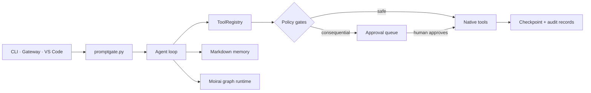

<div align="center">


# birkin

### Local memory. Deterministic control. Human authority.

A dependency-light Python agent whose memory, execution, and self-improvement stay inspectable on your machine.

[](https://github.com/ashmoonori-afk/birkin/actions/workflows/tests.yml)
[](./pyproject.toml)
[](./vscode-extension)
[](./LICENSE)

[Why](#why-birkin) · [Quick Start](#quick-start) · [VS Code](#vs-code-extension) · [Compare](#surface-comparison) · [Architecture](#architecture) · [Commands](#commands) · [한국어](./README.ko.md)

</div>

---

## Why birkin?

Agent runtimes are easy to demo and hard to trust. Birkin keeps the model useful while moving authority into code.

| The problem | Birkin's fix |
|---|---|
| Memory disappears into a hosted service or vector database | Markdown notes, YAML frontmatter, and wikilinks live in an Obsidian-compatible local vault. |
| A prompt is asked to enforce its own safety | Native tools pass through one registry; shell and scheduled actions use deterministic policy and the approval queue. |
| “Multi-agent” means a model recursively spawning itself | Moirai provides Python-owned `agent`, `parallel`, and `pipeline` graph primitives with budget and spawn ceilings. |
| Self-improvement silently mutates the runtime | Harness records typed proposals in a versioned ledger and supports rollback. |
| A coding agent changes files before the user understands the plan | The official VS Code extension sends editor context, reviews a plan first, renders proposed diffs, resolves Birkin approvals, and restores checkpoints. |
| A local tool becomes an opaque service | Runs, approvals, checkpoints, status, and configuration remain local and inspectable. |

Birkin's core runtime has **no mandatory third-party Python dependencies**. Optional extras add voice, desktop vision, and office-file support. The repository currently bundles **56 skills**; all default tests are designed to run offline.

## Quick Start

Python 3.10 or newer is required. The default provider is the locally authenticated Codex CLI; setup can select Claude CLI or API-backed providers instead.

```bash
git clone https://github.com/ashmoonori-afk/birkin.git
cd birkin
python -m pip install -e .
birkin setup
birkin chat
```

Run the local service surfaces in separate terminals:

```bash
birkin gateway          # local HTTP on 127.0.0.1:8788; Telegram is optional
birkin web --no-browser # dashboard/control API on 127.0.0.1:8787
```

Optional features are explicit:

```bash
python -m pip install -e ".[voice]"
python -m pip install -e ".[desktop]"
python -m pip install -e ".[office]"
python -m pip install -e ".[full]"
```

> [!IMPORTANT]
> Native tools run with your operating-system account. Keep the gateway loopback-only, configure `shell_approval`, `fs_jail`, disabled tools, and channel allowlists for your deployment, and review consequential actions before approval.

## VS Code extension

`vscode-extension/` is the official TypeScript extension. It binds to Birkin's existing local surfaces instead of running a second agent protocol:

- sends the active selection, range, workspace, and open-file descriptors to the gateway;
- requests a non-executing plan and requires an explicit **Execute Plan** decision;
- opens file proposals in VS Code's native inline diff editor;
- approves or rejects through Birkin's existing approval queue;
- restores Birkin's shadow-git checkpoints after confirmation;
- displays live runtime and pending-review status in the status bar.

### Install from source

```bash
cd vscode-extension
npm ci
npm run compile
npm run package
code --install-extension birkin-vscode-0.1.0.vsix
```

For an Extension Development Host:

```bash
cd vscode-extension
npm ci
npm run compile
code --extensionDevelopmentPath="$PWD"
```

Start both `birkin gateway` and `birkin web --no-browser`. The WebUI writes a private `~/.birkin/web_session.json`, which the extension uses to discover its loopback port and capability. Change `birkin.gatewayUrl` if the gateway is not on port 8788. If you set `BIRKIN_HTTP_TOKEN`, copy the same value to `birkin.gatewayToken`.

Open the Command Palette and run **Birkin: Review Plan Before Execution**. The other commands send a contextual request, review proposed changes, roll back files, and refresh status.

## Surface comparison

All rows below describe surfaces shipped in this repository.

| Capability | CLI / REPL | Gateway | WebUI | VS Code |
|---|:---:|:---:|:---:|:---:|
| Conversational agent | Yes | Yes | No (monitoring/control) | Yes, through gateway |
| Current editor selection and open files | Manual | Manual | No | Yes |
| Plan review before execution | Slash-command/workflow dependent | Conversation dependent | No | Dedicated review surface |
| Proposed-change diff | Terminal checkpoint diff | No | Approval details | Native VS Code diff editor |
| Approval queue | `birkin review` | Trusted chat controls | Approve/reject API and UI | Approve/reject API |
| File rollback | `/rollback` | No | Checkpoint control API | Checkpoint picker |
| Live status | Status line | Progress callbacks | Dashboard | Status bar |
| Local transport | Process stdin/stdout | Loopback HTTP / channels | Loopback HTTP | Existing gateway + WebUI APIs |

## Architecture

The model proposes; deterministic code owns persistence, policy, and authority.


```mermaid
flowchart LR
    U[CLI · Gateway · VS Code] --> P[promptgate.py]
    P --> A[Agent loop]
    A --> R[ToolRegistry]
    R --> G{Policy gates}
    G -->|safe| T[Native tools]
    G -->|consequential| Q[Approval queue]
    Q -->|human approves| T
    T --> C[Checkpoint + audit records]
    A --> M[Markdown memory]
    A --> W[Moirai graph runtime]
```

<details>
<summary><strong>Repository map</strong></summary>

```text
birkin/
  agent.py          native tool loop, steering, compaction, parallel calls
  runtime.py        provider, prompt, registry, memory, and skill construction
  promptgate.py     one system-prompt assembly point for every main surface
  tools/            files, shell, web, vision, memory, sessions, subagents
  approvals.py      human gate and approved action execution
  checkpoints.py    external shadow-git snapshots and restore
  gateway/          local HTTP, Telegram, and outbound channel adapters
  web/              local dashboard and authenticated control API
  harness.py        validated self-improvement ledger and rollback
  moirai/           deterministic multi-agent graph runtime
  mcp_server.py     stdio MCP server for memory, skills, and proposals
vscode-extension/   official strict-TypeScript editor integration
skills/             bundled Markdown skills
tests/              offline unit, integration, and end-to-end coverage
```

State is file-backed under `BIRKIN_HOME` (normally `~/.birkin`). The dashboard uses a per-process capability; the gateway binds to loopback and can additionally require `BIRKIN_HTTP_TOKEN`. MCP uses newline-delimited JSON-RPC over stdio. The VS Code extension uses these existing authorities: gateway `/message` for turns and WebUI endpoints for approvals, status, editor context, and checkpoints.

</details>

<details>
<summary><strong>Execution and recovery path</strong></summary>

1. `runtime.py` builds the configured provider, memory, skills, hooks, checkpoint manager, and native tool registry.
2. `promptgate.py` composes the sealed main prompt shared by REPL, gateway, dry-run, and warm sessions.
3. `ToolRegistry.run` is the native enforcement choke point for hooks, redaction, and output handling.
4. Consequential cron, shell, operation, workflow, and harness actions become file-backed approval records.
5. Mutating file tools snapshot the project into Birkin's external checkpoint store before mutation.
6. A human resolves the queue from CLI, trusted channels, WebUI, or VS Code; rollback restores a chosen checkpoint after protecting the current state.

</details>

## Commands

| Command | Purpose |
|---|---|
| `birkin setup` | Guided provider and workspace onboarding. |
| `birkin chat` | Interactive local agent (the default command). |
| `birkin gateway` | Run loopback HTTP and configured message channels. |
| `birkin web [--no-browser]` | Run the local dashboard and authenticated control API. |
| `birkin review` | Approve or reject pending consequential actions. |
| `birkin permission` | Inspect or change approval categories and CLI access. |
| `birkin tools` | List, enable, or disable native tools. |
| `birkin model` / `birkin models` | Inspect or select the model. |
| `birkin skills` | List, inspect, sync, validate, or manage skills. |
| `birkin daemon` | Run or install the Morpheus + cron scheduler. |
| `birkin morpheus [--dry-run]` | Run the scheduled self-improvement routine now. |
| `birkin harness` | Show, refine, export, or roll back the improvement ledger. |
| `birkin moirai` | List, run, inspect, or resume deterministic workflows. |
| `birkin runs` / `birkin trace ID` | Inspect run summaries and detailed audit records. |
| `birkin cron` | List or remove scheduled jobs. |
| `birkin sessions` | List or export saved conversations. |
| `birkin mcp-serve` | Serve Birkin memory, skills, and proposals over MCP stdio. |
| `birkin voice` | Configure or control the optional voice daemon. |

Run `birkin --help` or `birkin <command> --help` for the complete interface.

## Configuration

`birkin setup` writes `~/.birkin/config.json`. These security- and runtime-relevant defaults are generated against `birkin.config.DEFAULT_CONFIG` and checked by tests:

```json
{
  "provider": "codex-cli",
  "model": "default",
  "subagent_model": "default",
  "redact_secrets": true,
  "api_keys": [],
  "lsp_servers": {},
  "a2a_enabled": false,
  "cli_network_access": false,
  "egress": {
    "enabled": true,
    "enforced": true,
    "max_bytes": 1048576,
    "destinations": {}
  },
  "harness_enabled": true,
  "harness_turn_interval": 12,
  "harness_cooldown_min": 15,
  "harness_compact_review": true,
  "harness_max_edits": 12,
  "harness_prompt_budget": 20000,
  "harness_auto_approve": [
    "memory",
    "skill_note"
  ]
}
```

Environment variables remain the right place for provider secrets. `api_keys` names environment-variable pools; it is not a place to paste raw keys. `a2a_enabled` is opt-in. Enforced egress disables uninspected native network paths and allows only configured destinations through Birkin's inspected tools.

## Development

```bash
python -m pip install -e ".[dev]"
python -m compileall -q birkin
python -m pytest

cd vscode-extension
npm ci
npm test
npm run compile
npm run test:e2e
```

CI executes the Python suite on Ubuntu/Python 3.10, macOS/Python 3.13, and Windows/Python 3.13. Extension unit tests use Vitest; the host QA target uses `@vscode/test-electron`.

## License

[MIT](./LICENSE). See [NOTICE](./NOTICE) for attribution.
