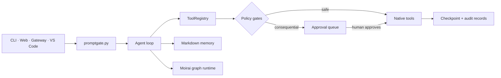

<div align="center">


# birkin

### Local memory. Deterministic control. Human authority.

A dependency-light Python agent whose memory, execution, and self-improvement stay inspectable on your machine.

[](https://github.com/ashmoonori-afk/birkin/actions/workflows/tests.yml)
[](./pyproject.toml)
[](./vscode-extension)
[](./LICENSE)

[Why](#why-birkin) · [Quick Start](#quick-start) · [Office Work OS](#office-work-os-v2) · [GitHub Action](#github-action) · [Sandbox](#isolated-execution) · [VS Code](#vs-code-extension) · [Compare](#surface-comparison) · [Architecture](#architecture) · [Commands](#commands) · [한국어](./README.ko.md)

</div>

---

## Why birkin?

Agent runtimes are easy to demo and hard to trust. Birkin keeps the model useful while moving authority into code.

| The problem | Birkin's fix |
|---|---|
| Memory disappears into a hosted service or vector database | Markdown notes, YAML frontmatter, and wikilinks live in an Obsidian-compatible local vault. |
| A prompt is asked to enforce its own safety | Native tools pass through one registry; shell and scheduled actions use deterministic policy and the approval queue. |
| “Multi-agent” means a model recursively spawning itself | Moirai provides Python-owned `agent`, `parallel`, and `pipeline` graph primitives with budget and spawn ceilings. |
| Self-improvement silently mutates the runtime | Harness records typed proposals in a versioned ledger and supports rollback. |
| A coding agent changes files before the user understands the plan | The official VS Code extension sends editor context, reviews a plan first, renders proposed diffs, resolves Birkin approvals, and restores checkpoints. |
| A local tool becomes an opaque service | Runs, approvals, checkpoints, status, and configuration remain local and inspectable. |

Birkin's core runtime has one mandatory process-identity dependency (`psutil`). Optional extras add voice, native desktop Computer Use, browser, and office-file support. The repository currently bundles **63 skills**; all default tests are designed to run offline.

## Memory

BM25 with Hangul/jamo-aware tokenization remains the default retrieval engine and requires no extra package. Every result discloses normalized `lexical`, `vector`, `entity`, and `time` scores, the signals that sourced it, and each backend name. Vector embeddings, one-hop entity traversal, and temporal reranking are independent opt-ins:

```bash
python -m pip install -e ".[memory-semantic]"  # local sentence-transformers only
```

```json
{
  "memory_vector_enabled": true,
  "memory_entity_enabled": true,
  "memory_temporal_enabled": true
}
```

Markdown remains the source of truth. The entity graph is rebuilt from titles, tags, and `[[wikilinks]]`; no graph sidecar is required for lexical search. Temporal facts keep separate `valid_at` (became true), `invalid_at` (stopped being true), and `expired_at` (learned to be wrong) fields, plus optional `supersedes` links. Search accepts `as_of`, `since`, and `until` date filters.

Memory can be owned by `user`, `organization`, `project`, `agent`, or `workflow`. User memory keeps the existing vault layout; the other roots live at `.birkin-scopes/<scope>` and retain the same zone layout inside them. Duplicate keys resolve from most specific to least specific: **workflow > agent > project > organization > user**. `memory_visible_scopes` fails closed for unreadable roots, while `memory_source_trust`, `memory_default_trust`, and the query's `min_trust` control source filtering. Search hits disclose `scope`, `record_source`, and `trust`. Owners may mark a note `shared_read_only`; visible agents can read the labeled block, but a non-owner write raises a typed policy error.

The committed 14-question LongMemEval fixture reports retrieval and final-answer stages separately. All four configurations reached `1.000` retrieval recall but `0.857` answer accuracy (11.9-12.4 context tokens/query), exposing the context-assembly gap rather than hiding it behind retrieval. See [the category and cost tables](./benchmarks/RESULTS.md) and the exact public-dataset command there. These are fixture results, not public leaderboard numbers.

## Quick Start

Python 3.10 or newer is required. The default provider is the locally authenticated Codex CLI; setup can select Claude CLI or API-backed providers instead.

```bash
git clone https://github.com/ashmoonori-afk/birkin.git
cd birkin
python -m pip install -e .
birkin setup
birkin chat
```

Run the local service surfaces in separate terminals:

```bash
birkin gateway          # local HTTP on 127.0.0.1:8788; Telegram is optional
birkin web --no-browser # authenticated chat workspace on 127.0.0.1:8787
```

Optional features are explicit:

```bash
python -m pip install -e ".[memory-semantic]"
python -m pip install -e ".[voice]"
python -m pip install -e ".[desktop]"
python -m pip install -e ".[office]"
python -m pip install -e ".[browser]"
python -m playwright install chromium
python -m pip install -e ".[full]"
```

### Native Browser Aside

With the optional browser dependency installed, `birkin web` exposes a
collapsible **Browser** plane beside the unified workspace. It is a real
isolated persistent Playwright Chromium context: there is no iframe, HTML
projection, or mock browser. Open the plane, enter an `http://` or `https://`
URL, and press Enter. Collapsing the plane preserves its session and storage;
the authenticated `DELETE /api/browser-aside/session` endpoint or WebUI
shutdown closes it.

The plane reuses the unified workspace's shared semantic theme, including its
dark, light, and high-contrast palettes. Its compact status rail exposes
ready, loading, blocked, stale, and error states without relying on color, and
revision-aware frame polling keeps the canvas synchronized without embedding
image data in the page.

Live JPEG frames use bounded, workspace-scoped content-addressed memory
storage. UI state and event/context records carry only frame digest/ref
metadata, never inline image bytes or base64. Private-network navigation is
denied by default. An exact test-only destination may be admitted with a
host/CIDR/port rule such as
`BIRKIN_BROWSER_PRIVATE_NETWORK_RULES='[{"host":"127.0.0.1","cidr":"127.0.0.1/32","port":8080}]'`;
there is no global private-network switch. Repository sandbox network policy
still applies. If Playwright Chromium is unavailable, the browser endpoint
returns an actionable `503` without affecting core startup.

## Computer Use

Computer Use is an opt-in native desktop capability exposed as one typed tool, `computer_use`. Install the desktop extra, enable both the legacy desktop observation group and the separate Computer Use mutation gate, then inspect permissions without prompting:

```bash
python -m pip install -e ".[desktop]"
birkin computer-use setup --json
birkin computer-use doctor --json
```

The commands above emit setup or capability reports. Configuration is written separately:

```json
{
  "desktop_tools": true,
  "computer_use": {
    "enabled": true,
    "allowed_apps": ["org.example.QAFixture"],
    "denied_apps": [],
    "allowed_windows": null,
    "denied_windows": [],
    "allowed_operations": ["click", "scroll", "type"],
    "max_actions": 200
  }
}
```

Rules use exact native identities and window IDs. Titles, OCR, accessibility labels, screenshots, and other screen content are evidence only and never mutation authority.

The public action union is:

```text
capture, list_apps, list_windows,
click, double_click, right_click, middle_click,
drag, scroll, type, doctor
```

Mutations require the latest opaque app/window/snapshot/element refs. An empty `allowed_apps` list denies every app; `allowed_windows: null` permits the windows of explicitly allowed apps. Birkin attempts semantic background delivery first, verifies the predicted effect from fresh native state, and reports `confirmed`, `unverifiable`, or `suspected_noop`. Pointer foreground fallback is available only for native backends that advertise it, and requires a recorded background failure, an exact one-shot approval, a topmost-window hit test, and focus restoration evidence. Horizontal foreground scroll is Linux X11-only; macOS and Windows refuse it rather than silently substituting vertical scroll. Native password fields are hard-blocked; additional sensitive/risky classes are enforced only when the backend supplies trusted native metadata.

| Platform | Discovery and structure | Exact capture | Background mutation | Foreground input |
|---|---|---|---|---|
| macOS | AX, conditional on Accessibility | Quartz exact `CGWindowID`, conditional on Screen Recording | AX semantic actions only | Approved Quartz pointer fallback bound to current AX bounds |
| Windows | UIA in an interactive desktop with compatible integrity | `PrintWindow` exact `HWND` | UIA patterns only | Approved pointer fallback bound to the current UIA rectangle |
| Linux X11 | AT-SPI with exact PID/XID correlation | Exact X11 window image | AT-SPI semantic actions only | Approved XTest fallback bound to current AT-SPI bounds |
| Linux XWayland | Conditional on unique AT-SPI/XID correlation | Conditional on authoritative XID | Conditional | Only when the X11 fallback conditions hold |
| Linux native Wayland | App observation may be available | Generic exact-window capture unsupported | Generic authoritative mutation unsupported | Unsupported |
| Optional browser adapter | Contract seam with no production route | Contract seam only | Contract seam only | Never controls browser chrome or OS surfaces |

The unified terminal and web workspace expose a dedicated Computer Use panel. Both surfaces replay the same versioned reducer state, reject stale or cross-session overlays, and hand foreground approval IDs to the existing approvals panel instead of inventing a second approval channel.

Raw screenshots are content-addressed under `BIRKIN_HOME/computer-use/artifacts`; events and journals retain bounded redacted metadata, digests, scopes, effects, and receipts instead of raw pixels or typed secrets. Runtime code never installs dependencies, opens privacy settings, or clicks permission dialogs.

> [!IMPORTANT]
> Native tools run with your operating-system account. Keep the gateway loopback-only, configure `shell_approval`, `fs_jail`, disabled tools, and channel allowlists for your deployment, and review consequential actions before approval.

## Office Work OS v2

Birkin registers a bounded workflow for DOCX, XLSX, PPTX, PDF, and HWPX. It supports text extraction, text-first creation, layered validation and comparison, explicit-budget TXT conversion, semantic structured previews, and narrow copy-on-write package edits. PDF mutation remains refused; HWPX creation requires a trusted template.

<!-- office-support-matrix:start -->
| Format ID | Read/inspect | Create | Extract | Validate | Compare | Text convert | Surgical mutation | Render/recalc/forms |
|---|---|---|---|---|---|---|---|---|
| `docx` | bounded | conditional | bounded | structural | layered | bounded | bounded | structured-preview |
| `xlsx` | bounded | conditional | bounded | structural | layered | bounded | bounded | structured-preview |
| `pptx` | bounded | conditional | bounded | structural | layered | bounded | bounded | structured-preview |
| `pdf` | bounded | bounded | conditional | structural | layered | conditional | refused | structured-preview |
| `hwpx` | bounded | template-only | bounded | structural | layered | bounded | bounded | structured-preview |
<!-- office-support-matrix:end -->

`layered` comparison reports byte hashes, bounded normalized semantic text, and ZIP package-entry changes where applicable; it is not byte-only. PDF has no ZIP package layer. `structured-preview` means `render_artifact` succeeds only with `output_format: "structured_preview"`; visual `pdf`, `png`, and `thumbnail` requests return `RENDER_UNAVAILABLE`. Spreadsheet recalculation and general forms remain unavailable.

The registered calls are `list_document_adapters`, `inspect_document`, `extract_document`, `create_document`, `compare_documents`, `fill_template`, `apply_document_patch`, `render_artifact`, `validate_artifact`, and `convert_document`. The synchronized skills are `office-work-os`, `office-documents`, `word-documents`, `spreadsheets`, `presentations`, `pdf-documents`, and `korean-hwp-documents`.

Document inputs are jailed to `BIRKIN_HOME`. For example, with `BIRKIN_HOME=/workspace/.birkin`, copy or import the source under `/workspace/.birkin/artifacts/incoming` before calling a tool; an absolute path outside that tree is rejected. Outputs are basename-only new files under `/workspace/.birkin/artifacts/drafts`.

```json
{"source":{"content_hash":"<source-sha256>","uri":"/workspace/.birkin/artifacts/incoming/source.docx"},"projection":"text","max_text_bytes":100000}
```

TXT conversion requires the `loss_budget` argument and never claims native or lossless conversion:

```json
{"source":{"content_hash":"<source-sha256>","uri":"/workspace/.birkin/artifacts/incoming/source.docx"},"target_format":"txt","output_name":"source.txt","loss_budget":{"structure":10,"style_layout":10,"macro_active_content":0,"signature_encryption":0}}
```

Install optional Office backends with `python -m pip install -e ".[office]"` and PDF inspection/extraction/deep reopen with `python -m pip install -e ".[office-advanced]"`. Built-in PDF creation is ASCII-only; non-Latin requests return a typed capability refusal without executing or suggesting ReportLab. Missing approved optional backends return typed errors and never silently select a candidate.

See the [detailed support contract](./docs/office-support.md#office-work-os-v2), machine [`provenance_manifest.json`](./birkin/office/adapters/provenance_manifest.json), and [`THIRD_PARTY_NOTICES.md`](./birkin/office/adapters/THIRD_PARTY_NOTICES.md). This documentation targets Birkin `0.4.227`, `catalog_revision: 4`, `inventory_sha256: 66ac4638ee7a8b4f6b68325b036ca7d9b312fdf37eef9b90f3c163a756356d53`.

## Unified chat workspace

`birkin chat` now opens the terminal workspace by default and starts its authenticated loopback web authority. The private bootstrap URL printed at startup exchanges its one-time path capability for an `HttpOnly`, `SameSite=Strict` cookie, then removes the secret from the address bar. `birkin web [--no-browser]` runs the same responsive web workspace as a standalone local surface.

Both surfaces consume the same ordered command/event protocol and durable journal. Conversation messages, tasks and runs, approvals, evidence, sessions, activity, cron, memory and skills, checkpoints, and status are canonical snapshot panels rather than separate dashboard state. When a surface reconnects with an existing session ID, the journal replays its conversation, panel data, and command cursor.

- Terminal: type and press Enter to send, press Esc to interrupt, use `/work` to focus tasks/runs, and use the deprecated `/dash` compatibility alias to focus activity/logs.
- Web: press Ctrl+Enter to send, press Esc to interrupt, use the context button for the nine canonical panels, and use the explicit approve/reject actions after reviewing requester, target, impact, rejection result, risk, expiry, and evidence.
- Themes: Studio Dark, Paper Light, and High Contrast share semantic roles with terminal truecolor/ANSI-256 rendering. `NO_COLOR=1` keeps the terminal usable without color.
- Responsive behavior: desktop keeps conversation and context side by side; mobile uses an opaque sheet above a composer that remains visible, with touch-sized controls and an explicit back action.

The workspace remains loopback-only and preserves Host validation, capability checks, approval authority, filesystem jail, network egress, and audit records. Deprecated UI paths `/legacy-dashboard`, `/dashboard`, and `/workbench` return a permanent `308` redirect to `/` with deprecation metadata; existing backend APIs remain available.

The embedded web authority does not overwrite the standalone WebUI discovery file. If the configured web port is already occupied, `birkin chat` binds its private embedded authority to an available loopback port and prints that bootstrap URL instead.
The embedded authority is bootstrap-URL only; run standalone `birkin web` when the VS Code extension needs `~/.birkin/web_session.json` discovery.

## GitHub Action

The official composite Action turns a trusted issue or pull-request comment into an isolated Birkin job. Put this workflow in `.github/workflows/birkin.yml` in a consumer repository, add `ANTHROPIC_API_KEY` as an Actions secret, and pin `@main` to a release tag or commit SHA once selected:

```yaml
name: Birkin
on:
  issue_comment:
    types: [created]
permissions:
  contents: read
jobs:
  birkin:
    if: >-
      startsWith(github.event.comment.body, '/birkin') &&
      contains(fromJSON('["OWNER","MEMBER","COLLABORATOR"]'),
      github.event.comment.author_association)
    runs-on: ubuntu-latest
    permissions:
      contents: write
      issues: write
      pull-requests: write
    steps:
      - uses: actions/checkout@11d5960a326750d5838078e36cf38b85af677262
        with:
          ref: ${{ github.event.repository.default_branch }}
          persist-credentials: false
      - uses: ashmoonori-afk/birkin@main
        with:
          github-token: ${{ secrets.GITHUB_TOKEN }}
          anthropic-api-key: ${{ secrets.ANTHROPIC_API_KEY }}
          test-command: python -m pytest -q
          max-retries: "1"
```

A trusted maintainer comments `/birkin <task>` on an issue or PR. Birkin edits a branch from the default branch, runs the configured test command, receives exact failure output for a bounded repair attempt, pushes, and opens a PR referencing the source. On a PR, `/birkin review <focus>` reads the diff with a tool-free model call and posts a structured review comment; it does not execute PR code.

> [!CAUTION]
> The workflow intentionally uses `issue_comment`, not a secret-bearing fork checkout. It gates runs to `OWNER`, `MEMBER`, or `COLLABORATOR`, checks out only the trusted default branch, and declares read-only workflow permissions plus the three write scopes required by the job. Credentials are accepted only through the documented `github-token`, `anthropic-api-key`, and `openai-api-key` inputs. The driver removes them from agent tools and test subprocess environments before processing task or diff content. Never replace this with a secret-bearing untrusted-code checkout.

## Isolated execution

Birkin can run a declared repository job in either a disposable **git worktree** or a **Docker container**. Both backends consume the same immutable `SandboxPolicy`, and the GitHub Action worker calls the same evaluator as local execution rather than maintaining a second remote policy.

Check in `.birkin/sandbox.json` to make setup reproducible:

```jsonc
{
  "backend": "docker",
  "image": "python:3.12.4-slim@sha256:<digest>",
  "setup": ["python -m pip install -e ."],
  "env_allowlist": ["PIP_INDEX_URL"],
  "network": "allowlist",
  "network_allowlist": ["pypi.org"],
  "write_paths": ["birkin", "tests"]
}
```

- **Network:** `off` rejects every declared destination and Docker adds `--network=none`; `allowlist` rejects destinations not named by the repository.
- **Secrets:** the child receives only variables named by `env_allowlist`; inherited credentials and every other host variable are stripped.
- **Writes:** Docker mounts the repository read-only and overlays only configured paths as writable. Worktree jobs run on a detached disposable checkout, validate actual changes against the same scopes, and remove the checkout even after failure.

Policy or configuration violations raise typed errors and fail before delivery. Setup commands run in declaration order on every job. Keep Docker images digest-pinned and writable paths present in the repository. The worktree backend provides disposable repository/write isolation, not a network namespace; use Docker when kernel-enforced network isolation is required.

## Browser QA

Install the optional browser surface and its Chromium runtime; core Birkin does not import Playwright:

```bash
python -m pip install 'birkin[browser]'
python -m playwright install chromium
```

The native registry exposes `browser_navigate`, `browser_click`, `browser_fill`, `browser_press`, `browser_execute`, `browser_screenshot`, `browser_evidence`, and `browser_close`. They share one page, so an agent can edit web code and verify the rendered result rather than infer it from source.

Browser traffic reuses the repository's `sandbox.network` and `sandbox.network_allowlist` policy. The default `network: "off"` fails closed. For local WebUI QA, set `network` to `allowlist`, include `127.0.0.1`, and keep the screenshot path inside `sandbox.write_paths`. Every navigation and page subrequest is checked; redirects, scripts, `fetch`, and click-triggered requests cannot bypass the allowlist. Registry hooks, `disabled_tools`, and approval replay remain the same gates used by every native tool. Policy refusals are returned as `BrowserPolicyViolation` errors.

A runnable ouroboros check against Birkin's own WebUI:

1. Change `birkin/web/static/index.html`, then start `birkin web --no-browser` and copy its private bootstrap URL.
2. In a Birkin native session configured with `sandbox.network="allowlist"` and `sandbox.network_allowlist=["127.0.0.1"]`, call `browser_navigate` with that URL.
3. Call `browser_click` with `#lens-toggle`, then `browser_screenshot` with a named relative path such as `artifacts/webui.png`.
4. Call `browser_evidence` and save its console plus request/response summaries with the screenshot. Finish with `browser_close` so Chromium and all contexts are released.
5. As a negative proof, navigate to a host absent from the allowlist and retain the typed refusal. This request must not reach the network.

This is real browser execution, not an HTML parser. Use `browser_fill`/`browser_press` for forms and `browser_execute` for focused page-state assertions; disable any action by name in `disabled_tools` when a surface should not expose it.

## VS Code extension

`vscode-extension/` is the official TypeScript extension. It binds to Birkin's existing local surfaces instead of running a second agent protocol:

- sends the active selection, range, workspace, and open-file descriptors to the gateway;
- requests a non-executing plan and requires an explicit **Execute Plan** decision;
- opens file proposals in VS Code's native inline diff editor;
- approves or rejects through Birkin's existing approval queue;
- restores Birkin's shadow-git checkpoints after confirmation;
- displays live runtime and pending-review status in the status bar.

### Install from source

```bash
cd vscode-extension
npm ci
npm run compile
npm run package
code --install-extension birkin-vscode-0.1.0.vsix
```

For an Extension Development Host:

```bash
cd vscode-extension
npm ci
npm run compile
code --extensionDevelopmentPath="$PWD"
```

Start both `birkin gateway` and `birkin web --no-browser`. The WebUI writes a private `~/.birkin/web_session.json`, which the extension uses to discover its loopback port and capability. Change `birkin.gatewayUrl` if the gateway is not on port 8788. If you set `BIRKIN_HTTP_TOKEN`, copy the same value to `birkin.gatewayToken`.

Open the Command Palette and run **Birkin: Review Plan Before Execution**. The other commands send a contextual request, review proposed changes, roll back files, and refresh status.

## Surface comparison

All rows below describe surfaces shipped in this repository.

| Capability | CLI / REPL | Gateway | WebUI | VS Code |
|---|:---:|:---:|:---:|:---:|
| Conversational agent | Yes | Yes | Yes | Yes, through gateway |
| Current editor selection and open files | Manual | Manual | No | Yes |
| Plan review before execution | Slash-command/workflow dependent | Conversation dependent | Conversation + explicit approval | Dedicated review surface |
| Proposed-change diff | Terminal checkpoint diff | No | Approval details | Native VS Code diff editor |
| Approval queue | `birkin review` | Trusted chat controls | Approve/reject API and UI | Approve/reject API |
| File rollback | `/rollback` | No | Checkpoint restore panel | Checkpoint picker |
| Live status | Workspace status/panels | Progress callbacks | Chat workspace | Status bar |
| Local transport | Process stdin/stdout | Loopback HTTP / channels | Loopback HTTP | Existing gateway + WebUI APIs |

## Architecture

The model proposes; deterministic code owns persistence, policy, and authority.


```mermaid
flowchart LR
    U[CLI · Web · Gateway · VS Code] --> P[promptgate.py]
    P --> A[Agent loop]
    A --> R[ToolRegistry]
    R --> G{Policy gates}
    G -->|safe| T[Native tools]
    G -->|consequential| Q[Approval queue]
    Q -->|human approves| T
    T --> C[Checkpoint + audit records]
    A --> M[Markdown memory]
    A --> W[Moirai graph runtime]
```

<details>
<summary><strong>Repository map</strong></summary>

```text
birkin/
  agent.py          native tool loop, steering, compaction, parallel calls
  runtime.py        provider, prompt, registry, memory, and skill construction
  promptgate.py     one system-prompt assembly point for every main surface
  tools/            files, shell, web, vision, memory, sessions, subagents
  approvals.py      human gate and approved action execution
  checkpoints.py    external shadow-git snapshots and restore
  gateway/          local HTTP, Telegram, and outbound channel adapters
  web/              local chat workspace and authenticated control API
  workspace/        shared commands, events, journal, snapshots, and themes
  workspace_terminal.py  default terminal workspace adapter
  harness.py        validated self-improvement ledger and rollback
  moirai/           deterministic multi-agent graph runtime
  mcp_server.py     stdio MCP server for memory, skills, and proposals
vscode-extension/   official strict-TypeScript editor integration
skills/             bundled Markdown skills
tests/              offline unit, integration, and end-to-end coverage
```

State is file-backed under `BIRKIN_HOME` (normally `~/.birkin`). The workspace uses a per-process capability and honors `BIRKIN_HTTP_TOKEN` as an explicit bearer-capability override; the gateway also binds to loopback and can require that token. MCP uses newline-delimited JSON-RPC over stdio. The VS Code extension uses these existing authorities: gateway `/message` for turns and WebUI endpoints for approvals, status, editor context, and checkpoints.

</details>

## Approval console

`birkin web` opens a responsive control surface for background agent runs and
risky actions. It shows live run states (`running`, `blocked`,
`waiting-approval`, and `done`), progress and results, related shell/cron
proposals, action diffs, and execution receipts. A run can be steered, aborted,
or resumed from its detail card; approval and rejection continue to use the
same file-backed authority as `birkin review`.

The server remains loopback-only by default. Set `web_remote_access` to `true`
only when remote access is intentional; this binds on all interfaces but does
**not** create a public route. Open the secret bootstrap URL printed by
`birkin web` on the remote device. It exchanges the per-process capability for
an HttpOnly, SameSite cookie, and every remote request without that capability
is rejected. Put TLS or a trusted private-network tunnel in front when traffic
leaves the host.

## Checkpoints

The WebUI workbench turns Birkin's external shadow-git snapshots into a tool-level
timeline. Each entry records the tool, time, touched paths, result, and the
checkpoint hashes for its before and after state. Open any checkpoint to preview
an aggregate patch or each file's patch before changing anything.

| Restore mode | Workspace files | Task/conversation state |
|---|---:|---:|
| `files` | restored | unchanged |
| `task` | unchanged | restored |
| `both` | restored | restored |

Every restore is destructive, so the WebUI queues it through the existing human
approval authority and first protects the current state. An alternate attempt
instead seeds a disposable, policy-controlled sandbox worktree from the selected
checkpoint and records its lineage, without touching the current workspace.
The authenticated API exposes the checkpoint list, `/timeline`, `/lineage`,
`/{id}/diff`, `/{id}/restore`, and `/{id}/fork` for the same flow.

<details>
<summary><strong>Execution and recovery path</strong></summary>

1. `runtime.py` builds the configured provider, memory, skills, hooks, checkpoint manager, and native tool registry.
2. `promptgate.py` composes the sealed main prompt shared by REPL, gateway, dry-run, and warm sessions.
3. `ToolRegistry.run` is the native enforcement choke point for hooks, redaction, and output handling.
4. Consequential cron, shell, operation, workflow, and harness actions become file-backed approval records.
5. Mutating file tools snapshot the project into Birkin's external checkpoint store before mutation.
6. A human resolves the queue from CLI, trusted channels, WebUI, or VS Code; rollback restores a chosen checkpoint after protecting the current state.

</details>

## Working Memory

Birkin keeps the current task contract in first-class **Working Memory**. This
is not transcript history or long-term semantic memory: it is a compact,
structured state for one session containing the goal, user corrections,
constraints, decisions, incomplete items, evidence, and next actions.

Each agent turn reloads the existing session-local harness journal at
`$BIRKIN_HOME/sessions/<normalized-label>--<sha256-prefix>/harness/harness_state.json`
through the Prompt-Gate. The hash makes valid session IDs collision-safe across
platforms; an unambiguous older literal session directory is moved to this form
on first access. Context compaction therefore cannot summarize it away, and a process
that resumes the same stable session ID reloads the same state. The objective
and completion verifier remain canonical in `goals.py`; the harness journal
owns corrections, constraints, decisions, incomplete items, evidence, and next
actions. Updates are locked and atomically replaced, repeated list values are
deduplicated, and a new `--goal` replaces that session's previous goal.

```bash
birkin working-memory update \
  --session issue-123 \
  --goal "Ship the fix" \
  --correction "Preserve the public JSON shape" \
  --constraint "Stay offline" \
  --decision "Use the existing atomic store" \
  --incomplete "Run the security regression" \
  --evidence "Focused tests passed" \
  --next-action "Run the full suite"

birkin working-memory show --session issue-123 --json
birkin working-memory clear --session issue-123
```

The list-valued flags are repeatable. Session IDs are deliberately
path-safe: 1-128 ASCII letters, digits, `.`, `_`, or `-`, beginning with a
letter or digit. Use `birkin working-memory --help` for the complete surface.

## Commands

| Command | Purpose |
|---|---|
| `birkin setup` | Guided provider and workspace onboarding. |
| `birkin chat` | Default terminal chat workspace plus private loopback web authority. |
| `birkin gateway` | Run loopback HTTP and configured message channels. |
| `birkin web [--no-browser]` | Run the standalone authenticated chat workspace and control API. |
| `birkin review` | Approve or reject pending consequential actions. |
| `birkin permission` | Inspect or change approval categories and CLI access. |
| `birkin tools` | List, enable, or disable native tools. |
| `birkin model` / `birkin models` | Inspect or select the model. |
| `birkin skills` | List, inspect, sync, validate, or manage skills. |
| `birkin plugins` | Inspect permissions, install exact signed bundle versions, or resolve pins. |
| `birkin daemon` | Run or install the Morpheus + cron scheduler. |
| `birkin morpheus [--dry-run]` | Run the scheduled self-improvement routine now. |
| `birkin harness` | Show, refine, export, or roll back the improvement ledger. |
| `birkin moirai` | List, run, inspect, or resume deterministic workflows. |
| `birkin runs` / `birkin trace ID` | Inspect run summaries and detailed audit records. |
| `birkin cron` | List or remove scheduled jobs. |
| `birkin sessions` | List or export saved conversations. |
| `birkin working-memory` | Inspect, update, or clear structured current-task state. |
| `birkin mcp-serve` | Serve Birkin memory, skills, and proposals over MCP stdio. |
| `birkin voice` | Configure or control the optional voice daemon. |

Run `birkin --help` or `birkin <command> --help` for the complete interface.

### Live OMO session control

Birkin controls an already-open OMO session through an extension owned by that
session. It does not open a replacement `omo --mode rpc` process, acquire
OMO's `settings.json.lock`, or discover windows by title.

From a trusted Birkin chat or gateway channel, install the extension once:

```text
/omo bridge install
```

This copies `birkin-omo-live-bridge.mjs` into the active OMO agent extension
directory without editing `settings.json`. Open OMO sessions normally discover
the new extension; run `/reload` in a session if it does not reload
automatically. A session that has not loaded the extension is deliberately not
controllable.

Send one prompt to one or more already-open sessions by full, exact session ID:

```text
/omo send-to 019ffe4c-0ba9-7fa2-acab-176a22fc1fd3,019ffda0-c982-7ffe-badf-b952f457011e -- resume
```

Birkin returns one acknowledgement line per target with the exact session ID
and request ID. It resolves every target before delivering any prompt, removes
duplicate IDs within the request, and rejects unknown, stale, unauthorized, or
ambiguous live registrations. Historical JSONL sessions are never treated as
live targets.

Each live session listens on loopback only and publishes a private registration
containing a random capability token. Birkin validates the token-bound response,
session ID, request ID, and protocol version. Transport failures are surfaced
instead of retried blindly, preserving at-most-once delivery for each request.
## Plugin registry

A bundle is a directory containing `birkin-plugin.json`, its entry-point files,
and a detached `bundle.sig`. The strict manifest declares one exact semantic
version, one or more `skill`, `agent`, `hook`, or `mcp_server` kinds, and the
permissions it needs using the same `network`, `network_allowlist`,
`env_allowlist`, and `write_paths` vocabulary as `SandboxPolicy`:

```jsonc
{
  "name": "acme-review",
  "version": "1.2.3",
  "kinds": ["skill", "agent"],
  "entry_points": {
    "skill": ["skills/review"],
    "agent": ["agent.py:tools"]
  },
  "required_permissions": {
    "network": "off",
    "network_allowlist": [],
    "env_allowlist": ["ACME_TOKEN"],
    "write_paths": ["reports"]
  }
}
```

Run `birkin plugins inspect BUNDLE [--json]` to see the exact permission record
before installation. `birkin plugins install BUNDLE --version 1.2.3` always
prints that disclosure and requires interactive confirmation (or explicit
`--yes`) unless all four permission fields are read-only/empty. Signed bundles
also need a trusted shared key supplied as `--key KEY_ID=HEX`; missing,
untrusted, or mismatched signatures fail closed. A publisher may deliberately
set `"unsigned_allowed": true`, which makes only a missing signature acceptable.

Project pins live under `.birkin/registry/registry.lock`; team pins live under
`~/.birkin/registry/team/registry.lock`. Resolution is deterministic: a project
pin shadows a team pin with the same bundle name, including when their versions
differ. An exact version request that disagrees with the project pin is a
conflict rather than a fallback to team scope. Existing pins change only with
`--upgrade`. Skill entry points feed the existing `SkillManager`; agent entry
points return `Tool` objects consumed by the existing native tool registry.

## Configuration

`birkin setup` writes `~/.birkin/config.json`. The block below is generated from `birkin.config.DEFAULT_CONFIG` and verified by tests, so it is the complete default surface rather than a curated excerpt:

<details>
<summary><strong>Full default configuration</strong></summary>

<!-- config-schema:start -->
```json
{
  "provider": "codex-cli",
  "model": "default",
  "subagent_model": "default",
  "base_url": "",
  "cli_command": [],
  "api_key": null,
  "max_tokens": 4096,
  "temperature": 1.0,
  "max_turns": 24,
  "auto_compact": true,
  "context_window": 200000,
  "fallback_provider": "",
  "fallback_model": "",
  "fallback_base_url": "",
  "fallback_cooldown": 300,
  "api_keys": [],
  "a2a_enabled": false,
  "lsp_servers": {},
  "spill_threshold": 30000,
  "spill_dir": "",
  "spill_retention_days": 7,
  "redact_secrets": true,
  "repl_typed_line": "steer",
  "moirai_auto": false,
  "moirai_workers": 4,
  "moirai_max_agents": 100,
  "moirai_roles": {},
  "moirai_token_budget": 0,
  "marginalia_api_key": "",
  "parallel_tools": true,
  "parallel_tool_workers": 8,
  "shell_approval": "manual",
  "allow_powershell": false,
  "checkpoints": true,
  "hooks": {},
  "hooks_auto_accept": false,
  "skills_guard_agent_created": false,
  "checkpoint_keep": 20,
  "command_allowlist": [],
  "approval_model": "",
  "max_depth": 2,
  "extra_skill_dirs": [],
  "disabled_tools": [],
  "desktop_tools": false,
  "computer_use": {
    "enabled": false,
    "allowed_apps": [],
    "denied_apps": [],
    "allowed_windows": null,
    "denied_windows": [],
    "allowed_operations": [
      "click",
      "double_click",
      "right_click",
      "middle_click",
      "drag",
      "scroll",
      "type"
    ],
    "max_actions": 200
  },
  "self_improve": true,
  "skill_nudge_interval": 3,
  "memory_nudge_interval": 6,
  "web_port": 8787,
  "web_remote_access": false,
  "gateway_port": 8788,
  "gateway_model": "",
  "gateway_reasoning_effort": "",
  "gateway_persistent": true,
  "gateway_allowed_tools": [],
  "repl_warm_session": false,
  "gateway_clean_hooks": true,
  "gateway_thinking_tokens": 0,
  "gateway_prewarm": true,
  "office": {
    "handoc": {
      "node_path": "",
      "node_version": "22.14.0",
      "module_root": "",
      "package_manifest_sha256": "",
      "timeout_seconds": 30
    }
  },
  "voice": {
    "wake_phrase": "Daddy is home",
    "gateway_url": "",
    "session_id": "voice-local",
    "sample_rate": 24000,
    "stt_model": "gpt-transcribe",
    "tts_model": "gpt-4o-mini-tts",
    "tts_voice": "coral",
    "tts_instructions": "Speak concisely and clearly.",
    "conversation_style": "",
    "onboarding_complete": false,
    "background_workers": 2
  },
  "autosave_transcripts": false,
  "autosave_redact_secrets": true,
  "autosave_max_chars": 4000,
  "autosave_max_turns": 40,
  "autosave_retention_days": 30,
  "autosave_max_files": 500,
  "neurosis_threshold": null,
  "neurosis_auto": true,
  "channels": {
    "http": {
      "enabled": true
    },
    "telegram": {
      "enabled": false,
      "token": "",
      "allowed_chat_ids": [],
      "stream": true
    },
    "slack": {
      "enabled": false,
      "webhook_url": ""
    },
    "discord": {
      "enabled": false,
      "webhook_url": ""
    }
  },
  "vault_path": "",
  "memory_vector_enabled": false,
  "memory_vector_backend": "sentence-transformers",
  "memory_vector_model": "all-MiniLM-L6-v2",
  "memory_entity_enabled": false,
  "memory_temporal_enabled": false,
  "memory_scope": "user",
  "memory_visible_scopes": [
    "workflow",
    "agent",
    "project",
    "organization",
    "user"
  ],
  "memory_default_trust": "medium",
  "memory_source_trust": {},
  "morpheus_deliver_chat_id": "",
  "workspace_roots": [],
  "reaper_enabled": true,
  "morpheus_provider": "",
  "morpheus_model": "",
  "morpheus_hour": 7,
  "morpheus_minute": 0,
  "auto_approve": [
    "memory",
    "skill"
  ],
  "harness_enabled": true,
  "harness_turn_interval": 12,
  "harness_cooldown_min": 15,
  "harness_compact_review": true,
  "harness_max_edits": 12,
  "harness_prompt_budget": 20000,
  "harness_auto_approve": [
    "memory",
    "skill_note"
  ],
  "cli_access": "workspace",
  "cli_network_access": false,
  "egress": {
    "enabled": true,
    "enforced": true,
    "max_bytes": 1048576,
    "destinations": {}
  },
  "allow_unattended_full": false,
  "budget_tokens_daily": 0,
  "budget_tokens_monthly": 0,
  "subagent_tree_max_tokens": 0,
  "subagent_tree_max_usd": 0.0,
  "subagent_tree_deadline_seconds": 0,
  "subagent_tree_max_concurrent": 4,
  "subagent_tree_max_nodes": 16,
  "cli_timeout": 300,
  "evidence_required": false,
  "critique_agents": 3,
  "boulder_max_iters": 100,
  "fs_jail": false,
  "sandbox": {
    "backend": "worktree",
    "image": "",
    "setup": [],
    "env_allowlist": [],
    "network": "off",
    "network_allowlist": [],
    "write_paths": [
      "."
    ]
  },
  "update_verify_signature": false
}
```
<!-- config-schema:end -->

</details>

Environment variables remain the right place for provider secrets. `api_keys` names environment-variable pools; it is not a place to paste raw keys. `a2a_enabled` is opt-in. Enforced egress disables uninspected native network paths and allows only configured destinations through Birkin's inspected tools. A sandboxed gateway child can submit a shell request through `propose_action`; Birkin queues it for approval instead of running it inside the child sandbox. An empty Telegram `allowed_chat_ids` list permits public text-only turns for Claude/native providers, but strips semantic memory, harness state/review, transcript persistence, Birkin/company MCP, and native tools. Codex CLI cannot provide an equivalent tool-free child, so its Telegram gateway requires an explicit chat allowlist. Public replies cannot trigger attachment delivery or workflow persistence, and shared-state commands such as `/neurosis` require an allowlisted chat.

Free-form shell requests use a fixed non-login platform shell (`%SystemRoot%\System32\cmd.exe /d /s /c` on Windows and `/bin/bash -c` on POSIX) inside an owned process tree. Windows disables AutoRun and selects code page 65001 before user command evaluation, so native `cmd.exe` built-ins and UTF-8 runtimes share the captured stream contract. Birkin preserves the inherited `PATH`, adds known runtime directories without sourcing user profiles, captures UTF-8 streams, and provides writable temporary directories. The same managed runner serves the native shell tool, approved shell continuations, scheduler shell jobs, script monitors, lifecycle hooks, GitHub Action test commands, and worktree setup commands. Worktree setup still exposes only policy-approved payload variables plus non-secret process mechanics such as `PATH`, system interpreter variables, and an isolated `TMPDIR`/`TEMP`/`TMP`; Docker setup shell text remains inside the policy-constrained container. Timeout, interrupt, and Job Object/process-group closure terminate descendants before returning and preserve partial stdout and stderr.

PowerShell is disabled by default on the model-facing native shell tool: set `allow_powershell` to `true` deliberately, or approve one exact queued operation. Other owner-controlled shell surfaces retain their existing explicit authority boundaries. Lifecycle-hook consents recorded before the managed-shell contract require one-time reapproval so old discrete-argv consent cannot silently authorize shell operators. Native macOS and Windows CI exercise commands, pipelines, redirection, quoting, Unicode and spaced working directories, environment and temporary-directory behavior, exit propagation, runtime/package-manager resolution, and descendant cleanup.

## Development

```bash
python -m pip install -e ".[dev]"
python -m compileall -q birkin
python -m pytest
uv run python scripts/qa/macos_shell_smoke.py
uv run python scripts/qa/windows_shell_smoke.py

cd vscode-extension
npm ci
npm test
npm run compile
npm run test:e2e
```

CI executes the Python suite on Ubuntu/Python 3.10, macOS/Python 3.13, and Windows/Python 3.13. The macOS and Windows jobs install a pinned Bun release, run native managed-shell acceptance, and execute their tracked sibling-surface smoke drivers. Extension unit tests use Vitest; the host QA target uses `@vscode/test-electron`.

## License

[MIT](./LICENSE). See [NOTICE](./NOTICE) for attribution.
