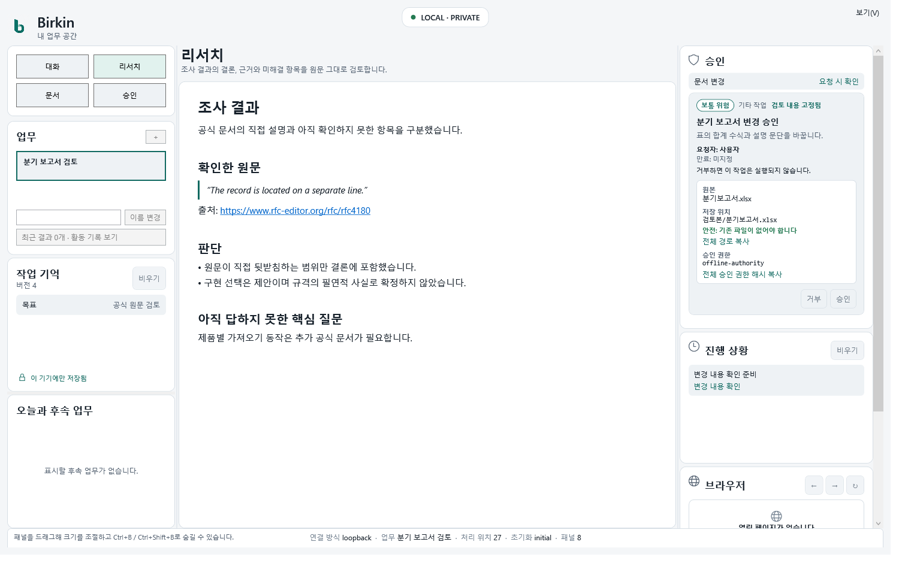

# Birkin


<p align="center"><strong>A local workspace for research, Office documents, and approval-controlled work.</strong></p>

<p align="center">
  <a href="./README.ko.md">한국어</a> ·
  <a href="./docs/office-support.md">Office support</a> ·
  <a href="./docs/DESIGN.md">Architecture</a> ·
  <a href="./docs/config-reference.md">Configuration</a>
</p>

Birkin brings conversation, source-backed research, document work, and approvals into one local workspace. Python owns execution and policy; the Windows, macOS, terminal, and Web surfaces show the same work without becoming separate authorities.

It is built for work where the difference between “prepared” and “executed” matters. A document change can be inspected before it is written. A consequential action waits for approval. A completed action returns an artifact and receipt instead of a vague success message.

Birkin's mandatory runtime dependencies are `httpx`, `pydantic`, `psutil`, `tzdata`, and `typing-extensions`. `birkin_mnemosyne` is bundled with Birkin rather than installed separately. The repository currently bundles **63 skills**.



> The hero is a generated brand illustration. The workspace image is a generated product-direction render with representative data. Neither is a live Microsoft 365 session or packaged-release acceptance result.

## What you can do

- **Research with an audit trail.** Collect public sources, separate source-backed claims from inference and unresolved questions, and keep citations attached to the result.
- **Inspect and prepare Office work.** Read, extract, compare, validate, create, or make bounded copy-on-write changes to DOCX, XLSX, PPTX, PDF, and HWPX files.
- **Review before execution.** See the source, destination, exact change, overwrite decision, risk, and approval state before a consequential action runs.
- **Recover without guessing.** Durable jobs and receipts distinguish completed, partial, failed, and outcome-unknown states. Uncertain mail delivery is checked before any retry. An approved mail that Microsoft 365 only accepted is not reported as sent: it stays outcome-unknown until a recheck observes the submitted message.
- **Keep internal state local by default.** Sessions, memory, approvals, and audit state stay under `BIRKIN_HOME`. A configured model provider may receive request content, and Microsoft 365 is contacted only when connected.
- **Choose your surface.** Start in the terminal or local Web workspace. Native Windows and macOS clients use the same Python authority.
- **Summon a specialist.** Hand a task to a named agent such as `sheet-analyst` or `meeting-scribe`, with its own instructions and a narrower toolset, from chat, the CLI, or a trusted Telegram chat.

## The primary journey

1. Ask Birkin to research a question or inspect a file.
2. Review the result, its sources, and unresolved claims.
3. Request a document change or external action.
4. Inspect the proposed change and approve or reject it.
5. Open the resulting artifact and verification receipt.

Before changing an existing Office file, import it into the dedicated `BIRKIN_HOME/office` jail. Writes are copy-on-write, destinations are bounded, and an approval request does not change the source or destination. Rollback is a separate approved action.

```text
Research or file import → result + evidence → proposed change
        → human approval → execution + artifact + receipt
```

## Quick Start

Birkin requires Python 3.10 or newer. The repository currently identifies as Birkin `0.4.433`. This is the source version, not a claim that the same version is installed on your machine or available as a signed public app.

### Windows PowerShell quick install

From an ordinary, non-elevated PowerShell 5.1 or 7 prompt, run the installer for the current `main` branch, verify the installed version, configure a provider, and start the first conversation:

```powershell
irm https://raw.githubusercontent.com/ashmoonori-afk/birkin/main/scripts/install.ps1 | iex
birkin --version
birkin setup
birkin chat
```

The installer registers the user `PATH` without `setx PATH`, verifies `birkin --version`, and falls back to `python -m birkin --version` if the current shell cannot resolve the command shim yet. The current default Morpheus run time is **07:00**.

To inspect the remote script before running it:

```powershell
irm https://raw.githubusercontent.com/ashmoonori-afk/birkin/main/scripts/install.ps1 -OutFile install.ps1
notepad .\install.ps1
powershell -ExecutionPolicy Bypass -File .\install.ps1
```

From an existing source checkout:

```powershell
python -m pip install .
birkin setup
birkin chat
```

Persist only the non-secret Birkin data root when needed. `setx` does not update the current window, and `setx PATH` can expand and truncate the user path:

```powershell
setx BIRKIN_HOME "$env:USERPROFILE\.birkin"
```

Remove that persistent override with:

```powershell
reg delete HKCU\Environment /v BIRKIN_HOME /f
```

The WPF client is a development preview and requires .NET 8 plus a locally installed Birkin CLI:

```powershell
dotnet run --project .\windows\BirkinNativeApp\src\Birkin.Native.App\Birkin.Native.App.csproj -c Release
```

The Windows client remains a development preview. Installer and updater delivery, production
signing, and provider-backed production delivery are separate release gates. See [Birkin for Windows](./windows/BirkinNativeApp/README.md) for build, connection, and package-verification details.

### macOS and Linux

```bash
python3 -m pip install .
birkin setup
birkin chat
```

The repository also provides an installer for the current `main` branch:

```bash
curl -fsSL https://raw.githubusercontent.com/ashmoonori-afk/birkin/main/scripts/install.sh | bash
birkin --version
```

The SwiftUI macOS app is built from source. Builds without release credentials are development artifacts; notarization, stapling, Gatekeeper assessment, and public distribution remain separate gates. See the [native app guide](./docs/native-app/README.md).

### Web workspace

The authenticated Web workspace is served locally by the same Python runtime:

```bash
birkin web
```

Use `birkin web --no-browser` when another client will open the private bootstrap URL. It listens on loopback by default and exchanges the one-time bootstrap capability for an `HttpOnly`, `SameSite=Strict` cookie.

## Add Office and research support

Install only the tier you need from the source checkout:

```bash
python -m pip install ".[office]"          # DOCX, XLSX, PPTX, HWPX
python -m pip install ".[office-advanced]" # PDF extraction and bounded page rendering
python -m pip install ".[research]"        # research schemas and canonical records
```

Office support is bounded document work, not arbitrary desktop-suite automation.

### Office Work OS v2

This README publishes the registered runtime contract for Birkin `0.4.433`, `catalog_revision: 8`, and `inventory_sha256: 54bb5a00d5370a69ec1c12e7e27ba72af51cfb11eb45dab912ab4ec10a008fd8`. The machine publication is [`provenance_manifest.json`](./birkin/office/adapters/provenance_manifest.json), with generated attribution in [`THIRD_PARTY_NOTICES.md`](./birkin/office/adapters/THIRD_PARTY_NOTICES.md).

<!-- office-support-matrix:start -->
| Format ID | Read/inspect | Create | Extract | Validate | Compare | Text convert | Surgical mutation | Render/recalc/forms |
|---|---|---|---|---|---|---|---|---|
| `docx` | bounded | conditional | bounded | structural | layered | bounded | bounded | structured-preview |
| `xlsx` | bounded | conditional | bounded | structural | layered | bounded | bounded | structured-preview |
| `pptx` | bounded | conditional | bounded | structural | layered | bounded | bounded | structured-preview |
| `pdf` | bounded | bounded | conditional | structural | layered | conditional | refused | conditional-page-image |
| `hwpx` | bounded | conditional | bounded | structural | layered | bounded | bounded | structured-preview |
<!-- office-support-matrix:end -->

The exact registered set is `list_document_adapters`, `inspect_document`, `extract_document`, `analyze_workbook`, `review_meeting_actions`, `list_work_items`, `work_item_request`, `local_document_import`, `m365_document_import`, `search_office_sources`, `list_office_batches`, `office_batch_request`, `list_office_templates`, `office_template_request`, `resolve_office_template`, `compare_documents`, `render_artifact`, `validate_artifact`, `office_job_request`, and `office_rollback_request`. The machine catalog records each adapter's `public_entrypoint` separately from lower-level capability.

The synchronized skill IDs are `office-work-os`, `office-documents`, `word-documents`, `spreadsheets`, `presentations`, `pdf-documents`, and `korean-hwp-documents`.

Inputs are jailed to `BIRKIN_HOME/office`. With `BIRKIN_HOME=/workspace/.birkin`, import them under `/workspace/.birkin/office/artifacts/incoming`. `local_document_import` copies one Office file from the current working folder, the Telegram attachment folder (`BIRKIN_HOME/uploads`), or `BIRKIN_HOME/office/artifacts/incoming` into that jail without changing the original; paths outside those folders, symbolic links, and other Birkin files are refused. Template fields (`{"field": ..., "value": ...}` for DOCX content controls and HWPX fields) and PPTX placeholders can be filled through `office_job_request`; the approval shows each target's exact current text. Extraction accepts `max_text_bytes`; conversion requires an explicit `loss_budget`; and semantic rendering uses `output_format: "structured_preview"`. PDF alone can conditionally render one bounded page image. Other unavailable visual requests return `RENDER_UNAVAILABLE`.

Read the [versioned Office support contract](./docs/office-support.md#office-work-os-v2) for exact arguments, provenance, limits, and refusal behavior.

## GitHub Action

The repository's GitHub workflows exercise the same Python-owned authority and documentation contracts; focused local results are not a claim of cross-platform release acceptance.

## Providers and useful commands

`birkin setup` configures the provider and model. The default configuration uses the local `codex-cli` provider; API-backed and compatible endpoints require their own credentials.

```bash
birkin --version
birkin --help
birkin chat --dry-run "Summarize this request" # builds the prompt packet; sends nothing
birkin review                                  # review pending approvals (a failed action is marked ✗)
```

The generated tables live in [Configuration reference](./docs/config-reference.md). User-facing Korean and stable protocol/diagnostic English follow the [language policy](./docs/language-policy.md).

## Summon specialist agents

A summoned agent is a named specialist: its own role instructions, a least-privilege set of tool groups, preloaded skills, and a turn budget. It runs as a subagent, so it cannot see the parent conversation and returns a self-contained result. Tool groups narrow Birkin's native registry for API providers. A CLI provider (`codex-cli`, `claude-cli`) runs its own tools, so there a specialist runs the CLI read-only and without Birkin's MCP tools: it can read and analyze but not change files; `local-cli` runs the configured command unchanged.

| Agent | Role | Tool groups | Preloaded skills |
|---|---|---|---|
| `researcher` | Public-source research with dated citations | `web`, `research`, `files` | `web-research`, `fact-checking` |
| `doc-analyst` | Inspect, extract, and compare DOCX/PPTX/PDF/HWPX | `documents`, `files` | `office-work-os` |
| `sheet-analyst` | XLSX/CSV analysis with cell-range evidence | `documents`, `files` | `spreadsheets` |
| `meeting-scribe` | Decisions, action items, owners, and due dates | `documents`, `files` | `meeting-notes` |
| `report-writer` | Conclusion-first reports and presentation drafts | `documents`, `files`, `web` | `word-documents` |
| `planner` | Steps, owners, dates, risks, and follow-up proposals | `documents`, `files` | `task-breakdown`, `planning` |
| `mail-drafter` | Reply and notice drafts; sending needs approval | `connections`, `files` | `email-draft` |

```bash
birkin summon                                    # list the roster (--json for machines)
birkin summon sheet-analyst                      # show one agent
birkin summon meeting-scribe "Extract action items from incoming/weekly.docx"
```

`birkin summon` writes its progress to stderr and only the result to stdout, so the result can be piped or redirected; Ctrl-C stops it. In `birkin chat`, `/summon <agent> <task>` runs in the foreground, shows each step the agent takes, and stops on Ctrl-C; `/summon --bg <agent> <task>` (or `/summon <agent> --bg <task>`) runs in the background. When a background run finishes, whether you started it or the model did through `spawn_subagent`, the terminal announces it with the opening of its result before the next prompt, and until then the status line shows how many agents are running. `/agents` lists the 20 most recent runs (`/agents all` lists every run), and `/attach` and `/send` follow or steer one. In a trusted Telegram chat, `/summon <agent> <task>` starts the agent without interrupting the conversation and sends the result back to that chat; from the local HTTP or voice channel, follow it with `/agents` and `/attach` in `birkin chat`. With a native API provider, `egress.enforced=false`, and a model preset that keeps delegation, the model can also summon by passing `agent` to `spawn_subagent`.

In `birkin web`, the 작업 (Tasks) panel lists the summonable agents and how to start one, and shows each summoned run with its agent, elapsed time, and result; a live run can be steered, paused before its next step, or resumed. The list refreshes every 30 seconds while the panel is open or a run is still live. An approval raised by a summoned agent names that agent and its run and links to the run.

In the desktop apps and the browser workspace, a specialist the model summons shows its start and finish in the activity list under its title, and an approval raised by a summoned agent names that agent as the requester.

Add your own specialist as `BIRKIN_HOME/agents/<name>.md`:

```markdown
---
name: contract-reviewer
title: 계약서 검토자
description: 계약서의 위험 조항을 찾아 요약합니다.
tools: [documents, files]
skills: [word-documents]
max_turns: 8
---
You review contracts for risky clauses and cite the exact clause location.
```

Definitions are validated: the name must match the file name, tool groups come from a fixed list that excludes `subagent`, at most four skills are preloaded, `max_turns` is 1–40, and a user file cannot reuse a built-in name. Invalid files are skipped and reported by `birkin summon`. Birkin's file tools cannot write this directory.

## Configuration

`birkin setup` writes `~/.birkin/config.json`. The block below is generated from `birkin.config.DEFAULT_CONFIG` and verified by tests, so it is the complete default surface rather than a curated excerpt.

<details>
<summary><strong>Full default configuration</strong></summary>

<!-- config-schema:start -->
```json
{
  "provider": "codex-cli",
  "model": "default",
  "subagent_model": "default",
  "base_url": "",
  "cli_command": [],
  "api_key": null,
  "max_tokens": 4096,
  "temperature": 1.0,
  "max_turns": 24,
  "auto_compact": true,
  "context_window": 200000,
  "fallback_provider": "",
  "fallback_model": "",
  "fallback_base_url": "",
  "fallback_cooldown": 300,
  "fallback_chain": [],
  "api_keys": [],
  "a2a_enabled": false,
  "lsp_servers": {},
  "spill_threshold": 30000,
  "spill_dir": "",
  "spill_retention_days": 7,
  "redact_secrets": true,
  "repl_typed_line": "steer",
  "moirai_auto": false,
  "worker_call_auto": true,
  "session_goal_fallback": true,
  "moirai_workers": 4,
  "moirai_max_agents": 100,
  "moirai_roles": {},
  "moirai_token_budget": 0,
  "marginalia_api_key": "",
  "parallel_tools": true,
  "parallel_tool_workers": 8,
  "shell_approval": "manual",
  "shell": {
    "extra_roots": [],
    "env_passthrough": []
  },
  "allow_powershell": false,
  "checkpoints": true,
  "hooks": {},
  "hooks_auto_accept": false,
  "skills_guard_agent_created": false,
  "checkpoint_keep": 20,
  "command_allowlist": [],
  "approval_model": "",
  "max_depth": 2,
  "extra_skill_dirs": [],
  "disabled_tools": [],
  "desktop_tools": false,
  "computer_use": {
    "enabled": false,
    "allowed_apps": [],
    "denied_apps": [],
    "allowed_windows": null,
    "denied_windows": [],
    "allowed_operations": [
      "click",
      "double_click",
      "right_click",
      "middle_click",
      "drag",
      "scroll",
      "type"
    ],
    "max_actions": 200
  },
  "self_improve": true,
  "skill_nudge_interval": 3,
  "memory_nudge_interval": 6,
  "web_port": 8787,
  "web_remote_access": false,
  "web_external_url": "",
  "browser_allow_private_network": false,
  "gateway_port": 8788,
  "gateway": {
    "http": {
      "insecure_no_token": false
    }
  },
  "gateway_model": "",
  "gateway_reasoning_effort": "",
  "gateway_persistent": true,
  "gateway_allowed_tools": [],
  "repl_warm_session": false,
  "gateway_clean_hooks": true,
  "gateway_thinking_tokens": 0,
  "gateway_prewarm": true,
  "gateway_max_sessions": 8,
  "gateway_session_ttl_s": 3600,
  "gateway_polish_timeout": 90,
  "voice": {
    "wake_phrase": "Daddy is home",
    "gateway_url": "",
    "session_id": "voice-local",
    "sample_rate": 24000,
    "stt_model": "gpt-transcribe",
    "tts_model": "gpt-4o-mini-tts",
    "tts_voice": "coral",
    "tts_instructions": "Speak concisely and clearly.",
    "conversation_style": "",
    "onboarding_complete": false,
    "background_workers": 2,
    "gateway_timeout_seconds": 330
  },
  "autosave_transcripts": false,
  "autosave_redact_secrets": true,
  "autosave_max_chars": 4000,
  "autosave_max_turns": 40,
  "autosave_retention_days": 30,
  "autosave_max_files": 500,
  "profile": {
    "enabled": false,
    "write_approval": false,
    "limits": {
      "user": 1375,
      "preferences": 1375,
      "mask": 800,
      "workflow": 1000,
      "automation": 800
    },
    "background_review": {
      "enabled": false,
      "provider": null,
      "model": null,
      "digest_recent_turns": 6
    }
  },
  "neurosis_threshold": null,
  "neurosis_auto": true,
  "channels": {
    "http": {
      "enabled": true
    },
    "telegram": {
      "enabled": false,
      "token": "",
      "allowed_chat_ids": [],
      "allowed_sender_ids": [],
      "stream": true,
      "max_public_workers": 4
    },
    "slack": {
      "enabled": false,
      "webhook_url": "",
      "allowed_channel_ids": []
    },
    "discord": {
      "enabled": false,
      "webhook_url": "",
      "allowed_channel_ids": []
    }
  },
  "vault_path": "",
  "memory_vector_enabled": false,
  "memory_vector_backend": "sentence-transformers",
  "memory_vector_model": "all-MiniLM-L6-v2",
  "memory_entity_enabled": false,
  "memory_temporal_enabled": false,
  "memory_scope": "user",
  "memory_visible_scopes": [
    "workflow",
    "agent",
    "project",
    "organization",
    "user"
  ],
  "memory_default_trust": "medium",
  "memory_source_trust": {},
  "morpheus_deliver_chat_id": "",
  "workspace_roots": [],
  "reaper_enabled": true,
  "morpheus_provider": "",
  "morpheus_model": "",
  "morpheus_hour": 7,
  "morpheus_minute": 0,
  "auto_approve": [
    "memory",
    "skill"
  ],
  "harness_enabled": true,
  "harness_turn_interval": 12,
  "harness_cooldown_min": 15,
  "ishikawa_enabled": true,
  "minto_enabled": true,
  "confidence_strict_below": 0.4,
  "confidence_fast_above": 0.8,
  "cynefin_enabled": true,
  "evidence_gate_enabled": false,
  "harness_compact_review": true,
  "harness_max_edits": 12,
  "harness_prompt_budget": 20000,
  "harness_auto_approve": [
    "memory",
    "skill_note"
  ],
  "cli_access": "workspace",
  "cli_network_access": false,
  "egress": {
    "enabled": true,
    "enforced": true,
    "max_bytes": 1048576,
    "destinations": {}
  },
  "allow_unattended_full": false,
  "budget_tokens_daily": 0,
  "budget_tokens_monthly": 0,
  "subagent_tree_max_tokens": 0,
  "subagent_tree_max_usd": 0.0,
  "subagent_tree_deadline_seconds": 0,
  "subagent_tree_max_concurrent": 4,
  "subagent_tree_max_nodes": 16,
  "cli_timeout": 300,
  "evidence_required": false,
  "critique_agents": 3,
  "boulder_max_iters": 100,
  "daedalus_dir": "",
  "daedalus_max_files": 2000,
  "fs_jail": false,
  "sandbox": {
    "backend": "worktree",
    "image": "",
    "setup": [],
    "env_allowlist": [],
    "network": "off",
    "network_allowlist": [],
    "write_paths": [
      "."
    ]
  },
  "update_verify_signature": false
}
```
<!-- config-schema:end -->

</details>

## Trust boundaries

- Document prose, URLs, formulas, macros, metadata, and embedded objects are untrusted input.
- Read-only inspection does not grant write authority. Office mutation enters through `office_job_request`; rollback enters through `office_rollback_request`.
- Approval binds the source hash, operation, destination, overwrite choice, and proposer. Changed inputs fail closed.
- Browser and Computer Use are optional and disabled until configured. They remain constrained by allowlists, action budgets, and approval policy.
- Proactive Telegram delivery (cron and `/remind` jobs, commitment check-ins, the Morpheus digest, `/summon` results) goes only to chats listed in `channels.telegram.allowed_chat_ids`; with an empty list nothing is sent. A `/remind` from the local HTTP or voice channel is delivered to Telegram only when exactly one chat is allowed, and is refused otherwise.
- Cron approval cards on Telegram, the web approval screen, and the native apps show the schedule, action type, and full command, script, or URL that will actually be registered, computed by the same code that registers the job; a schedule Birkin cannot parse is refused when it is proposed instead of being registered as a daily 09:00 job. Telegram approval cards escape control characters and say when a long command, mail body, or request was cut, and a Telegram approval reply marks only a real success with ✅: a command that exits non-zero, or a request already resolved elsewhere, is reported as such.
- Commitment check-ins stay off until you turn them on; turning them on adopts this computer's time zone for quiet hours unless you already set one. A snoozed check-in is asked again once when the snooze ends (or when quiet hours end, if it would land inside them), and a check-in that could not be sent in time is marked missed instead of arriving late. A chat has at most one pending check-in, so a missed one can be snoozed or rescheduled only while no other commitment in that chat is pending.
- The nightly Morpheus run adds memory and skill-note entries to the global harness that every session reads, only when `harness_auto_approve` lists those kinds (the default) and after both the entries and the proposal's summary pass secret and prompt-injection screening. It may change or remove only entries it wrote itself and no one has changed since. Changes to any other entry, a proposal whose summary fails screening, and its prompt and subagent edits always wait for `birkin review`, even when `harness_auto_approve` lists them.
- A summoned agent's tool groups only narrow the policy Birkin already applies (disabled tools, model presets, enforced egress); they never widen it. Summoned agents cannot summon further agents, consequential actions still wait for approval, and each run counts toward the token budget. With enforced egress, only the user can summon, through `/summon` or `birkin summon`; the model-facing `spawn_subagent` tool stays removed.
- When a monitor job detects a change, the fetched page or script output reaches the model only inside a per-run external-content envelope, as data for the job's own prompt; skills are routed from the job prompt, not from the fetched text. The run itself keeps the normal tool registry and approval policy.
- A first Microsoft 365 connect records delegated read scopes only; a connect that adds write scopes, or a revoke or reauthentication with no connection, is refused before an approval is created. Write scopes are added through reauthentication. The first mail, calendar, or meeting read after connect or reauthentication verifies the signed-in account and organization, and a mismatch fails closed.
- When a gateway model turn times out, Birkin records the incident and, only on a channel with a trusted principal, queues a `hard-task` workflow proposal to finish the remaining work; nothing runs until you approve it (in Telegram, through `/pending`), unless `auto_approve` lists `moirai`. Other channels get the partial answer or an error, and no workflow. A workflow result arrives as a Korean status line (complete, partial, or failed, with the failure count) followed by the report itself, and a hard task whose steps all failed is reported as failed, never as complete.
- Provider completion, HTTP acceptance, a local receipt, and confirmed remote state are different evidence. Birkin preserves `unknown` or `needs_review` when it cannot observe the external outcome.

## Verification and current limits

Repository tests and focused local runs cover the Python authority, approval/recovery contracts, Web behavior, and native protocol projections. A representative DOCX flow completed from natural-language inspection through Native approval, saved output, and receipt, with no output before approval.

This does not establish a fully accepted public release:

- the source version does not establish which version is installed or publicly released;
- the newest research run left unresolved claims and did not pass whole-answer acceptance;
- rendered mock/offline and keyboard checks have passed, while live installed journeys, macOS CI follow-up, and human screen-reader acceptance remain open;
- Microsoft 365 live-account verification is intentionally last and remains incomplete;
- signed Windows packaging and notarized macOS public distribution are not established here.

Evidence and remaining gates are tracked in the [Office agent review](./docs/office-agent-review.md), [UI redesign specification](./docs/ui-redesign-spec.md), and [Windows first-report journey](./docs/windows-first-report-journey.md).

## Reference

| Need | Document |
| --- | --- |
| Exact Office capabilities | [Office Work OS v2](./docs/office-support.md) |
| UI and accessibility criteria | [UI redesign specification](./docs/ui-redesign-spec.md) |
| Current implementation and open gates | [Office agent review](./docs/office-agent-review.md) |
| Full configuration schema | [Configuration reference](./docs/config-reference.md) |
| Runtime architecture | [Design](./docs/DESIGN.md) |
| Memory system | [Mnemosyne design](./docs/mnemosyne-design.md) |
| Multi-agent workflows | [Moirai design](./docs/moirai-design.md) |
| Native protocol and security | [Native app documentation](./docs/native-app/README.md) |
| Engineering status | [Status](./docs/STATUS.md) |
| VS Code client | [Extension](./vscode-extension) |

## Development

```bash
python -m pip install -e ".[dev]"
pytest
```

Native and browser suites have additional platform requirements; use their linked guides rather than treating a focused local pass as cross-platform acceptance.

Birkin is released under the [MIT License](./LICENSE). Third-party attribution and terms are recorded in [NOTICE](./NOTICE), `LICENSES/`, and the Office [third-party notices](./birkin/office/adapters/THIRD_PARTY_NOTICES.md).
